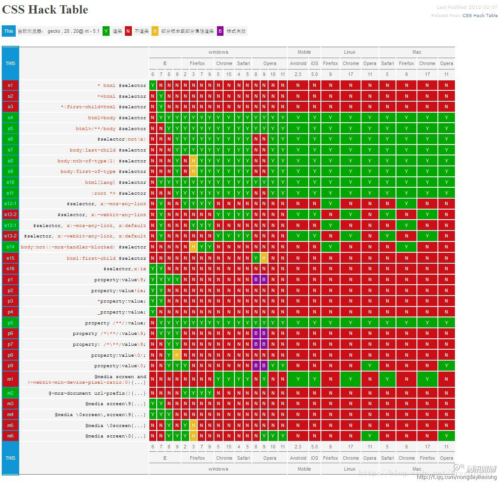

# 1.HTML（浏览器机制）

[[toc]]

## 1.1基础知识

### 1.1.1 HTML5新属性

聋人的3D后台拖拽存储

```js
1. 8个语义标签：header, section, footer, aside, nav, main, article, figure
2. canvas画图，svg
3. localStorage，sessionStorage,indexofdb
4. 媒体元素 video，audio
5. 拖拽api，h5转语音api，contenteditable，maxlength，pattern等正则，required
6. aria新特性（为了残疾人设置的）
7. data-key = value语法糖  el.dataset.键可以进行取值
8.	tabIndex

<input type="text" name="username" id="" tabindex="1" />
<a href="www.baidu.com" tabindex="-1">注册账号</a>
<input type="password" name="password" tabindex="2" />
    
这样子可以通过键盘上面的tab键 进行切换。tabindex为0的时候，可以被聚焦，但是不能够被切换

9.input pattern（正则）


10.图片懒加载
  IntersectionObserver
```


语义化好处:

1.seo 2.代码逻辑


### 1.1.2路由模式（三种）

hash，history，abstruct（node模式的时候用）。前者是不需要在后端做配置是基于hash change也就是锚点链接的，切换的时候不会发送http请求。history是基于push stat和replacestate的，需要在后端做配置

### 1.1.3  浏览器渲染过程 | dom 渲染过程 | url输入


```js
浏览器的渲染分成两个阶段。有
渲染主线程(dom树(html解析 parse) css树(样式compute)，render树，layout，paint)
和合成线程(分块 tiling | 光栅化 | draw)


输入url 和 浏览器渲染过程 不一样 。 前者要加上取得数据的方式

简单来说有三层 第一层是初始化 第二层是计算机 第三层是css层面的解析

第一步：解析URL，确定了 Web 服务器和⽂件名
//会话层 表示层挂机
//2.传输层（tcp，udp连接）
第二步：应用层（dns解析-本地DNS->本地DNS缓存中没有就去找根域名服务器然后逐级上找），这里我们获取了ip（cdn）

第三步：传输层 添加tcp头部 http，https协议的底层tcp3次握手-流量控制(通信双⽅各声明⼀个缓存⼤⼩的窗口)-拥塞控制(就是控制⾃⼰，也即控制发送的速度。不能改变世界，就改变⾃⼰嘛)-状态位（SYN 是发起⼀个连接， ACK 是回复， RST 是新连接， FIN 是结束连接等）

第四步：网络层：委托 IP 模块将数据封装成⽹络包发送给通信对象

第五步：网络接口层：进行最终的数据传输

第六步：HTML 分析器解析html，构建DOM树  //从上往下读取html标签+碰到js 可以通过把script放在底部
第七步：CSS 分析器解析CSS，stylesheet  //字面意思
第八步：合并dom树和css规则树，生成render渲染树 // dom树和cssom树相结合，成为一颗新的渲染树 render tree
第九步：根据render渲染树进行布局(Layout)
第十步：调用GPU对渲染树进行绘制，合成图层，显示在屏幕上（Painting）
//其中第四步和第五步合起来，就是我们常常说的浏览器渲染，并且第四步和第五步是浏览器渲染最耗时的部分（主要优化点）.
//回流（Reflow）,回流会让浏览器重新执行第四步和第五步的操作
//重绘（Repaint）,重绘会让浏览器重新执行第五步的操作

这里说一下html 的语法解释器，这是牛皮的。一共有三个过程 
lexical analysis（语法分析，扫描器）：按类别提取并保存到线性表
tokenize（分析规则）：识别出 HTML 应用的节点层级关系并将其填装到一个对象中
parse analysis（变成ast）：变成ast或者反向解析，这里随便啦


```


```js
//优化方案
//1.在合适的时机选择使用Load或者DOMContentLoaded
//2.使用不同的图层来渲染页面 translate代替left的平移什么的 | position: fixed
//3.不要使用 js 代码对dom 元素设置多条样式，选择用一个 className
//4.硬件加速。-webkit-transform transform: translateZ(0) 欺骗浏览器
```

### 1.1.4 DOM(document)

#### 1.1.4.1  事件流

 ```js
DOM0级事件模型只支持冒泡，不支持捕获，同一事件只能绑定一个执行函数（用onclick函数绑定）
DOM2级事件规定的事件流包括三个阶段：事件捕获阶段、处于目标阶段、事件冒泡阶段。可以绑定多个执行函数。虽然捕获阶段规定不允许响应事件，但实际上还是会执行，所以有两次机会获取到对象。

//DOM2级事件绑定与解除，useCapture默认是false，也就是在冒泡阶段调用handler函数
addEventListener(eventType, handler, useCapture) //stopPropagation阻止冒泡，preventDefault取消默认行为
removeEventListener(eventType, handler, useCapture)
 ```


#### 1.1.4.2 事件委托

利用事件冒泡处理动态元素事件绑定的方法，简单来说给父元素绑定事件来监听子元素冒泡事件。好处是不用对每个子元素添加事件监听，减少DOM操作从而提高性能。

```js
//事件回调函数中的参数e
例如在点击事件中，绑定的执行函数会自动有参数e传入，
e.target是事件的触发对象，
e.currentTarget是事件绑定对象(事件委托中一般是父)。因为存在冒泡，所以可能点击的是A组件的子组件B但是触发了A组件的点击事件。

//常见操作
document.createElement('div') // 但是没有文本
document.createTextNode('text') // 前提是要有个div

document.querySelector('.element') // 传入任何css选择器，返回首个
document.querySelectorAll('.element')
 
 // 每个DOM元素有parentNode, childNodes, firstChild, lastChild, nextSibling, previousSibling属性
 // 更新节点：innerHTML, innerText(不返回隐藏元素的文本), textContent, style
 // 增减节点：appendChild添加到父节点的最后一个子节点，removeChild把自己从父节点中删掉
```


### 1.1.5 V8引擎（丢到js里面了）

```
Google 开源的 用c++写的JavaScript 引擎：V8 将程序员写的代码，最终解析成机器码能够让计算机识别
```


### 1.1.6 事件循环机制

```js
浏览器的事件循环机制和Node.js不一样，要区分开来。浏览器的事件循环机制是先执行主程序代码，然后因为主程序属于宏任务，这时候每执行完一个宏任务（setTimeout、setInterval、setImmediate）就去看微任务（process.nextTick和promise.then）队列里是否否是空，如果不为空就等微任务队列执行完了再执行宏任务队列的下一个宏任务。注意：Promise构造函数中的resolve和reject函数参数是属于主线程要执行的。

//其中vue2的事件循环是不一样的，process.nextTick毫无疑问是一个微任务，vue2会根据版本决定是微任务还是微任务+宏任务

```

### 1.1.7 内存泄露

```js
是指内存没有被回收，js是一种垃圾回收语言，通过周期性检查先前分配的内存是否可达来帮助开发者管理内存。
内存管理的算法例如标记清除法：在标识阶段标记所有的可访问对象，在收集阶段扫描并回收所有的未标记对象。

// 意外的全局变量
a = 1
相当于
window.a = 1

function foo() { this.a = 1 }
foo()
导致
window.a = 1

防范办法是在js文件头部加上use strict，启用严格模式

// 被遗忘的计时器和闭包
尤其是牵扯到DOM对象的引用
```


### 1.1.8 noscript标签

不能显示javascript显示的


### 1.1.9 doctype

```js
--1.
主要作用是告诉浏览器的解析器使用哪种HTML规范或者XHTML规范来解析页面;

--2.
--2.1严格模式<!DOCTYPE html>-h5
又称标准模式，是指浏览器按照W3C标准来解析代码，呈现页面;
--2.2混杂模式(没有声明DOCTYPE,默认就是这个模式)
又称为怪异模式或者兼容模式，是指浏览器按照自己的方式来解析代码，不同浏览器在怪异模式下的处理也是不同的
```


### 1.1.10 状态码

```js

--1. 
1XX | 信息性状态码，请求正在处理 | 
--2. 
200(请求被正常处理了) | 204(请求成功处理，但是返回空内容)
--3. 
301 （永久重定向，比如域名变更） | 302 （临时重定向，比如登录跳转） | 307（HSTS中,可以被缓存.继续重定向到https）
304（协商缓存命中 | 没有命中是200的状态码）  
--4. 
400（请求语法错误 | 泛指）
401(请求需要认证 Unauthorized) | header传值，证书之类的
403 （服务器拒绝访问，比如没权限）  | 禁止读取访问的js + ssl + 太忙
404（请求资源不存在）
--5. 
500 | 服务器错误，可能是服务器有bug或临时故障  
502 | 网关出错
503 | 服务器繁忙 
```


### 1.1.11 状态码 401/403 有什么区别？跳转登录用哪个？

```js
状态码 401/403 有什么区别？跳转登录用哪个？（403 已经携带了鉴权信息，只是没有鉴权通过，forbidden，即使再跳转登录页也无法登录，401 代表 Unauthorized，即没有获取到鉴权信息，这个时候应该跳转登录页）
```


## 1.2缓存

### 1.2.1 强缓存 | 协商缓存

1. http缓存
   通过expires时间戳（http1.0产物）或cache-control时间长度（http1.1产物）判断强缓存是否可用，如果不可用进入协商缓存阶段。如果服务器资源没更新，那么返回304，客户端继续使用缓存获取资源。如果服务器资源更新了，那么返回200和资源。
   http1.0的缓存机制在http1.1中也可以使用。但是http1.1的缓存机制优先级是高于http1.0的。
2. http1.0协商缓存
   通过客户端的if-modified-since和服务端的last-modified来检查资源是否更新。客户端的if-modified-since是第一次请求资源用last-modified赋予的时间戳。
3. http1.1协商缓存
   通过if-None-Match和Etags一起使用，用来判断资源是否更新。Etags是对文件内容进行md5加密的密文。
4. last-modified的局限
   时间戳可能因为时区不一样而产生误差
   last-modified无法解决文件被频繁修改，但文件内容未被修改的场景，所以提出基于文件内容加密的Etags


```js
--1.强缓存和协商缓存？（强缓存直接。使用协商缓存策略时，会先向服务器发送一个请求，如果资源没有发生修改，则返回一个 304 状态，让浏览器使用本地的缓存副本。如果资源发生了修改，则返回修改后的资源 ）

--2.使用强缓存策略时，如果缓存资源有效，则直接使用缓存资源，不必再向服务器发起请求。
强缓存策略可以通过两种方式来设置，分别是 http 头信息中的 Expires 属性和 Cache-Control 属性。协商缓存会判断e-tag和last-modidy
```


### 1.2.2 http缓存

```js
--
cookies
1.自动发给服务器
2.服务端可操作cookie
3. 大小只有4KB
4. 作用域为域/路径
//1.怎么去删除一个cookies
max-age=-1 或者把过期时间设置成现在

--
localstorage 和 session 
相同点是存储本地、更大存储空间、服务端无法操作，作用域为同源的域。不同点是session关闭就没了


```


## 1.3 ajax | 请求 | http头 |  cors

### 1.3.1Ajax/Axios/fetch

1. Ajax
   AJAX是一种创建交互式网页的开发技术，通过XmlHttpRequest对象来向服务器发异步请求，从服务器获得数据，然后用JS操作DOM更新页面。
   open函数建立连接，send函数发送数据，onreadystatechange事件监听通信状态

2. Axios
   本质是promise对xmlhttpRequest(XHR对象）的封装

3. axios的封装
   每次发起HTTP请求都要设置超时时间、请求头、请求地址、错误处理等，代码就很冗余。可以设置请求拦截器、响应拦截器等对axios进行二次封装。

4. fetch

   本质是promoise的封装.fetch发送两次请求，第一次是option请求，询问能否跨域，第二次才是真正的请求。

### 1.3.2跨域

浏览器中，协议、域名和端口有一个不一样就是不同的域。

```
跨域资源共享CORS（Cross-Origin Resource Sharing）：简单请求只要满足请求方法是HEAD\GET\POST并且header的 Accept 正常和Content-Type是application/x-www-form-urlencoded的情况
```


跨域资源共享CORS
分为简单请求和非简单请求。简单请求只要满足请求方法是HEAD\GET\POST并且请求头不超过Accept,Accept-Language,Content-Language,Last-Event-ID,Content-Type（(只限于application/x-www-form-urlencoded, multipart/form-data, text/plain）。这是为了兼容表单，因为历史上表单一直可以发跨域请求。简单请求，ajax的请求头会加一个origin字段服务器根据这个值决定是否同意，

不同意的话响应的头信息没有包含Access-Control-Allow-Origin字段，就会报错，如果同意会多三个以Access-Control-开头的字段。cors默认不发送cookie，如果要发服务器需要指定Access-Control-Allow-Credentials，并且ajax请求打开withCredentials属性。需要注意的是，如果发送cookie，Access-Control-Allow-Origin不能设置星号，必须指明域名。
对于非简单请求，比如请求方法是PUT，DELETE或者Content-Type是application/json，在cors请求前会先进行预检请求（OPTIONS请求）询问服务器是否能跨域访问，预检请求关键字段是Origin，还有请求方法和逗号分开的请求头字段。
\5. jsonp跨域
因为script标签是不受跨域限制的，所以在jquery时代都用jsonp解决跨域问题。jsonp是程序员的奇思妙想，要点是把一个callback回调函数作为Get请求的参数传给服务器，然后服务器是可以从数据库取数据的，取出来的数据作为这个函数的输入参数，再把这个有输入参数的函数返回给客户端，客户端会自动执行这个函数去更新DOM。
\6. postmessage可以向另一个window对象发送消息，常用于和iframe的跨域

### 1.3.3 常见 headers

#### 1.3.3.1 x-www-form-urlencoded和application/json的区别：

```
application/x-www-form-urlencoded接收get和post的form表单 
get的时候append后面去 
post的时候http body 
最后都会变成key1=value1&key2=value2的方式发送到服务器。如果用Jquery，它内部已经进行了处理，如果自己写原生的Ajax请求，就需要自己对数据进行序列化
```

```
这玩意不会暴露
application/json 这个时候接收的是json  
后端会拿到json
```


application/json 这个时候接收的是json  


#### 1.3.3.3 request header

总结一下：公用的是Cache-Control和Connection。不同的主要有三点

1.request头考虑接收所以字段是accept（0），reponse头考虑的是发送的方式（1）

2.响应头 缓存相关的是    Expires ETag

3.g-zip相关的，request的是accept-Encoding ，reponse头是content-Encoding   

| header名字       | 说明         |                             参数                             |
| ---------------- | ------------ | :----------------------------------------------------------: |
| Accept           | 回发类型     |                       application/json                       |
| Accept-Encoding: |              |                        gzip, deflate                         |
| Accept-language  |              |                            ZH-CN                             |
| Cache-Control    | 缓存机制     |                     no-cache，max-age=10                     |
| Connection       | 是否持久连接 |                          keep-alive                          |
| Cookie           | 存储         |         name, value, domain, httpOnly, secure等属性          |
| Content-Type     | 请求内容格式 | application/json(ajax),,application/form-urlencoded(表单传输),multipart/form-data(文件传输) |
|                  |              |                                                              |

#### 1.3.3.4 reponse header


| header名字                  | 说明         | 参数                        |
| --------------------------- | ------------ | --------------------------- |
| Allow                       | 回发的类型   | POST,GET,OPTIONS            |
| Cache-Control               | 缓存机制     | no-cache，max-age=10        |
| Connection                  | 是否持久连接 | keep-alive                  |
| Expires                     | 资源过期时间 | Expires:  2021 12:52:51 GMT |
| ETag                        | 资源标识符   | ETag: "dcwq989"             |
| content-Encoding            | 编码方法     | gzip, deflate               |
| Access-control-allow-origin |              | *                           |

allow

allow-origin

request是

#### 1.3.3.5 请求方法

GET：获取资源
POST：传输实体主体
PUT：传输文件，“幂等性”（多次传输和一次传输是等效的）
HEAD：获取报文首部，和GET一样但是没有报文主体
DELETE：删除文件，和PUT一样因为HTTP1.1不会验证，所以很少使用
OPTIONS：询问支持（verbs）的方法
TRACE：跟踪所有处理过该请求的服务器
CONNECT：与代理服务器通信时建立隧道进行TCP通信，通常使用SSL和TLC协议加密传输


1. RESTFUL
   用url定位资源，用http描述操作的一种设计风格
   目前主流三种Web服务交互方案中，REST比SOAP以及XML-RPC更加简单明了。
2. token原理和时效性
   将荷载payload、header进行base64加密分别形成密文，然后用句号连接起来，用服务端秘钥记性HS256加密，生成签名，这就是token，返回给服务器。服务器解密后可以知道荷载中的授权时间以及有效期，从而与当前时间判断是否过期
3. 鉴权机制
   **session-cokie**:cookie用来标识浏览器，第一次请求得到的响应会被服务器设置set-cookie，之后浏览器就会设置cookie并存储，之后浏览器请求自动带上cookie。而session也是服务器创建的，只不过会缓存在服务端，用来标识浏览器。
   **token**是一个令牌，一般由用户信息，时间戳和签名构成。token和session区别在于token认证不局限于客户端，而cookie只能存在浏览器。cookie有csrf风险，token不需要在服务器存储，服务器只需要校验token是否合法即可。
   **JWT**(Json Web Token)由后端将荷载（Payload)和请求头（Header）base64位编码后和签名拼成`xxx.yyy.zzz`的格式，然后再加密生成token存在cookie里。此后再发起请求时，一般是放在Authorization请求头里发送给服务器，服务器会进行token的验证。
   **Oauth2.0**是一种第三方授权的协议。以码云第三方登录为例，首先当用户点击码云登录按钮时，在前端或者后端响应一个重定向地址到码云，这个地址要带上事先码云分配的客户端id和登录成功后的重定向地址，这个地址一般是由自己的服务器响应的。其次，用户在码云登录页面输入用户名密码并勾选授权成功登录后，码云服务器响应客户端一个重定向地址，这个地址带着授权码，这个重定向地址一般是自己的服务器响应的，服务器响应请求，因为可以获得解析请求中的授权码，这时候服务器可以用这个授权码去请求码云获得token，然后用这个token再去获得用户名等信息。

### 1.3.4Get和Post区别


get把参数放在url中，post通过request body传递参数。
get在浏览器回退时是无害的，post会再次提交请求。
get传输大小有限制，post无限制。
**注意：网传get暴露参数所以不安全，其实post也可以通过抓包获取数据，属于防君子不防小人。另外还说post发两个包所以慢，也是错的，post和get一样只发一个tcp包。**


## 1.4 快问快答

```js
1.Vue2作为SPA不利于seo，如何解决？
//在Vue中可以利用SSR服务端渲染，通过服务器生成html返回给浏览器，Vue3就是如此。
2. Doctype有啥用？
//这玩意就是定义用什么方式来解析文档。分为严格模式和混杂模式
3.ssr和spa的区别？
//服务端渲染Server-Side Rendering简称SSR，在前后端不分离的时代，由后端返回一个HTML文档给客户端。Vue是SPA单页面应用（single），方便前后端工程师分工协作，通过JSON传输数据。SPA首次加载慢，但是后面就快了，因为用户操作只是部分组件的变化，不用整个页面重新更新渲染。
4.iframe的缺点？
//iframe元素会创建包含另一个文档的内联框架，缺点是会阻塞主页面的onload事件（文档加载后触发onload事件执行js脚本），不利于SEO，iframe和主页面共享连接池从而影响性能
5.canvas和svg的区别
//svg是基于XML的，这表明每个节点都可用，都可以添加事件。canvas是用js绘制图形的，绘制完浏览器将不再关注它，如果位置变化需要重新绘制，只能给整个画布添加事件。
6.script标签中的async和defer属性
//浏览器在解析 HTML 的时候，如果遇到一个没有任何属性的 script 标签，就会暂停解析，先发送网络请求获取该 JS 脚本的代码内容，然后让 JS 引擎执行该代码，当代码执行完毕后恢复解析。如果获取 JS 脚本的网络请求迟迟得不到响应，或者 JS 脚本执行时间过长，都会导致白屏，用户看不到页面内容。
//当浏览器遇到带有 async 属性的 script 时，请求该脚本的网络请求是异步的，不会阻塞浏览器解析 HTML，一旦网络请求回来之后，如果此时 HTML 还没有解析完，浏览器会暂停解析，先让 JS 引擎执行代码，执行完毕后再进行解析。
//当浏览器遇到带有 defer 属性的 script 时，获取该脚本的网络请求也是异步的，不会阻塞浏览器解析 HTML，一旦网络请求回来之后，如果此时 HTML 还没有解析完，浏览器不会暂停解析并执行 JS 代码，而是等待 HTML 解析完毕再执行 JS 代码。

```


```js
1.dom中有10个节点 渲染树中的节点会是10个吗？
//不是的，渲染树不包括 head 和隐藏元素（更少的原因），这个问题换一个说法就是渲染树和dom树不一样
2.CSS会阻塞DOM解析吗？
//对于一个HTML文档来说，不管是内联还是外链的css，都会阻碍后续的dom渲染，但是不会阻碍后续dom的解析。当css文件放在中时，虽然css解析也会阻塞后续dom的渲染，但是在解析css的同时也在解析dom，所以等到css解析完毕就会逐步的渲染页面了。js会阻塞渲染
```

## 1.5  浏览器调试


### 1.5.1 dom断点

在元素消失或者是发生变化的时候快速定位

```js
1.f12后在element的具体代码行数右键，break on 把三个断点都打上。如果发生变化会直接跳到我们的source方法中去
2.我们如果是在vue或者是react中，那么可能定义的断点的源码中，因此我们在旁边找到call stack这个东西，向上找
```

### 1.5.2 xhr断点

定位请求发起的位置

```js
1.首先来到network，筛选出xhrrequest地址
2.然后我们根据这个在sources里面的xhr/fetch Breakpoints添加格式类似于/getDetail。
3.然后定位到断点我们看call stack就可以了
```

### 1.5.3 定位内存泄漏

```js
1.shift+ctrl+p打开搜索，输入monitor。选择show performance monitor，我们主要看js head size，如果要切换tab的时候，这个参数一直在增加，那么我们可以怀疑可能有内存泄漏
2.打开Memory，然后把Allocation instrumentation on timeline（按照时间线来看）给打开。我们点击end之后可以看到内存条，内存条中有一些constructor，找大的分析就可以了
3.最好用settimeout来调试（把代码都放进去）

或者permonce 录制一下，然后拼命刷新，查看closure
```

### 1.5.4  性能

#### 1.5.4.1 performance insights

我们主要关注三个指标

```
FCP(first content paint):
LCP(large content paint):在detail中可以看出哪一个element耗时最多
DCL(dom content loaded):DOMContentLoaded 时DOM解析完触发的没有渲染。defer会阻塞，async不会阻塞
```

#### 1.5.4.2 performance insights


#### 1.5.4.3 performance 

```
点了录制开始和结束之后。
还可以看 reflow 和 paint 时间

调试的时间轴：
step1：最上面是fps，如果是红色，那么就有性能问题
step2：然后我们可以看到main 下面的 summary。可能会有导致这个问题的文件。有红色三角形的地方
```


### 1.5.5 事件断点

```js
1.shift+ctrl+p打开搜索,搜索show event listener
2.mouse中我们给click打入断点就可以了
```

### 1.5.6 源代码中添加js

```js
1.source中选择overrides，然后选择一个文件夹
2.就可以在任意文件夹中添加alert("dsad");

function add(){
    alert("add")
}
```


## 1.6 浏览器 |  js  |  css |  兼容性

终极解决方法：

```
alert non-Chrome & dogs access denied 然后window.close 或者 加一下polyfill
```


### 1.6.0 基础知识

```js
--1.css hack:针对不同的浏览器情景来应用不同的CSS
--2.兼容性跟doctype的声明息息相关。例如我们声明doc默认就是严格模式，这个时候document.documentElement.scrollTop会生效。不声明doc默认就是混合模式，document.body.scrollTop会生效，由于这两个属性只会生效一个，因此如果我们想要准确获取下拉的值我们就可以将document.documentElement.scrollTop+document.body.scrollTop加起来

```


### 1.6.1 css兼容性（浏览器）


```js
--1.css Reflections只有safafi和chrome才能支持。opera和firebox都是不支持的
--2.css transforms 3d opera不支持
--3.pointer events只有opera不支持
--4.css hack:针对不同的浏览器情景来应用不同的CSS。(其实大家都不是很推荐)-Hack大致有3种表现形式，CSS属性前缀法（兼容性相当差）、选择器前缀法以及IE条件注释法
IE条件注释法示例如下
<!--[if IE]>
    这段文字只在IE浏览器显示
<![endif]-->
    
选择器前缀法：
background-color : blue ;        /* firefox */
background-color : red\9 ;        /* all ie */
background-color : yellow\0 ;      /* ie8 */
+background-color : pink ;          /* ie7 */
_background-color : orange ;         /* ie6 */
下面附加具体的规则-图片
    
5.css hack:原则上是优先级高的在前面

6.不同浏览器的标签默认的内外边距不同，用reset.css之类的可以改变

7.在Chrome中字体不能小于10px。solution：font-size: 12px; transform: scale(0.8);


```




### 1.6.2 js兼容性（浏览器）

```js
--1.e兼容火狐浏览器，window.event兼容非火狐
document.onclick = function(e){
     //var e = e||window.event;  
     console.log(e.clientX,window.event.clientX);
 }


2. 在DTD已声明的情况下用documentElement，未声明的情况下用body
```


## 1.7 seo

Search Engine Optimization（搜索引擎优化）

### 1.7.0 百度示例

去到百度搜索 百度搜索资源平台


#### 1.7.0.1 绿萝算法(低质量链接)

```
之所以叫绿萝（检测外链），是因为百度大厦中有很多绿萝，用来净化空气，而互联网的空气也需要好好净化。打击买卖链接的行为，包括超链中介、出卖链接的网站、购买链接的网站。

外链就是指在别的网站导入自己网站的链接
软文（有点像软广），是相对于硬性广告而言，指由企业的市场策划人员或广告公司的文案人员来负责撰写的“文字广告”。软文实际上存在于大众媒体中，以新闻报道形式发布的广告。

打击：软文交易平台
```


#### 1.7.0.2 石榴算法(低质量内容)

```
之所以叫石榴，因为当时开发算法的RD哥哥和PM妹妹一个姓“石”，一个姓“刘”，会检测强制弹窗行为，会进行fid检测是否能够关闭.
有点像冰桶算法
```


### 1.7.1  meta头 | TDK

```html
<title>xxx<title>
<meta name="keywords" content="HTML5,css,js">
<meta name="description" content="这是meta的测试">
<!-- 允许抓取本页和跟踪链接，noindex和nofollow是不允许抓取链接和跟踪链接 -->
<meta name="robots" content="index,follow">
```


### 1.7.2 PR算法

```
PR是pagerank算法：
1.正向反馈的是：这个站点外链本身的pr分值
2.负向反馈的是：这个站点外链的数量

所以可以在网站中添加 导航到本页面的标签
然后可以在不需要导航的链接添加 no follow 例如
<a href="" rel="nofollow">
```


### 1.7.3  闪电算法

```
这种算法主要针对移动搜索页面首屏加载时间将影响搜索排名。
```


### 1.7.4  页面识别难度

```
语义化优化。role标签添加一下
```


### 1.7.5  检测seo | seo指标

```js
--1.wwwlogs文件夹下面有访问日志 xxxx.gz
筛选baiduspider/2.0 就可以看到访问了多少次

-2.站长工具也可以看到网站的seo数据和一些基本数据
收录不是越多越好，跟流量不成正比。
权重越高，访问人数越多


```


#### 1.7.6.2 robots.txt

```js
spider访问一个站点时，它会首先检查该站点根目录下是否存在robots.txt，如果存在，搜索机器人就会按照该文件中的内容来确定访问的范围；如果该文件不存在，那么搜索机器人就沿着链接抓取(而且文件名必须全部小写)

//允许 访问 所有的东西
User-agent: *
Disallow: 

//不允许 访问  /03/路径的东西
User-agent: Crawler
Disallow: /03/
```


### 1.7.6 域名等级

```
域名有等级划分
```


### 1.7.7 SSR | SPA 不利于seo

```
spider直接爬你页面一开始的静态页面
```


### 1.7.8   反向seo |  减少网站服务器的负担


#### 1.7.6.1 meta的rebots头

```html
<!-- noindex和nofollow是不允许抓取链接和跟踪链接 -->
<meta name="robots" content="index,follow">

我们需要告诉搜索引擎哪些页面重要哪些页面不重要，重要的页面让蜘蛛进行抓取，不重要的页面进行屏蔽可以减少网站服务器的负担
```


## 1.8 语义化 | role | aria 


### 1.8.1 role 

这玩意只能在语义上进行定义，在无障碍api中没有用

```html
比如用div做button，那么设置div 的 role=“button”，辅助工具就可以认出这实际上是个button。
<div role="checkbox" ></div>
```


### 1.8.2  aria 

当焦点落到该输入框时，读屏软件就会读出aria-label里的内容，即"标签提示内容"。

```html
<span tabindex="0″ aria-label="标签提示内容">可被tab的span标签</span>
aria-hidden="true"  能够直接隐藏                                 

                  
辅助设备就会获取aria-label的值读给听.）
可视化设备： <div class=’button disabled’>点我</div>
屏幕阅读设备： <div class=’button disabled’ role=’button’ aria-checked=’false’ aria-disabled=’true’>点我</div>             
                                      
```


## 1.9 Fetch示例

```js
let datat = fetch("data.json", {
    method: 'GET',
    headers: {
        //   'Content-Type': 'application/json',
    },
    // body: JSON.stringify({
    //     uname: '张三',
    //     pwd: '456'
    // }), 
    // 请求的模式，如
    mode: "cors",
    // 为了自动发送cookie
    credentials:"include",
    // 缓存设置
    cache:"default"
}).then(res => {
    // 请求json数据这个stream只能请求一次
    let ceshi = res.json()
    ceshi.then((result) => {
        console.log(result)
    })
})
```


## 1.10  不同端口的cookies信息是否共享

```
cookie 区分域，而不区分端口.同一个 ip 下的多个端口下的 cookie 是共享的！并且http和https都是一样的。

但是带有 Secure 属性的不能被 http 共享 带有 HttpOnly 属性的 cookie 无法被 document.cookie 访问


```


## 1.11 csrf | xss | 中间人攻击

```js
-1.xss 就是对用户的输入过滤不严格。对用户进行攻击。嵌入代码中（引导用户跳转 | ）。
--1.1 解决：对输入进行过滤就可以了

--2.csrf（Cross-site request forgery） 跨站请求伪造。
--2.1 解决：对用户行为添加token和referer
--2.2 检测：抓取一个正常请求的数据包，去掉Referer字段后再重新提交，如果该提交还有效，那么基本上可以确定存在CSRF漏洞。

跟跨网站脚本（XSS）相比，XSS 利用的是用户对指定网站的信任，CSRF 利用的是网站对用户网页浏览器的信任

--3.中间人攻击：就是对双方进行伪造。
--3.1 解决：使用https | 不要使用公共wifi
```

