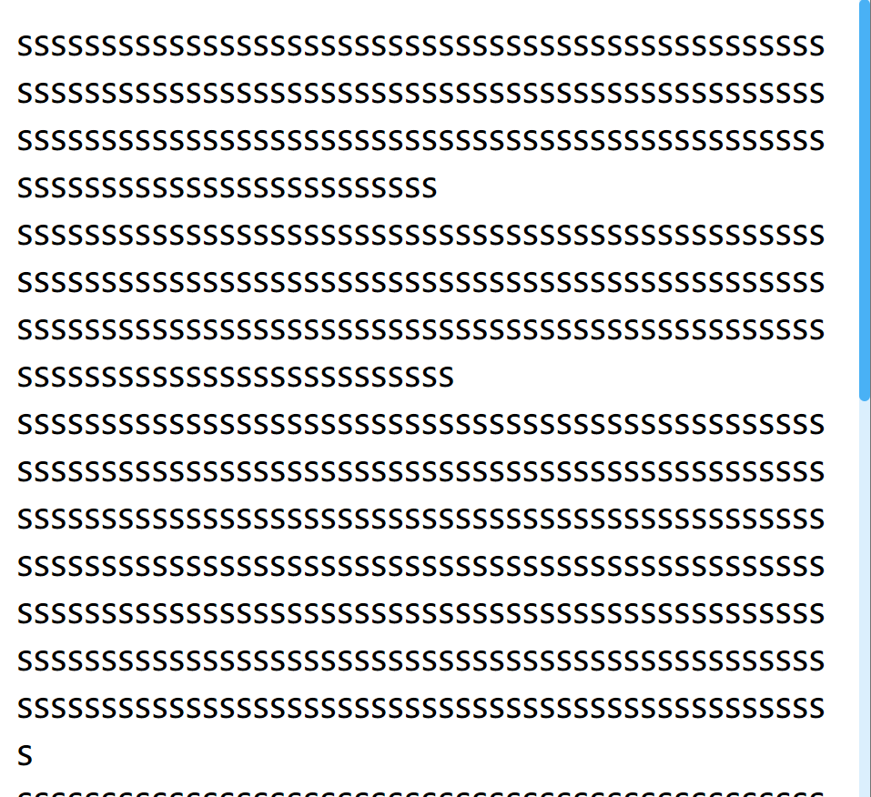

#  5.CSS

[[toc]]

## 5.1 基础

### 5.1.1 border-box |  content-box   

```js
--1.怪异盒子模型（ie盒子）：box-sizing: border-box;
即 width和height 已经包含了 padding 和 border 

--2.标准盒模型： box-sizing:content-box   
```


### 5.1.2 兼容性 | input | 内联

```js
--1.内联块元素之间为什么会有小间隙?
内联元素的空格和换行会被解析.像img这种不需要文本内容的内联块元素可以给它的父级的font-size设为0,也可以将img的宽高都设为100%.

--2.标签嵌套
a标签不能嵌套a标签（链接嵌套浏览器解析为兄弟级关系)
p标签不能嵌套块级标签 浏览器解析为兄弟级关系

--3.
dataset 是为了 规范而已
```


### 5.1.3 优先级(难) | 权重 | 100个id选择器样式也不会超过内联样式


两个定位元素分别在两个不同的包含元素中， 并且两个包含元素也设置了 z-index 的话，那么这两个元素的堆叠顺序取决于包含元素的 z-index。

https://specifishity.com

- 内联样式——得分为 1-0-0-0
- ID——得分为 1-0-0
- 类、伪类和属性——得分为 1-0 
- 元素和伪类——得分为 1

！important>内联样式（权重：1-0-0-0）>id选择器（权重：1-0-0）>class（权重：1-0）>属性选择器（权重：1-0）>元素选择器（权重：1）>通配符


相邻同胞选择器(.one+.two 选择.one之后的同一父元素的所有.two元素）、伪类选择器(:hover)、伪元素选择器(:after)、属性选择器([attribute])

### 5.1.4.display | visibility |  opacity

display:none：彻底消失，浏览器重绘重排
visibility:hidden：不重排，但会重绘
opacity:0：不重排，但会重绘


### 5.1.5 容器查询(Container Queries) | 难 | container name | type


```html
针对组件来做自适应

组件化的思路

父级容器contain: layout inline-size;
子元素就可以

@container (min-width: 700px) {
  .card {
    display: grid;
    grid-template-columns: 2fr 1fr;
  }
}


<!DOCTYPE html>
<html lang="en">

<head>
    <meta charset="UTF-8">
    <meta http-equiv="X-UA-Compatible" content="IE=edge">
    <meta name="viewport" content="width=device-width, initial-scale=1.0">
    <title>Document</title>
    <style>
        .container {
            container-type: inline-size;
            container-name: name;
            text-align: center;
            /* border: 1px black solid; */
        }
        @container name (max-width: 800px) {
            .text {
                color: red;
            }
        }
    </style>
</head>

<body>

    <div class="container">      
        
        <div class="text">koofe</div>
    </div>
</body>

</html>
```


给容器设置一个 contain 属性


### 5.1.5.BFC

块级格式化上下文

```js
个人理解BFC就是开启了一块独立的渲染区域，容器内的布局不会影响到外部
开启bfc的条件：
1.浮动元素（float）和绝对固定定位元素定位元素  
2.flex或者grid的 的 直接子元素
3.根元素<html标签>

解决方案：1.overflow：hidden（没有副作用）
```


应用：

- 使得若干元素不在同一BFC内来消除外边距折叠。
- 在使用子元素float的情况下，父元素不会包裹住子元素，这时候设置父元素生成一个BFC，就可以清除内部浮动

- 


### 5.1.6.CSS3 | 新特性

加了一些选择器
边框新样式：border-radius、box-shadow、border-image、text-overflow(clip, ellipsis)、rgba()
transform转换：位移、缩放、旋转、倾斜
渐变
flex布局
媒体查询

### 5.1.7 hsl颜色表示法(色值，饱和度，亮度，透明度)

```js
越接近0，颜色越深。约接近255，越来越浅
background: hsl(240, 16%, 59%)
```


### 5.1.8 pointer-events |  cursor | 鼠标事件 | 处理遮罩 | 鼠标移入

```css
--1.处理遮罩问题最好的方式是设置

.overlay {
  pointer-events: none;
}

--2.鼠标移入是

body{
    cursor: pointer;
}
```


### 5.1.9 (aspect-radio) 纵横比

```css
div.card {
  aspect-ratio: 16 / 9;
}
```


### 5.1.10 (resize: both + overflow)拖动大小 -2个注意

```css
.card{
    resize: both;
    width: 100px;
    height: 100px;
    background: red;overflow: auto;
}
<div class="card">card</div>


--1.resize需要和overflow结合使用才能生效
--2.img和table就没办法resize。
```


### 5.1.10.性能

```js
1.资源压缩
2.异步加载
5.不要使用@import，尽量使用link元素，前者页面加载后被加载，后者引入的同时被加载。
4.减少重排重绘
5.icon图片转成base64编码
6.硬件加速（css3的特性）
```


### 5.1.11.text-overflow

```js
解决：文本溢出
单行：text-overflow、overflow
多行：使用overflow：hidden截断，并使用伪元素遮住底部文字或者用text-overflow
```


### 5.1.15. filter 

```
属性（高斯模糊 | 亮度）:
可以转化灰度图像  graycale
可以调整对比度 contras
可以添加高斯模糊 blur
透明程度 opacity
```


### 5.1.16.calc 

可以在css中计算尺寸，注意运算符前后保留空格

### 5.1.19.line-height | height 

line-height一般针对文字来设置，后者对容器设置


### 5.1.20 渐变阴影的优雅处理

```css
使用.box::before 创建一个伪元素

.box::before {
  content: "";
    
  position: absolute;
  top: 0;
  left: 0;
  width: 100%;
  height: 100%;
  background: linear-gradient(
    45deg,
    hsl(300deg, 100%, 50%),
    hsl(200deg, 100%, 50%),
    hsl(100deg, 100%, 50%)
  );
  border-radius: 8px;
  filter: blur(24px);
    /*放在最下面*/
  z-index: -1;
}


```


### 5.1.21.absolute | fixed | float

相同之处在于元素都从文档流删除

float元素脱离文档流。但是他是在标准文档流中的。因为

```
因为float的元素处于标准文档流中，所以才会影响紧跟后面的元素啊，因为紧跟后面的元素是处在标准文档流中。脱离了文档流，但是没有脱离文本流,
元素浮动之后，会让它脱离文档流，也就是说当它后面还有元素时，其他元素会无视它所占据了的区域，直接在它身下布局。但是文字却会认同浮动元素所占据的区域，围绕它布局，也就是没有脱离文本流。

```

而绝对定位则是是相对于最近的且不是static定位的父元素来定位，如果没有父级元素，就以根节点

fixed布局是真正的全局定位


### 5.1.25.js | css 变量

js里面的常用方法

```js
 var rootElement = document.documentElement;
//获取属性
getComputedStyle(document.documentElement).getPropertyValue('--mode') 
//设置属性
rootElement.style.setProperty('--count', '25%');
```

css

```css
变量的使用
:root{
    --blue:xxx
}
调用
var(--blue)

vue里面模块化在css的后面加上module，定义和引入变量@value
```


### 5.1.24. :befor  |  :hover | 常用伪类

```css
--1.lvha 顺序
a{    
    :link 未访问的链接
    :visted 已经访问的链接
    :hover 鼠标移动到链接上
    :active 向被激活的元素添加样式
}
:before/after 最适合也是最推荐的应用就是图形生成
nth-child(2n)，first-child，not:nth-child(n):可以实现元素的选择，这是把n设置成0，1，2的然后取总体的值，父的子非常神奇。例如
.style1:not(:nth-child(n+2)){
    color: green
} 就是包括2以后的不要

container{
    
}


.red:nth-child(n+2){
            width: 100px;
            height: 100px;
            background: red;
            margin: 10px;
}

就是要包括2以后的。也就是说css：nth-child(是没有效果的)

--2.注意一下
nth-child有一个坑，就是在根标签下面用会有奇怪的效果
```


### 5.1.25.vh | vw | vmin | rem

```
em是相对父级元素的大小
rem是相对于根元素字体的大小。比如根元素大小是16px（这个一般是默认的大小。现在我们设计稿的尺寸的是48px。那么我们转化成rem就是48/16rem）
vmin，vmax是用来适配横屏和竖屏的，vmin是横屏和竖屏中比较小的值

```


### 5.1.31 temple标签

```html
据说是为了语义化才用的。元素不在界面上显示但是可以通过querySelector 和 这个元素content.firstElementChild.cloneNode(true)赋值后进行传参。
用法示例
<template id="template-task">
    <div class="task">
        <a class="task-name" target="_blank">some file name</a>
        <span class="task-progress">50%</span>
    </div>
</template>


<script> 
	const taskTemplate = document.querySelector('#template-task');
    const taskDOM = taskTemplate.content.firstElementChild.cloneNode(true);
    const nameDOM = taskDOM.querySelector('.task-name');
    nameDOM.textContent = task.name;
    const progressDOM = taskDOM.querySelector('.task-progress');
    const progress = `${task.progress}%`
    progressDOM.textContent = progress;
    if (task.status === TASK_STATUS.PROCESSING) {
        taskDOM.style.background = `linear-gradient(to right, #bae7ff ${progress}, #fafafa ${progress}, #fafafa 100%)`
    } else if (task.status === TASK_STATUS.SUCCESS) {
        taskDOM.style.background = '#d9f7be';
        nameDOM.href = task.url;
    } else if (task.status === TASK_STATUS.ERROR) {
        taskDOM.style.background = '#ffccc7';
    }
    //step2：去到到这里已经组装完，去到实体上复制 taskDOM
    const taskList = document.querySelector('.task-list');
    // 组装id
    let taskBox = taskList.querySelector(`#task-${task.id}`);
    // 这里是进度条
    if (!taskBox) {
        taskBox = document.createElement('div');
        taskBox.id = `task-${task.id}`;
        taskList.prepend(taskBox);
    }
    //append也可以添加dom元素，第一次见
    taskBox.innerHTML = '';
    taskBox.append(taskDOM);
</script>
```


### 5.1.32 scroll-snap-type(滚动贴合+轮播图)


```html
父元素中 
scroll-snap-type: y mandatory;
/* 需要把滚动条设置到直接父容器，
scroll-snap-type 才能生效，
默认是在 body 上，现在是 main 上 */
overflow: scroll;
height: 100vh;
然后子元素就
height:100vh

<!DOCTYPE html>
<html lang="en">

<head>
    <meta charset="UTF-8" />
    <meta http-equiv="X-UA-Compatible" content="IE=edge" />
    <meta name="viewport" content="width=device-width, initial-scale=1.0" />
    <title>CSS Scroll Snap 垂直</title>
    <style>
        * {
            margin: 0;
            padding: 0;
            overflow: hidden;
        }

        /* 核心样式 */
        .container {
            scroll-snap-type: y mandatory;
            /* 需要把滚动条设置到直接父容器，
                scroll-snap-type 才能生效，
                默认是在 body 上，现在是 main 上 */
            overflow: scroll;
            height: 100vh;
        }

        .page1,
        .page2,
        .page3,
        .page0,
        .page4 {
            width: 96vw;
            height: 100vh;
            scroll-snap-align: center;
            display: grid;
            place-items: center;
            font-size: 2em;

        }
    </style>

    <style>
        .switch {
            position: fixed;
            top: 20px;
            right: 50px
        }

        .switchButton {
            cursor: pointer;
        }
    </style>
</head>

<body>
    <div class="container">
        <div class="switch">
            <div class="switchButton" index="0">⚫</div>
            <div class="switchButton" index="1">⚫</div>
            <div class="switchButton" index="2">⚫</div>
            <div class="switchButton" index="3">⚫</div>
            <div class="switchButton" index="4">⚫</div>
        </div>
        <div class="page0">页面一</div>
        <div class="page1">页面二</div>
        <div class="page2">页面三</div>
        <div class="page3">页面四</div>
        <div class="page4">页面五（上下滚动也行）</div>

    </div>

    <script>
        document.querySelector(".switch").addEventListener("click", (e) => {
            let index = e.target.getAttribute("index")
            document.querySelector(".page" + index).scrollIntoView({
                behavior: "smooth",// 平滑过渡
                block: "start", //垂直方向的对齐
                inline: "start"
            })
        })
    </script>
</body>

</html>
```


## 5.2 快问快答（效果实现）

```js
--1.css的属性选择符是从左到右还是从右到左？
从右到左，因为这样能够比较快的定位元素
--2.如何减少回流和重绘？
尽量用class、少用内联样式
避免使用table布局
动画效果设置绝对布局，使其脱离文档流，从而减少对其他元素的影响
动态插入节点时，使用DocumentFragment
--3.毛玻璃效果怎么实现？
这玩意其实就是用到filter的blur（高斯模糊）
--4.为什么图片是行内元素还可以设置宽高？
图片是可替换元素，可替换元素的内容不受css影响，css只能影响他的位置但不能影响可替换自身内容，和inline-block一样。
典型的可替换元素 有iframe，video，img，input
```

### 5.2.1 清除浮动方法

在浮动元素后加一个css属性clear为both的空元素
父元素添加overflow：hidden或者auto变成一个BFC


### 5.2.2 视觉滚动效果

```js
background-attachment: fixed; //设置背景图像是否固定或者随着页面的其余部分滚动。

//scroll 背景图片随着页面的滚动而滚动，这是默认的。
//fixed 背景图片不会随着页面的滚动而滚动。
//local 背景图片会随着元素内容的滚动而滚动。
//initial 设置该属性的默认值。 阅读关于 initial 内容
//inherit 指定 background-attachment 的设置应该从父元素继承。 阅读关于 inherit 内容
```


### 5.2.3.画三角形效果

利用border-width，border-color和width设置成0可以分别设置四部分样式

```css
.border {
    width: 0;
    height: 0;
    border-style:solid;
    border-width: 0 50px 50px;
    border-color: transparent transparent #d9534f;
    position: relative;
}
.border:after{
    content: '';
    border-style:solid;
    border-width: 0 40px 40px;
    border-color: transparent transparent #96ceb4;
    position: absolute;
    top: 0;
    left: 0;
}
```


### 5.2.4 实现两栏布局 效果

右边自适应？三栏布局中间自适应？

- 两栏布局1：左边栏左浮动，右边栏用marin-left撑出内容展示，父元素生成BFC防止下方元素飞到上方内容
- 两栏布局2：设置右边栏flex为1
- 三栏布局1：两边float，中间使用margin把空间留出来给左右栏（要把中间的div写在html最后位置）
- 三栏布局2：两边绝对布局，中间使用margin把空间留出来给左右栏
- 三栏布局3：父元素flex布局，设置justify-content: space-between，左右设置宽度，中间设置宽度100%


### 5.2.5 实现父子元素absolution的宽高相等

```
q：父元素是一个flex，子元素是一个absolution。当时怎么样也对不齐
s：最后的解决方法是把父元素添加一个position: relative;
```


### 5.2.6.实现居中


```js
1. 绝对定位+margin:0 auto + top/bottom/left/right

2.绝对定位50% 50%+transform:translate(-50%,-50%)

3.flex布局+父元素justify-content+父元素align-items

4.place-items 作为 center(place-items 设置成start end 右上)
.grid {
  display: grid;
  place-items: center;
  height: 100vh;
}
```


### 5.2.7.实现sticky

可以通过observeraction监控元素，超过范围后设置成fixed布局


### 5.2.8.高z-index的容器空白处点击事件被吸收的问题处理

```js
例如地图组件中间我们加上几个按钮，然后中间会有一些地方被连接，被连接的地方点不了触发不了下面的事件。也就是事件被吸收了

solution：
--1.整体的dom设置成 pointer-events:none
--2.dom 下面的事件我们设置成  pointer-events:auto

或者是 
--1.把整体的dom 的height 设置成 0，因为其他的button 的
```


### 5.2.9 对齐问题

```
img 的对齐是baseline
```


### 5.2.10 滚动贴合 + 轮播图

```html
<!DOCTYPE html>
<html lang="en">

<head>
    <meta charset="UTF-8" />
    <meta http-equiv="X-UA-Compatible" content="IE=edge" />
    <meta name="viewport" content="width=device-width, initial-scale=1.0" />
    <title>CSS Scroll Snap 垂直</title>
    <style>
        * {
            margin: 0;
            padding: 0;
            overflow: hidden;
        }

        /* 核心样式 */
        .container {
            scroll-snap-type: y mandatory;
            /* 需要把滚动条设置到直接父容器，
                scroll-snap-type 才能生效，
                默认是在 body 上，现在是 main 上 */
            overflow: scroll;
            height: 100vh;
        }

        .page1,
        .page2,
        .page3,
        .page0,
        .page4 {
            width: 96vw;
            height: 100vh;
            scroll-snap-align: center;
            display: grid;
            place-items: center;
            font-size: 2em;

        }
    </style>

    <style>
        .switch {
            position: fixed;
            top: 20px;
            right: 50px
        }

        .switchButton {
            cursor: pointer;
        }
    </style>
</head>

<body>
    <div class="container">
        <div class="switch">
            <div class="switchButton" index="0">⚫</div>
            <div class="switchButton" index="1">⚫</div>
            <div class="switchButton" index="2">⚫</div>
            <div class="switchButton" index="3">⚫</div>
            <div class="switchButton" index="4">⚫</div>
        </div>
        <div class="page0">页面一</div>
        <div class="page1">页面二</div>
        <div class="page2">页面三</div>
        <div class="page3">页面四</div>
        <div class="page4">页面五（上下滚动也行）</div>

    </div>

    <script>
        document.querySelector(".switch").addEventListener("click", (e) => {
            let index = e.target.getAttribute("index")
            document.querySelector(".page" + index).scrollIntoView({
                behavior: "smooth",// 平滑过渡
                block: "start", //垂直方向的对齐
                inline: "start"
            })
        })
    </script>
</body>

</html>
```


## 5.3 CSS手写题

### 5.5.1.实现一个从下到上动画的模态窗

```html
<!DOCTYPE html>
<html lang="zh-cn">

<head>
  <meta charset="UTF-8">
  <meta name="viewport" content="width=device-width, initial-scale=1,maximum-scale=1, user-scalable=no">
  <style>
    @keyframes frames {
            0% {
                transform: translateY(100%);
            }
            100% {
                transform: translateY(0);
            }
        }
  </style>
</head>

<body>
  <button onclick="handleClick()">click</button>
  <div id="dialog" style="width:100px;height:100px;border: 1px solid;display: none;">
    <button type="button" onclick="handleHidden()" style="float: right;">取消</button>
  </div>
  <script>
    function handleClick(){
      let dialog = document.getElementById('dialog');
      dialog.style.display = 'block'
      dialog.style.animation = 'frames 3s'
    }
    function handleHidden(){
      document.getElementById('dialog').style.display = 'none';
    }
  </script>
</body>

</html>
```

### 5.5.2 实现手风琴

```html
主要是用到了：check这个伪类

<!DOCTYPE html>
<html lang="zh-CN">

<head>
	<meta charset="UTF-8" />
	<meta name="viewport" content="width=device-width, initial-scale=1.0" />
	<title>垂直手风琴</title>
	<!-- 事先引入好的字体图标库 源码会放在简介 自行下载即可 -->
	<link rel="stylesheet" href="css/font-awesome.min.css" />
	<link rel="stylesheet" href="css/index.css" />
</head>

<body>
	<style>
		* {
			/* 页面初始化 清除元素原有的内外边距 */
			padding: 0;
			margin: 0;
			/* 盒子模型 */
			box-sizing: border-box;
		}

		/* :not()选择器选取的是除括号里的元素以外的其它元素 :first-child选择器是第一个元素 */
		.accordion>li:not(:first-child) label {
			border-top: 1px solid #38814d;
		}

		li label i {
			position: absolute;
			left: 20px;
		}


		li ol {
			width: 100%;
			background-color: #333;
		}


		/* 逻辑 */
		li input {
			/* 将单选按钮隐藏起来 */
			/* display: none; */
		}

		li label {
			/* 相对定位 */
			position: relative;
			/* label元素是行内元素 需要将其转为块级元素 才能设置宽度和高度 */
			display: block;
			width: 100%;
			padding: 20px 50px;
			color: #fff;
			background-color: #5fb878;
			cursor: pointer;
		}


		.text_item {
			position: relative;
			width: 100%;
			height: 0;
			line-height: 50px;
			padding-left: 20px;
			color: #fff;
			cursor: pointer;
			/* 加过渡 */
			transition: all 0.5s;
		}

		.radio_item:checked~.text .text_item {
			height: 50px;
		}
	</style>
	<ul class="accordion">
		<li>
			<!-- 单选框的id属性值和label 元素的for属性值相同时,就可以通过label
				元素来选中单选框, 每个单选框都有一个相同name属性 -->
			<!-- 这个属性主要作用是用来将单选框分类的,当每个name属性值相同时,那么这一组单选框就只能同时选中一个 -->
			<input type="radio" name="item" id="item1" class="radio_item" /><label for="item1">一级标题1<i
					class="fa fa-caret-right"></i></label>
			<ol class="text">
				<li class="text_item">二级标题1</li>
				<li class="text_item">二级标题2</li>
			</ol>
		</li>
		<li>
			<input type="radio" name="item" id="item2" class="radio_item" /><label for="item2">一级标题2<i
					class="fa fa-caret-right"></i></label>
			<ol class="text">
				<li class="text_item">二级标题1</li>
				<li class="text_item">二级标题2</li>
				<li class="text_item">二级标题3</li>
			</ol>
		</li>
		<li>
			<input type="radio" name="item" id="item3" class="radio_item" /><label for="item3">一级标题3<i
					class="fa fa-caret-right"></i></label>
			<ol class="text">
				<li class="text_item">二级标题1</li>

			</ol>
		</li>

	</ul>
</body>

</html>
```


## 5.4 svg原理


### 5.4.1重要的属性

```js
x,y,fill,stroke, stroke-width，stroke-opacity
transform：translate（-10，10）| scale（0.1，0.1） ，
transform-origin：center
transform-box：fill-box //使用对象边界框作为参考框，要是不设置这个属性可能会将最近的svg视口作为标准
```

### 5.4.2重要的标签

```
polyline.points | stroke(折线图)，polygon.points（乱七八糟的东西），text.x.y（文字），line（折线图）fill | stroke
```

### 5.4.3 基础示例

```html
<!DOCTYPE html>
<html lang="en">

<head>
    <meta charset="UTF-8">
    <meta http-equiv="X-UA-Compatible" content="IE=edge">
    <meta name="viewport" content="width=device-width, initial-scale=1.0">
    <title>Document</title>
</head>
<style>
    .svgItem {
        background: aqua;
        width: 100px;
    }
    .animate {
        animation: move_right 1.1s cubic-bezier(0, 0,0,1) infinite;
        
    }

    @keyframes move_right {
        0% {
            opacity: 1;
            margin-left: -140px;
            position: absolute;

        }
        100% {
            opacity: 1;
            position: absolute;
            margin-left: -0px;
            z-index: 999;
        }
    }
</style>

<body>
    <!-- 第一步：定义：绘制时所占用的空间大小,0 0 表示x轴和y有的起始位置,即可视区View中哪个位置开始显示（可见） -->
    <!-- 后面100 100表示长和宽但是只是一个数量，不会有具体的长度.这里的100只是表示一个比例关系 -->
    <svg viewBox="0 0 100 100" class="svgItem animate">
        <!-- 第二步：绘制矩形,在y为1/10的时候进行绘制 -->
        <!-- <rect x="0" y="10" width="10" height="10"></rect> -->
        <!-- 第二步：绘制三角形 双数分别代表着x，y，单数则是不出现东西 -->
        <!-- <polygon points="0,10,10,10,0,0"></polygon> -->
        <!-- 第二步：绘制圆形 -->
        <circle cx="45" cy="45" r="5" class="animate"></circle>
        <!-- 第二步：绘制线段 -->
        <!-- <line stroke="black" x1="0" y1="0" x2="20" y2="0" stroke-width="10"></line> -->
        <!-- 第二步：绘制折线 -->
        <polyline points="0,0,10,10,15,20" fill="transparent" stroke="black" stroke-width="1"></polyline>
        <!-- 第二步：绘制文字 -->
        <!-- <text x="10" y="60" style="font-size: 24">hello </text> -->
        <!-- g标签可以加一个组 -->
    </svg>

</body>

</html>
```


## 5.5 动画动效


以后慢慢完善

### 5.5.1  gif(多用)

这个对于技术来说最简单，本质还是和png、jpg一样，就是个图片，大多数网站都会使用这个经济、有效、简单的方法。设计师导出方便，技术用的舒服。不过注意体积不宜过大。

但是有个致命缺点：gif图是不支持alpha透明度的.只支持[索引透明度](https://www.zhihu.com/search?q=索引透明度&search_source=Entity&hybrid_search_source=Entity&hybrid_search_extra={"sourceType"%3A"answer"%2C"sourceId"%3A547326433})，也就是只会显示全透明和不透明，导致出现杂边，尤其是做透明的不规则的gif。所以gif在网站上一般会加个底图来展示，以遮盖毛边。


### 5.5.2 png序列帧动画(少用)

这个方法网页端和APP都适用，技术也推荐，性能没问题。本质就是动画的基础原理，一个一个展示，速度快了就成了动画。


### 5.5.3  Lottie动画

Lottie是Airbnb开源的动画项目，支持Android、iOS、ReactNaitve三大平台，网页也可以。

对设计师来说，就是在AE上使用bodymovin插件，导出动画json文件给技术，技术调用lottie的代码来实现动画。动画非常流畅，效果也很惊艳。

不过需要注意的是[Lottie](https://link.zhihu.com/?target=https%3A//airbnb.design/introducing-lottie/)动画在AE里面只能用[矢量图形](https://www.zhihu.com/search?q=矢量图形&search_source=Entity&hybrid_search_source=Entity&hybrid_search_extra={"sourceType"%3A"answer"%2C"sourceId"%3A547326433})制作，如果用图片素材就不行了，本质上是把AE可视化的代码，转换成[json文件](https://www.zhihu.com/search?q=json文件&search_source=Entity&hybrid_search_source=Entity&hybrid_search_extra={"sourceType"%3A"answer"%2C"sourceId"%3A547326433})。

```
https://airbnb.design/introducing-lottie/
```


### 5.5.4 css动画实例

可以看作是是animation的简化版本

1. transition是一个过渡的效果，没有中间状态，需要设置触发事件（如hover等）才能执行；一次性，不能重复发生，除非一再触发

2. animation是一个动画的效果，有多个中间帧，可以在任意一个中间帧设置状态，不需要设置触发事件就能执行。

### 5.5.4.1 keyframes | animation-name/duration/fill-mode

```css
css的效果，谁想用就 document.querySector('xxxx').classList.toggle('move_right')就可以了


@keyframes move_right {
        0% {
            opacity: 1;
            margin-left: -140px;


        }
        100% {
            opacity: 1;
            position: absolute;
            margin-left: -0px;
            z-index: 999;
        }
    }

.animate {
    /*animationm默认传参传2个*/
  animation-name: move_right;
  animation-duration: 1.1s;
    /*第三个参数是运动曲线*/
  animation-timing-function: cubic-bezier(0.0, 0.0, 1.0, 1.0);
    /*第四个参数是重复次数*/
  	animation-iteration-count: infinite;
   /*动画完成时,是显示动画开始的状态还是结束时的状态。*/
    /*forwards：结束态。backwards：开始态*/
  animation-fill-mode: forwards;
}


/*上面的animate跟下面的效果一样*/
.animate {
        animation: move_right 1.1s cubic-bezier(0, 0,0,1) infinite;
    }
```

### 5.5.4.2  transition(hover示例)

可以看作是是animation的简化版本

```css
transition: property duration timing-function delay;
注意一下，如果这个 transition 放在没有触发事件（hover）的里面的话，我们就会在不执行的时候，慢慢收回去。放在了.box:hover这里面他就会一下子收回去
.box {
        height: 100px;
        width: 100px;
        background-color: lightpink;
        transition: all 1s 0.5s ease-in-out;
    }
 
    .box:hover {
        width: 200px;
    }
```

## 5.6 滚动条样式


### 5.6.1  箭头 | scrollbar-button

```css
::-webkit-scrollbar-button{
    
}
```


### 5.6.2 可以拖动的滑块 |  scrollbar-thumb

```css
::-webkit-scrollbar-thumb{
	background-color: #49b1f5;
    border-radius: 32px;
}
```


### 5.6.3 滑块正上下的元素 |  scrollbar-track-piece


```css
::-webkit-scrollbar-track-piece{

}
```


### 5.6.4整个轨道  |  scrollbar

```css
::-webkit-scrollbar{
	/* 对应纵向滚动条的宽度 */
    width: 10px;
    /* 对应横向滚动条的宽度 */
    height: 10px;
}
```


### 5.6.5 纯色示例(.2+.4)



```html
<!DOCTYPE html>
<html lang="en">

<head>
    <meta charset="UTF-8">
    <meta http-equiv="X-UA-Compatible" content="IE=edge">
    <meta name="viewport" content="width=device-width, initial-scale=1.0">
    <title>Document</title>
</head>

<body>
    <style>
        body {
            word-wrap: break-word;
        }

        /*  */
        ::-webkit-scrollbar {
            /* 对应纵向滚动条的宽度 */
            width: 5px;
            /* 对应横向滚动条的宽度 */
            height: 10px;
            background-color: #dbeffd;
        }

        ::-webkit-scrollbar-thumb {
            background-color: #49b1f5;
            border-radius: 32px;
        }
    </style>
    ssssssssssss
</body>

</html>


 <style>
这样也可以
/* 总 */
::-webkit-scrollbar {
    /* 滚动条宽 */
    width: 6px;
    height: 4px;
    background-color: #eee;
}
/* 样式 */
    ::-webkit-scrollbar-thumb {
    /* 滚动条 拖动条 */
    background-color: rgba(0, 0, 0, .2);
    border-radius: 6px;
}
 </style>
```


### 5.6.6 火狐示例

```css
*{
    /* 1.宽度 */
    scrollbar-width: thin;
    /* 2.颜色 第一个滚轮颜色，第二个滚动条背景色 */
    scrollbar-color: rgb(90, 105, 195) #eee;
}
```


## 5.7 css 工程化

### 5.7.1 预处理器

解决了模块化开发和嵌套书写的维护问题

```js
--1.Less、Sass和Stylus:解决了模块化开发和嵌套书写的维护问题
```


### 5.7.2 命名 | oocss | bem | smacss


```js
--1.Object-Oriented CSS(css面向对象)：主要有两个规则
--1.1 Separate structure and skin（结构和皮肤分离）：结构指的是一个东西的大小和定位。皮肤指的是color，gradient之类的。
--1.2 Separate container and content（内容和容器分离）：目前是我最喜欢的（这样子会增加类）。

--2.BEM 类似于search-form__input
--2.1 block(您希望将样式范围限定到的 HTML 块) 
--2.2 element(block__elementOne)
--2.3 modifier(.block__elementOne--modifier)
--2.4 __分隔块和元素。--分隔元素 和修饰器

我想大多数人都觉得 BEM 的破折号和下划线看起来很奇怪，所以真是项目中很少有严格遵守 BEM 规范的 CSS 代码出现，往往大家都是接受 BEM 的核心思想然后通过短横线来连接这种命名规范，比如：head-input-search。


--3.SMACSS(Scalable and Modular Architecture for CSS)  blmst
bem的核心是分层，smacss的核心是分类 样式主要有5类

--3.1 Base（基础）：元素选择器 html {} | div{} 
--3.2 Layout（布局）：一般布局类名都是 .l- 开头
blmst
.l-header {}
.l-primarynav {}
.l-main-content {}


--3.3 Module（模块）：可重用可复用的部分
.moudle-name{}
--3.4 State（状态）
.is-xx{}  //动态交互 .is-collapsed {} .is-active {}
--3.5 Theme（主题）
__theme.css 
```


### 5.7.3 postcss

可以看作css的babel工具，能够压缩css.也是样式兼容工具，加前缀，重置等

#### 5.7.3.1 Autoprefixer

Autoprefixer 使用Browserslist，因此你可以通过查询指定要在项目中定位的浏览器。

我们可以使用“browserslist”键在 package.json 文件中配置我们的 Browserslist：

```json
 "browserslist": [ 
     "defaults"  
 ]

```

上面的`defaults`查询是以下内容的简短版本：

- `> 0.5%`全球使用率至少为 0.5% 的浏览器。
- `last 2 versions`*每个*浏览器的最后 2 个版本，
- `Firefox ESR`最新的[Firefox 扩展支持版本](https://link.juejin.cn?target=https%3A%2F%2Fsupport.mozilla.org%2Fen-US%2Fkb%2Fchoosing-firefox-update-channel).,
- `not dead`在过去 24 个月内获得官方支持或更新的浏览器。

或者我们可以使用`.browserslistrc`根目录中的文件，并在其中输入我们的配置。


#### 5.7.3.2 postcss-import

```css
允许我们用
@import './components/comp2.css';语法
```


#### 5.7.3.3 cssnano

```
缩小css的大小
```


#### 5.7.3.4 postcss-preset-env | 处理兼容

```js
npm install postcss-preset-env@7.8.3  //postcss-preset-env预设就是插件的集合

const path = require('path')

module.exports = {
  entry: './src/index.js',
  output: {
    filename: 'main.js',
    path: path.resolve(__dirname, 'dist')
  },
  module: {
    rules: [
      {
        test: /\.css$/,
        use: [
          'style-loader',
          'css-loader',
            {
              loader:'postcss-loader',
                options:{ // webpack选项
                    postcssOptions:{ // loader配置选项
                        plugins:[
                            require('autoprefixer'),
                            require('postcss-preset-env')
                        ]
                    }
                }
            }
          
        ]
      },
      {
        test: /\.less$/,
        use: [
          'style-loader',
          'css-loader',
          'postcss-loader',
          'less-loader'
        ]
      }
    ]
  }
}

```


## 5.8 选择器(难)

### 5.8.1  邻居(~) |  直接相邻(+)兄弟选择器

```js
--1.h1 + p {margin-top:50px;}相邻兄弟:紧随h1的p元素(必须紧跟A后面，A前面无效)
--2.h1 ~ p {margin-top:50px;} ~是在h1之后，但是不用紧随  | ~ 对应着webpack的小版本
```


### 5.8.2 后代选择器(空格) |  直接后代选择器(>)

````js
--1.h1  p {margin-top:50px;} 就是老大小弟元素。
--2.h1>p{}选择h1的一代p元素 其中 有点像的是>只会选择一代
````


### 5.8.3  并列元素(逗号)


```js

--29.3 并列元素是逗号，如果要把并列元素优化何以用 :where 和 :is选择器
例如
:is(.red,.xx){  
    background: red;
}
注意 where的权重是0，:is的权重是100


```


### 5.8.4 where | is

```js
--1.css :where 选择器，可以给他指定一组选择器作为参数，来选择所有满足条件的元素。例如选择所有 div 和 section 元素：

:where(div, section) {
  border: 1px solid #8965f6;
  padding: 24px;
}

例如
:is(.red,.xx){  
    background: red;
}

p :where(a.link, button.btn) {
  color: #83fd7a;
}
注意 where的权重是0，:is的权重是100
```


复杂的布局我们用gird，简单的二维布局我们用flex就可以了


## 5.9 css新特性


### 5.9.1 -webkit-mask-image

b站的弹幕不受遮挡的源码。ai生成模板

```css
 position: relative;
 -webkit-mask-image: url("mask.svg");
 -webkit-mask-size: 668px 376px;
```


## 5.10 加载字体

```js
--0.使用
@font-face {
  font-family: "led";
  src: url("DS-DIGI.TTF");
}

.card-panel-num {
  font-family: led;
  font-size: 25px
}


--1.简单优化
@font-face {
  font-family: "sans-medium";
  src: url(./font/NotoSansSC-Medium.otf);
    /*表示文档不会block(极短的阻塞期< 1s)，直接使用备选字体，远程字体下载完毕后再进行替换。*/
  font-display: swap;
}


--2.分块加载（https://github.com/HoPGoldy/google-font-splitter）
浏览器只会在页面使用了该范围中的字符时才会加载对应的字体“分片”。也就是说页面初始化时给浏览器一个目录，在页面要渲染字体时再去根据目录加载所需的字体文件。这不就是字体文件的按需加载

类似与这样
@font-face {
  font-family: "sans-regular";
  font-style: normal;
  font-weight: 400;
  font-display: swap;
  src: url(s/notosanssc/v26/k3kXo84MPvpLmixcA63oeALhLOCT-xWNm8Hqd37g1OkDRZe7lR4sg1IzSy-MNbE9VH8V.4.woff2)format("woff2");
  unicode-range: U+1f1e9-1f1f5, U+1f1f7-1f1ff, U+1f21a, U+1f232, U+1f234-1f237, U+1f250-1f251, U+1f300, U+1f302-1f308, U+1f30a-1f311, U+1f315, U+1f319-1f320, U+1f324, U+1f327, U+1f32a, U+1f32c-1f32d, U+1f330-1f357, U+1f359-1f37e
}


```


## 5.11 交互 理论 | 用户体验法则

### 5.11.1  Fitts’s Law(菲茨定律)

到达目标的移动时间取决于目标的大小和到目标的距离。

```js
--1.触摸目标之间应该有足够的间距
--2.触摸目标足够大
```


### 5.11.2 Doherty Threshold（多尔蒂阈值）

<400 毫秒进行交互时，工作效率就会飙升

```js
--1.进度条有助于让等待时间变得可以忍受，无论其准确性如何。(加上进度条+动画)
--2.有目的地为流程添加延迟实际上可以增加其感知价值并灌输信任感，即使流程本身实际上花费的时间要少得多。(加上延迟)
--3.响应时间在400ms之类
```


### 5.11.3 Goal-Gradient Effect(目标梯度效应)

接近目标的倾向随着接近目标而增加

```
提供清晰的进度指示，以激励用户完成任务
```


### 5.11.4 Hick’s Law(希克定律)

做出决定所需的时间随着选择的数量和复杂性而增加。

```js
--1.当响应时间对增加决策时间至关重要时，尽量减少选择。
--2.将复杂的任务分解成更小的步骤，以减少认知负荷。
--3.通过突出推荐的选项来避免让用户不知所措(有点意思)。创造游戏角色的时候可以用得上
```


### 5.11.5 Jakob’s Law(雅各布定律)

```js
--1.用户会将他们围绕一种熟悉的产品建立的期望转移到另一种看起来相似的产品上。(模仿现成竞品)
```


### 5.11.6  布局法则


```js
--1.靠近的元素被认为具有相似的功能或特征。
--2.公共区域创建清晰的结构，帮助用户快速有效地理解元素和部分之间的关系(简单方法)
--3.确保链接和导航系统在视觉上与普通文本元素有所区别。
```


### 5.11.7   Miller’s Law(米勒定律)

```js
--1.一般人在工作记忆中只能保留 7（正负 2）项(不要太密集)

```

### 5.11.8 Occam’s Razor(奥卡姆剃刀)

在预测效果相同的竞争假设中，应选择假设最少的假设。

```js
--1.降低复杂性的最佳方法是首先避免它(人们应该选择做出最少假设的答案)
```


## 5.12 Flex布局

### 5.12.0 flex-direction(排列方式)

```js
--1.row 横着排列（列） 
--2.column 竖着排列（行）
```


### 5.12.1 align-items(竖轴对齐) |  justify-content (横轴对齐)

```js
--1.flex-start/end/ :朝左/右对齐
--2. space-evenly/space-between ：平分空间/两端对齐
--3.居中
```

### 5.12.2 flex的属性

```js
flex的属性：放大，缩小，本身。
flex-basis, flex-grow和flex-shrink。
可以按照flex-grow,flex-shrink,flex-basis的顺序使用flex简写属性
```


## 5.13 Grid布局

### 5.13.1  grid-template-columns(横向)

```css
//3个一行的布局 ，也可以用fr来进行布局，类似于百分比
grid-template-columns: 100px 100px 100px;
```


### 5.13.2 grid-gap(间隔)

```css
/*行之间间隙10px ，列之间间隔0px*/
grid-gap:10px 0px;

```


### 5.13.3 grid-area | grid-template-areas(范围)

```html
 <style>
     .container{
        display: grid;
        grid-template-areas:
          "header header header"
          "sidebar content content"
          "footer footer footer";
     }
	/*然后制定一下header sidebar content 和 footer*/
     .header{
         grid-area: header;
         width: 98%;
         height: 100px;
         background: red;
         margin: 10px;
         grid-area: header;
     }
 </style>
```


### 5.13.4 align-items(竖轴对齐) |  justify-content (横轴对齐)

```css
align-items: center/end/space-between;
```


## 5.14 流行设计风格


### 5.14.1 (skeuomorphism)拟物

mo fi shen

```
就是 例如 wifi 图标 就变成 这个图标
```


### 5.14.2( flat) 扁平

```
字面意思：有点类似于现在的 fontsome
```


### 5.14.3  (material design) 物料设计

https://www.mdui.org/design/resources/layout-templates.html#layout-templates-tablet

```js
--1.阴影、明亮的高光并存。干净
--2.匹配品牌的外观和感觉
```


### 5.14.4 neumorphism(新拟态)

```js
--1.模拟凸出或者凹下去的感觉
```


### 5.14.5 glassmorphism(玻璃态)

```js
--1.主要是对背景颜色的虚化，模拟
```


### 5.14.6 claymorphism(泥陶态)

```
--1.模拟3d 效果，给人一种可以按下去的感觉
```

