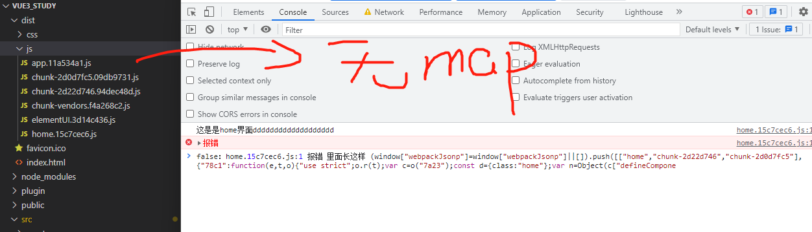
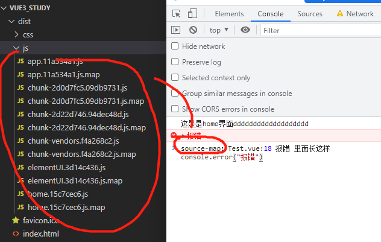
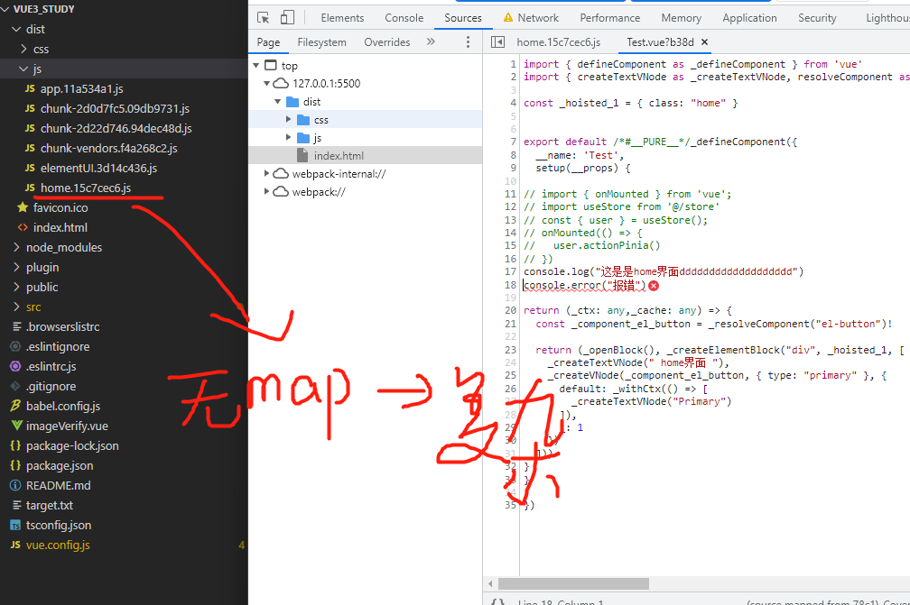

#  2.webpack

[[toc]]

https://www.webpackjs.com/

```js
--1.webpack 原理：
--1.1.从配置文件读取与合并参数，得出最终的参数（初始化参数）
--1.2 初始化compiler对象，调用plugin的apply方法（加载插件，开始编译）
--1.3 entry开始，编译（compiler）ast语法树，过loader转化生成chunk，plugin（确定入口，编译模块-（模块会被加载(load)、封存(seal)、优化(optimize)、分块儿(chunk)、哈希(hash)和重新创建(restore)））
--1.4.生成模块，输出资源

--2.webpack热更新原理：
--2.0.监控
--2.1.socket建立连接，传递hash值
--2.2.hmr runtime 根据变化发送json
--2.3.hmp比对tree并且更新module

--3.webpack运行顺序
> Preset 》 Plugin(从前到后顺序执行，从左到右 | HotModuleReplacementPlugin) > Preset(从后向前,从右往左) > loader

--4.
```

## 6.1 配置

### 6.1.1 external 模块

跟**splichtunk** 模块很相似

项目优化的方案：抽离公共的组件，减小项目的大小

用于避免将一些很通用的模块打包进你发布的library里，而是选择把它们声明成external的模块

```js
 // 比如我们现在要打包一个js类似于
import $ from 'jquery'

当你的库需要依赖到例如jquery，bootstrap这样的通用JS模块时，我们可以不将它打包进bundle，而是在Webpack的配置中声明external。npm install 的时候

externals: {
 jquery: {
  root: 'jquery', //可以通过一个全局变量访问 library （例如，通过 script 标签）。
  commonjs: 'jquery', //commonjs：可以将 library 作为一个 CommonJS 模块访问。
  commonjs2: 'jquery',
  amd: 'jquery',
 },
},
```


### 6.1.2  ProvidePlugin 

无需用require引入的全局变量

```js
 plugins: [
    //提供全局的变量，在模块中使用无需用require引入
    new webpack.ProvidePlugin({
      $config: [resolve(`src/data/config/${process.env.CONFIG_ENV}.env.js`), 'default'],
    }),
  ]
```

### 6.1.3 code splitting.

code splitting：每次改动业务逻辑代码，就会只打包业务逻辑 js，只有1Kb，节省打包的时间空间可能也有

跟**external** 模块很像：但是**external**是节省打包空间的

#### 6.1.3.1 通用分隔代码方法

```js
webpack有三种通用的code spliting方法
--1.多entry方式: 使用配置手动拆分代码
const path = require('path');
module.exports = {
  mode: 'development',
  entry: {
    page1: './src/page1.js',
    page2: './src/page2.js'
  },
  output: {
    filename: '[name].bundle.js',
    path: path.resolve(__dirname, 'dist')
  }
};
生成两个bundle, 即page1.bundle.js和page2.bundle.js。

--2.公共提取： 使用依赖项或者SplitChunksPlugin

// 关键
optimization: {
    //默认是deterministic
    chunkid:""  // 2. natural 按使用顺序的数字ID。
 //3. named 方便调试的高可读性id
 //4. deterministic 根据模块名称生成简短的hash值
 //5. size 根据模块大小生成的数字id
    splitChunks: {
        chunks: 'all'
    }
}
如果两个都import了一个东西xx，那么xx就会被打包到xx.bundle.js

--3.动态加载：使用模块内的内联函数拆分代码

function loadScript(url) {
    const script = document.createElement('script');
    script.src = url;
    document.head.appendChild(script);
}


```

#### 6.1.3.2 splitChunk工作原理

```js
调用如下
import('lodash').then(_ => {
    // Do something with lodash (a.k.a '_')...
  });

webpack的工作原理
requireEnsure方法中成功加载resolve，失败reject

```


### 6.1.4  webpackChunkName | webpackPrefetch

--1.魔法注释:它其实就是对 chunkFilename 定义时 [name] 值的改写

```js
{
        path: '/',
        name: 'three',
        component: ()=>import(/*webpackChunkName: "sum" */ '@/index3.vue'),
        meta:{title:"sku算法",role:'admin',img:'bitbug_favicon.ico'}
},
```

--2.通过魔法注释，对 chunk 的异步加载进行一系列优化

```js
/* webpackPrefetch: true */  //浏览器在闲置时间加载chunk 文件
/* webpackPreload: true */	// 浏览器在父chunk加载时并行加载

在 webpack 中如果当前加载的 chunk 中有通过 webpackPrefetch 的依赖 chunk 时，就会创建一个<link rel="prefetch" href="依赖的chunk的路径">标签添加到head中。这样就实现了 magic comments 中的 prefetch

```


### 6.1.5  webpack-merge

将共有的东西提取出来

```js
--6.1.5 webpack.dev.config.js
const commonConfig = require('./webpack.base.config')
// webpack-merge 将公共的配置 和 开发的配置合并结合
const { smart: merge } = require('webpack-merge')

const devConfig = {
	mode: 'development'
}
module.exports = merge(commonConfig, devConfig)
--3.2 webpack.prod.config.js 
    const commonConfig = require('./webpack.base.config')
const { smart: merge } = require('webpack-merge')

const prodConfig = {
	mode: 'production'
}
module.exports = merge(commonConfig, prodConfig)
```


### 6.1.6 source map

#### 6.1.6.1 基础配置

```js
//用来定位bug的。生产环境可以设置
configureWebpack:{
    // devtool:"source-map",
    devtool:false,
} 
//把这个东西藏起来
```


#### 6.1.6.2 sourcemap 不同属性

```js
devtool: process.env.NODE_ENV === "production" ? 'eval-cheap-module-source-map' : false,
```


false



source-map



eval-cheap-module-source-map




### 6.1.7 loader

因为webpack默认是打包js的，因此如果我们要打包css和ts还有图片然后引入官方loader就可以了


### 6.1.8 runtime-only |  runtime-compiler

```js
--4.项目中的runtime-only和runtime-compiler对比？
我们首先要知道流程：template -> ast(抽象语法树) -> render -> vitural dom -> ui。我们默认是runtimeCompiler-only
--4.1runtime-compiler中，是将组件编译成模版再进行使用的（从template开始）
--4.2而runtime-only，直接使用提供render函数(从render开始)
main.js中是这样的
new Vue({
  render: h => h(App),
}).$mount('#app')

--4.3启用运行时编译表示现在使用的vue是runtime-only，启用将使用runtime-compiler。在vue.config.js中runtimeCompiler: true。他的作用是可以当作react的空标签帮助我们包裹元素，但是不会被渲染。vue-template-compiler的在开发依赖时将.vue文件中的 template 解析成 render 函数
main.js中是这样的
new Vue({
  template: `
    <div id="app-test">x2222xx</div>
  `,
}).$mount('#app')

--4.3总结 :runtime-only能够更快一点.因为能够 runtime-compiler省略了第一个template变成render的过程，而采用vue-template-compiler直接编译了

```


### 6.1.10  browserslistrc

(browserslistrc的数据来自于can i use)

babel是一个工具他自己什么是都做不了，通过.browserslistrc筛选出浏览器，再通过@babel/preset-env插件的集合处理转换，但是不能完成所有功能（promise symbol）的转换，所以加上polyfill。

@babel/preset-env和 Autoprefixer用来确定需要转译的 JavaScript 特性和需要添加的 CSS 浏览器前缀

根目录下面新建这个文件

```shell
>1%
last 2 version
not dead
```

package.json中添加

```js
"browserslist":[
    ">1%",
    "last 2 version",
    "not dead"
]
```


### 6.1.11 环境的配置

```js
--1.shell中
npm install cross-env 
--2.就可以在package.json中
"serve": "cross-env NODE_ENV=production vue-cli-service serve"
--3.
就可以在任何地方
process.env.NODE_ENV进行调用了
```


### 6.1.12 锁定版本号

锁定版本：去掉^或~ 

## 6.2 vue-cli | 基本配置示例

### 6.2.1 vue-cli 版本

| 版本 |                            vuecli                            |
| :--: | :----------------------------------------------------------: |
| 2.0  | 1.基于webpack3 \|  2.初始化项目用vue init webpack my-project |
| 3.0  | 1.基于webpack4 \| 2.初始化项目用vue create \| 3.移除了build和config等目录 \| 4.core-js从2.xx变成了3.xx |
| 4.0  | 1.cli3.0跟4.0差不多 \| 2.自带了webpack-bundle-analyzer \| thread-loader。speed-measure-webpack-plugin还是没有 \| |


### 6.2.2  vue-cli和webpack

```js
npm install -g @vue/cli

--1.查看@vue/cli 版本
//输出@vue/cli 4.5.15
vue -V

--2.查看当前项目的vue/cli的webpack版本
node_mudules

--3.vue-cli和webpack有个默认配置，该对象将会被 webpack-merge 合并入最终的 webpack 配置。
--3.1.如下访问：/node_modules/@vue/cli-service/webpack.config.js
--3.2.调整 webpack 配置最简单的方式就是在 vue.config.js 中的 configureWebpack 选项提供一个对象：
// vue.config.js module.exports = { configureWebpack: { plugins: [ new MyAwesomeWebpackPlugin() ] } }
--3.3Vue CLI 内部的 webpack 配置是通过 webpack-chain 维护的 .可以通过chain来进行调用

--4.vue-cli之中的webpack的优化示例
const shadowMode = !!process.env.VUE_CLI_CSS_SHADOW_MODE
const needInlineMinification = isProd && !shouldExtract
if (shouldExtract) {
          rule.use('extract-css-loader').loader(require('mini-css-extract-plugin').loader).options({publicPath: cssPublicPath})
}
```


### 6.2.4 vue.config.js基础

```js
npm install  webpack-bundle-analyzer -D

var BundleAnalyzerPlugin = require('webpack-bundle-analyzer').BundleAnalyzerPlugin

const env = process.env.NODE_ENV;//当前环境
// 默认是本地环境
if (env === 'production') { // 生产环境
    console.log("----------生产环境----------");
    module.exports = {
        publicPath: process.env.NODE_ENV === "production" ? "./" : "./",
        //优化：关闭打包的map文件
        productionSourceMap: false,
        configureWebpack: {
            plugins: [
                new BundleAnalyzerPlugin({
                    analyzerMode: 'server', // 每次构建时自动打开server  手动打开 disabled
                    generateStatsFile: true, // 是否生成stats.json文件
                    statsOptions: { source: false },
                }),
            ],
            cache: {
                type: "filesystem",
                allowCollectingMemory: true
            },
            // 性能提示
            performance: {
                // hints: "error"     // 超过250kb 的资源 我们掏出错误
                maxAssetSize: 250000 //最大250000 bytes
            },
            //优化器
            optimization: {
                chunkIds: "named", // 2. natural 按使用顺序的数字ID。
 //3. named 方便调试的高可读性id
 //4. deterministic 根据模块名称生成简短的hash值
 //5. size 根据模块大小生成的数字id
                splitChunks: {
                    // runtimeChunk: "single",  //单独打包，小文件还挺好用的
                    chunks: "all", // 必须三选一： "initial" | "all"(推荐) | "async" (默认就是async)
                    minSize: 30000, // 最小尺寸，30000 超过30K才独立分包
                    minChunks: 1, // 最小 chunk ，默认1
                    maxAsyncRequests: 5, // 最大异步请求数， 默认5
                    maxInitialRequests: 3, // 最大初始化请求书，默认3
                    automaticNameDelimiter: "-", // 打包分隔  
                    cacheGroups: {
                        // 这里开始设置缓存的 chunks
                        priority: false, // 缓存组优先级
    
                        elementUI: {
                            name: 'elementUI', // 将elementUI拆分为单个包
                            test: /[\\/]node_modules[\\/]_?element-ui(.*)/ // in order to adapt to cnpm
                        }
                    }
                },
                // 优化：代码压缩，使用terser来缩小/最小化你的 JavaScript
                minimize: true,
            },
    
    
        },
        //压缩图片
        chainWebpack(config) {
           console.log(config)
        }
    
    
    }
    

} else if (env === 'test') { // 测试环境
    console.log("----------测试环境----------");
   
} else { // 开发环境
    console.log("----------开发环境----------");
    module.exports = {
        publicPath: process.env.NODE_ENV === "production" ? "./" : "./",
        //优化：关闭打包的map文件
        productionSourceMap: false,
        configureWebpack: {
            plugins: [
                new BundleAnalyzerPlugin({
                    analyzerMode: 'server', // 每次构建时自动打开server  手动打开 disabled
                    generateStatsFile: true, // 是否生成stats.json文件
                    statsOptions: { source: false },
                }),
            ],
            cache: {
                type: "filesystem",
                allowCollectingMemory: true
            },
            // 性能提示
            performance: {
                // hints: "error"     // 超过250kb 的资源 我们掏出错误
                maxAssetSize: 250000 //最大250000 bytes
            },
            //优化器
            optimization: {
                chunkIds: "named", //1.named选择块 ID 时的算法在编译之间不会更改的短数字 ID。 // 2.'deterministic'选择快 编译的时候默认使用适合长期缓存。生产模式默认启用。
                //对应着chain模块就是   config.optimization.splitChunks({})  只有splitChunks:里面的参数可以被引用
                // 可以在 vue配置文件中加入 /* webpackChunkName:"lodash" */ 就可以在打包js的时候叫做这个名字
                splitChunks: {
                    // runtimeChunk: "single",  //单独打包，小文件还挺好用的
                    chunks: "all", // 必须三选一： "initial" | "all"(推荐) | "async" (默认就是async)
                    minSize: 30000, // 最小尺寸，30000 超过30K才独立分包
                    minChunks: 1, // 最小 chunk ，默认1
                    maxAsyncRequests: 5, // 最大异步请求数， 默认5
                    maxInitialRequests: 3, // 最大初始化请求书，默认3
                    automaticNameDelimiter: "-", // 打包分隔  
                    cacheGroups: {
                        // 这里开始设置缓存的 chunks
                        priority: false, // 缓存组优先级
    
                        elementUI: {
                            name: 'elementUI', // 将elementUI拆分为单个包
                            test: /[\\/]node_modules[\\/]_?element-ui(.*)/ // in order to adapt to cnpm
                        }
                    }
                },
                // 优化：代码压缩，使用terser来缩小/最小化你的 JavaScript
                minimize: true,
            },
    
    
        },
        //压缩图片
        chainWebpack(config) {
           console.log(config)
        }
    
    
    }
}


```


### 6.2.4 webpack 版本

```js
npm install webpack@4 webpack-cli@3
```


## 6.3 快问快答

```js
--1. webpack的source-map了解吗
用来定位bug的。
--2.如果开发环境没有source-map，那如何去定位错误呢？
如果是是vue或者是react的代码，他会有编译，因此我们既然不能从源码层面去定义错误。我们可以分情况讨论 有接口错误 dom错误，我们可以通过chrome打上断点来进行调试
    
--3.webpack如何去做拆分合并配置？（这里的知识点主要是想合并共同项目的配置-webpack-merge）

--4.import和我们的代码在webpack里转化成了什么？import转化成了__webpack_require__，自己的代码转化成了eval

--5.webpack 和 webpack-cli的区别
webpack-cli 只是处理参数，且执行webpack的run命令
并通过参数构建 compiler 对象，然后才是对代码进行打包的过程。


--6.vue.config.js中modules.export两个对象会哪一个会生效
同时导出两个东西，那么只有后面的那个能够生效

--7.webpack的 chunk 和 modules
我们先说一下webpack的解析策略：分析entry，逐一遍历。接下来确定依赖和进行分包策略最后输出template。template -> ast(抽象语法树) -> render -> vitural dom -> ui
chunk是由多个module合并生成的，每一个chunk生成的时候都会有一个对应的chunkId

--8.在我们webpack4增量更新的时候，其实这玩意能够破坏线上缓存。我们怎么解决呢？
万物的罪魁祸首是chunkId，所以必须要固定它，才能让文件内容不会变。解决方案是在beforeChunkIds基于module内容来生成唯一hash---webpack-fixed-chunk-id-plugin。这个问题在webpack5中已经得到了解决

--9.optimization的id配置有什么区别

--9.1 natural 就是webpack5以前生产模式下的命名方式。
--9.1 named 是根据项目文件路径生成名称，webpack以前和现在的开发环境模式默认使用这种命名方式
--9.2 size 是根据模块大小来生成数字。
--9.3 deterministic 是webpack5新增的命名方式，根据文件名称生成短hash，webpack5生产模式下默认启用。
```


## 6.4 小技巧 | 版本对比 | 失效分析

查看当前配置:可以看到我们有没有重复配置了一个东西和看到vue-cli是怎么配的

```
vue inspect > output.js
```


### 6.4.1 删除 node_modules | rimraf

```shell
npm install rimraf -g
rimraf node_modules
```


### 6.4.2  semver |  ~ |  ^

 ~1.2.3 与 ^1.2.3 的版本号范围是多少

semver是Semantic Versioning语义化版本的缩写。它由 `[major, minor, patch]` 三部分组成

对于 `~1.2.3` 而言，它的版本号范围是 `>=1.2.3 <1.3.0`

对于 `^1.2.3` 而言，它的版本号范围是 `>=1.2.3 <2.0.0`

当我们 `npm i` 时，默认的版本号是 `^`，可最大限度地在向后兼容与新特性之间做取舍，但是有些库有可能不遵循该规则，我们在项目时应当使用 `yarn.lock`/`package-lock.json` 锁定版本号。

```js
--1.npm i 某个 package 时会修改 package-lock.json 中的版本号吗？

当 package-lock.json 该 package 锁死的版本号符合 package.json 中的版本号范围时，将以 package-lock.json 锁死版本号为主。

当 package-lock.json 该 package 锁死的版本号不符合 package.json 中的版本号范围时，将会安装该 package 符合 package.json 版本号

--2.为了稳定我们一般会把项目中的^变成~
```


### 6.4.3  并行编译比较 |  thread-loader |  HappyPack

```js
thread-loader |  HappyPack
--1.由于HappyPack作者对js的兴趣逐步丢失，所以之后维护将变少，webpack4及之后推荐使用thread-loader
--2.在webpack4使用需要HappyPack5.0的版本 引入之后将rules对js的编译改为happypack/loader
```


### 6.4.4  环境变量比较  | mode |  NODE_ENV |  DefinePlugin |  cross-env

```js
--1.mode的基础介绍：选择 development, production 或 none 之中的一个。package.json中定义。或者在shell脚本中进行传递（模块中process.env.NODE_ENV是能够拿到的，但是webpack.config.js拿不到）
--2.NODE_ENV既可以在模块中用，也可以在webpack.config.js中用。（但是window和linux的使用不一样）
--3.这个时候就要使用 cross-env NODE_ENV=production vue-cli-service serve的命令 | npm install  cross-env -S
--4.webpack4 移除了 DefinePlugin 添加了 mode
```


### 6.4.4  npm install | uninstall |  npm  -i |  --save  |  --save-dev  |  -S | -D

```js
--1.dependencies和devDependencies
--2.webpack是一个模块打包器，它会以entryPoint声明的文件为入口，查找import语句构建依赖图，无论你的依赖被声明在devDependencies或dependencies中，只要被包含在依赖图中，那么它都会被打包进你的dist中.
	不过一般来说，我更倾向于遵循node的约定，将依赖分开声明，这对于提高项目的可读性是有帮助的。
```


```js
--1.--save -S 是生产阶段+开发的依赖
--2.--save-dev -D 是dev环境的依赖
--3. npm i安装的模块无法用npm uninstall删除，用npm uninstall i才卸载掉。npm i 会帮助检测 和 当前 node 最匹配的 npm 版本号，并匹配出相互依赖的npm 包应该升级的版本号（简称自作主张）
4.
npm uninstall 模块：删除模块，但不删除模块留在package.json中的对应信息。之后都可以增加 -S -D
```


### 6.4.5  Filename  |   chunkFilename

```js
Filename：打包同步代码
chunkFilename：打包异步代码

vue.config.js中的module.exports 中的configureWebpack的output中的
filename: 'js/js.bundle.js',   //同步代码
chunkFilename: 'js/js.bundle.js',  //异步代码
```


###  6.4.6 异步加载 |  require.ensure |  魔法注释失效 | webpackChunkName | webpackPrefetch


/* webpackPrefetch: true */  //浏览器在闲置时间加载chunk 文件
/ * webpackPreload: true */	// 浏览器在父chunk加载时并行加载

```js
--1.路由失效的问题
魔法注释/*webpackChunkName: "测试" */在路由中使用生效但是又没有生效，初步猜想是babel插件的兼容性问题。从由来的
component: (/*webpackChunkName: "测试"*/ ) => import('@/viewnd.vue') 替换成
component: resolve => require.ensure([], () => resolve(require('@/components/HelloWorld')), '测试'),
    
--2. webpackChunkName
require.ensure(dependencies: String[], callback: function(require), 
 chunkName: String)
 
 ./index.js中
function b = ()=>{
    console.log("测试")
}
module.exports= {b}

vue中
window.addEventListener("click",()=>{
      require.ensure([], function () {
      let { b } = require("./index.js");
      console.log(b());
    });
```


### 6.4.7 分包对比 | CommonsChunkPlugin |  splitChunks

```js
--1.webpack 4 最大的改动就是废除了 CommonsChunkPlugin 引入了 optimization.splitChunks。如果你的 mode 是 production，那么 webpack4 就会自动开启 Code Splitting。CommonsChunkPlugin

--2.vendor.js和splitchunks分析
--2.1 通过bundle-analysis得到 vendor.js 是首页必须加载的大文件。但是太大了
--2.2 echart 和 iview 文件太大，应该使用 cdn 引入的方法

--3.一些配置示例
element-ui
optimization
	
    splitChunks: {
      chunks: 'all',
      cacheGroups: {
          //首页
        vendors: {
          name: 'chunk-vendors',
          test: /[/]node_modules[/]/,
          priority: 10,
          chunks: 'initial'
        },
        iview: {
          name: 'chunk-element-ui',
          priority: 20,
          test: /[/]node_modules[/]_?ielement-ui(.*)/
        },
        commons: {
          name: 'chunk-commons',
          minChunks: 2,
          priority: 5,
          chunks: 'initial',
          reuseExistingChunk: true
        }
      }
    }


```


### 6.4.8  不生效 |  terser  |  chunkfilename

```js
--1.terser不生效：我们先用 cross-env NODE_ENV=production vue inspect > output.js分析一下具体的原因 发现原来我写的是
 minimizer: 
[new TerserPlugin({
    terserOptions: {
        mangle: true, // 混淆，默认也是开的，mangle也是可以配置很多选项的，具体看后面的链接
        compress: {
            drop_console: true,//传true就是干掉所有的console.*这些函数的调用.
        }
    }
})],
这种方式导致的后果就是vue-cli本身就有一个TerserPlugin，所以不会被覆盖，如果我们要覆盖他我们要用链式传值
chainWebpack (config) {
    config.optimization.minimizer('terser').tap((args) => {
      args[0].parallel = 4
      args[0].terserOptions.compress.warnings = true
      args[0].terserOptions.compress.drop_debugger = true
      args[0].terserOptions.compress.drop_console = true
      return args
    })
}
12m变成3m。。。。。。。。。很恐怖 
     
     
--2. chunkfilename 不生效可能是因为跟babel冲突了（路由）
用
component: resolve => require.ensure([], () => resolve(require('@/components/HelloWorld')), '测试'), 代替chunkfilename 
```


## 6.5 webpack | loader  |  重要

### 6.5.1 loader 

https://cloud.tencent.com/developer/article/1865736

注意一下如果use 和 options在同一层级会报错。因此我们要一个 loader（里面用path解析路径） 和option


#### 6.5.1.1 loader是什么

```js
将不同类型的文件转换为 webpack 可识别的模块

--1.Loader 的本质是什么？
Loader 本质上是导出函数的 JavaScript 模块。所导出的函数，可用于实现内容转换，该函数支持以下 3 个参数（content 源文件的内容，使用的 SourceMap 数据，meta 数据，可以是任何内容）
--2.Normal Loader 和 Pitching Loader 是什么？
loader 可以被分为 4 类：pre 前置、post 后置、normal 普通和 inline 行内。其中 pre 和 post loader，可以通过 rule 对象的 enforce 属性来指定：
rules: [
      {
        test: /\.txt$/i,
        use: ["a-loader", "b-loader", "c-loader"],
        enforce: "post", // post loader
      }
]
--3.Pitching Loader 的作用是什么？(从左到右)
在开发 Loader 时，我们可以在导出的函数上添加一个 pitch 属性，它的值也是一个函数。该函数被称为 Pitching Loader 它支持 3 个参数：
/**
 * @remainingRequest 剩余请求
 * @precedingRequest 前置请求
 * @data 数据对象
 */
function (remainingRequest, precedingRequest, data) {
 // some code
};
Pitching Loader 的执行顺序是 从左到右，而 Normal Loader 的执行顺序是 从右到左
其实当某个 Pitching Loader 返回非 undefined 值时，就会实现熔断效果。return "xx"的时候，会跳过剩下的loader（已经执行的loader会在pitch之后进行返回）

--4.Loader 是如何被加载的？

--5.异步方式怎么获取值
Loader 可以分为同步 Loader 和异步 Loader。对于异步loader。我们需要调用 this.async 方法来获取 callback 函数：
Loader 最终的返回结果是如何被处理的？

--6. 常见报错 
xxxxx is not a loader (must have normal or pitch function)
我是通过
{
    test: /\.ts$/,
    exclude: /node_modules/,
    loader: path.resolve(__dirname,'./loader/console.js'),
},然后直接报错

正确的做法
use: ["b-loader"], // normal loader
```

#### 6.5.1.2 loader实例

根目录下面新建loader/replaceLoader.js

```js
module.exports = function (source) {
  //不能为箭头函数一定要这个格式,参数为引入文件的原代码
  // console.log("loader之中获取的参数",this.query)
  // 需求1：在编译阶段，把index.js里面的{{ __path__ }}转化为我们真正需要的路径
  // result=source.replace('{{ __path__ }}', 'electrolux')
  // return  result
  //this.callback 也是官方提供的API，替代return
  // this.callback(null, result); content  sourceMap
  // this.callback能传递以下四个参数.第三个参数和第四个参数可以不填.this.callback传递的参数会发送给下一个loader函数接受,每一个loader函数形成了流水线上的一道道工序,最终将代码处理成期待的结果.
  // 万一loader函数里面需要做一些异步的操作就要采用如下方式.
  //上一个loader可能会传递sourceMap和meta过来,没穿就为空
  //   module.exports = function (content, sourceMap, meta) {
  //     const callback = this.async()
  //     setTimeout(() => {
  //       // 模拟异步操作
  //       callback(null, content)
  //     }, 1000)
  //   }
    
    
  return source.replace(/console\.log\(.*\);?/g, "");
}
```


vue.config.js 中写入

```js
module.exports = {
	module:{
		{
          test: /\.js$/,
          use: [
            {
              loader: path.resolve(__dirname, "./loaders/replaceLoader.js"),
              options: {
                name: "我的名字是electrolux "
              }
            }
          ]
        }
	}
}
```


### 6.5.2  babel-loader/plugin

Plugin的编写就灵活了许多。 webpack在运行的生命周期中会广播出许多事件，Plugin 可以监听这些事件，在合适的时机通过 Webpack 提供的 API 改变输出结果

#### 6.5.2.1 编写示例(babel | 不正式)

```js
module.exports = function ({ types: t }) {
  return {
    //基于vistior设计模式
    visitor: {
      // 知识点1：debug可执行
      Identifier(path) {
        // 使用的时候 if(DEBUG){}
        const parentNodeIsIfStatement = t.isIfStatement(path.parent);
        // const isDebug = path.node.name === "DEBUG";
        const isDebug = path.node.value === "DEBUG";
        if (isDebug && parentNodeIsIfStatement) {
          //if 变成 string
          const stringNode = t.stringLiteral("DEBUG");
          // 替换原来的函数
          path.replaceWith(stringNode);
        }
      },
      // 知识点2：可移除-父级是if而且
      StringLiteral(path) {
        const parentNodeIsIfStatement = t.isIfStatement(path.parent);
        const isDebug = path.node.value === "DEBUG";
        if (path.node.value === "production") {  
          path.parentPath.remove();
        }
        if (isDebug && parentNodeIsIfStatement) {
          console.log(path)
          if (process.env.NODE_ENV === "production") {
            path.parentPath.remove();
          }
          
        }
      },
    },
  };
};


```

#### 6.5.2.2 使用示例(babel | 不正式)

**babel.config.js** 中

```js
module.exports = {
  presets: ["@vue/cli-plugin-babel/preset"],
  plugins: ["../index.js"],
};
```


#### 6.5.2.3 plugin正式示例

compiler对象是webpack整一个整个生命周期钩子的对象，可以通过Compiler对象访问到webpack的主环境配置，比如loader、plugin等配置信息。

compilation 对象 负责的是粒度更小的生命周期钩子，处理每种类型的资源时都会创建一个compilation对象

```js


调试可以 npm run serve >> target.txt

var WebpackClearConsole = function () {
};

WebpackClearConsole.prototype.apply = function (compiler) {
    var self = this;
	//获取emit钩子
    compiler.plugin("emit", function (compilation, callback) {
        compilation.chunks.forEach(function (chunk) {
            // 遍历文件
            chunk.files.forEach(function (filename) {
                // 获取内容
                var source = compilation.assets[filename].source();

                var consoleName=["console","window.console"];
                var consoleType= ["log", "info", "warn", "error" ,"assert" ,"count" ,"clear", "group" ,
                    "groupEnd", "groupCollapsed" ,"trace" ,"debug", "dir" ,"dirxml", "profile", "profileEnd" ,
                    "time" ,"timeEnd" ,"timeStamp" ,"table","exception"];

                //Console.log|debug|info|warn|error regexp
                rConsole = new RegExp("(" + consoleName.join("|") + ")" + ".(?:" + consoleType.join("|") + ")\\s{0,}\\([^;]*\\)(?!\\s*[;,]?\\s*\\/\\*\\s*NotClearConsole\\s*\\*\\/)\\s{0,};?", "gi");

                //替换内容
                source = source.replace(rConsole, function() {
                    return source.replaceWith || "";
                });

                compilation.assets[filename] = {
                    source: function () {
                            return source;
                        },
                    size: function () {
                            return source.length;
                        }
                }
            });
        });
        callback();
    });
};

module.exports = WebpackClearConsole;
```


### 6.5.3 生命周期 | webpack钩子 | plugin示例

https://www.webpackjs.com/api/compiler-hooks/


```js
--1.hook的种类（10种）
Tapable为webpack提供了插件接口(钩子)类型定义，它是webpack的核心功能库，webpack目前有10种hooks， 在Tapable源码汇总可以看到，他们是：
exports.SyncHook = require("./SyncHook");
exports.SyncBailHook = require("./SyncBailHook");
exports.SyncWaterfallHook = require("./SyncWaterfallHook");
exports.SyncLoopHook = require("./SyncLoopHook");
exports.AsyncParallelHook = require("./AsyncParallelHook");
exports.AsyncParallelBailHook = require("./AsyncParallelBailHook");
exports.AsyncSeriesHook = require("./AsyncSeriesHook");--这个玩意里面有emit，run，compilation
exports.AsyncSeriesBailHook = require("./AsyncSeriesBailHook");
exports.AsyncSeriesLoopHook = require("./AsyncSeriesLoopHook");
exports.AsyncSeriesWaterfallHook = require("./AsyncSeriesWaterfallHook");
exports.HookMap = require("./HookMap");
exports.MultiHook = require("./MultiHook");
--2.hook的构建（3种）
tapable暴露了3个方法给插件，用于注入不同类型的自定义构建行为。
tap: 可以注册同步钩子和异步钩子
tapAsync： 回调方式注册异步钩子   //compiler.hooks.emit.tapAsync
tapPromise： promise方式注册异步钩子
```


```js
-------------plugin/index.js-----------
class CopyrightWebpackPlugin {
    constructor(params) {
        console.log(params);
        this.params = params
    }
    apply(compiler) {
        console.log(`-----------${this.params.name}-----------------`);
        // 在资源输出之前触发
        compiler.hooks.emit.tapAsync("emit", (compilation,callback) => {
            // console.log(compilation)
            for (const name in compilation.assets) {
                //文件名字 console.log(name)
                // console.log(name)
                //文件内容 compilation.assets[name].source()
                //匹配文件 name.endsWith('.js')
                let source = compilation.assets[name].source()
                if (name.endsWith('.js')) {
                    let rConsole =/console.log\(.*?\)/g;
                    source = source.replace(rConsole, "");
                    // console.log(source)
                    compilation.assets[name] = {
                        source: function () {
                            return source;
                        },
                        size: function () {
                            return source.length;
                        }
                    }
                }
            }
            callback()
        });
    }
}
module.exports = CopyrightWebpackPlugin;
---------------vue.config.js----------------
const CopyrightWebpackPlugin = require('./plugin/index')
module.exports = {
        publicPath: process.env.NODE_ENV === "production" ? "./" : "./",
        //优化：关闭打包的map文件
        productionSourceMap: false,
        configureWebpack: {
            plugins: [
                // new BundleAnalyzerPlugin({
                //     analyzerMode: 'server', // 每次构建时自动打开server  手动打开 disabled
                //     generateStatsFile: true, // 是否生成stats.json文件
                //     statsOptions: { source: false },
                // }),
                new CopyrightWebpackPlugin({
                    name:"electrolux"
                })
            ],
        }
}
```


### 6.5.4 基础的loader

编写新建loader/console.js

```js
function consoleFun(content, map, meta) {
    // 省略部分代码
    console.log(`******${this.query.name}-loader***********`)
    return content
}
module.exports = consoleFun 
```

再vue.config.js中直接调用

```js
module.exports = {
	configureWebpack: {
		module: {
                rules: [{
                    test: /\.js$/,
                    exclude: /node_modules/,
                    use: {
                        loader: 'babel-loader',
                        options: {
                            "presets": [
                                [
                                    '@vue/cli-plugin-babel/preset',// @babel/preset-env
                                    {

                                        corejs: "3.22",
                                        useBuiltIns: 'usage',
                                    },
                                ]
                            ]
                        },
                    },
                },
                {
                    test: /\.ts$/,
                    exclude: /node_modules/,

                    use: [{
                        loader: path.resolve(__dirname, "./loader/console.js"),
                        options: {
                            name: "one-loader"
                        }
                    }, {
                        loader: path.resolve(__dirname, "./loader/console.js"),
                        options: {
                            name: "two-loader"
                        }
                    }]

                },
                ],

            },
	
	
	}
}
```


## 6.6  webpack | plugin


### 6.6.0 基础

```js
plugin原理：
webpack 在编译代码过程中，会通过compilation触发一系列 Tapable 钩子事件。我们可以注入事件，拥有更强的构建能力。Tapable 还统一暴露了三个方法。tap：可以注册同步钩子和异步钩子。tapAsync：回调方式注册异步钩子。tapPromise：tapPromise 方式注册异步钩子。 我比较常用的就是emit了
```


### 6.6.1 CopyrightWebpackPlugin.js

自己写的plugin，可以添加版权信息

```js
class CopyrightWebpackPlugin {
    constructor(params) {
        console.log(params);
        this.params = params
    }
    apply(compiler) {
        console.log(`-----------${this.params.name}-----------------`);
        // 在资源输出之前触发
        compiler.hooks.emit.tapAsync("emit", (compilation,callback) => {
            for (const name in compilation.assets) {
                let source = compilation.assets[name].source()
                if (name.endsWith('.js') | name.endsWith('.ts')) {
                    const prefix = `
                    /**
                     * Author: ${this.params.name}
                     */
                    `
                    source = prefix+source
                    compilation.assets[name] = {
                        source: function () {
                            return source;
                        },
                        size: function () {
                            return source.length;
                        }
                    }
                }
            }
            callback()
        });
        
    }
}

module.exports = CopyrightWebpackPlugin;


```


### 6.6.2 DelConsoleWebpackPlugin.js

正则研究了好久，还是实现了。

可以删除console.log()

```js
class DelConsoleWebpackPlugin {
 
    apply(compiler) {
        // 在资源输出之前触发
        compiler.hooks.emit.tapAsync("emit", (compilation,callback) => {
            // console.log(compilation)
            for (const name in compilation.assets) {
                //文件名字 console.log(name)
                // console.log(name)
                //文件内容 compilation.assets[name].source()
                //匹配文件 name.endsWith('.js')
                let source = compilation.assets[name].source()
                if (name.endsWith('.js')) {
                    let rConsole =/console.log\(.*?\)/g;
                    source = source.replace(rConsole, "");
                    // console.log(source)

                    compilation.assets[name] = {
                        source: function () {
                            return source;
                        },
                        size: function () {
                            return source.length;
                        }
                    }
                }

            }
            callback()
        });
        
    }
}

module.exports = DelConsoleWebpackPlugin;


```

### 6.6.3 AnalyzeWebpackPlugin.js

```js
class AnalyzeWebpackPlugin {
    apply(compiler) {
      compiler.hooks.emit.tap('AnalyzeWebpackPlugin', (compilation) => {
        // 1.遍历所有即将输出的文件，得到其大小
        const assets = Object.entries(compilation.assets);
        /**
         * "??md中表格的语法
         *  |资源名称|资源大小|
         *  | --- | --- |
         *  | xxx.js | 10kb |
         */
        let content = `|资源名称|资源大小|
            | --- | --- |`
        ; 
        assets.forEach(([filename, file]) => {
          content += `\n| ${filename} | ${Math.ceil(file.size() / 1024)}kb |`
        });
        // 2.生成一个md文件
        compilation.assets['analyze.md'] = {
          source() {
            return content;
          },
          size() {
            return content.length;
          }
        }
      });
    }
  }
  
  module.exports = AnalyzeWebpackPlugin
```


### 调用


```js
const DelConsoleWebpackPlugin = require('./plugin/DelConsoleWebpackPlugin')
const CopyrightWebpackPlugin = require('./plugin/CopyrightWebpackPlugin')
const AnalyzeWebpackPlugin = require('./plugin/AnalyzeWebpackPlugin')

module.exports = {
        publicPath: process.env.NODE_ENV === "production" ? "./" : "./",
        //优化：关闭打包的map文件
        productionSourceMap: false,
        configureWebpack: {
            plugins: [
                new DelConsoleWebpackPlugin({
                }),
                new CopyrightWebpackPlugin({
                    name:"electrolux"
                }),
                new AnalyzeWebpackPlugin()
            ],
          
            //优化器
           
        //压缩图片
        chainWebpack(config) {
        //    console.log(config)
        }
    
    
    }


```


## 6.7 webpack | version


### 6.7.1 webpack  5


```js
npm init -y 
移除兼容，减小体积
--1.缓存 |  cache自带configureWebpack下面的cache选项，能够进行配置，解决了webpack4和webpack4之前不能够缓存的问题
--2. 打包速度 |webpack4默认将polyfill内容添加进项目，webpack5处于对打包速度的考虑被移除了 . 如果要使用 
const NodePolyfillPlugin = require('node-polyfill-webpack-plugin')
plugins: [
    ...
    new NodePolyfillPlugin(),
    ...
]
就可以使用crypto（加密解密）

--3.启动方式 | webpack4是webpack-dev-server，webpack5内置使用 webpack serve 启动。

--4. 自带 browserslist  | terser  
--5. Module Federation(联邦):允许多个 Webpack 构建产物一起工作。一些基础依赖也有可能都改成外部依赖，在本地开发的时候就无需引入，通过避免众所周知的 node_modules 层次太深的问题(暂时没有用到)
app_one 和 app_two 使用了共享的 ["react", "react-dom","react-router-dom"]，同时 app_two 把自己的 Dialog 暴露给了 app_one 使用
module.exports = {
 plugins: [
  new ModuleFederationPlugin({
   name: "app_two",
   library: { type: "var", name: "app_two" },
   filename: "remoteEntry.js",
   exposes: {
    “./Dialog”: "./src/Dialog"
   },
   remotes: {
    app_one: "app_one",
   },
   shared: ["react", "react-dom","react-router-dom"]
  })
 ]
}
--6.对比起webpack4的dev-tool（source-map方式）：更加严格，如果不对会报错
Invalid configuration object. Webpack has been initialized using a configuration object that does not match the API schema.
 - configuration.devtool should match pattern "^(inline-|hidden-|eval-)?(nosources-)?(cheap-(module-)?)?source-map$".
   BREAKING CHANGE since webpack 5: The devtool option is more strict.
   Please strictly follow the order of the keywords in the pattern.
--7.打包静态文件问题
 {
            test: [/\.bmp$/, /\.gif$/, /\.jpe?g$/, /\.png$/],
            type: 'asset',
            parser: {
              dataUrlCondition: {
                maxSize: 10000,
              },
            },
            generator: {
              filename: 'media/image/[name].[hash:8].[ext]',
            },
          },
   
   
--优化tree--shaking 
npm install speed-measure-webpack-plugin@^1.5.0 -D
npm install terser-webpack-plugin@4  -S
npm install cross-env
npm install eslint@8.15.0 -D //node要求在16以上
npm install postcss@8 //PostCSS plugin postcss-discard-comments requires PostCSS 8.
```


### 6.7.2 webpack  4

```js
--1.缓存 | webpack4和webpack4之前的版本是没有持久化缓存的能力的，只能靠插件来进行缓存。cache-loader babel-loader生成的缓存会存储在 node_modules/.cache
	在我们webpack4增量更新的时候，其实这玩意能够破坏线上缓存。我们怎么解决呢？
万物的罪魁祸首是chunkId，所以必须要固定它，才能让文件内容不会变。解决方案是在beforeChunkIds基于module内容来生成唯一hash---webpack-fixed-chunk-id-plugin。这个问题在webpack5中已经得到了解决

--2.不带terser

--3.分包 | webpack 4 最大的改动就是废除了 CommonsChunkPlugin 引入了 optimization.splitChunks。如果你的 mode 是 production，那么 webpack4 就会自动开启 Code Splitting。

4.js兼容 |  webpack4默认将polyfill内容添加进项目，webpack5处于对打包速度的考虑被移除了

5.启动方式 | webpack4是webpack-dev-server，webpack5内置使用 webpack serve 启动
```


### 6.7.3 webpack  3


### 6.7.4 webpack 5 | 4

```js
--1.官网说：使用 webpack >= 4 时，升级到最新的 webpack 5 版本无需额外的操作
--2.webpack5已经自带了图片解析功能，再使用url-loader的话会出现图片重复打包的问题.改用webpack5自身来解析图片
 {
            test: [/\.bmp$/, /\.gif$/, /\.jpe?g$/, /\.png$/],
            type: 'asset',
            parser: {
              dataUrlCondition: {
                maxSize: 10000,
              },
            },
            generator: {
              filename: 'media/image/[name].[hash:8].[ext]',
            },
}
--3.带有了缓存的功能，可以设置自带configureWebpack下面的cache选项，能够进行配置，解决了webpack4和webpack4之前不能够缓存的问题
```


### 6.7.5 webpack 4 | 3

```js
--1.webpack4.0之后。执行方式就发生了改变。不再是 webpack 一波流，而是多了一个 webpack-cli

--2.添加 mode: 'production' ，去掉了webpack3的defineplugin
--3.webpack4 UglifyJsPlugin 去掉了 ：代码最小化、压缩、美化
--4.webpack4 NoEmitOnErrorsPlugin 去掉了 ：不输出日志的错误日志
--5.webpack 4 最大的改动就是废除了 CommonsChunkPlugin 引入了 optimization.splitChunks。如果你的 mode 是 production，那么 webpack4 就会自动开启 Code Splitting。
```


## 6.9  js版本兼容 | babel

### 6.9.1 babel基本情况

https://babeljs.io/docs/en/babel-preset-env#options

AST:抽象语法树

```js
--0.webpack6插件都是像babel/plugin-transform-runtime


--1.babel7后多个包
--1.1 @babel/core: 只会将 es6+ 语法转换为 es5 语法，但是没办法转换新 api，如：promise
--1.2 @babel/preset-env: 智能预设，包含了一组插件，控制如何添加 polyfill（兼容新 api），可以按需添加 polyfill，不会污染全局环境和原型
--1.3 @babel/plugin-transform-runtime: 使辅助代码作为一个独立模块引入，可以减少编译后代码的体积（起到一个treeshaing的功能）
--1.4 @babel/cli: 提供 cli 命令行工具，用来通过命令行编译文件，适合安装到本地项目里
--1.5 @babel/polyfill 这玩意已经被弃用了

而这些 babel 包如果需要在 webpack 项目上使用，则需要使用到 babel-loader


--2.babel多个包的版本
每年会新增很多特性。这些特性需要 babel 去转换，每个特性用一个 babel 插件来做。但是特性多啊，也就是说插件多，总不能让用户自己去配一个个插件吧，所以 babel 6 引入了 preset 的概念，就是 plugin 的集合。

babel 6之前如果我们想用 es6 语法就用 
babel-preset-es2015，es7 就在引入 babel-preset-es2016
如果是想用还没加入标准的特性，则分别用 babel-preset-stage0、babel-preset-stage1 等来引入。这个插件就是一个求并集的时候

babel 7：所有的包都迁移到了 @babel  下。preset-env，
preset-env 默认会支持所有 es 标准的特性，如果没进入标准的，不再封装成 preset，需要手动指定 plugin-proposal-xxx。

--3.babel.config.js | .babelrc
baberc 的加载规则是按目录加载的，是只针对自己的代码。config的配置针对了第三方的组件和自己的代码内容。babel.config.js 是一个项目级别的配置，一般有了babel.config.js 就不会在去执行.babelrc的设置。

--4.core2和3的版本差别
corejs2只转换全局变量(Object)和静态方法(Object.assign)，并不转换原型上的方法(Array.prototype.includes)，corejs3会转换原型上的方法


```


|     版本     |                 基本                 |            额外            |
| :----------: | :----------------------------------: | :------------------------: |
|  babel7之前  | preset-es2016 \| preset-es2017之类的 | babel-preset-stage0 之类的 |
| babel7和之后 |              preset-env              |    plugin-proposal-xxx     |

@babel/preset-env 包含的是不低于stage3的预设

webpack5才用 npm i @babel/polyfill -D

```js
--1.polyfill方案

polyfill方案目前主要有以下两种：
@babel/polyfill （这种方法是添加原型实现的）
和  
@babel/plugin-transform-runtime 和@babel/runtime（这种方法需要我们按需引入）。@babel/polyfill会造成全局变量的污染，所以适用于应用开发，@babel/runtime 不会造成全局变量的污染，适用于库的开发。现在的实现方式有了很大的区别。@babel/polyfill 在7.4 以后被废弃了。所以最好不要用useBuiltIns


```


### 6.9.2  webpack 的项目引入babel

```js
--1.babel6 和babel6以下进行引入

在入口文件中 `import 'babel-polyfill' / require('babel-polyfill')`。使用webpack的话也可以在entry中添加 `entry: ['babel-polyfill', 'src/index.js']`。

--2.负优化
@babel/preset-env 与@babel/plugin-transform-runtime用一个就好了，两个同时用可能会出现负优化。  @babel/preset-env的"useBuiltIns": "entry"和plugin-transform-runtime 会出现负优化
```

```shell
npm i -D babel-loader @babel/core @babel/preset-env
```

我们可以再webpack.config.js中进行引入

```js
module.exports = {
    configureWebpack:{
         module: {
                rules: [{
                    test: /\.js$/,
                    exclude: /node_modules/,
                    use: {
                        loader: 'babel-loader',
                        options: {
                            "presets":[
                                [	// @babel/preset-env
                                    '@vue/cli-plugin-babel/preset',
                                    {
									//当 useBuiltIns 的值为 entry 时， @babel/preset-env 会按照你所设置的目标浏览器（browerlic）在入口处来引入所需的 polyfill,不管你需不需要。
                                        //usage的时候，但是如果我们排除node_modules/目录，遇上没有经过转译的第三方包，就检测不到第三方包内部的 ‘hello‘.includes(‘h‘)这种句法，这时候我们就会遇到bug
                                        //false的就不会用polyfill，也就不会去参考browerlic文件
                                        corejs: "3.22",
                                        useBuiltIns: 'usage',
                                    },
                                ]
                            ]
                        },
                    },
                }],
            },
    }
}

```

或者根目录新建babel.config.js，经过http://www.360doc.com/content/20/0305/08/65839416_896812820.shtml  前辈的实验。@babel/preset-env的"useBuiltIns": "entry"和plugin-transform-runtime 会出现负优化

```js
module.exports = {
  presets: [
    [
      '@vue/cli-plugin-babel/preset',
      {
        corejs: "3.22",
        useBuiltIns: 'usage',
      },
    ]
  ],
  plugins: [
    [
      "@babel/plugin-transform-runtime",
      {
        "absoluteRuntime": false, // 不是很清除干啥的
        "corejs": false, // 下面详解
        "helpers": true, // 助手函数是否提取，同babel-plugin-transform
        "regenerator": true, // 同babel-plugin-transform
        "useESModules": false
      }
    ]
  ]
};

```


## 6.10 css版本兼容 | postcss

### 6.10 vue.config.js中

```js
module.exports = {
    configureWebpack:{
         module: {
                rules: [
                    {
                    test: /\.css$/,
                    loader: 'postcss-loader',
                    options: {
                        postcssOptions: {
                            plugins: [
                                require('autoprefixer'),       // 添加浏览器前缀
                                require('postcss-preset-env')  // 该插件可以使用一些未来的CSS特性
                            ]
                        }
                    }
                  }
                ]
         }
    }
}

```

### 6.10 posscss.config.js中

```js
module.exports = {
  plugins: [
    require('autoprefixer'),
    require('postcss-preset-env')
  ]
}
```


## 6.11 webpack示例

https://gitee.com/Electrolux/vue3-package-base

```js
var BundleAnalyzerPlugin = require('webpack-bundle-analyzer').BundleAnalyzerPlugin
const DelConsoleWebpackPlugin = require('./plugin/DelConsoleWebpackPlugin')
const CopyrightWebpackPlugin = require('./plugin/CopyrightWebpackPlugin')
const AnalyzeWebpackPlugin = require('./plugin/AnalyzeWebpackPlugin')
const consoleFun = require('./loader/console')
const path = require("path")

const env = process.env.NODE_ENV;//当前环境
// 默认是本地环境
if (env === 'production') { // 生产环境
    console.log("----------生产环境----------");
    module.exports = {
        publicPath: process.env.NODE_ENV === "production" ? "./" : "./",
        configureWebpack: {
            // webpack5 对于检测会有正则
            //  source-map           产生.map文件
            //  inline-source-map    不会生成.map文件，source-map以base64形式放到js文件里
            //  cheap                cheap报错提示信息只精确到行，不用精确到列，性能更好
            //  module               module模式会对三方库、loader等的也负责
            //  eval                 eval会将每一个module模块，执行eval，执行后不会生成sourcemap文件，仅仅是在每一个模块后，增加sourceURL来关联模块处理前后的对应关系，eval通过eval来执行，性能最快，但是复杂的代码可能显示不全
            devtool: "eval-cheap-module-source-map",
            plugins: [
                // new BundleAnalyzerPlugin({
                //     analyzerMode: 'server', // 每次构建时自动打开server  手动打开 disabled
                //     generateStatsFile: true, // 是否生成stats.json文件
                //     statsOptions: { source: false },
                // }),
                // new AnalyzeWebpackPlugin()
            ],
            cache: {
                // type: "filesystem",
                // allowCollectingMemory: true
            },
            // 性能提示
            performance: {
                // hints: "error"     // 超过250kb 的资源 我们掏出错误
                maxAssetSize: 250000 //最大250000 bytes
            },
            //优化器
            optimization: {
                chunkIds: "named", //1.named选择块 ID 时的算法在编译之间不会更改的短数字 ID。 // 2.'deterministic'选择快 编译的时候默认使用适合长期缓存。生产模式默认启用。
                //对应着chain模块就是   config.optimization.splitChunks({})  只有splitChunks:里面的参数可以被引用
                // 可以在 vue配置文件中加入 /* webpackChunkName:"lodash" */ 就可以在打包js的时候叫做这个名字
                splitChunks: {
                    // runtimeChunk: "single",  //单独打包，小文件还挺好用的
                    chunks: "all", // 必须三选一： "initial" | "all"(推荐) | "async" (默认就是async)
                    minSize: 30000, // 最小尺寸，30000 超过30K才独立分包
                    minChunks: 1, // 最小 chunk ，默认1
                    maxAsyncRequests: 5, // 最大异步请求数， 默认5
                    maxInitialRequests: 3, // 最大初始化请求书，默认3
                    automaticNameDelimiter: "-", // 打包分隔  
                    cacheGroups: {
                        // 这里开始设置缓存的 chunks
                        priority: false, // 缓存组优先级

                        elementUI: {
                            name: 'elementUI', // 将elementUI拆分为单个包
                            test: /[\\/]node_modules[\\/]_?element-plus(.*)/ // in order to adapt to cnpm
                        }
                    }
                },
                // 优化：代码压缩，使用terser来缩小/最小化你的 JavaScript
                minimize: true,
            },


        },
        //压缩图片
        chainWebpack(config) {
            //    console.log(config)
        }


    }


} else if (env === 'test') { // 测试环境
    console.log("----------测试环境----------");

} else { // 开发环境
    console.log("----------开发环境----------");
    module.exports = {

        publicPath: process.env.NODE_ENV === "production" ? "./" : "./",
        //优化：关闭打包的map文件
        productionSourceMap: false,
        configureWebpack: {
            plugins: [
                // new BundleAnalyzerPlugin({
                //     analyzerMode: 'server', // 每次构建时自动打开server  手动打开 disabled
                //     generateStatsFile: true, // 是否生成stats.json文件
                //     statsOptions: { source: false },
                // }),
                // new DelConsoleWebpackPlugin({
                // }),
                new CopyrightWebpackPlugin({
                    name: "electrolux"
                }),
                new AnalyzeWebpackPlugin()
            ],
            cache: {
                type: "filesystem",
                allowCollectingMemory: true
            },
            // 性能提示
            performance: {
                // hints: "error"     // 超过250kb 的资源 我们掏出错误
                maxAssetSize: 250000 //最大250000 bytes
            },
            //优化器
            optimization: {
                chunkIds: "named", //1.named选择块 ID 时的算法在编译之间不会更改的短数字 ID。 // 2.'deterministic'选择快 编译的时候默认使用适合长期缓存。生产模式默认启用。
                //对应着chain模块就是   config.optimization.splitChunks({})  只有splitChunks:里面的参数可以被引用
                // 可以在 vue配置文件中加入 /* webpackChunkName:"lodash" */ 就可以在打包js的时候叫做这个名字
                splitChunks: {
                    // runtimeChunk: "single",  //单独打包，小文件还挺好用的
                    chunks: "all", // 必须三选一： "initial" | "all"(推荐) | "async" (默认就是async)
                    minSize: 30000, // 最小尺寸，30000 超过30K才独立分包
                    minChunks: 1, // 最小 chunk ，默认1
                    maxAsyncRequests: 5, // 最大异步请求数， 默认5
                    maxInitialRequests: 3, // 最大初始化请求书，默认3
                    automaticNameDelimiter: "-", // 打包分隔  
                    cacheGroups: {
                        // 这里开始设置缓存的 chunks
                        priority: false, // 缓存组优先级

                        elementUI: {
                            name: 'elementUI', // 将elementUI拆分为单个包
                            test: /[\\/]node_modules[\\/]_?element-ui(.*)/ // in order to adapt to cnpm
                        }
                    }
                },
                // 优化：代码压缩，使用terser来缩小/最小化你的 JavaScript
                minimize: true,
            },
            //loader
            module: {
                rules: [{
                    test: /\.js$/,
                    exclude: /node_modules/,
                    use: {
                        loader: 'babel-loader',
                        options: {
                            "presets": [
                                [
                                    '@vue/cli-plugin-babel/preset',// @babel/preset-env
                                    {

                                        corejs: "3.22",
                                        useBuiltIns: 'usage',
                                    },
                                ]
                            ]
                        },
                    },
                },
                {
                    test: /\.ts$/,
                    exclude: /node_modules/,

                    use: [{
                        loader: path.resolve(__dirname, "./loader/console.js"),
                        options: {
                            name: "one-loader"
                        }
                    }, {
                        loader: path.resolve(__dirname, "./loader/console.js"),
                        options: {
                            name: "two-loader"
                        }
                    }]

                },
                ],

            },
            resolveLoader: {
                modules: [
                    //   path.resolve(__dirname, "loader"),
                ],
            },
        },
        //压缩图片
        chainWebpack(config) {
            //    console.log(config)
        }
    }
}


```


