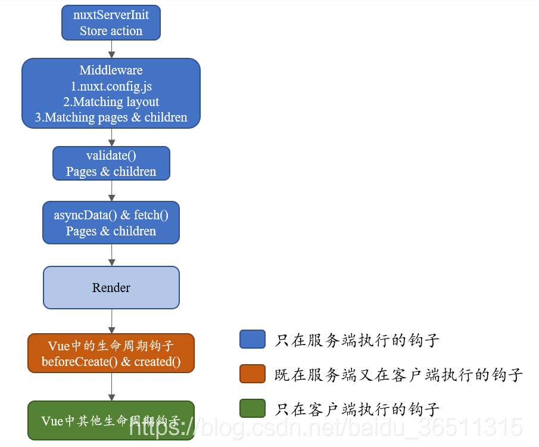

#  3.ssr

[[toc]]

项目示例：https://gitee.com/Electrolux/nuxt-vue-project

## 3.1 nuxt3

node 14.18以上可以用

```
我们可以用nvm ls 
nvm use xx来进行调用
```


官网：https://v3.nuxtjs.org

nuxt3最好的就是可以支持ts。并且nuxt3只支持 vue3

```js
--1. 我们在helloworld之后，会提示Are you interested in participation 。这个东西会想收集你的个人信息。给他或者不给他都可以
--2.他还有一个新特性是可以子佛那个引入api和组件
--3.

--4.
```


### 3.1.1 helloworld

#### 3.1.1.1  package.json

根目录创造创建 `package.json`，并补充以下信息 👇

```json
{
	"scripts": {
		"dev": "nuxi dev",
		"build": "nuxi build",
		"start": "nuxi build && node .output/server/index.mjs"
	},
	"devDependencies": {
		"nuxt": "^3.0.0-rc.3"
	}
}
```

#### 3.1.1.2 app.vue

在根目录下创建 `app.vue`

```html
<!-- app.vue -->
<template>
	<div>Hello, World!!</div>
</template>
```

然后

```bash
npm install
npm run dev
npm run build #打包项目
npm run start # 生产环境
```


#### 3.1.1.3 ts 引入

如果你想要开一个 `ts` 项目

请在根目录下创建 `tsconfig.json`，并补充 

```json
{
	"extends": "./.nuxt/tsconfig.json"
}
```

为了更好的类型提示，还需要在根目录下创建 `nuxt.config.ts`，并补充 👇

```typescript
import { defineNuxtConfig } from 'nuxt'

export default defineNuxtConfig({
	typescript: {
		shim: false
	}
})
```


### 3.1.2  自动引入

```js
自动引入：根目录下面的composables 目录下模块的同名导出会被自动引入。如果 API 嵌套在目录内，可以通过 index 模块导出。在  components 目录下的组件将被自动引入 目录下的组件将被自动引入

例如，composables/useDark 下有个 index 模块

//composables/useFoo.ts

export const useFoo = 100

//然后我们在app.vue可以

<script setup lang="ts">
console.log(useFoo) 
</script>
```


### 3.1.3 路由设置

路由顺序是nuxt.config.js中配置的 -> 匹配layouts -> 匹配pages

#### 3.1.3.1 app.vue

在 `` 中加入 `NuxtPage`

```html
<template>
    <NuxtPage />
</template>
```

#### 3.1.3.2  一些示例

在 `pages` 下的页面都将被自动路由

例如，`/` 页面只需创建 `pages/index.vue`

```html
<!-- pages/index.vue -->
<!-- 路由 / 将渲染 -->
<template> default </template>
```

又例如，`/home` 页面只需创建 pages/home.vue

```html
<!-- pages/home.vue -->
<!-- 路由 /home 将渲染 -->
<template> home </template>
```

再例如，`/about` 页面只需创建 pages/about.vue

```html
<!-- pages/about.vue -->
<!-- 路由 /about 将渲染 -->
<template> about </template>
```

访问起来就直接访问 /about就可以了


#### 3.1.3.3 嵌套路由

如果需要子路由，可以才用目录嵌套的方式

例如，`/user/details` 页面只需创建 `pages/user/details.vue`

```html
<!-- pages/user/details.vue -->
<!-- 路由 /user/details 将渲染 -->
<template> user/details </template>
```

当然你还可以创建 `pages/user.vue` 来做成嵌套路由

```html
<!-- pages/user.vue -->
<template>
    user
    <NuxtPage />
</template>

<!-- nuxt-child现在似乎用不了 -->

```


#### 3.1.3.4 动态路由

如果需要动态路由，可以使用 `[param]` 的方式

例如，`/user/:id` 页面只需创建 `/pages/user/[id].vue`

同时可以通过 `$route.params.id` 获取到具体的参数

```html
<!-- pages/user/[id].vue -->
<!-- 路由 /user/:id 将渲染 -->
<template>
    user / {{ $route.params.id }}
</template>
```

当然父路由也可以是动态的

例如，`/user-:group/:id` 页面只需创建 `/pages/user-[group]/[id].vue`

同时可以通过 `$route.params.group` 获取到具体的参数

```html
<!-- /pages/user-[group]/[id].vue -->
<!-- 路由 /user-:group/:id 将渲染 -->
<template>
    user-{{ $route.params.group }} / {{ $route.params.id }}
</template>
```


#### 3.1.3.5 导航

`NuxtLink` 可以用来导航

```html
<!-- app.vue -->
<template>
    <!-- 点击将跳转到 /about 页面 -->
    <NuxtLink to="/about"> to about </NuxtLink>
</template>
```

当然还可以跳转外链

```html
<!-- app.vue -->
<template>
    <!-- 点击将跳转到 百度 页面 -->
    <NuxtLink to="https://www.baidu.com/"> to baidu </NuxtLink>
</template>
```


#### 3.1.3.6 元信息

我们可以通过 `definePageMeta` 设置当前路由的元信息

```html
<script setup lang="ts">
// 定义元信息
definePageMeta({
    foo: 'bar'
})

// 获取当前路由
const route = useRoute()

// 获取元信息
const { meta } = route
console.log(
    toRaw(meta) // 输出 { foo: 'bar' }
)
</script>
```

#### 3.1.3.7 布局系统


1. 在 `layouts` 下创建的布局都可以应用到页面上

例如，创建 `layouts/custom.vue` 布局

```html
<!-- layouts/custom.vue -->
<template>
    <!-- 根元素是必需的 -->
    <div>
        custom
        <slot /> <!-- 页面出口 -->
    </div>
</template>
```

紧接着就可以在页面中使用

例如，在 `/home` 页面中使用

```html
<!-- pages/home.vue -->
<template>
	<NuxtLayout name="custom"> home </NuxtLayout>
</template>
```

有时我们需要全局的去应用布局，这时对 `app.vue` 进行修改

```html
<!-- app.vue -->
<template>
	header <!-- 这将应用到全局 -->
	<NuxtPage />
</template>
```

但是这是一个无法关闭的全局布局，这时可以删除 `app.vue`，同时创建 `layouts/default.vue` 布局

```html
<!-- layouts/default.vue -->
<template>
    <div>
        header
        <slot /> <!-- 页面出口 -->
    </div>
</template>
```

该布局也是全局应用的，但是可以手动关闭

例如 `/about` 页面不需要该布局

```html
<!-- pages/about.vue -->
<script setup lang="ts">
    definePageMeta({
        layout: false // 通过元信息的方式关闭 default 布局
    })
</script>

<template> about </template>
```


#### 3.1.3.8 布局注意事项

如果你是使用组件的形式去应用其他布局，`default` 布局将与其他布局重合，那么需要手动关闭。

例如，在 `/home` 页面中

```html
<script setup lang="ts">
	definePageMeta({
		layout: false // 手动关闭 default 布局
	})
</script>

<template>
    <!-- 使用组件的方式应用 custom 布局 -->
	<NuxtLayout name="custom"> home </NuxtLayout>
</template>
```


#### 3.1.3.9 路由跳转

```
navigateTo('/')
```


### 3.1.4 数据存储(store)

使用 `useState` 可以定义简单的共享状态.

`useState` 只允许在生命周期中使用。composables文件下面随便定义一个文件，写入

```typescript
export const useCounter = () => useState('counter', () => ({
    username: "小红",
    password: "s"
}))
```


使用起来

```vue
<script lang="ts" setup>
	const conuter = useCounter()
    //注意这里不能使用this，不然会疯狂报错
    //又因为counter是一个很奇怪的对象，所以我们要对只进行回调输出要加上._object.$scounter
    conuter._object.$scounter.password++
</script>


<template>
    <div>
        <!-- 这是home -->
        <NuxtPage />
        {{data.data}}
        {{conuter.password}}
        <button @click="clickMe()">clickMe</button>
    </div>
</template>

<script setup>

const conuter = useCounter()
const data =  reactive({
    data:"这是数据"
})
const clickMe = () =>{
    conuter._object.$scounter.password++
}
// console.log(conuter)
</script>

<style lang="scss" scoped>

</style>


```


### 3.1.5 请求数据

#### 3.1.5.1.安装

```shell
npm i @nuxtjs/axios @nuxtjs/proxy -D
```


#### 3.1.5.2. http文件夹

根目录下面建立http文件夹.下面的index.js

```js
import axios from 'axios'
let cancel ,promiseArr = {}//promiseArr拦截使用
const CancelToken = axios.CancelToken
axios.defaults.baseURL = 'http://localhost:9999'

axios.defaults.headers = {
  'X-Requested-With': 'XMLHttpRequest',
  'Content-Type': 'application/x-www-form-urlencoded; charset=UTF-8'
}
//请求超时时间
axios.defaults.timeout = 30000

// 跨域是否带cookie
axios.defaults.withCredentials = false
export default{
  //get请求
  get(url, data) {
    return new Promise((resolve) => {
      axios({
        method: 'get',
        url: url,
        params: data,
       
      }).then(res => {
        resolve(res)//注意点1
      })
    })
  },
  //post请求
  post(url, data) {
    let storage = window.localStorage
    return new Promise((resolve) => {
      axios({
        method: 'post',
        url: url,
        data: JSON.stringify(data),//将post请求的数据转化为json字符串
        headers: { 'Authorization': storage.token,'Content-Type': 'application/json; charset=UTF-8'},//注意点2
        cancelToken: new CancelToken(c => {
          cancel = c
        })
      }).then(res => {
        resolve(res)
      })
    })
  },
  //delete请求
  delete(url, data) {
    let storage = window.localStorage
    return new Promise((resolve) => {
      axios({
        method: 'delete',
        url: url,
        data: JSON.stringify(data),//将post请求的数据转化为json对象
        headers: { 'Authorization': storage.token, 'Content-Type': 'application/json; charset=UTF-8' }
      }).then(res => {
        resolve(res)
      })
    })
  },
}

```


#### 3.1.5.3. 使用接口

```js
import http from "../http/index";

http.get('').then((res)=>{
    console.log("请求数据",res)
    localStorage.setItem("ssr",(JSON.stringify(res)))

})
```


### 3.1.6 引入element插件


```
npm install element-plus
```

app.vue里面

```
@import 'element-plus/dist/index.css';
```

新建plugins/element-plus.js

```js
import { defineNuxtPlugin } from '#app'
import ElementPlus from 'element-plus/dist/index.full'
export default defineNuxtPlugin(nuxtApp => {
  nuxtApp.vueApp.use(ElementPlus)
})
```

接下来我们就可以直接

```vue
<el-button type="primary">Primary</el-button>
```

### 3.1.7 中间件注册

普通的注册好像没有什么用，我们要middleware/my-middleware-test.global.js中间添加.global我们就可以全局来做事情了


```js
export default defineNuxtRouteMiddleware((to, from) => {
    console.log("要去那个页面:"+to.path)
    console.log(to)
    console.log("来自那个页面:"+from.path)
    console.log(from)
  })
```

### 3.1.8 生命周期钩子





### 3.1.9 坑

```js
--1.build环境中3.0-rc版本中缺少 start命令（自己添加 node ./outout...）
--2.nuxt instance unavailable报错
实际上是nuxt3的 useRoute()的bug，服务端渲染不支持 useRoute()。
const route = process.client? useRoute(): {}
--3.如果要配置跨域要到@/nuxt.config.ts 设置
export default defineNuxtConfig({
    vite: {
        server: {
            proxy: {
                '/api': {
                    target: 'http://localhost:9999',  //这里是接口地址
                    changeOrigin: true
                }
            }
        }
    }  
})
--4.使用onBeforeMount代替vue2中的created，然后请求我们要放到create中去
--5.static丢失（放在oss上面吧）
--6.nuxt的ssr模式下，需要定义BASE_URL 地址（因为是服务端获取数据，获取不到window对象）。spa模式可以直接用 /
```

