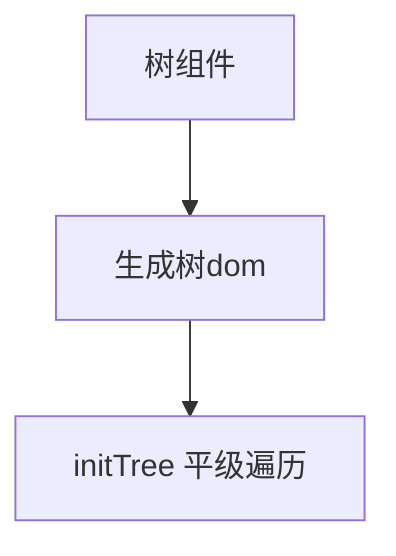

# 2.1 JavaScript基础  | v8

[[toc]]

## 2.1  v8

### 2.1.1   垃圾回收

- 变量都在堆区上
- 

```js
--1.简单说一下原理
首先js因为是单线程，垃圾回收会占用主线程，导致页面卡顿，所以需要一个算法或者说策略

而v8采用的是分代式回收，回收主要表现在新老生代上，新生代就活得短一点的对象，老生代就活得长一点的对象。
“在新生代里有一个算法，将新生代分成了两个区，一个form,一个to，每次经过Scavenge会将form区中的没引用的销毁，然后活着的to区调换到form，反复如此，当经过一次acavange后就会晋升的老生代还有个条件就是TO区的内存超过25也会晋升。”
“而老生代，采用标记清除和标记整理，但标记清除会造成内存不连续，所以会有标记整理取解决掉内存碎片，就是清理掉边界碎片”

--2.为什么TO超过25%要晋升老生代？
为了不影响后续FORM空间的分配.

--3.标记清除是怎么清除的？
垃圾回收会构建一个根列表，从根节点去访问那些变量，可访问到位活动，不可就是垃圾


栈内存和堆内存垃圾回收方式不同。

--1.栈内存的回收：调用栈上下文切换后回收栈内存，比较简单
--2.堆内存回收：V8的堆内存分为新生代内存和老年代内存。
--2.1新生代内存是临时分配的内存，存在时间短
有两个部分 from 和 to， 
Scavenge先扫描 from ，清理一次非存活对象。 存活的复制到to
然后 交换 from 和 to。to超过25%要晋升老生代

--2.2老年代内存存在时间长
--2.2.1Promotion：新生代比较长命的回到老生代，
--2.2.2回收主要是标记清除

有一个方法，里面有一个基础数据类型 a，还有用 const 定义的 b 对象，怎么回收?（删除引用）
知识点：const定义的引用类型只要指针不发生改变，其他的不论如何改变都是可以的

function a() {
    setTimeout(() => {
        var b = 5;
        const c = {
            data: [{ "id": 55 },]
        }
        //这样会报错 c={}，因为这样就改变了他的引用类型了
        c["data"]=[]
        console.log(c)
    },3000)

}
a()
```


### 2.1.2  进程  线程

```js
后新开一个页面至少需要：
--1.浏览器进程（brower）：地址栏、书签、前进后退按钮
--2.GPU进程：3D CSS，进程渲染
--3.网络进程（http）：发起和接受网络请求
--4.渲染进程（render）：将HTML、CSS、JS转为用户可以与之交互的网页
--4.1   GUI 渲染线程
--4.2   JavaScript 引擎线程
--4.3   事件触发线程
--4.4   定时器触发线程
--4.5   异步http请求线程
--5.插件进程（可以有，可以没有）：防止崩溃
```


### 2.1.3  栈 | 堆 | 队列 | 内存溢出解决方案 | 内存管理


先简单说一下 内存管理 ，一般的文章都会说**基本数据类型**存放在 **栈**里面然后**引用数据类型**存放在**堆**里面，但是其实是 v8 引擎所有的 内存都会在 堆上面。

- 第一个原因：因为 v8 的 栈 和 堆 和计算机  的栈和 堆是两个不一样的概念。由于v8是一个虚拟机，虚拟机的内容都会在 堆上面
- 第二个原因：因为 v8 实际内存 都是在 execution context stack上面，但是这个类型只存储对象 

但是有一种情况好像是 例外的，就是 通过turbofun 优化后的代码


```ts
v8全在堆区原因是虚拟机的存在，第一个原因是会划分一小块区域当做栈，所以说js的栈和cpu的栈不太一样。第二个原因是execution context stack这个类型只存储对象
```


## 2.2.js上传最终版


### 1.2.1 基本的dom结构

简单的说就是input 中设置 type="file" 和 multiple 

```html
<input type="file" name="" id="file" value="上传文件" multiple></input>


上面是最基本的，如果我们要让他漂亮一点。我们可以考虑用下面的dom结构.简单地说就是把多加一个父元素input藏起来并且把样式变大
 <div id="preview">
     <!-- 这里我们隐藏起来 长款跟div一样-->
     <input type="file" name="" id="file" value="上传文件" multiple></input>
	<div id="img-style">选择图片上传</div>
</div>
<style>
input {
    /* width: 100%; */
    height: 100%;
    width: 100%;
    opacity: 0;
    position: absolute;
}
    
#img-style{
	
}
    
</style>
```


### 1.2.2 校验封装(cvte)

```ts
const Config = {
    appIcon: {
        accept: ['image/jpg', 'image/png', 'image/jpeg'],
        maxCount: 1,
        formatTitle: '',
        // 传入的 file 具有 size | type | width | length | name。可以做四种校验-大小-类型-宽度-长度
        limit: (e) => {
            const file = e;
            // const maxFileSize = 100 * 1024; // 100kb
            const maxFileSize = 1024 * 1024 * 10; // 10m
            // 1 * 1024 * 1024 * 1024; // 1G
            const fileSize = file.size || 0;
            const fileType = file.type || '';
            const img = new Image();
            img.src = window.URL.createObjectURL(file);
            return new Promise((resolve) => {
                img.onload = () => {
                    if (fileSize > maxFileSize) {
                        resolve(`图标大小不能超过10m`);
                    } else if (!Config.appIcon.accept.includes(fileType)) {
                        resolve(`图标格式不支持`);
                    } else if (img.width < 192 || img.height < 192) {
                        resolve(`图标尺寸不能小于192*192PX`);
                    }
                    // else if (img?.height <= img?.width) {
                    //     resolve(`上传图片仅支持竖图`);
                    //   } 
                    else if (fileSize > maxFileSize) {
                        resolve(`上传图片不能超过10张`);
                    } else {
                        resolve('');
                    }
                };
                img.onerror = () => {
                    resolve(`读取失败`);
                };
            });
        },
    },

};


使用起来
// 这个element 是 <input type="file" name="" id="file" value="上传文件" multiple></input>
var file = document.getElementById("file");  
file.onchange = async function (e) {
    let test = await Config["appIcon"].limit(e.target.files[0])
    if(test){
        // dosomething
    }
}


// ------------------全部----------------------------
export const Config = {
  appIcon: {
    accept: ['image/jpg', 'image/png', 'image/jpeg'],
    maxCount: 1,
    formatTitle:
      '请上传jpg/png格式、圆角不超过15px、尺寸不小于192*192px、大小100kb内的图标；',
    limit: (e) => {
      const file = e as unknown as File;
      const maxFileSize = 100 * 1024; // 100kb
      const fileSize = file.size || 0;
      const fileType = file.type || '';
      const fileName = file.name;
      const img = new Image();
      img.src = window.URL.createObjectURL(file);
      return new Promise((resolve) => {
        img.onload = () => {
          if (fileSize > maxFileSize) {
            resolve(`图标 "${fileName}" 大小不能超过100KB`);
          } else if (!Config.appIcon.accept.includes(fileType)) {
            resolve(`图标 "${fileName}" 格式不支持`);
          } else if (img.width < 192 || img.height < 192) {
            resolve(`图标 "${fileName}" 尺寸不能小于192*192px`);
          } else {
            resolve(0);
          }
        };
        img.onerror = () => {
          resolve(`读取 "${fileName}" 失败`);
        };
      });
    },
  },
  appScreenShots: {
    accept: ['image/jpg', 'image/png', 'image/jpeg'],
    maxCount: 5,
    formatTitle:
      '请上传jpg/png格式、圆角不超过15px、尺寸不小于192*192px、大小1M内的图标；',
    limit: (e) => {
      const file = e as unknown as File;
      const maxFileSize = 1 * 1024 * 1024; // 1M
      const fileSize = file.size;
      const fileType = file.type;
      const fileName = file.name;
      const img = new Image();
      img.src = window.URL.createObjectURL(file);
      return new Promise((resolve) => {
        img.onload = () => {
          if (fileSize > maxFileSize) {
            resolve(`图标 "${fileName}" 大小不能超过1M`);
          } else if (!Config.appIcon.accept.includes(fileType)) {
            resolve(`图标 "${fileName}" 格式不支持`);
          } else if (img.height < 1600) {
            resolve(`图标 "${fileName}" 尺寸高度不能小于1600px`);
          } else {
            resolve('');
          }
        };
        img.onerror = () => {
          resolve(`读取 "${fileName}" 失败`);
        };
      });
    },
  },
  copyrightCertificates: {
    accept: ['image/jpg', 'image/png', 'image/jpeg'],
    maxCount: 10,
    formatTitle:
      '请上传jpg/png格式、圆角不超过15px、尺寸不小于192*192px、大小100kb内的图标；',
    limit: (e) => {
      const file = e as unknown as File;
      const maxFileSize = 10 * 1024 * 1024; // 10M
      const fileSize = file.size;
      const fileType = file.type;
      const fileName = file.name;
      const img = new Image();
      img.src = window.URL.createObjectURL(file);
      return new Promise((resolve) => {
        img.onload = () => {
          if (fileSize > maxFileSize) {
            resolve(`图标 "${fileName}" 大小不能超过10`);
          } else if (!Config.appIcon.accept.includes(fileType)) {
            resolve(`图标 "${fileName}" 格式不支持`);
          } else {
            resolve('');
          }
        };
        img.onerror = () => {
          resolve(`读取 "${fileName}" 失败`);
        };
      });
    },
  },
  uploadMultipart: {
    accept: ['application/vnd.android.package-archive'],
    maxCount: 1,
    formatTitle: '请上传1GB内的包体',
    limit: (e) => {
      const file = e as unknown as File;
      const maxFileSize = 1 * 1024 * 1024 * 1024; // 1G
      const fileSize = file.size;
      const fileName = file.name;
      const fileType = file.type;

      return new Promise((r) => {
        if (fileSize > maxFileSize) {
          r(`文件"${fileName}" 大小不能超过1G`);
        } else if (!Config.uploadMultipart.accept.includes(fileType)) {
          r(`图标 "${fileName}" 格式不支持`);
        } else {
          r('');
        }
      });
    },
  },
};


```


### 1.2.1 js 预览效果

```js
// 当我们上传文件的时候 。我们可以监听这个 dom 元素的 onchange 事件
// 注意一下。srcElement 是 快过时的版本 我们 可以用 target 进行替代
var file = document.getElementById("file");

// 获取base64 字符串 。 放到 img 的 src 下面就可以直接用
const getBase64 = (file) => {
    return new Promise((resolve, reject) => {
        const reader = new FileReader();
        reader.readAsDataURL(file);
        reader.onload = () => resolve(reader.result);
        reader.onerror = (error) => reject(error);
    });
}

file.onchange = function (e) {
      /* 文件读取对象读取文件 */
    var fileReader = new FileReader();
    let img_src = await getBase64(e.target.files[0])
    img.src = img_src;
    img.style.width = "300px";
    console.log(img,img_src)
    preview.appendChild(img);
};


```


### 1.2.4 初始变量 | 项目开始

```js
 const data = {
     fileKey: response.fileKey || '',
     taskUid: response.taskUid || '',
 }
```


### 1.2.5  数据类型定义

```ts
export interface Repo<T> {
  code: number | string;
  data: T;
  body?: T;
  message: string;
}
export interface UploadPolicy {
  bodyPackageType: string;
  filePartFieldNameInFormFiled: string;
  filePartFieldTypeInFormFiled: string;
  formFields: string;
  headerFields: string[];
  httpMethod: string;
  keyInfoFields: string[];
  magicKey: string;
  needCallServer: string;
  needExtractHeaderNames: string;
  serviceProviderType: string;
  uploadUrl: string;
}
```


### 1.2.6  upload 组件 | handleBeforeUpload 方法 | 校验 + 上传地址获取 | 加密规则

这里面首先对图片大小，格式，大小进行校验

接着请求 cstore的  上传地址，这里不需要任何参数。只用到写在配置里面的内容就可以了

```js
antd 的 upload 组件中 有一个 
  <Upload
	//  accept: ['image/jpg', 'image/png', 'image/jpeg'] 变成  'image/jpg,image/png,image/jpeg'
    accept={configInfo.accept.join(',')}
    maxCount={configInfo.maxCount}
	//	这里用 usestate 做存储 ，在 beforeUpload 的时候 进行了数据请求后 setUploadUrl(policyRes.data.uploadUrl)
    action={uploadUrl}
	//	这里用 usestate 做存储 ，在 beforeUpload 的时候 进行了数据请求后 setUploadUrl(policyRes.data.uploadUrl)
    data={uploadData}
	//内建样式不用管他
    listType="picture-card"
    fileList={fileList}
    onPreview={handlePreview}
    onChange={handleChange}
    beforeUpload={handleBeforeUpload}
    onRemove={handleOnRemove}
>
import type { UploadFile } from 'antd/es/upload/interface';
const handleBeforeUpload = async (e: UploadFile): Promise<boolean> => {
    // step1：这里做对应检查。尺寸大小，高度，后缀。如果返回值是空，那么说明校验成功，返回值都是错误的信息
    const res = await configInfo.limit(e)
    // step2:如果有错误，那么直接返回 
    if (res) {
        e['status'] = 'error'
        if (onUploadError) {
            onUploadError(res)
        }
        return false
    }
    // step3:获取cstore的  策略。这就是这次上传的 密文 和 密钥 
    const policyRes = await getCStoreUploadPolicyApi().catch(() => null)
    if (policyRes && policyRes.code === 0) {
        const policy = getFeedIPolicyDecryption(policyRes.data.formFields, policyRes.data.magicKey)
        const uploadPolicy = {
            ...policy,
        }
        return new Promise((r) => {
            setUploadUrl(policyRes.data.uploadUrl)
            setUploadData(uploadPolicy)
            setTimeout(() => {
                r(true)
            }, 1);
        })
    } else {
        e['status'] = 'error'
        if (onUploadError) {
            onUploadError('上传图片失败')
        }
        return false
    }
}

// step1:首先是 设置header x-appKey 也就是 公钥
// step2:接着设置 header 的 x-requestId 用 utf 编码 secret。然后用AES/ECB/Pkcs7加密data (这里的data是uuid + 时间)
// step3:然后设置 header 的 x-authorization。用 x-requestId ，和公钥 拼接再用HmacSHA1加密拼接的字符串及逆行base64编码。
// step4:然后设置 header 的 x-token，这部分在上传前就设置好了，就是用户的cookie
// step5:在上传之前 （antd upload组件有一个beforeUpload方法）.beforeUpload方法中，不传参数只用头部进行数据请求，每一次都会返回不同的加密信息
// step6：用step5 中返回的密文和密钥进行解密 。在一个类似于getFeedIPolicyDecryption(密文, 密钥)的方法中。将上传地址和策略分配给界面的元素
// 真正上传的时候用
```


### 1.2.7  upload 组件 | prewiew 预览

简单来说，就是点击图片预览的时候会打开一个modal

```ts
const [previewImage, setPreviewImage] = useState('');
const handlePreview = async (file: UploadFile) => {
    if (!file.url && !file.preview) {
        file.preview = await getBase64(file.originFileObj as RcFile);
    }
    setPreviewImage(file.url || (file.preview as string));
    setPreviewOpen(true);
    setPreviewTitle(file.name || file.url!.substring(file.url!.lastIndexOf('/') + 1));
};


 <Modal open={previewOpen} title={previewTitle} footer={null} onCancel={handleCancel}>
     
 </Modal>
```


### 1.2.8 upload 组件 | handleChange

每一次点击handleChange

```ts
const handleChange: UploadProps['onChange'] = ({ file, fileList: newFileList }) => {
    setFileList(newFileList);
    if (file?.status === 'done' && file?.xhr?.response) {
            try {
        		// 每一次都会上传
                const response = JSON.parse(file.xhr.response)?.data
                const data = response[uploadType]
                onChange?.([...(value || []), data])
            } catch (error) {
                console.log(error);
            }
    } else if (file?.status === 'error' && onUploadError) {
               onUploadError('上传图片失败')
    }
}
```


### 1.2.9 upload组件 | 删除图片

```js
const handleOnRemove = (file: UploadFile): Promise<boolean> => {
        return new Promise((r, j) => {
            Modal.confirm({
                icon: <ExclamationCircleOutlined />,
                title: '确定要删除图片吗',
                okText: '删除',
                cancelText: '取消',
                onCancel() {
                    r(false)
                },
                onOk() {
                    if (file?.status === 'done' && file?.response) {
                        const response = file.response?.data
                        const data = response[uploadType]
                        if (typeof value === 'string' && value === data) {
                            onChange?.([])
                        } else if (Array.isArray(value)) {
                            const key = value.indexOf(data)
                            if (key !== -1) {
                                const res = value.filter((_, i) => (i !== key))
                                onChange?.(res)
                            }
                        }
                    }
                    r(true)
                },
            });
        })
    }
```


## 2.3 cryto.js加解密(c厂为例子)

加密：utf 编码 secret 。然后 AES编码data 
 解码：utf 编码 secret 。然后 AES解码data 

### 2.3.1 引包名 | 初始化变量

```js
import * as CryptoJS from "crypto-js";
let cryptoJS = CryptoJS.default;

const randomUUid = () => {
  // 转成 36 进制接着 截取后8位置
  return Math.random().toString(36).slice(-8);
};

let eventSecret = "我是secret";

const time = String(new Date().getTime());
let data = randomUUid().replace(/-/g, "") + time;

```


### 2.3.2 加密

```js
/**
 * @description :总的来说，其实就是两点,第一点是 utf 编码 secret 第二点就是 AES + hex 解密
 * @param {*} data :需要加密的数据
 * @param {*} timeStr
 * @param {*} secret :加上密钥
 * @returns
 */
function serectEncode(data, secret) {
  // const data = randomUUid().replace(/-/g, "") + timeStr;
  const key = cryptoJS.enc.Utf8.parse(secret);
  const res = cryptoJS.AES.encrypt(data, key, {
    mode: cryptoJS.mode.ECB,
    // ECB 不需要 偏移量 IV 
    padding: cryptoJS.pad.Pkcs7,
    // 在 AES 标准中，一个字由 32 位（4 字节）组成，因此密钥长度也要以 32 位为步长来确定，不能随意变动。
    keySize: 256 / 32,
  });
  //  返回的数据是这样格式的 {words:[12,23],sigBytes} .这玩意叫密文
  //  utf8 格式就是 你有多少length，parse 的 word 列表中 就一样 。Utf8
  //  也就是 对应字符串的 16 进制编码格式

  let result = cryptoJS.enc.Hex.parse(res.ciphertext.toString());
  console.log(res.ciphertext.toString(), cryptoJS.enc.Hex.stringify(result));
  // toString默认是Hex,所以 cryptoJS.enc.Hex.parse(res.ciphertext.toString(cryptoJS.enc.Hex)); ==  res.ciphertext 。 感觉这里直接返回res.ciphertext就可以了。
  // 因为是encrypt返回回来的，似乎这里直接用  res.ciphertext 也可以？ 
  return cryptoJS.enc.Hex.parse(res.ciphertext.toString());
}
```


### 2.3.3 解密

```js
function serectDecode(encrypted, secret) {
  const key = cryptoJS.enc.Utf8.parse(secret);
  const ciphertext = encrypted;
  const decrypted = cryptoJS.AES.decrypt(
    // cryptoJS.enc.Hex.stringify(ciphertext)
    {
      ciphertext: ciphertext,
    },
    key,
    {
      mode: cryptoJS.mode.ECB,
      padding: cryptoJS.pad.Pkcs7,
      keySize: 256 / 32,
    }
  );
  return decrypted.toString(cryptoJS.enc.Utf8);
}
console.log("解密：", serectDecode(encodeSecret, eventSecret));
```


### 2.3.4 完整

```js
import * as CryptoJS from "crypto-js";

/**
 1.基础知识
 stringify 用于编码  | 传参传入{words:[12,23],sigBytes} | 
 parse 用于解码 | 传参传入 字符串 | 返回值是 {words:[12,23],sigBytes}
 一般来说是先parse，在进行其他操作

 */

let eventSecret = "我是secret";

let cryptoJS = CryptoJS.default;

let randomUUid = () => {
  return "p9rvas0j";
  // return Math.random().toString(36).slice(-8)
};

/**
 * @description :总的来说，其实就是两点,第一点是 utf 编码 secret 第二点就是 AES + hex 解密
 * 模拟加密,将 secret 用 utf8 解码成word数组，
 * 用 AES 对 data 使用 刚刚解码的进行加密
 * 最后返回 用 hex 编码的格式
 * @param {*} data :需要加密的数据
 * @param {*} timeStr
 * @param {*} secret :加上密钥
 * @returns

 */
function serectEncode(data, secret) {
  // const data = randomUUid().replace(/-/g, "") + timeStr;
  const key = cryptoJS.enc.Utf8.parse(secret);
  const res = cryptoJS.AES.encrypt(data, key, {
    // 指定加密模式为ECB
    mode: cryptoJS.mode.ECB,
    // 填充方式，使用ECB 不需要 偏移量 IV
    padding: cryptoJS.pad.Pkcs7,
    // 其中 256 代表密钥的位数，32 代表密钥由多少个 32 位的字（word）组成）。由8个32位置的密钥组成.
    // 后面的 32位置
    // 在 AES 标准中，一个字由 32 位（4 字节）组成，因此密钥长度也要以 32 位为步长来确定，不能随意变动。
    keySize: 256 / 32,
  });
  //  返回的数据是这样格式的 {words:[12,23],sigBytes} .这玩意叫密文
  //  utf8 格式就是 你有多少length，parse 的 word 列表中 就一样 。Utf8
  //  也就是 对应字符串的 16 进制编码格式

  let result = cryptoJS.enc.Hex.parse(res.ciphertext.toString());
  console.log(res.ciphertext.toString(), cryptoJS.enc.Hex.stringify(result));
  // toString默认是Hex,所以 cryptoJS.enc.Hex.parse(res.ciphertext.toString(cryptoJS.enc.Hex)); ==  res.ciphertext 。 感觉这里直接返回res.ciphertext就可以了。
  // 因为是encrypt返回回来的，似乎这里直接用  res.ciphertext 也可以？
  return cryptoJS.enc.Hex.parse(res.ciphertext.toString());
}

const time = String(new Date().getTime());
let data = randomUUid().replace(/-/g, "") + time;
let encodeSecret = serectEncode(data, eventSecret);
console.log("加密数据:", data);

function serectDecode(encrypted, secret) {
  const key = cryptoJS.enc.Utf8.parse(secret);
  const ciphertext = encrypted;
  const decrypted = cryptoJS.AES.decrypt(
    // cryptoJS.enc.Hex.stringify(ciphertext)
    {
      ciphertext: ciphertext,
    },
    key,
    {
      mode: cryptoJS.mode.ECB,
      padding: cryptoJS.pad.Pkcs7,
      keySize: 256 / 32,
    }
  );
  return decrypted.toString(cryptoJS.enc.Utf8);
}
console.log("解密：", serectDecode(encodeSecret, eventSecret));

```


### 2.3.5 项目策略

 加密：utf 编码 secret 。然后 AES编码data 
 解码：utf 编码 secret 。然后 AES解码data 

```js
// step1:首先是 设置 header x-appKey 也就是 公钥
// step2:接着设置 header 的 x-requestId 用 utf 编码 secret。然后用AES/ECB/Pkcs7加密data (这里的data是uuid + 时间)
// step3:然后设置 header 的 x-authorization。用 x-requestId ，和公钥 拼接再用HmacSHA1加密拼接的字符串及逆行base64编码。
// step4:然后设置 header 的 x-token，这部分在上传前就设置好了，就是用户的cookie
// step5:在上传之前 （antd upload组件有一个beforeUpload方法）.beforeUpload方法中，不传参数只用头部进行数据请求，每一次都会返回不同的加密信息
// step6：用step5 中返回的密文和密钥进行解密 。在一个类似于getFeedIPolicyDecryption(密文, 密钥)的方法中。将上传地址和策略分配给界面的元素
真正上传的时候用
```


### 

## 2.4 分块加载视频


- Range请求头是HTTP1.1才加入的，他为并行下载和断点续传提供了技术支持
- 当服务器响应的HTTP状态码为`206`时，在每次的HTTP请求头中自动加入Range请求头，服务端只需要根据前端传过来的Range信息截取视频的指定区间来响应即可
- ffmpeg 允许 对视频进行切片


### 2.4.1 HLS协议

**hls.js**来读取索引文件然后实现视频流式播放。


- HLS的小切片(.ts)方式会生成大量的文件(M3U8索引文件)
- 并且会比较慢,至少在一个分段媒体文件被完全下载后才能够开始播.因此，在对实时性要求较高的场合，如互动直播，就要慎用HLS。


### 2.4.2 ffmepg 切片

[https://www.gyan.dev/ffmpeg/builds](https://www.gyan.dev/ffmpeg/builds/packages/ffmpeg-6.0-full_build.7z)  这里面下载 包解压后将bin目录添加到环境变量


`shift + 鼠标右键`，选择 `在此处打开 powersheel`，紧接着在命令行终端中输入以下命令转化成 ts

```shell
ffmpeg -y -i test.mp4  -c copy -vbsf h264_mp4toannexb test.ts

```


- `-vbsf` 参数指定视频比特流滤镜，这里使用 `h264_mp4toannexb` 将 H.264 视频流重新组织为 MPEG-TS 格式的流，以便后续处理。
- `-y` 参数表示在输出文件存在的情况下，覆盖已经存在的文件，无需进行确认


打开你 `ts` 视频所在的文件夹，然后在当前文件夹下，新建一个 `chunk` 文件夹，用于存放视频切片和索引文件


```ts
ffmpeg -i test.ts -c copy -map 0 -f segment -segment_list chunk/index.m3u8 -segment_time 10 chunk/test-%04d.ts

```


- -i ： 路径
- -c： 指定编码器，这里是说不用重新编码
- -map 0 参数指定要处理的流的映射关系，`0` 表示处理输入文件的第一个流，即默认的音频和视频流
- -f segment 指定 format 输出。这里是 分块输出
- `%04d` 表示使用四位数的数字作为文件名，例如 `test-0001.ts`、`test-0002.ts` 等。


### 2.4.3 html 简单渲染

这样子 就i可以 直接用了，其实原理主要在后端，前端能够做的其实不算是很多。就引用一下flv 就可以了

```html
<!DOCTYPE html>
<html>

<head>
    <meta charset="UTF-8">
    <meta http-equiv="X-UA-Compatible" content="IE=edge">
    <meta name="viewport" content="width=device-width, initial-scale=1.0">
    <title>Document</title>
    <style>
        #video {
            width: 800px;
        }
    </style>
</head>
<body>
    <video id="video" controls></video>

    <script src="https://cdn.bootcdn.net/ajax/libs/hls.js/1.0.0-beta.3.0.canary.6685/hls.min.js"></script>

    <script>
        window.onload = () => {
            let video = document.getElementById('video')
            let videoSrc = './chunk/index.m3u8';

            if (Hls.isSupported()) {
                var hls = new Hls();
                hls.loadSource(videoSrc);
                hls.attachMedia(video);
            } else if (video.canPlayType('application/vnd.apple.mpegurl')) {
                video.src = videoSrc;
            }
        }
    </script>
</body>

</html>

```


### 2.4.4 ffmepg 加密


#### 2.4.4.1  生成加密依据

git bash 

```git
openssl rand 16 > enc.key
```


#### 2.4.42 生成iv

git bash 

```
openssl rand -hex 16
```


#### 2.4.4.3 新建解密文件 enc.keyinfo

```
http://127.0.0.1:5500/enc.key
C:\Users\wangyue\Desktop\视频流\video\enc.key
9a605f6be42059d689b40e13e39ff289
```

- 第一行是 `enc.key` 的网络访问路径
- 第二行是 `enc.key` 的本地绝对路径
- 第三行是我们第二步中得到的 `iv` 字符串

#### 2.4.4.4 重新  ffmpeg 打包 

```shell
ffmpeg -y -i .\test.mp4 -hls_time 10 -hls_key_info_file .\enc.keyinfo -hls_playlist_type vod -hls_segment_filename "./chunk/test-%d.ts" ./chunk/index.m3u8

```


## 2.6 chatGPT 流式传输


### 2.6.1 基础知识


其实是采用了sse的技术。EventSource 基于 HTTP 协议实现，通过与服务器建立一个持续连接，实现了服务器向客户端推送事件。HTTP 头中添加 "Content-Type: text/event-stream"。


事件数据格式如下：

```css
css复制代码event: eventName;
data: eventData;
```

其中，event 字段表示事件名，data 字段表示事件数据。


### 2.6.2 与ws 的不同


1. 协议 EventSource 基于 HTTP 协议，使用的是 HTTP 的长连接机制，而 WebSocket 则是一种独立的协议，与 HTTP 没有关系

   

    **Connection**: 'keep-alive', 

     'Access-Control-Allow-Origin': '*'


### 2.6.3 前端示例

```html
<!DOCTYPE html>
<html>
<meta charset="UTF-8">

<head>
    <title>SSE Example</title>
</head>

<body>
    <h1>SSE Example</h1>
    <button id="startButton">开始</button>
    <div id="output">回答：</div>
    <script>
      

        const source = new EventSource('http://localhost:8088/sse');
            source.onmessage = (event) => {
            console.log(event);
        };
        source.onerror = (event) => {
            console.log(event);
            // source.close()
        };
        
    </script>
</body>

</html>
```


## 2.7.canvas


### 2.7.1 概况


#### 常用使用

- 调用方式类似于 DOM，每个实例可以当做一个虚拟节点

#### 常用优化手段

- 离屏渲染
- 脏区渲染
- 异步渲染

#### 结构

这个class类包括

- 一个舞台 Stage、

- 多个画布 Layer、

- 多个分组 Group，

- 以及若干的叶子节点 Shape，

  

  ```ts
  这些虚拟节点关联起来最终形成了一棵树。一个 Stage 就是根节点，Layer 对应一个 Canvas 画布，Group 是指多个 Shape 的集合，它本身不会进行绘制，但同一个 Group 里面的 Shape 可以一起应用旋转、缩放等变换。Shape 则是指具体的绘制节点，比如 Rect、Circle、Text 等等
  ```

  

  

#### 包围盒(碰撞事件)


- AABB 包围盒：直接用最大最小的横纵坐标来生成包围盒(Konva 和 AntV 使用的方式)
- OBB 包围盒: 协方差矩阵来计算出新的坐标轴方向

碰撞检测：

两个包围盒在所有轴（与边平行）上的投影都发生重叠，则判定为碰撞；否则，没有发生碰撞。


#### **排版系统**

在 AntV 和 SpriteJS 这类 Canvas 渲染引擎里面，都内置支持了盒模型的语法糖，底层会将盒模型属性进行一次计算转换成 x、y。支持一套非常完整的盒模型和 Flex 布局语法.实现了 Padding、Column、Row、Margin、Expanded、Flex、GridView 等 Widget


#### 事件处理

- 取色值法:Konva 采用的实现方式，在主 Canvas 绘制一个图形的时候，会为这个图形生成一个随机的 colorKey.绘制的同时会在内存里的 hitCanvas 同样位置绘制一个一模一样的图形，填充色是刚才的 colorKey.当用户鼠标点击 Canvas 画布的时候，可以拿到鼠标触发的 x、y，将其传给内存里面的 Canvas.内存里面的 Canvas 通过 getImageData 来获取到当前的颜色，进而通过 colorKey 来匹配到对应的图形


#### 性能优化

- 批量渲染示例

```ts
if (!this._waitingForDraw) {
    this._waitingForDraw = true;
    Util.requestAnimFrame(() => {
        this.draw();
        this._waitingForDraw = false;
    });
}
```

- 离屏渲染：就是两个 Canvas 来回用 drawImage 绘制可复用部分  | 虚拟列表

- 脏区渲染：指定Canvas 做 clearRect 清除，重新渲染 |  更好的做法是检测到当前的改动影响到的范围，计算出重绘范围后，只清除重绘区的内容重新进行绘制。


获取首屏数据 -> 资源加载 -> 首屏数据反序列化 -> 初始化 Model 层 -> 计算排版数据 -> Canvas 渲染


### 2.7.2  工程化


先讲一下基础架构




## 2.8 promise


### 2.8.1 自己手写的promise示例


 * **初始化**
 * 1.1 初始化 class 和 resolve 和 reject(简单改变全局value和status)
 * 1.2 接着 执行 用户传入的 函数并且把 class里面的 resolve 和 reject绑定到上面
 * 1.3 每一次 resolve和 reject 执行**微队列**(是为了异步)


 * **then**
 * 2.1 **then** 返回一个promise(保证了可以链式调用)
 * 2.2 并且在这个promise里面**添加到** 队伍队列(ful/noful)=> 用户传入 数组。
 * 2.2 执行 **微队列**(是为了同步)


 * **微队列**
 * 3.1 以前我会依次拿出第一项 setImmediate 执行。但是浏览器环境不支持，并且这个也不够优先级，最后发现`queueMicrotask` 刚好可以用到这里
 * 3.2 判断 state和用户传入是不是function。接着用 用户传入的new promise函数 的 第一个参数 设置成初次resolve的参数，执行
 * 3.3 执行完 删掉
 * 简单

- **promise.resolve**
- 其实我源码中实现 promise.resolve的方式还是有一点问题。例如有两个地方 
  - 假如 promise.resolve 的值是另外一个promise的时候。会进行复用
  - 假如是 then 的对象方法，那么会进行展开执行 then。相当于最后执行了 promise.resolve


```ts

interface PromiseConstructor {
 
}


/**
 * @des 执行微队列
 */
function MicroTask(MicroTaskItem:Function){
    
}


 type BasePromiseType = "pending" | "fulfilling" | "reject"
 interface MicroTaskQuequeItemType{
     excutor?:Function
     state:BasePromiseType,
     resolve:Function,
     reject:Function
 }
class MyPromise{
    // 基本状态
    config:{
        state:BasePromiseType
        value:any
    }
    // 微函数队列
    #MicroTask:MicroTaskQuequeItemType[];

    /**
     * @des step1:new promise 初始化时候的方法
     * @param executor 
     */
    constructor(executor:Function){
        this.#MicroTask = []
        this.config = {
            state:"pending",
            value:undefined
        }
        try{
            executor(this.#resolve.bind(this),this.#reject.bind(this))
           
           
        }catch(error){
            this.#reject(error)
        } 
    }
    static resolve(value:any) {
        return new MyPromise((resolve:any) => {
            resolve(value);
        });
    }
    /**
     * @des step2:then函数
     * @param OnFulfillinged 
     * @param OnRejected 
     * @returns 
     */
    then(OnFulfillinged:Function,OnRejected?:Function){
        return new MyPromise((resolve:any,reject:any)=>{
            this.#MicroTask.push({
                excutor:OnFulfillinged,
                state:"fulfilling",
                resolve,
                reject
            })
            this.#MicroTask.push({
                excutor:OnRejected,
                state:"reject",
                resolve,
                reject
            })
            // 同步
            this.MicroTaskHandler()
        })
    }

    /**
     * @des 执行微队列的函数
     * @action 执行微队列 | .then 之后的东西都要放到微队列里面去
     */
    MicroTaskHandler(){
        if(this.config.state=="pending"){
            return
        }
        // 假如没有 执行 then,就没有 microtask，也可以
        while(this.#MicroTask[0]){
     
            // 执行 | node 环境可以 nexttick 然后浏览器环境可以 mutaction | 最简单就是setimeout
            const Handler = this.#MicroTask[0]
            queueMicrotask(() => {
               
                // 过滤
                if(this.config.state!=Handler.state){
                    return
                }
           
                // 处理传参不是function的情况
                if(typeof Handler.excutor !=="function"){
                    this.config.state == "fulfilling" ? 
                    Handler.resolve(this.config.value):
                    Handler.reject(this.config.value)
                    return
                }
                // 执行用户传入
                try{
                    let res = Handler.excutor(this.config.value)
                    if(res && typeof res.then == "function"){
                        // console.log("返回值是promise")
                        queueMicrotask(()=>{
                            res.then(Handler.resolve,Handler.reject)
                        })
                    }else{
                        Handler.resolve(res)
                    }
                }catch(error){
                    this.#reject(this.config.value)
                }
            });
            // 删除
            this.#MicroTask.shift()
        }
    }

    /**
     * @des step2:执行状态改变，只有在外部 调用 resolve 或者是 reject 的 时候才有
     * @action 改变状态 | 执行微队列
     * @param message 用户自定义
     * @returns 
     */
    
    #resolve(message:any){
        if(this.config.state!=="pending"){
            return
        }
        this.config.state = "fulfilling"
        this.config.value = message
        this.MicroTaskHandler()
    }
    #reject(message:any){
        if(this.config.state!=="pending"){
            return
        }
        this.config.state = "reject"
        this.config.value = message
        this.MicroTaskHandler()
    }
    
}

// let test =
//  new MyPromise((resolve:any,reject:any)=>{
//     setTimeout(() => {
//         resolve("d")
//     }, 2000);
//     resolve("d")
// })

//  test.then((e:any)=>{
//     console.log("then222:",e)
// })


// .then 有两个参数(都要有异步的逻辑) 成功之后 | 失败之后
// promise 和 promise.then 需要调用微队列


/**
 一边遍历一边删除
 const arr = [1,2,3,4,5,6]
 for(let item in arr){
    arr.splice(item,1);console.log(item,arr)
 } 
  console.log(arr)
 */

  console.log("MyPromise-mix");

//   let temp = new MyPromise((re) => { setTimeout(() => {
//     re(0);
//   }, 1000); });
// temp.then((e)=>{
//     console.log(e)
// })

  let temp = new Promise((re) => { re(0); });
  temp.then(() => {
      console.log(1);
  }).then(() => {
      console.log(2);
      // Promise.resolve("后来的2")   new Promise((re)=>{re("后来的2")})
      return new Promise((e)=>{
        setTimeout(() => {
            e()
        }, 2000);
      });
  }).then((e) => {
      console.log(e);
  });
  temp.
      then(() => {
      console.log(6);
  }).then(() => {
      console.log(7);
  }).then(() => {
      console.log(8);
  }).then(() => {
      console.log(9);
  }).then(() => {
      console.log(10);
  }).then(() => {
      console.log(11);
  });


/*
* @f2 .then
 * 2.1 then 返回一个promise，
 * 2.2 并且在这个promise里面添加 队伍队列(ful/noful)=> 用户传入 数组。
 * 2.2 执行 微队列(是为了同步)
 * 
 * @u 微队列
 * 3.1 依次拿出第一项 setImmediate 执行
 * 3.2 判断 state和用户传入是不是function。接着用 用户传入的new promise函数 的 第一个参数 设置成初次resolve的参数，执行
 * 3.3 执行完 删掉
 */

export{

}
```


