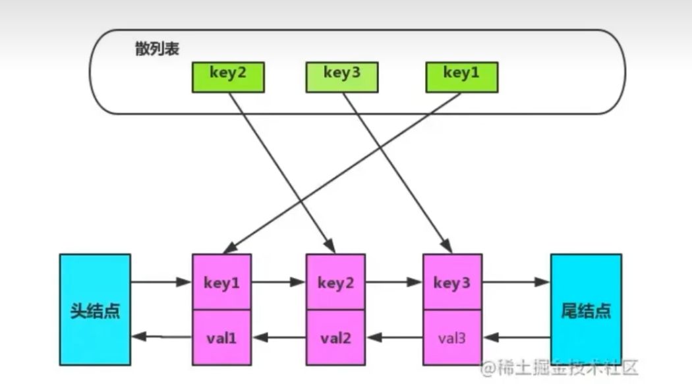

# 3.实用算法 | 设计模式

[[toc]]

## 7.1 时间复杂度


## 7.2  基础算法思想

### 7.2.1 排序

```js
//冒泡排序:从最后面开始，小的换换到前面，然后最前面的固定住
//选择性排序:先线性搜索数列 筛选出最小值，固定在左边。重复
//插入排序-冒泡排序:从最前面开始，小的左右换到前面
//堆排序：大的作为父节点形成堆，从大到小输出
//归并排序：先一个个进行分割，分割成单个的，接着在上一级进行排序（先比较开头，移动较小的数字）。重复
//快速排序：找一个基准。然后分成left 中间 +right排序
```


### 7.2.2 分类算法

```js
1.k均值算法：重复 先确定数量每个数据分类到集群中和移动到中心点的中心（通过距离），直到中心点收敛
2.k均值算法++：只对初始化K个聚类中心进行优化-计算每个样本与当前已有聚类中心的最短距离（即与最近一个聚类中心的距离），这个值越大，表示被选取作为聚类中心的概率较大；最后，用lunpanfa（依据概率大小来进行选择）选出下一个聚类中心；
3.系统（层次）聚类      //不用设置设置多少个聚类
4.svn
```


### 7.2.3 目标规划算法

```js
// 线性规划：求xx最大值，最小值，最优解
退火算法 //初始温度 迭代数次  温度衰减系数
```

```js
// 非线性规划：⽬标函数和或者约束条件中 有⼀个是决策变量  的⾮线性表达式
//⼤多数算法都是在选定决策变量的初始值后 ,通过定的 搜索⽅法寻求最优 的决策变量 。
```


### 7.2.4 识别算法

```js
//1.opencv
//2.ocr
```


### 7.2.5  因子算法

```js
//1.regression
//2.线性拟合（插值预测）  spline'线性差值    nearest  最近点差值 pchip（分段三次多项式）----多元线性回归
//3.时间序列分析-专家建模器-ARIMA
//4.灰色预测模型  GM(1,1)是使用原始的离散非负数据列，通过一次累加生成削弱随机性的较有规律的新的离散数据列，然后通过建立微分方程模型，。（我们在此只探究GM(1,1)模型，第一个‘1’表示微分方程是一阶的，后面的‘1’表示只有一个变量）-光滑比-准指数检验

```

### 7.2.6 评价算法

```js
// 1.topsis 熵权法是一种客观赋权方法依据的原理：熵越大，能给你。补充的信息量就越大。方差大的权重就越大跟AHP的区别就是 指标正向化和标准化消除量纲影响
//2AHP流程   1.构建层次结构图  目标  准则 方案2.判断矩阵  将。。。。。两两比较，得到判断矩阵。 对准则层与方案层两两比较（给出矩阵）3.进行一致性检验  4.计算权重并归一化   （特征值法。。。。）

```

### 7.2.7 参数生成

```js
//1.蒙特卡洛的基本原理简单描述是先大量模拟，然后计算一个事件发生的次数，再通过这个发生次数除以总模拟次数，得到想要的结果。比如投3个骰子，计算3个骰子同时是6的概率，可以模拟投N次（随机样本数），统计同时是6出现的次数C，然后C除以N即是计算结果
```

### 7.2.8 降维算法

```js
//1.主成分分析:它能将多个指标转换为少数几个主成分.并且构建公式。关键是要写出主成分并且进行分析。分析出第一主成分，第二主成分之类的意思
```

### 7.2.8 参数分析 处理

```js
//1.假设验证 = person相关系数 + 可信度

//2. 典型相关分析：可以得到典型变量。 方程的主要意思   具体参考    https://jingyan.baidu.com/article/25648fc1d94bc49191fd00fa.html

//3.标准化
```

### 7.2.9 神经网络

```
1.vgg
2.resnet
3.alexnet
4.sequential net
```


## 7.3 项目中常用的算法片段


## 7.4 前端面试算法

### 7.4.1 js中sort算法原理

```js
//v8：数组小于10插入排序，否则快排。目前采用timsort来进行排序。 这是一种混合稳定的排序。是归并+插入排序，实现是通过迭代进行工作。比较稳定
```


### 7.4.2  布隆过滤器（angular）

搜索算法

### 7.4.3 红黑树和vscode

piecetable算法处理加载文件。类似于打补丁的方式来进行加载vscode

### 7.4.4 在线协同冲突处理算法(双向链表)

#### 1.   ot算法（Google）-Operational transformation

基于操作转化的协同处理算法。

核心思想：1. 对操作进行拆分（原子）。2. 应用到冲突的文档。通过服务端的提示。都能执行。但是比如两个人，a，b同时插入子表。后出现的表名会变成自动重命名 3.服务器进行协同

#### 2.  CRDT算法(ATOM/YJS)-Conflict-free Replicated Data Types

多个主机间并行复制：各个主机的副本可以进行并行复制。这是他牺牲数据结构的性能来进行实现的。服务端相当于是一个中间件。整个状态都必须传到副本-----双向链表---分布式数据库和聊天系统也是比较常用

#### 3.fluid framework（微软）

服务端只负责排序，广播和存储。借助dds（分布式数据结构实现协同-key-value）进行多用户协同


## 7.5 设计模式 


### 7.5.1  策略模式

定义一系列的算法，把它们一个个封装起来，并且使它们可以相互替换

用处：表单的验证方法  | 其他的多种平行策略


```js
//一个基于策略模式的程序至少由两部分组成：

//第一个部分是一组策略类，策略类封装了具体的算法，并负责具体的计算过程。

var rules = {
    minLength: function(value,  errorMsgs) {
        if (value.length < 6) {
            return  errorMsgs['minLength']
        }
    },
    isNumber: function(value, errorMsg) {
        if (!/\d+/.test(value)) {
            return  errorMsgs['isNumber'];
        }
    },
    required: function(value, errorMsg) {
        if (value === '') {
            return  errorMsgs['required'];
        }
    }
};

//第二个部分是调用

function getResult() {
    var errorMsgs = {
        minLength: '输入数据长度不足',
        isNumber: '请输入数字',
        required: '内容不为空'
    };
    for(let temp in rules){
        return(rules[temp]("cc",errorMsgs))
    }
}

cdfzg
```


### 7.5.2 代理模式

在数据读取或者使用前对数据进行处理：比如我们把魔法数字0，1转化成对应的状态   | 节流也是一种体现


### 7.5.3 发布-订阅模式

例如 addEventListener    父子组件通信

```js
class eventBus {
    constructor() {
        this.eventBus = {
            // 保存类型与回调的容器
            event: {
            }
        }
    }
    // 绑定事件
    on = (name, event) => {
        // 判断
        if (this.eventBus.event[name]) {
            this.eventBus.event[name].push(event);
        } else {
            // 如果 event 属性中不存在该类型事件,就往里存
            this.eventBus.event[name] = [event];
        }
    };
    // 触发事件
    emit = (name, data) => {
        // 判断
        if (this.eventBus.event[name] ) {
            this.eventBus.event[name].forEach(event => {
                // 执行回调
                event(data);
            })
        }
    }

    // 事件解绑
    off = (eventName) => {
        // 若传入了 eventName
        if (this.eventBus.event.hasOwnProperty(eventName)) {
            // 只是删除对应的事件回调
            delete this.eventBus.event[eventName];
        } else {
            this.eventBus.event = {};
        }
    }
    say = ()=>{
        console.log(this.eventBus)
    }
}
```


### 7.5.4  代理模式 |  装饰器模式

代理模式和装饰器的区别是代理模式的范围一般来说会大一点

#### 基本

```ts
function giveSay(name: string) {
  // target 指的是跟在下一行的东西，跟在类的前面可以重写类的方法
  // 跟在function的前面可以进行方法的增强
  return function(target: any) {
      target.say = function () {
      console.log('hello! My name is ' + name)
    }
  }
}
function thorttle(time: number = 1000) {
    // target 是 class 。propertyKey是方法名 descriptor.value是具体方法
    return function (target: any, propertyKey: string, descriptor: PropertyDescriptor) {
        let fn = descriptor.value;
        let flag: any = null;
        descriptor.value = function () {
            if (!flag) {
                flag = true;
                fn();
                setTimeout(() => {
                    flag = false;
                }, time)
            }
        }
        return descriptor
    }
}
@giveSay('Yuanbao')
class Animal1 {
  static say: Function;
  @thorttle(1000)
  public sayOnce(){
    console.log("say once")
  }
}


// 重写类的方法
// Animal1.say() // hello! My name is Yuanbao
new Animal1().sayOnce() // 
new Animal1().sayOnce() //

```


#### 防抖（输入）

```ts
function debounce(time: number = 1000) {
    return function (target: any, propertyKey: string, descriptor: PropertyDescriptor) {
        let fn = descriptor.value;
        let flag: any = null;
        descriptor.value = function () {
            clearTimeout(flag)
            flag = setTimeout(() => {
                fn()
            }, time)
        }
        return descriptor
    }
}
//使用就 在类之中 @debounce(1000) 
```


#### 节流 （滚动）

```ts
function thorttle(time: number = 1000) {
    return function (target: any, propertyKey: string, descriptor: PropertyDescriptor) {
        let fn = descriptor.value;
        let flag: any = null;
        descriptor.value = function () {
            if (!flag) {
                flag = true;
                fn();
                setTimeout(() => {
                    flag = false;
                }, time)
            }
        }
        return descriptor
    }
}
//使用就 在类之中 @debounce(1000) 
```


####  curry

```ts
//指定参数个数的
function curry(target: any, key: string | symbol, descriptor: PropertyDescriptor) {
    //这个origin可以拿到下面装饰方法的数据
    const origin = descriptor.value;
    descriptor.value = function (...args: any) {
        return origin.bind(this, ...args)
    };
}
//使用就 在类之中 @debounce(1000) 

//不指定参数个数的 origin 接收function 然后 用这个function第一个 funtction 接收旧的，第二个return 的function接收新的
function curryMult(target: any, key: string | symbol, descriptor: PropertyDescriptor) {
    const origin = descriptor.value;
    descriptor.value = function a(...args: any) {
        //这一段是覆盖原来的方法 并且避免一开始
        return (newArray: any) => {
            if (newArray != undefined) {
                origin(args.concat(newArray))
            } else {

            }
            return a(...args.concat(newArray))
        }
    };
}
```


#### 错误处理

```ts
/**
 * 
 * @param {*} msg 
 * @param {*} options 
 * @returns 
 */

function errorHandle(msg: string, options: any) {
    return function (target: any, key: any, descriptor: any) {
        let fn = descriptor.value;
        descriptor.value = function (...args: any[]) {
           try{
               fn()
           }
            catch{
                console.log(msg,options)
            }
        }
    }
}

class test{
    @errorHandle("errorGet方法报错",{url:"index.ts中25行报错"})
    public  errorGet(){
        throw("哈哈哈哈哈")
    }
}
new test().errorGet()
```


### 7.5.5 命令模式 | 状态模式 | 责任链模式

顾名思义，责任链模式就是每个处理者都有各自的责任，他们的责任都各自不同，每个请求的处理都不同，或多或少。我们把每个处理者排成队，每个处理者按照它们各自的责任处理这个请求并且指定了下一个处理器是谁，形成一个链路。这种类型的设计模式属于行为模式。

```js
--1.

--2. 状态模式= 每一个状态封装成单独的类，然后行为都在类型的类的内部

--3. 职责链模式：
orderType 401 402 403
pay 10 100 1000
stock 10 100 1000
--3.1 简单模式
3.1.1可以根据某一个字段 order 拆分成 3个 函数(灵活可拆分的职责链节点)
order401(xx,xx,xx)   

--3.1.2 里面可能会有一种降级的逻辑，我们可以 
order401(xx,xx,xx)  {
    if(xxx){
        order402(xx,xx,xx)
    }
}


```

```js
// --3.2 链条 chain + 异步（异步的值return 不回来）
function order500 (orderType, pay, stock) {
  if (orderType === 1 && pay === true) {
    console.log('500元定金预购，得到100元优惠券')
  } else {
    return 'chainNext'
  }
}

function order200 (orderType, pay, stock) {
  if (orderType === 2 && pay === true) {
    console.log('200元定金预购，得到50元优惠券')
  } else {
    setTimeout(() => {
       	this.asycNext()
        return 'chainNext'
  	}, 3000)
  }
}

function asSure(){
    console.log("最后")
    return "没有值"
}

class Chain {
  constructor (fn) {
    this.fn = fn
    this.nodeNext = null
  }
  asycNext(){
      return  this.nodeNext.passRequest.apply(this.nodeNext, arguments)
  }
  nodeSet (nodeNext) {
    return this.nodeNext = nodeNext
  }
  passRequest () {
    //执行这个方法
    const res = this.fn.apply(this, arguments)
    if (res === 'chainNext') {
    	//这里就是改变作用域了	
        //所有的函数都要用chain方法包起来，否则没有this.nodeNext
      return this.nodeNext.passRequest.apply(this.nodeNext, arguments)
    }
    return res
  }
}

// 1. 初始化 链条
const chainOrder500 = new Chain(order500)
const chainOrder200 = new Chain(order200)
const chainOrderLast = new Chain(asSure)

// 2.设置关系
chainOrder500.nodeSet(chainOrder200).nodeSet(chainOrderLast)

//3.开始执行
// 从一开始的链条开始执行
chainOrder500.passRequest(3, true, 500)   
```


```js
// --3.3 利用aop 注入

function order500 (orderType, pay, stock) {
  if (orderType === 1 && pay === true) {
    console.log('500元定金预购，得到100元优惠券')
  } else {
    return 'chainNext'
  }
}

function order200 (orderType, pay, stock) {
  if (orderType === 2 && pay === true) {
    console.log('200元定金预购，得到50元优惠券')
  } else {
    setTimeout(() => {

       	//this.asycNext()
        return 'chainNext'
  	}, 3000)
    
    	
  }
}

function asSure(){
    console.log("最后")
    return "没有值"
}

Function.prototype.after = function (fn) {
  const self = this
  return function () {
    const res = self.apply(this, arguments)
    if (res === 'chainNext') {
      return fn.apply(this, arguments)
    }
    return res
  }
}

const order = order500.after(order200).after(asSure)
order(0,0,0)


```


### 7.5.6 享元模式

享元模式的本质是缓存共享对象

```
享元模式有三个参与角色：抽象享元角色,具体享元角色,享元工厂（FlyweightFactory）：负责管理享元对象池和创建享元对象。
```

### 7.5.7 工厂模式 | 建造者模式

```js
1.工厂模式
是我们最常用的实例化对象模式了.new
2.建造者模式（比工厂模式多包了一层，我感觉可以是在函数里面new 类出来）
比工厂类多了一个导演类的角色
建造者类一般只提供产品类中各个组件的建造，而将具体建造过程交付给导演类。由导演类负责将各个组件按照特定的规则组建为产品，然后将组建好的产品交付给客户端
```


### 7.5.8 单例模式

```ts
之前我在 项目中都是 直接导出 new 之后的 东西的。
但是好像有一种更好的办法,例如 在 class 中给一个 instanceGet 方法
```


## 7.6 快问快答

```js
--1.观察者和发布者订阅者的区别
s:发布者订阅者中间会有一个调度中心。观察者没有
```


## 7.7 算法题


### 7.7.1 经典反转链表


```js
var reverseList = function(head) {
    let prev = null
    while (head != null) {
        //step1：存储一个变量
        const temp = head.next
        //step2；构建关系
        head.next = prev
        //step3；同步prev和head
        prev = head
        head = temp
    }
    return prev
};
```


### 7.7.2 经典爬楼梯

```js
/**
@des 设你正在爬楼梯。需要 n 阶你才能到达楼顶。

每次你可以爬 1 或 2 个台阶。你有多少种不同的方法可以爬到楼顶呢
 * @param {number} n 
 * @return {number}
 */
var climbStairs = function(n) {
    let dp = new Array(n+1);
    dp[1]=1;
    dp[2]=2;
    dp[3]=3;
    for(let i = 3;i<=n;i++){
        dp[i]=dp[i-1]+dp[i-2]
    }
    
    return dp[n]
};


//--------爬楼梯的最少成本----------
//
/**
输入：cost = [1, 100, 1, 1, 1, 100, 1, 1, 100, 1]
输出：6
解释：最低花费方式是从 cost[0] 开始，逐个经过那些 1 ，跳过 cost[3] ，一共花费 6 。


 * @param {number[]} cost
 * @return {number}
 */
var minCostClimbingStairs = function(cost) {
    let temp = new Array(cost.length)
    temp[0]=0;
    temp[1]=0;
    for (let i =2;i<=cost.length;i++){
        temp[i]=Math.min(temp[i-1]+cost[i-1],temp[i-2]+cost[i-2])
    }
    return temp[cost.length]
};

```


### 7.7.2 经典股票


```js
--1.给定一个数组 prices ，它的第 i 个元素 prices[i] 表示一支给定股票第 i 天的价格。

你只能选择 某一天 买入这只股票，并选择在 未来的某一个不同的日子 卖出该股票。设计一个算法来计算你所能获取的最大利润。

返回你可以从这笔交易中获取的最大利润。如果你不能获取任何利润，返回 0 。


var maxProfit = function(prices) {
    let min = prices[0];
    let max = 0
    for(let i = 0 ;i<prices.length;i++){
        max = Math.max(prices[i]-min,max)
        min = Math.min(min,prices[i])
    }
    return max
};

--2.给你一个整数数组 prices ，其中 prices[i] 表示某支股票第 i 天的价格。

在每一天，你可以决定是否购买和/或出售股票。你在任何时候 最多 只能持有 一股 股票。你也可以先购买，然后在 同一天 出售。

返回 你能获得的 最大 利润 。
/**
 * @param {number[]} prices
 * @return {number}
 */
var maxProfit = function(prices) {
    let res=0
    for(let i = 1 ; i<prices.length;i++){
        if(prices[i]-prices[i-1]>0){
            res = res +prices[i]-prices[i-1]
        }
    }
    return res
};

--3.
给定一个数组，它的第 i 个元素是一支给定的股票在第 i 天的价格。

设计一个算法来计算你所能获取的最大利润。你最多可以完成 两笔 交易。

注意：你不能同时参与多笔交易（你必须在再次购买前出售掉之前的股票
分析状态。
/**
 * @param {number[]} prices
 * @return {number}
 */
var maxProfit = function (prices) {
    if(prices.length==0 | prices.length==1){
        return 0
    }
    let dp = new Array(prices.length)
    for (let i = 0; i < prices.length; i++) {
        dp[i] = (new Array(5).fill(0))
    }
    dp[0][1] = -prices[0]
    dp[0][3] = -prices[0]

    for (let i = 1; i < prices.length; i++) {
        dp[i][0] = dp[i - 1][0];
        dp[i][1] = Math.max(dp[i - 1][1], dp[i - 1][0] - prices[i]);//不动，买入
        dp[i][2] = Math.max(dp[i - 1][2], dp[i - 1][1] + prices[i]);//不动，卖出
        dp[i][3] = Math.max(dp[i - 1][3], dp[i - 1][2] - prices[i]);//不动，接着买
        dp[i][4] = Math.max(dp[i - 1][4], dp[i - 1][3] + prices[i]);//不动，卖出后接着买
    }
    // console.log(dp)
    return dp[prices.length - 1][4]
};

```


## 7.8 js技巧


### 7.8.1 大数计算

```js
--1.BigInt 只能与 BigInt 做运算，如果和 Number 进行计算需要先通过 BigInt() 做类型转换。 5n+1会报错
--2.例子：BigInt(1)+BigInt(4) //输出5n
--3. 5n / 2n   //输出2n  ，像是这种情况是向上取整
--4.整数字面量后面加 n 的方式定义一个 BigInt,如：10n
```


### 7.8.2 快速幂 | 位运算

```js
--1. 快速幂
我们求 x^10 我们可以求 (x^5)^2 可以减少一半的运算。

--2.位运算
x<<1  // x*2
x>>1  // x/2
x & 1 // 是0 就是偶数 是1就是奇数
true & true & false //判断boolean 输出 0
true | true | false //输出1

--3. 快速幂算法
function qPow(x, n) {
    let result = 1;
    while (n) {
        if (n & 1) result *= x; // 同 if(n%2)
        x = x * x;
        n >>= 1; // 同 n=floor(n/2)
    }
    return result;
}
```


### 7.8.3  js技巧

```js
--1.reverse()
let param = [1,5,6,7,-5]
param.reverse()  //数组反转 [-5, 7, 6, 5, 1]
let stringP="Hello"
stringP.split('').reverse().join('') //olleH

--2.正则
const reg = /[1][3,4,5,6.7,8,9][0-9]{9}/g;
text.match(reg)

--3. arr.indexOf arr.includes  include检测nan

--4. reduce((all,now)=>{return now+all},3)   这里面的3就是all，不设置他会从第二项开始遍历。 pre是目前的值，

--5. 新建矩阵
new Array(row).fill(0).map((value)=>{ return  new Array(col).fill(0)})
```


## 7.9 结构算法


### 7.9.1 链表


```js

const log = console.log.bind(console);

/** * 链表节点 * @param {*} val
 * @param {ListNode} next
 */
function ListNode(val, next = null) {
    this.val = val;
    this.next = next;
}

/** * 将一个数组转为链表 * @param {array} a
 * @return {ListNode} */
const ArrayToList = (param) => {
        let temp = new ListNode()
        let pre = temp
        param.forEach((value) => {
            pre = pre.next = new ListNode(value)
        })
        return temp.next
}


/** * 将一个链表转为数组 * @param {ListNode} node
 * @return {array} */

const listToArray = (param) => {
    let temp = []
    while (param) {
        temp.push(param.val);
        param = param.next
    }
    return temp
}
    
let nowListNode = ArrayToList([1,6,5])
let result = listToArray(nowListNode)
log(result)


```


```js
上面的js方法真实万能，比如一道js 链表排序的题目

/**
 * Definition for singly-linked list.
 * function ListNode(val, next) {
 *     this.val = (val===undefined ? 0 : val)
 *     this.next = (next===undefined ? null : next)
 * }
 */
/**
 * @param {ListNode} head
 * @return {ListNode}
 */
var sortList = function (head) {
    const listToArray = (param) => {
        let temp = []
        while (param) {
            temp.push(param.val);
            param = param.next
        }
        return temp
    }
    const ArrayToList = (param) => {
        let temp = new ListNode()
        let pre = temp
        param.forEach((value) => {
            pre = pre.next = new ListNode(value)
        })
        return temp.next
    }
    function sequence(a, b) {
        return a - b;
    }
    let temp = listToArray(head);
    let tempArray = temp.sort(sequence)
    let result = ArrayToList(tempArray)
    return (result)
};


合并两个链表
var mergeInBetween = function(list1, a, b, list2) {
    const listToArray = (param) => {
        let temp = []
        while (param) {
            temp.push(param.val);
            param = param.next
        }
        return temp
    }
    const ArrayToList = (param) => {
        let temp = new ListNode()
        let pre = temp
        param.forEach((value) => {
            pre = pre.next = new ListNode(value)
        })
        return temp.next
    }
    let temp1 = listToArray(list1);
    let temp2 = listToArray(list2)
   
    let result = temp1.splice(a,b-a+1,...temp2)
    return ArrayToList(temp1)
};
```


### 7.9.2  双向链表

```js
let ListNode= function (key,value){
    this.key = key
    this.value = value
    this.next =null;
    this.prev=null;
    
}
```


### 7.9.3  LRU（hashset+双向链表）




```js
--1.基本要求
LRUCache(int capacity) 以 正整数 作为容量 capacity 初始化 LRU 缓存
int get(int key) 如果关键字 key 存在于缓存中，则返回关键字的值，否则返回 -1 。
void put(int key, int value) 如果关键字 key 已经存在，则变更其数据值 value ；如果不存在，则向缓存中插入该组 key-value 。如果插入操作导致关键字数量超过 capacity ，则应该 逐出 最久未使用的关键字。

--2.原理
其实原理是一个hashmap。但是普通的hashmap是没有时间顺序记录的功能的

--3.实现

// 构造双向链表
class ListNodeStruct {
    key: any
    value: any
    next: Node | null
    prev: Node | null
    constructor(key,value) {
        this.key = key
        this.value = value
        this.next = null;
        //双向链表需要上一跳
        this.prev = null;
    }
}

let LRUCache = function (capacity) {
    this.capacity = capacity;
    //记录LRUCache 当前的length 
    this.curSize = 0;
    // 定义一个 hash 表
    this.listNodeMap = {}
    //为了方便我们一般来说，会定义一个头尾节点
    //@ts-ignore
    this.head = new ListNodeStruct(-1, -1)
    //@ts-ignore
    this.tail = new ListNodeStruct(-1, -1)
    //链表的头部指向尾部
    this.head.next = this.tail
    this.tail.prev = this.head
}

LRUCache.prototype.get = function (key) {
    let node = this.listNodeMap[key]
    if (node) {
        //移到双向链表的前面
        this.moveToHead(node)
        return node.value
    } else {
        return -1
    }
}

LRUCache.prototype.put = function (key, value) {
    let node = this.listNodeMap[key]
    if (node) {
        //如果存在，移到双向链表的前面并且重新赋值
        node.value = value
        this.moveToHead(node)
    } else {
        let listNode = new ListNodeStruct(key, value)
        //插入
        this.listNodeMap[key] = listNode;
        this.addToHead(listNode)
    }
}

LRUCache.prototype.moveToHead = function (node) {
    //this.removeFromList(node)
    //this.addToHead(node)
    //从现在的节点删除
    node.next.prev = node.prev
    node.prev.next = node.next
    //添加到头
    node.prev = this.head
    node.next = this.head.next
    this.head.next.prev = node;
    this.head.next = node

}


LRUCache.prototype.addToHead = function (node) {
    this.curSize++;
    node.prev = this.head
    node.next = this.head.next
    this.head.next.prev = node;
    this.head.next = node
    //删除最后一个
    if (this.curSize > this.capacity) {
        //因为要key值，所以多写了几行
        //    this.tail.prev.prev.next = this.tail;
        //    this.tail.prev = this.tail.prev.prev
        let deleteNode = this.tail.prev;
        let deletePrevNode = this.tail.prev.prev;
        
        deletePrevNode.next = this.tail;
        this.tail.prev = deletePrevNode;
        this.curSize--;
        Reflect.deleteProperty(this.listNodeMap, deleteNode.key)
    }
}

```


### 7.9.4  树


#### 7.9.4.0 公用方法


#### 7.9.4.1 dfs(深度,路径,节点)

应用场景：二叉树某种要求的深度，路径，节点

```js
/**
 * Definition for a binary tree node.
 * class TreeNode {
 *     val: number
 *     left: TreeNode | null
 *     right: TreeNode | null
 *     constructor(val?: number, left?: TreeNode | null, right?: TreeNode | null) {
 *         this.val = (val===undefined ? 0 : val)
 *         this.left = (left===undefined ? null : left)
 *         this.right = (right===undefined ? null : right)
 *     }
 * }
 */
function maxDepth(root: TreeNode | null): number {
    //存储最终结果
    let res=0
    //初始化当前结果
    let start=0
    //构造参数是当前节点和当前的dfs值
    function dfsTree(node,dfsRes){
        //终止条件返回判断
        if(node==null){
            return
        }
        //可以更新：更新当前结果(深度)
        dfsRes++
        if(node.left==null&&node.right==null){
            //可以更新：更新最终结果 
            if(dfsRes>res){
                res = dfsRes
            }
        }
        //左右子树递归
        dfsTree(node.left,dfsRes);
        dfsTree(node.right,dfsRes);

    }
    dfsTree(root,start)
    return res
};
```


#### 7.9.4.2 前中后遍历

```
前中遍历求后遍历：
已知先序遍历 A B C D E F 假如是后续遍历 我们就倒着写
中序遍历 C	B	A	E	D	F
左子树所有节点在父节点左方，右子树节点在父节点右边
A		 	o
B		o
C	o
D					o
E				o
F						o
	C	B	A	E	D	F

答案  cbefda
反求
	C	B	A	E	D	F
A			o						
D					o
F						o
E				o
B		o
C	o


已知
中序 B D C E A F H G
后序 D E C B H G F A
	B	D	C	E	A	F	H	G
A					O
F						O
G								O
H							O
B	O
C			O
E				O
D		O

A B C D E F G H
	
```


//应用场景：前序（跟左右）/中序（左跟右）/后序遍历（左右根）
一些tip：前序遍历，中序遍历，后序遍历的遍历顺序。前者是左边画点

```JS
let res = []
function treeFor(treeNode){
	//如果到达尽头直接return
	if(!treeNode){
		return
	}
	
	//前序遍历
    //res.push(treeNode.val)
	treeFor(treeNode.left)
	//中序遍历
    //res.push(treeNode.val)
	treeFor(treeNode.right)
	//后序遍历
    //res.push(treeNode.val)
}
treeFor(root)
return res

```


#### 7.9.4.3 层序遍历 | 广度遍历 | shift

```js
function levelOrder(root: TreeNode | null): number[][] {
    let result = [];
    // step1：先将要遍历的树压入栈
    let stack = [root];
	let node = null
    // step2:递归广度遍历，用先序遍历的方法
    while(stack.length !== 0){
        node = stack.shift()
        result.push(node.val)
        if(node.left){stack.push(node.left)}
        if(node.right){stack.push(node.right)}
    }
    return  result
};
```


```js
function levelOrder(root: TreeNode | null): number[][] {
    let result = [];
    //这层节点值
    let tempArr = [];
    //这层节点数量
    let currentNums = 1;
    //这层孩子节点数量
    let childNums = 0;
    // step1：先将要遍历的树压入栈
    let stack = [root];
    let node = null
    // step2:从根节点开始计算。所以可以if (currentNums === 0)
    while (stack.length !== 0) {
        node = stack.shift()
        tempArr.push(node.val)
        if (node.left) { stack.push(node.left); childNums++; }
        if (node.right) { stack.push(node.right); childNums++; }
        currentNums--;
        if (currentNums === 0) {
            currentNums = childNums;
            childNums = 0;
            result.push(tempArr);
            tempArr = [];
        }
    }
    return result
};
```


## 7.10 方法算法

### 7.10.1 滑动窗口

```js
--1.原理：在数组上通过双指针同向移动的东西。（应用场景：最长字串，子数组，子序列  还是连续的）。核心左右双指针


//--------求最大，最长-------------
--1.1 先动右指针，如果符合条件就接着动右指针，更新max(扩大窗口)
--1.2 直到右指针不符合条件时，左指针向右。直到满足要求，如果跟右指针同时仍然不满足要求。接着向右。(缩小窗口)
初始化 left，right，window，bestResult

// 因为tight是后面更新的，因此长度是 right-left+1
let left=0,right=0,window=0,bestResult=0
while(右指针没到结尾){
    窗口扩大，加入right，更新window//window = window + nums[right]
    
    while(window不满足){
        窗口缩小，left右移//if(right - left + 1 < result){更新状态}
        //window = window-nums[left]
    }
    更新bestResult
    right++
}
返回bestResult


//--------求最小，最短-------------
--1.1 先动右指针，符合条件 左指针向右。更新min（缩小）
--1.2 左指针不满足条件，向右扩大
while(右指针没到结尾){
    窗口扩大，加入right，更新window
    while(window不满足){
        窗口缩小，left右移
    }
    更新bestResult
    right++
}
返回bestResult


两个同时不符合条件。那么是动一次卡一次

//--------容易理解-------------
function easy(nums, k): number {
    let left = 0,right =0,window=1,result=0
    for(let i=0;i<nums.length;i++){
      left = i;
      right=i;
      while(right<nums.length){  
        window = window * nums[right]
        if(window<k){
          console.log(left,right)
          result = result+1
        }
        while(window>=k ){
          break
        }
        right++
      }
      window =1
    }
    return result 
};

//-----------------------题目----------------------
209. 长度最小的子数组
给定一个含有 n 个正整数的数组和一个正整数 target 。

找出该数组中满足其和 ≥ target 的长度最小的 连续子数组 [numsl, numsl+1, ..., numsr-1, numsr] ，并返回其长度。如果不存在符合条件的子数组，返回 0 。

input：target = 7, nums = [2,3,1,2,4,3]
输出：2
解释：子数组 [4,3] 是该条件下的长度最小的子数组。


/**
    * @param {number} target
    * @param {number[]} nums
    * @return {number}
    */
    var minSubArrayLen = function (target, nums) {
        let left=0,right=0,window=0,result=0
        while(right<nums.length){
            window = window+nums[right]
            // console.log(window)
            while(window>=target){
                if(right-left+1<result || result==0){
                    result=right-left+1
                }
                window = window-nums[left]
                left++
            }
            right++

        }
        return result
    };


```

### 7.10.2 动态规划 | dp

```js
--1.方法总结
--1.1 初始化数组
二维数组：const dp = new Array(3).fill(0).map((v) => new Array(2).fill(0)); //初始化状态数组 竖3*横2
--1.2 初始化前几个数组
dp[0] = 1
--1.3 确定状态转化工具
dp[i]=dp[i-2]+dp[i-1]
--1.4 最后return 
return dp


--2.一维数组示例
var climbStairs = function(n) {
    let dp = new Array(n+1);
    dp[1]=1;
    dp[2]=2;
    dp[3]=3;
    for(let i = 3;i<=n;i++){
        dp[i]=dp[i-1]+dp[i-2]
    }
    
    return dp[n]
};


--3.二维数组示例

function maxValue(grid: number[][]): number {
    let row = grid.length, col = grid[0].length;
    let dp = new Array(row).fill(0).map((v) => new Array(col).fill(0)); //
    for (let i = 0; i < row; i++) {
        for (let j = 0; j < col; j++) {
            if (i > 0) {
                dp[i][j] = Math.max(dp[i][j], dp[i - 1][j]);
            }
            if (j > 0) {
                dp[i][j] = Math.max(dp[i][j], dp[i][j - 1]);
            }
            dp[i][j] += grid[i][j];
        }
    }
    return dp[row-1][col-1]
    // return dp[n];
};
```


### 7.10.3 回溯法（dfs）

```js
/**
 * @param {number[]} nums
 * @return {number[][]}
function dfs(res, path,data){
    if 满足结束条件(加起来=xx，size=xx):
        res.push(JSON.parse(JSON.stringify(path)))
        return
    
    for (let i  of data){
    	判断有没有资格进入path
    	把东西推进去path.push(i)
        backtrack(路径, 选择列表,初始数据)
        path.pop() 撤销选择
    }
        
}
 */
var permute = function(nums) {
    let length = nums.length
    if(nums.length==1){
        return [nums]
    }    
    function dfs(res,path,data){
        if(path.length==length){
            res.push(JSON.parse(JSON.stringify(path)))
            return
        }
        for(let i of data){
            
            if(!path.includes(i)){
                // console.log(i)
                path.push(i);
                dfs(res,path,nums);
                path.pop()
            }
        }
    }
    let res= []
    let path = []
    dfs(res,path,nums)
    return res
};


//--------------全排列2----------------
/**
 * @param {number[]} nums
 * @return {number[][]}
function dfs(res, path,data){
    if 满足结束条件(加起来=xx，size=xx):
        res.push(JSON.parse(JSON.stringify(path)))
        return
    
    for (let i  of data){
    	判断有没有资格进入path
    	把东西推进去path.push(i)
        backtrack(路径, 选择列表,初始数据)
        path.pop() 撤销选择
    }
        
}
 */

var permute = function(nums) {
    let length = nums.length
    if(nums.length==1){
        return [nums]
    }
    
    function dfs(res,path,data){
        if(path.length==length){
            res.push(JSON.parse(JSON.stringify(path)))
            return
        }
        for(let i of data){
            if(i>0 && data[i]==data[i-1] && i<length){
                continue
            }
            if(!path.includes(i)){
                // console.log(i)
                path.push(i);
                dfs(res,path,nums);
                path.pop()
            }
        }
    }
    let res= []
    let path = []
    dfs(res,path,nums.sort((a,b)=>{return a-b}))
    return res
};
```


```js
全排列模板

function dfs(path,res,data){
        if(path.length ==data.length ){
            res.push(JSON.parse(JSON.stringify(path)))
            return
        }
        for(let i = 0; i<data.length;i++){
            if(!path.includes(data[i])){
                path.push(data[i])
                dfs(path,res,data)
                path.pop()
            }
            
        }
        return res
    }
    
    let path = [],res=[],data=[]
    for(let i = 1;i<=n;i++){
        data.push(i)
    }
    console.log(dfs(path,res,data))
    return
```


好的，华哥。我大概讲一下我最近做的事情，你看看可不可以阶段性展示

1.虚拟人前台

1.1生成平台的拖拽定位，目前支持移动端和鼠标pc端的拖拉。这部分的难点是计算人物和背景的相对位置，并且将相对位置映射成后端的参数，实现所视即所得。然后还有拖拽的边界处理

1.2目前已有可配置参数的接入。比如speaker的参数调节，人物的大小调节


2.虚拟人后台

2.1 


### 7.10.4 双指针

窗口大小不固定的叫做**双指针**，窗口大小固定的叫做滑动窗口


