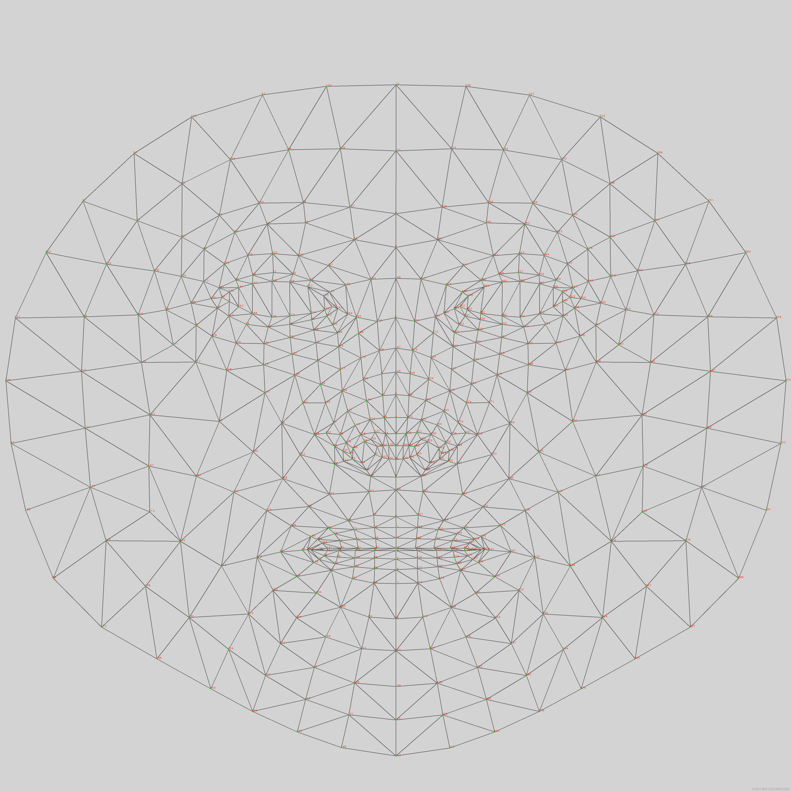
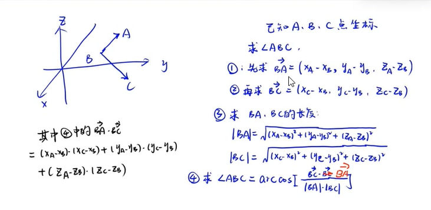

# mediapipe




## handtrack

### SSD | 手掌检测器


```
只有第一帧和手掌消失的时候调用一下，别的时候都是由上一帧来推断下一帧
```


### 手指检测器


### 找到深度

```
这里的深度其实是2.5D
```


### 策略

```js
--1.为什么要设计手掌检测器就是就是解决自遮挡的情况
--2.使用了类似于FPN的 extractor similar 解码器
--3.用的是focal loss 的损失函数
```


### 数据集

```
3d 获取的

用二分类模型来 做正反 实验
```


### 输出

```
1.置信度
2.左右手
3.坐标
```


## 2. 


**大家好，我是Electrolux。这个文章讲一下 纯前端结合mediapipe实现深蹲 | 俯卧撑计数 | 手势识别 **


### 首先cdn引入mediapipe的包

```html
这个包目前我丢在cdn中，如果你想放心一点，你可以npm install 下来 ，然后替换成你自己资源路径(mediapipe的官方那里copy过来的)

 <script src="https://cdn.jsdelivr.net/npm/electroluxasset/mediapipe/holistic/camera_utils.js" crossorigin="anonymous"></script>
    <script src="https://cdn.jsdelivr.net/npm/electroluxasset/mediapipe/holistic/control_utils.js"
        crossorigin="anonymous"></script>
    <script src="https://cdn.jsdelivr.net/npm/electroluxasset/mediapipe/holistic/drawing_utils.js"
        crossorigin="anonymous"></script>
    <script src="https://cdn.jsdelivr.net/npm/electroluxasset/mediapipe/holistic/holistic.js" crossorigin="anonymous"></script>
```


### 弯曲技术基本知识

我们首先要知道，mediapipe 能够返回给你身体不同坐标的x，y，z轴。明白的这点后。如何求俯卧撑技术或者是深蹲计数其实也就变成了求身体不同坐标的夹角。更加明确一点，应该是求点之间的夹角。这里我们用到我们高中时候学到的空间向量知识。

如下图所示




好了，我们已经有了理论基础了，那么接下来就是把 这个理论 转化成javascript了

```js
 let point1 = [0,0,0]
 let point2 = [0,1,0]
 let point3 = [0,1,1]


 /*  怎么用mediapipe和纯前端实现深蹲计数和俯卧撑计数
            1.3维点(输入：getusermedia .输出：mediapipe)
            2.计算夹角(空间向量)
        */
 function countAngle(point1,point2,point3){
     // 1.先求 point1 和point2之间的距离
     let temp12  =  Math.pow((point1[0]-point2[0]),2)+  Math.pow((point1[1]-point2[1]),2) +Math.pow((point1[2]-point2[2]),2)
     let point12 = Math.pow(temp12,0.5)
     // console.log(point12)
     let temp23  =  Math.pow((point3[0]-point2[0]),2)+  Math.pow((point3[1]-point2[1]),2) +Math.pow((point3[2]-point2[2]),2)
     let point23 = Math.pow(temp23,0.5)
     // console.log(point23)

     // 2.求向量 
     let vector12 = [(point1[0]-point2[0]),(point1[1]-point2[1]),(point1[2]-point2[2])]
     let vector23 = [(point3[0]-point2[0]),(point3[1]-point2[1]),(point3[2]-point2[2])]


     //3.求arccos 
     let top = vector12[0] * vector23[0] + vector12[1] * vector23[1] + vector12[2] * vector23[2]
     let bottom = point12 * point23

     // 4.最后求解
     console.log(Math.acos(top / bottom)* 180 / Math.PI)
 }
countAngle(point1,point2,point3)  // 结果是 90，这里验证 point1，point2，point3 的夹角
```


### mediapipe 基本知识

我们在这篇文章只需要知道。mediapipe就是哆啦A梦的口袋，我们把视频流丢给他，他就能返回给我们 result  用ts 表示如下

```ts
interface result {
    leftHandLandmarks?:Array<result_base>
    rightHandLandmarks?:Array<result_base>
    faceLandmarks?:Array<result_base>
    poseLandmarks?:Array<result_base>
}

interface result_base{
    x:number
    y:number
    z:number
}
```


如果你看不懂ts耶没关系，我举一个例子

```js
let result = {
    leftHandLandmark:[
        {x:0,y:0,z:0}
        {x:4,y:9,z:3}
		...
    ]
    ...  
}

```


可以看到mediapipe会返回给我们一个个array。那么我们怎么知道这些array对应者哪些节点呢。 mediapipe官方给了我们这些图可以参考


### 开始布局

好了，在了解完上面的基础知识后，我们很轻松就可以构建出我们想要的程序了

#### dom结构

```html
  <div class="container">
        <video class="input_video"></video>
        <canvas class="output_canvas" width="1280px" height="720px"></canvas>
    </div>
```


#### js 方法

```js
function countAngle(point1,point2,point3){
    // 1.先求 point1 和point2之间的距离
    let temp12  =  Math.pow((point1[0]-point2[0]),2)+  Math.pow((point1[1]-point2[1]),2) +Math.pow((point1[2]-point2[2]),2)
    let point12 = Math.pow(temp12,0.5)
    // console.log(point12)
    let temp23  =  Math.pow((point3[0]-point2[0]),2)+  Math.pow((point3[1]-point2[1]),2) +Math.pow((point3[2]-point2[2]),2)
    let point23 = Math.pow(temp23,0.5)
    // console.log(point23)

    // 2.求向量 
    let vector12 = [(point1[0]-point2[0]),(point1[1]-point2[1]),(point1[2]-point2[2])]
    let vector23 = [(point3[0]-point2[0]),(point3[1]-point2[1]),(point3[2]-point2[2])]


    //3.求arccos 
    let top = vector12[0] * vector23[0] + vector12[1] * vector23[1] + vector12[2] * vector23[2]
    let bottom = point12 * point23

    // 4.最后求解
    console.log(Math.acos(top / bottom)* 180 / Math.PI)
    return Math.acos(top / bottom)* 180 / Math.PI
}
function onResults(results) {
    try{

        // 构建3个坐标点
        let point1 = [results.leftHandLandmarks[8].x,results.leftHandLandmarks[8].y,results.leftHandLandmarks[8].z]
        let point2 = [results.leftHandLandmarks[6].x,results.leftHandLandmarks[6].y,results.leftHandLandmarks[6].z]
        let point3 = [results.leftHandLandmarks[5].x,results.leftHandLandmarks[5].y,results.leftHandLandmarks[5].z]
        console.log(results.leftHandLandmarks,countAngle(point1,point2,point3))
        // 计算3个坐标点的 弯曲角度
        if(countAngle(point1,point2,point3)>160){
            if(start==true){
                start = false
                count++
                alert(count)
            }

        }else{
            start = true
        }
    } 
    catch(e){
    }
    
}

holistic.onResults(onResults);

const camera = new Camera(videoElement, {
    onFrame: async () => {
        await holistic.send({ image: videoElement });
    },
    width: 1280,
    height: 720
});
```


好了，到这里我们的功能也就实现了。

