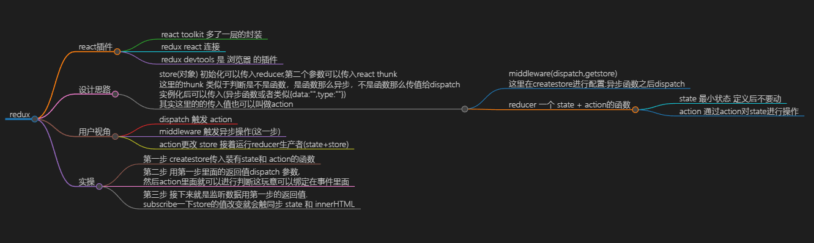

# 2.react

[[toc]]


## react  安装 

```shell
# React的脚手架:create-react-app
npm i create-react-app -g
create-react-app project #创造project
create-react-app react-study-ts --template typescript


npm run eject，会将原本creat react app对webpack，babel等相关配置的封装弹射出来，如果我们要将creat react app配置文件进行修改
```


## 2.-1 mini-react

### 2.-1.1  render | 非fiber  

```html
<!DOCTYPE html>
<html lang="en">
--1.render 思路
--1.1 fiber的数据结构：
--1.2 传入fiber数组和container元素。
--1.3 根据type创造子节点createElement 赋值给当前dom
--1.4 过滤children渲染子元素 .
--1.5 append dom进 container里面去
<head>
    <meta charset="UTF-8">
    <meta http-equiv="X-UA-Compatible" content="IE=edge">
    <meta name="viewport" content="width=device-width, initial-scale=1.0">
    <title>Document</title>
</head>

<body>
    <div id="root"></div>

<script>
    let root = document.querySelector("#root")
    /*
    1.createElement 把function变成对象
    element是 react 元素
    node 是dom 元素

    createElement(type,props,children)
    难点在于组装成一个object ？？？ 
    还真是。因为最主要的render逻辑没有讲
    形参的...xxx。xxx会变成 [xxx,xxx]
    形参的[...xxx]。[] 会比 ...优先级高. 扩展运算符最好还是一个用 

    */
    function createElement(type, props, ...children) {
        return {
            type,
            props: {
                ...props,
                children: children.map((child) => {
                    return typeof child === 'object' ? child : createTextElement(child)
                }),
            },
        };
    }
    function createTextElement(text) {
        return {
            type: 'TEXT_ELEMENT',
            props: {
                nodeValue: text,
                children: [],
            },
        };
    }

    let fiber = createElement("div", { id: "test" ,},
        "这里是文本节点", createElement("h3", { id: "test",style:"color:red" },
            "这里是文本节点"))

    console.log(fiber)
    /**
     * 
    {
        "type": "div",
        "props": {
            "id": "div",
            "children": [
                {
                    "type": "TEXT_ELEMENT",
                    "props": {
                        "nodeValue": "这里是文本节点",
                        "children": []
                    }
                },
                {
                    "type": "TEXT_ELEMENT",
                    "props": {
                        "nodeValue": "测试",
                        "children": []
                    }
                }
            ]
        }
    }
        */


    /**
     *2.render 的逻辑 
        2.1传入fiber数组和container元素。
        2.2根据type创造子节点createElement
        2.3过滤children渲染子元素 .
        2.4 append dom进 dom里面去
        
    */

    function render(fiber, container) {
        // 创建父节点
        const dom =
            fiber.type == 'TEXT_ELEMENT'
                ? document.createTextNode('')
                : document.createElement(fiber.type);

        // 赋值属性
        Object.keys(fiber.props)
            .filter((key) => key !== 'children')
            .forEach((key) => (dom[key] = fiber.props[key]));

        //渲染子元素
        fiber.props.children.forEach((child) => {
            render(child, dom)
        })
        container.append(dom)
        // return dom;
    }
    render(fiber, root)
</script>

</body>

</html>
```


### 2.-1.2 requestIdleCallback | fiber | 并行渲染 | commit render分离

```html
react 18 用 createRoot 代替了 render
hydrateRoot 可以用与修补 服务端渲染和客户端渲染属性的差别


--2.并行commit + render 思路
主要的工作放到workLoop 中去,单次 render 只渲染一个元素（nextUnitOfWork）。这里注意的是构建关系。只有第一个孩子叫children，其他的叫做sibling，然后前序遍历，chilren-》sibling-》parent.等到下一个nextUnitOfWork 不存在就开始commit


<!DOCTYPE html>
<html lang="en">

<head>
    <meta charset="UTF-8">
    <meta http-equiv="X-UA-Compatible" content="IE=edge">
    <meta name="viewport" content="width=device-width, initial-scale=1.0">
    <title>Document</title>
</head>

<body>
    <div id="root"></div>
    <script>
let root = document.querySelector("#root")
let nextUnitOfWork = null
let fiber = {
    "type": "div",
    "props": {
        "id": "div1",
        "children": [
            {
                "type": "div",
                "props": {
                    "children": [
                        {
                            "type": "div",
                            "props": {
                                "innerHTML": "里面"
                            }
                        }
                    ]

                }
            },
            {
                "type": "h3",
                "props": {
                    "innerHTML": "里面"
                }
            }
        ]
    }
}

/**
 *工具函数
    */
function createDOM(fiber) {
    const dom =
        fiber.type == 'TEXT_ELEMENT'
            ? document.createTextNode('')
            : document.createElement(fiber.type);

    Object.keys(fiber.props)
        .filter((key) => key !== 'children')
        .forEach((key) => (dom[key] = fiber.props[key]));

    return dom;
}

/**
 *2.render 的逻辑 
    2.1 初始化第一个工作UnitOfWork
    */

function render(element, container) {
    // Root Fiber
    wipRoot = {
        dom: container,
        props: {
            children: [element],
        },
        children: null,
        parent: null,
        sibling: null
        // alternate: currentRoot,
    };
    // deletion = [];
    nextUnitOfWork = wipRoot;
}
// 


/*
    上面的渲染不能停止.我们可以把任务给打成一个个小任务
    3.这次是并行渲染(conconstructor ) 
    Fiber：表示大的结构
    fiber：表示一个节点，fiber = js对象 

    优先级child ， sibling（兄弟） ，parent 。就是一个先序遍历

    第一个节点是render出来的，剩下的节点是 performUnitOfWork 出来的
*/

/*
    1.执行一个渲染任务单元
    2.创造新fiber
    3.返回下一个unitwork
*/
function performUnitOfWork(fiber) {
    // console.log(fiber)
    if (!fiber.dom) {
        fiber.dom = createDOM(fiber)
    }
    // 一开始 render 初始化了children，所以会回来
    if (fiber.parent) {
        fiber.parent.dom.append(fiber.dom)
    }
    const elements = fiber.props.children
    let prevSibling = null
    // 建立fiber之间的联系
    for (let i in elements) {
        const newFiber = {
            type: elements[i].type,
            props: elements[i].props,
            parent: fiber,
            dom: null,
            children: null,
            sibling: null
        }
        // 只有第0个叫child，别的都叫做sibling
        // 第二个if是兄弟节点
        if (i == 0) {
            fiber.children = newFiber
        } else {
            fiber.sibling = newFiber
        }
        // console.log(newFiber, prevSibling)

    }
    //找儿子,深度一直跑。
    // console.log(fiber)
    if (fiber.children) {
        return fiber.children
    }
    // 找兄弟
    let nextFiber = fiber
    while (nextFiber) {
        if (nextFiber.sibling) {
            return nextFiber.sibling
        }
        // 找爸爸
        nextFiber = nextFiber.parent
    }
}
/*
改造成异步
*/
function workLoop(deadline) {
    // console.log(deadline.timeRemaining())
    let shouldRun = true;
    // 不忙的时候进行渲染,一直空闲就能一直跑这个循环
    while (nextUnitOfWork && shouldRun) {
        nextUnitOfWork = performUnitOfWork(nextUnitOfWork);
        shouldRun = deadline.timeRemaining() > 1;
    }
    // 重新请求
    requestIdleCallback(workLoop);
}
render(fiber, root)
requestIdleCallback(workLoop)

    </script>

    <script>

    </script>
</body>

</html>
```


### 2.-1.3 diff

```js
3 diff 算法
3.1.先对比type，老节点和新节点有没有，相同，有复用当前dom 
3.2.新节点在，新节点没有或者新老节点不一样。那么增加
3.3.老节点在，新节点没有或者新老节点不一样。那么删除。组装好后commit。commit中对object对象进行处理
```


### 2.-1.4 状态管理对比

```js
redux 的使用就面临重复和沉重的的 reducer
dva，它是一个基于 redux 和 redux-saga 的数据流方案。通过 model 来分片管理全局状态，使用 connect 方法去给需要的深层次的组件传递状态。
```


### 2.-1.5 Symbol.**for**('react.element')

```js
为了防止一些服务器攻击
1.xss攻击让误将对象渲染成元素
s:
1.通过给每个 React 元素标记一个 Symbol 类型的属性。检查element.?typeof，并且回避掉丢失了这个属性或者其属性检查不通过的元素。

symbol

```


### 2.0.2 jsx | 虚拟dom 

```js
1.JSX 可以很好地描述 UI 的 一种js标识
2.虚拟DOM就是一个描述真实DOM的纯JS对象。React.createElement 函数所返回的就是一个虚拟DOM | 优点 ： 处理了浏览器兼容性，差异化更新更快   | 缺点：需要消耗额外的内存，首次渲染慢

```

### 2.0.3  class | hook 区别

```js
最本质的是 心智模型（mental model）


--1.计算损耗问题
--class中state 和 hook会写在constructor中，事件的处理都是写在render外部的。
--hook的 state 会写在函数中，在组件重新渲染的时候会被重新调用，这个时候我们就要关心是否会被重复调用的问题。
hook第一个是useState，提供了回调接收参数的方式，这样只在第一次调用时候会处理回调，从而避免重复调用导致的性能损失 。 const [count, setCount] = useState(() => {});。
第二个是依赖数组 。例如useEffect/useCallback/useMemo都提供了依赖数组的功能。useEffect 很简单就是生命周期，监听和return 


--2.this问题 | 状态不统一问题：
class中的this可以帮助我们获取最新的值
hook 因为没有this可能会访问到预期之外的旧值：
hook的实例：如果我们

alert（count）

然后我们如果用使用setCount

由于alert的count是一个基本类型的数值而不是一个引用。因此他的值就被固定下来。所以我们可以用useRef 来创造在函数组件内一直存在的对象引用。所以我们

const countR = useRef(0)
setCount(count+1)
countR.current = count+1
alert(countR.current)
```


## 2.1 react 基础知识

### 2.1.-2 dom元素

```
class     -----------   className
innerHTML     -----------   dangerouslySetInnerHTML
contentEditable     -----------   suppressContentEditableWarning
suppressHydrationWarning 可以简单判断服务端和客户端的渲染是不是有不同
```


### 2.1.-1 bug

```ts
bug：
React 官网介绍了 Hook 的这样一个限制：

--1.不要在循环，条件或嵌套函数中调用 Hook， 确保总是在你的 React 函数的最顶层以及任何 return 之前调用他们。

export default function App() {
  if (Math.random() > 0.5) {
    useState(10000)
  }
  const [value, setValue] = useState(0)

  return (
    <div>
      <button onClick={() => setValue(value + 1)}>+</button>
      {value}
    </div>
  )
}

2.
react hook 常年被诟病的毛病想必大家都知道。不能在条件语句中使用，useMemo 和 useCallback 需要显式指定依赖，解决子组件重新渲染可能还需要配合 React.memo 使用等等。虽然有对应的 eslint-plugin 可以帮助填充依赖，但是依赖项一旦很多，代码的可能读会非常差。现在普遍的观点是计算量大的再用 useMemo, 而 useCallback 能不用就不用


```


### 2.1.0 源码

```ts
react 源码 可以分成下面几个部分

--1.Scheduler（调度器）：排序优先级，让优先级高的任务先进行reconcile
​ react15没有Scheduler这部分，所以所有任务没有优先级，也不能中断，只能同步执行。


--2.Reconciler（协调器）： 找出哪些节点发生了改变，并打上不同的Tag
​ Reconciler发生在render阶段，render阶段会分别为节点执行beginWork和completeWork（后面会讲），或者计算state，对比节点的差异，为节点赋值相应的effectTag（对应dom节点的增删改）
​ Renderer发生在commit阶段，commit阶段遍历effectList执行对应的dom操作或部分生命周期
​ 异步可中断执行原理（concurrent mode）：
fiber能够记录当前遍历上下文。三个指针：父节点，下一个兄弟节点，子节点（优先深度，同级）。初次渲染时先序遍历，更新时后序遍历

通过类似于requestIdleCallback去控制的组件渲染的进度

之前是采用的递归的遍历方式（同步代码），这种也被成为 Stack Reconciler。主要是为了区别 Fiber Reconciler 取的一个名字

​ Fiber树 = 虚拟dom 。fiber双缓存是指存在两颗Fiber树，current Fiber树描述了当前呈现的dom树，workInProgress Fiber是正在更新的Fiber树，这两颗Fiber树都是在内存中运行的，在workInProgress Fiber构建完成之后会将它作为current Fiber应用到dom上。

​ 虚拟dom 挂载流程 ： 在mount时，会根据jsx对象返回值。构建Fiber对象形成树，然后这颗Fiber树会作为current Fiber应用到真实dom上


--3.Renderer（渲染器）： 将Reconciler中打好标签的节点渲染到视图上


```


### 2.1.1 react 17 | react18

```js
--1.react17的变化
--1.1 jsx引入的变更 单独使用 JSX 而无需引入 React（不用 import React from 'react';）因为新的 JSX 转换不会将 JSX 转换为 React.createElement。而是自动从 React 的 package 中引入新的入口函数并调用
--1.2 事件委托的变更 | 这次React 不再将事件添加在`document` 上，而是添加到渲染 React 树的根 DOM 容器中
--1.3 事件池去除 | 我们在17以前usestate使用异步是使用 setval + e.persist之中语法的不然会报错。17之后就不用加上e.persist

--2.react18的更新
--2.1 src/index.js |  渲染方式变成ReactDOM.createRoot
--2.2 Suspense的功能，使其支持流式 SSR
--2.3 并发特性指开启并发模式后才能使用的特性，比如：useDeferredValue/useTransition。
--2.4 多次事件合并成1此执行，提高了性能。多次渲染合并成一次渲染
import React, { useState, useEffect, useTransition } from 'react';
```


### 2.1.1 render

这玩意是类组件才有的东西，函数式组件没有这个东西

```js
每个React类组件强制要求必须有一个 render()。render里面必须return 一个闭合的标签
```


### 2.1.2 state  |  props 

```
props 是不可变的（父子间初始传参），而 state 可以根据与用户交互来改变（有点像双向绑定的东西）

没有 state 的叫做无状态组件，有 state 的叫做有状态组件
```


```js
--1.受控组件常见报错：react判定是 非受控组件 然后这个组件就成为了受控的组件（这个错误发生在input组件初始化的时候。我们在val初始化的时候并没有给值，所以val的初始化值就是undefined，react判定是 非受控组件）
就有了下面这个错误A component is changing an uncontrolled input of type text to be controlled

受控组件常见报错是完全呗表单元素控制
```


### 2.1.4 合成事件 = 事件委托 |  复合事件 | 别的dom事件 | event.target 与 event.currentTarget

执行顺序

- React16: document 捕获 -> 原生事件 -> 合成事件 -> document 冒泡 (原因是事件委托在 document 的冒泡事件上

- React17/18: document 捕获 -> 合成捕获 -> 原生捕获 -> 原生冒泡 -> 合成冒泡 -> document 冒泡 (原因是合成事件的委托在 root 容器的捕获和冒泡事件上了测试链接

  捕获 阶段 react 事件 会快一点 。冒泡 阶段 自定义事件 会快一点


```js
1.合成事件
是兼容各个浏览器react的一个api。例如onclick={()=>this.handle()}
react17添加到container层，react17以前添加到document
正因为合成事件所以在class 组件中可能会存在调用this 是undefine的情况

我c，官网下面这段话完全不知道
如需注册捕获阶段的事件处理函数，则应为事件名添加 Capture。例如，处理捕获阶段的点击事件请使用 onClickCapture，而不是 onClick。

然后之前的dragStart 变成了 ondragStart，都在前面加了一个on


react 的 合成事件 是真的不厚道，取了一个跟原生事件里面一样的名字

2.复合事件
oncompositionEnd ,oncompositionStart , onCompositionUpdate
compositionstart+compositioned这两个结合能够处理
输入法编辑器输入。不需要每次输入拼音都触发onchange事件

3.指针事件
指针事件:指针事件允许我们通过一份代码，同时处理鼠标，触摸和触控
.onPointerDown，.onPointerUp，.onPointerEnter之类的。可以包括click，touch
```


### 2.1.5 ref | ts | hook

```ts
hook组件中获取组件实例

let test =  useRef<HTMLImageElement | null >(null);
<component ref = {test}> </component>

然后就可以通过 test.current 就可以了
```


### 2.1.7.useEffect | useLayoutEffect |  flushSync

```js
flushSync(() => {
  setCount(count + 1);
}); // 强制刷新内部的更新
```

```jsx
useEffect什么时候用：
1.缓存 useEffect 的引用类型依赖。就是 依赖数组的形式
2.官方推荐在useEffect里面改变dom，添加定时器，日志，订阅之类的
3.effect的执行时机会有延迟，也要小心。数组中包含了所有 effect 中使用的变量，否则你的代码会引用到先前渲染中的旧变量。（我这里吃了大亏）


原理：每一次render 会 捕获 props 和 effect。Effect是 增强性组件。用来保持状态的 effect 可以告诉 React 组件需要在渲染后执行某些操作。React `会保存你传递的函数` 。先是UI，然后是数据。return 里面可以消除订阅

React 将按照 effect 声明的顺序依次调用组件中的每一个 effect。所以我们的effect可以进行分离

只有缓存

--1.模拟挂载 更新 和卸载前

1.1 示例
useEffect(()=>{
    // mount
    console.log('挂载后')
    //before destory 函数中通过return 可以清除副作用
    return ()=>{
            console.log('销毁前')
    }
},[])
1.2 如何正确地在useEffect里请求数据？
请求中所有的因子都要写在数组里

1.3 可以把函数作为effect的依赖吗？
可以把函数作为effect的依赖

1.4 class 和 函数 的 区别(useEffect和componentdid中的settimeout)
函数组件是 不同时机 不同状态 state。每一次渲染effect都有他的state。effect 也是渲染结果的一部分
class是 不同时机 同一状态 state

每一次依赖的更新或者是state的更新都相当于重新执行一遍function

接下来是 useEffect和componentdid中的settimeout
useEffect(() => {
    setTimeout(() => {
        console.log(`You clicked ${count} times`);
    }, 3000);
});   //这里按照顺序输出 。原理是闭包.hook自带闭包,服了


  componentDidUpdate() {
    setTimeout(() => {
      console.log(`You clicked ${this.state.count} times`);
    }, 3000);
  }  //只会输出最新的值


1.5 useEffect （定时器要在一个上下文（函数上下文）变量能被保持）
function Counter() {
  const [count, setCount] = useState(0);

  function handleAlertClick() {
    setTimeout(() => {
      alert('You clicked on: ' + count);
    }, 3000);
  }

  return (
    <div>
      <p>You clicked {count} times</p>
      <button onClick={() => setCount(count + 1)}>
        Click me
      </button>
      <button onClick={handleAlertClick}>
        Show alert
      </button>
    </div>
  );
}
点击Show alert 然后按 setCount 3次。会输出啥
答：会输出 0 （alert会“捕获”我点击按钮时候的状态，原因就是状态不保持）

const [count, setCount] = useState(0);
  function handleAlertClick(count: Number) {
    setTimeout(() => {
      alert("You clicked on: " + count);
    }, 3000);
  }
  return (
    <div className="App">
      <div>
        <p>You clicked {count} times</p>
        <button onClick={() => setCount(count + 1)}>Click me</button>
      </div>
      <button
        onClick={() => {
          handleAlertClick(count);
        }}
      >
        Show alert
      </button>
    </div>
  );
这样子给一个函数上下文才能够正确执行


--2.useLayoutEffect 不是异步的，他会阻塞dom 渲染。但是能够一定程度上解决闪烁的问题。这点挺好的
```


### 2.1.7 useMemo | useCallback | React.memo | 纯组件

```jsx
React.memo：用来包装 组件
hook.memoizedState = [nextValue, nextDeps]; 来缓存
在update的时候有一个  判断nextValue, nextDeps是不是空然后比较 prevDeps，nextDeps

useCallback:返回一个函数

useMemo 重新计算值

render的情况
1.更新
2.初始化
3.props 或者 state变化会重新渲染
4.父组件的渲染

什么时候用：
1.缓存 useEffect 的引用类型依赖。就是 依赖数组的形式
2.缓存子组件 props 中的引用类型：在父组件中跟子组件没有关系的状态变更导致的重新渲染可以不渲染子组件，造成不必要的浪费
3.相同输入，相同输出。

很可能


在父组件中跟子组件没有关系的状态变更导致的重新渲染可以不渲染子组件，造成不必要的浪费。

负优化的情况：


--1.usememo case1：
单独在子组件中使用
React.useMemo(() => {
    console.log("头部插件")
}, [父组件传过去的参数]);


let temp = React.useMemo(() => {
    console.log("头部插件")
}, []);
那么里面的东西也就只会渲染一次，这个跟useEffect 有一点像，但是它可以赋值，第二个参数传递依赖数组
本质上是一个小的缓存，类似于vue的watch 。唯一的不同是由于state每一次改变的时候都会重新执行function 

--2.memo case1（纯组件）-父子组件
在父组件和导出的时候用，只会在收到新数据或内部状态发生变化时重新渲染
类似于 export default React.memo (Footer) 但是如果传参给他的prop变了，那么他是会自动调用的。

// --------------------------------实例：很重要--------------------------------
// @ts-nocheck
import { useCallback, useState, memo, useMemo, useEffect } from "react";
import React from "react";
const Child = memo((props) => {
    console.log("子组件重新渲染", props.list);
    useEffect(() => {
        console.log("子组件的effect")
    }, [])
    return <>我是子组件</>
});
const App = () => {


    // 下面是第一大类情况，就是父子传参

    // 常见的错误有五个。都会导致组件重新渲染 
    // 1.父组件传递的参数单独使用(useCallBack | useMemo) ，子组件不包memo
    // 2.依赖数组 里面 有引用类型 会重复渲染
    // 3.memo 只会在收到新数据或内部状态发生变化时重新渲染
    // 4.usecallback(()=>{xx},[]) 同组件中，这种方式永远不会执行
    // 5.usecallback{xx,[]) 父子组件中，即使依赖数组正确也不会渲染

    // 正确示范如下
    // 父子组件:子组件包进去memo，依赖数组不给对象.useMemo正常，useCallBack传入数组
    // 1.useMemo
    /*
    const list = useMemo(()=>{
        return  count
    }
    ,[count])
    
    const list = useMemo(()=>{
        return function(){
            return count
        }
    }
    ,[count])
    */
    // 2.useCallback
    /*
    const list = useCallback(()=>{
            return(count)
     }
    ,[count])
    */


     // 单组件:
    // 1.useMemo
    /*
      useMemo(()=>{
        console.log("我是添加依赖数组的useMemo")
    }   ,[])
    */
    // 2.useCallback
    /*
    useCallback(
        console.log("我是添加依赖数组的useMemo")
    ,[])

    
    */

    `//-----------------------------下面的都是示例了,可以不看--------------------`


    const [count, setCount] = useState(0);

    // 2.传值的情况

    // 2.1 子组件 +  父组件prop基本类型 = 会重新渲染
    // const list = 1
    // 2.1.子组件memo + 父组件props为基本类型 = 不会重新渲染
    // 2.1.子组件memo+父组件传入prop为方法 = 会重新渲染
    // const list = ()=>{
    // }

    // 2.2 子组件 + 父组件props为useMemo + 依赖数组是count = 输出现在的count
    // 子组件 + 父组件props为useMemo + 依赖数组是空[] = 输出固定的初始值 
    // | 重要：常见的错误3，我以前上面以为这里只会渲染一次。因此子组件还是要加上memo
    // 子组件 + 父组件props为useMemo + 依赖数组去掉 =  输出现在的count
    // 2.2 子组件memo 和 父组件props为useMemo(当依赖数组没东西 return有用) 基本类型不会重新渲染
    // useMemo 传参会返回一个数值
    // 重要：常见的错误2 依赖数组有效的，注意依赖数组是引用类型就完蛋了
    // const list = useMemo(() => {
    //     return count //加上依赖数组后输出 这里面
    // }, [])


    // 2.3.子组件memo+父组件prop为useCallback方法(return没用)+依赖数组是[] = 不会重新渲染
    // 2.3.子组件+父组件prop为useCallback方法 = 会重新渲染 
    // | 重要：常见的错误1，所以要memo + useCallback 混合使用
    // 上面重新的渲染的原因是：父组件触发state，父组件useCallback里面的由于返回值是一个函数，所以一渲染就保持不了
    // 相比之下 useMemo能够不传入依赖数据也能够保持状态 的原因就是 返回值是一个 值
    // useCallback 传参会返回一个函数
    // 依赖数组有效的，注意依赖数组是引用类型就完蛋了

    // 如果父子组件这么传参，那么传了一个寂寞。这种传参只能是单个组件用
    // const list = useCallback(
    //     console.log(count)
    // ,[count])

    // 下面的这种传参是最佳实践，区别是一个传
    const list = useCallback(()=>{
        return(count)
    }
    ,[count])

    // 下面的这种传参是最佳实践,用usememo实现callback
    // const list = useMemo(()=>{
    //     return function(){
    //         return count
    //     }
    // }
    // ,[count])

    // 下面的这种传参是最佳实践,用usememo
    // const list = useMemo(()=>{
    //     return  count
    // }
    // ,[count])
    


    // 下面是第二大类情况，就是单个组件的usecallback和usememo

    // 1.不添加依赖数组的都会直接打印
    // useMemo(()=>{
    //     console.log("我是路过的useMemo")
    // })
    // // useCallback(()=>{
    // //     console.log("我是路过的useCallback")
    // // })
    // useCallback(
    //     console.log("我是路过的useCallback")
    // )

    // 2.useCall
    // useMemo(()=>{
    //     console.log("我是添加依赖数组的useMemo")
    // },[])
    // useCallback(()=>{
    //     console.log("我是添加依赖数组的useCallback")
    // },[])

    // 这个state 会触发，因为返回的是function
    // useCallback(()=>{console.log("我是添加依赖数组的useCallback")()}
    //     ,[]
    // )


    // useMemo(()=>{
    //     console.log("我是添加具体依赖的useMemo")
    // },[count])
    // // useCallback(()=>{
    // //     console.log("我是添加具体依赖的useCallback")
    // // },[count])
    // useCallback(console.log("我是添加具体数组的useCallback")
    //     ,[count]
    // )

    return (
        <>
            <div
                onClick={() => {
                    setCount(count + 1);
                    console.log("父组件的setState")
                }}
            >
                错误的111
            </div>

            {/* 1.什么值都不传入的时候那么 memo这种方式能够生效。
      真的能够避免子组件重新渲染 */}
            {/* <Child   /> */}

            {/* 2 */}
            <Child list={list} />
        </>
    );
};

export default App;


```


### 2.1.7  data | useState |  useRef  | useReducer | useContext | createContext

```tsx
--1.useState（需要视图驱动的时候可以这么做）
--1.1 useState 这个值的改变不能够同步更新（他的弊端就是不能在更新后立刻拿到改变后的值，state的问题在于一旦修改了它就会造成组件的重新渲染。原因是采用`object.js`进行比较）
--1.2 useState不会自动合并更新对象，可以用展开运算符达到合并更新

const [state, setState] = useState({});
setState(prevState => {
  // 也可以使用 Object.assign
  return {...prevState, ...updatedValues};
});
useEffect这类方法都是有延时的执行.使用它会有一些中间态


--1.3 useState 中返回一个值

initialState 参数只会在组件的初始渲染中起作用


--2.useRef
useRef能够同步更新数据（横跨生命周期），但是视图不会更新

--3.useReducer
接受一个fn（这里面第一个是state，第二个是action）和一个初始变量。返回现在变量和一个 fn。
这个fn可以传参 穿的参数作用到接受fn的第二个参数action里面
const fetchReducer = (state, action) => {
  switch (action.type) {
    case "FETCH_INIT":
      return {
        ...state,
        loading: true,
        data:action.payload,
      };
    default:
      throw new Error();
  }
};

let Child2:React.FC<PropsWithChildren>=()=> {
  console.log("组件二渲染")
  const [state, dispatch] = useReducer(fetchReducer, {
    loading: false,
    error: false,
    msg: "",
    data: {}
  });
    return (
    <>
      Count: {state.count}
      <button onClick={() => dispatch({type: 'decrement'})}>-</button>
      <button onClick={() => dispatch({type: 'increment'})}>+</button>
    </>
  );
}


--4.useContext
useContext接收context对象（React.createContext 的返回值）并返回该 context 的当前值（这一点由provider.value最近的那个）。

当组件上层最近的 <MyContext.Provider> 更新时，这个 Hook 会触发重渲染


父组件中
import Child1 from './child1'
const themes: Object = {
    light: {
        foreground: "#000000",
        background: "#eeeeee"
    },
    dark: {
        foreground: "#ffffff",
        background: "#222222"
    }
};

const rememberContext = createContext(themes)

export default function Parent() {
    // useContext 接受一个 createContext(themes) 的返回值
    return (
        <rememberContext.Provider value={themes}>
            parent
            <Child1 data={rememberContext}></Child1>
        </rememberContext.Provider>
    )
}

//------------------------
子组件

import React, { PropsWithChildren, useContext } from 'react'

interface param{
  [key:string]:any
}

let Child1:React.FC<any>=(param)=> {
  // const ThemeContext = React.createContext(themes.light);
  // React component names must start with an uppercase letter. React Hook names must start
  const theme = useContext(param.data);
  // const theme = useContext(param);
  console.log("子组件的param",theme)
  return (
    <div>
      child1-{(theme as any).light.label}
    </div>
  )
}
export default Child1


那么 useContext 怎么和memo作优化呢
1.拆分context
let theme = useContext(ThemeContext);然后
return <ExpensiveTree xxx={theme} />;
2.useMemo
function Button() {
  let appContextValue = useContext(AppContext);
  return useMemo(() => {
    // The rest of your rendering logic
    return <ExpensiveTree className={theme} />;
  }, [appContextValue.theme])
}


```


### 2.1.7 render |  并行commit + render   |   diff（困难）

```js
什么时候会render。
1.更新
2.初始化
3.props 或者 state变化会重新渲染
4.父组件的渲染

Fiber：一种将 recocilation （递归 diff），拆分成无数个小任务的算法；随时能够停止

--1.render 思路
--1.1 fiber的数据结构：
--1.2 传入fiber数组和container元素。
--1.3 根据type创造子节点createElement 赋值给当前dom
--1.4 过滤children渲染子元素 .
--1.5 append dom进 container里面去
{
		"type": "div",
		"props": {
                "id": "idTest",
                 "children": [
                        {
                            "type": "TEXT_ELEMENT",
                            "props": {
                                "nodeValue": "这里是文本节点",
                                "children": []
                            }
                        }
                    ] 
            }           
}
// 创建父节点
const dom = document.createElement(fiber.type);
// 赋值属性
Object.keys(fiber.props).filter((key) => key !== 'children')
.forEach((key) => (dom[key] = fiber.props[key]));
 //渲染子元素
fiber.props.children.forEach((child) => {
    render(child, dom)
})
container.append(dom)


// ----------------------------------------------

--2.并行commit + render 思路
主要的工作放到workLoop 中去,单次 render 只渲染一个元素（nextUnitOfWork）。这里注意的是构建关系。只有第一个孩子叫children，其他的叫做sibling，然后前序遍历，chilren-》sibling-》parent.等到下一个nextUnitOfWork 不存在就开始commit

function commitRoot() {
    commitWork(wipRoot.children)
    wipRoot = null
}
/*
	5.从根节点开始渲染
*/
function commitWork(fiber) {
    if (!fiber) {
        return
    }
    const domParent = fiber.parent.dom
    domParent.appendChild(fiber.dom)
    commitWork(fiber.children)
    commitWork(fiber.sibling)
}


function workLoop(deadline) {
    // console.log(deadline.timeRemaining())
    let shouldRun = true;
    // 不忙的时候进行渲染,一直空闲就能一直跑这个循环
    while (nextUnitOfWork && shouldRun) {
        nextUnitOfWork = performUnitOfWork(nextUnitOfWork);
        shouldRun = deadline.timeRemaining() > 1;
    }
    // 重新请求
    requestIdleCallback(workLoop);
}
render(fiber, root)
requestIdleCallback(workLoop)

//------------------------------------------------
3 diff 算法
3.1.先对比type，老节点和新节点有没有，相同，有复用当前dom 
3.2.新节点在，新节点没有或者新老节点不一样。那么增加
3.3.老节点在，新节点没有或者新老节点不一样。那么删除。组装好后commit。commit中对object对象进行处理
```


### 2.1.9 react 生命周期 | 版本差异

```js


--1.挂载阶段：（主要指constructor-初始化 + getDeriverdStateFormProps获取状态，这里就已经创造好vDom，进行render（注意里面不要用setState不然会递归爆栈） 。接下来是componentDidmount ）

--2.更新阶段（getDeriverdStateFormProps获取+shouldComponentUpdate+更新vDom+获取更新前状态getSnapBeforeUpdate+ componentDidUpdate） 
原理是 new props + set state + forceupdate。
触发时机：组件更新setState ｜ 根节点更新ReactDOM.render

组件更新挂载完成 -> 执行useLayoutEffect回调-> 浏览器dom 绘制完成  -> 执行useEffect回调


--3.卸载阶段（componentWillUnmount）

//--------------关于一些版本的差异（will基本上都被换成did了）-------------------
16.3之前：
挂载前，异步渲染导致dom被挂载前可能会被渲染多次。现在

getDeriverdState-FormProps（只有prop没有state）
componentWillReceiveProps（父子更新组件）
componentWillMount 
componentWillUpdate
componentWillUnmount

16.3之后：

getDeriverdStateFormProps（props-属性,state-状态）。返回值如果是object是会合并现在状态，不然啥也不会做
shouldComponentUpdate（nextProps，nextState）。返回值是true就不会重新渲染. 官方给我们实现了一个机遇这个的优化组件PureComponent（rpc快速生成）
getSnapshotBeforeUpdate(prevProps, prevState)：返回值是componentDidMount的第三个参数
componentDidMount（）{直接写}
componentDidUpdate（prevProps, prevState，返回值））
componentWillUnmount（）{常用的是this.setState=()=>{} ; 和 clearInterval()}
```


### 2.1.10 router | 版本差异

```tsx


//---------------React-router v6-最普通版本-----------------------


import Home from "../views/Home"
import Detail from "../views/Detail"
import App from "../views"
import Error from "../views/Error"
// 有两种模式  react-router-dom 有两个模式 
// BrowserRouter(history) 
// HashRouter(hash模式)
import {BrowserRouter,Route,Routes} from "react-router-dom"
// 定路由
const BaseRouter= () => {
    return (
        <BrowserRouter>
        <Routes>
            <Route path="/" element={<App></App>}>
                <Route path="/home" element={<Home></Home>}></Route>
            </Route>
            <Route path="/*" element={<Error></Error>}></Route>
        </Routes>
    </BrowserRouter>
    )
}

export default BaseRouter;

//---------------React-router v6-数组版本-----------------------
router/index.tsx
const routes = [
    {
      path: '/',
      element: <Login></Login>,
      meta: {
        title: '系统路由',
      },
      // redirect: '/system/login',
      children: [
        {
          path: '/child', // 这里的path，写为'/b'，也可以  /加不加都行
          element: <div>我是基本组件</div>
        }
      ]
    },
  ];
export default routes;
-------------------------------------------------
App.tsx
import { useRoutes} from 'react-router-dom'
import { AppSwrapper } from './style'

import routes from './router'
function App() {
  const element = useRoutes(routes)
//   console.log("则会使：",element)
  return (
    <>

      <AppSwrapper>{element}</AppSwrapper>
    
    </>
  )
}

export default App

------------------------------------------------
index.tsx
import React from 'react';
import ReactDOM from 'react-dom/client';
import './index.css';
import reportWebVitals from './reportWebVitals';
import {BrowserRouter} from "react-router-dom"

import App from './App'
const root = ReactDOM.createRoot(
  document.getElementById('root') as HTMLElement
);


root.render(
  <BrowserRouter>
   <App />
   </BrowserRouter>
);


//---------------React-router v5 v6差异-----------------------
//1.1顶层组件渲染
<Switch>
    <Route exact path="/"><Home /></Route>
    <Route path="/profile"><Profile /></Route>
</Switch>
//1.2 <Outlet />
能够进行嵌套。然后别的嵌套路由是里面直接写组件

//1.3 跳转

//v5
import { useHistory } from 'react-router-dom';
let history = useHistory();
history.push('/home');
//v6
import { useNavigate,useLocation } from 'react-router-dom';
let navigate = useNavigate();
navigate('/home');
//接收参数
naviate("/detail", {
    state: { id: 1 }
})
const location = useLocation();
console.log(location)


//1.4 组件
React-Router4/5 使用 component 收组件
React-Router6 使用element接收组件

<Route path="/home" element={<Home></Home>}></Route>
    
//1.4 都用useLocation
    
    
//1.5 用数组的方法
    react v5如果要是想用数组，必须用第三方库   xxx-config
    react v6可以直接用数组，但要注意<App>  useRoutes要包住数组，
然后在外面的main.tsx要
import {BrowserRouter} from "react-router-dom"

<BrowserRouter>
    <App />
</BrowserRouter>
```


### 2.1.11 css 方案

```tsx
--1.import styles from "./job.module.css'
className={styles["container"]}

2.styled-components

npm install styled-components
const AllStyle = styled.div`

  .header{
    display: block;
    background: rgb(112, 160, 206);
    width: 80%;
    overflow: hidden;
  }  
`

<AllStyle>
 <div className='header'>{param}</div>
</AllStyle>
      
```


### 2.1.12 ErrorBoundary | suspense

```js
hook是没有这个东西的

react 内的一个钩子,避免错误渲染白屏做异常中间处理的嵌套组件, 可以捕获子孙组件中「React工作流程」内的错误（render（组件render+diff算法） ｜ commit（渲染dom,生命周期componentdidmount/update））。顺带一句 suspense 的原理好像也是这个

render过程：function 里面第一层
commit过程：例如在uselayout里面就是

在很多全面使用Hooks开发的团队，唯一使用ClassComponent的场景就是「使用ClassComponent创建ErrorBoundary」。


loc（高级组件）
代码示例：

function ErrorBoundary({children}: {children: ReactNode}) {
  const [errorMsg, updateError] = useState<Error | null>(null);
  useErrorBoundary((e: Error) => {
    // 捕获到错误，触发更新
    updateError(e);
  })
  return (
    <div>
      {errorMsg ? '报错：' + errorMsg.toString() : children}
    </div>
  )
}

使用实例：


import React, { useState, useErrorBoundary, useLayoutEffect } from "react";
function ErrorBoundary({ children }) {
  const [errorMsg, updateError] = useState(null);
  const [count, updateCount] = useState(0);
  useErrorBoundary((e) => {
    updateError(e);
  });
  return (
    <div onClick={() => updateCount((count) => count + 1)}>
      {errorMsg ? "报错：" + errorMsg.toString() + count : children}
    </div>
  );
}
function Counter({ num }) {
  // 情况3: update时render阶段报错
  // if (num === 2) {
  //   throw new Error("render阶段报错");
  // }

  // 情况1: mount时render阶段报错
  throw new Error("render阶段报错");

useLayoutEffect(() => {
    // 情况4: update时commit阶段报错
    if (num === 2) {
      throw new Error("commit阶段报错");
    }
    // 情况2: mount时commit阶段报错
    // throw new Error("commit阶段报错");
  }, [num]);
  return <div>num is: {num}</div>;
}

// 用于调试 useErrorBoundary
export default function App() {
  const [num, updateNum] = useState(0);
  return (
    <div onClick={() => updateNum(num + 1)}>
    //重要：直接嵌套并且重写useErrorBoundary这个方法
      <ErrorBoundary>
        <Counter num={num} />
      </ErrorBoundary>
    </div>
  );
}

```


### 2.1.13 cloneElement | createElement

```js
注意 react element 的初始元素跟普通的html collection是不一样的

cloneElement，（react对象，主要是不可变元素。比如子组件）根据 Element 生成新的 Element
createElement，（各种 标签名字 html 和组件名字）根据 Type 生成新的 Element
```


### 2.1.14 portal |  Fragment

```js
react 中所有的组件都会位于 id 叫做app 的下面，而使用 Portals 提供了一种脱离 #app 的组件
createPortal(child, container)
render() {
    return ReactDOM.createPortal(this.props.children, this.el);
}
```


### 2.1.15 this

```js
在JSX中传递的事件是一个函数（如:onClick={this.handleClick}）。可以

1.就是给调用函数或者定义函数的时候时bind(this)，从而使得无论事件处理函数如何传递，this指向都是当前实例化对象。（如：onClick={this.handleClick.bind(this)}）

2.class 的时候直接绑定在constructor里面
（如：this.xxx=this.xxx.bind(this);onClick = {this.xxx} ）

3.箭头函数：直接调用this。（如：onClick={()=>{xxx();}）
```


### 2.1.16  为什么 hooks 不能写在循环或者条件判断语句里

```js
每次调用一次 useState, stateQueue 就会存储一个值

let stateQueue = []; // 用于存放每个useState返回值。
let stateIndex = -1;  //给每个 useState的返回值一个序号。
function useState(initState) {
  stateIndex++;
  stateQueue[stateIndex] = stateQueue[stateIndex] || initState;
  const currentIndex = stateIndex
  function setState(newState) {
    stateQueue[currentIndex] = newState;
    reRender(); //组件重渲染
  }
  return [stateQueue[stateIndex],setState]
}

例如 我们 在 if 中 加了一个usestate 然后, 界面就会reRender 被调用。stateIndex重新变为-1，App组件重渲染.那么  stateQueue[stateIndex] || initState 就会 永远是 一开始的 值 


```


### 2.1.17   react 原理

```js

//创建的是React初始元素
const A = React.createElement("div");
//创建的是React初始元素
const B = <div>123</div> 
//注意document.createElement(“div”) 创造的是真实dom

React首先根据初始元素先生成虚拟节点，然后做了一系列操作（处理节点完后）后最终渲染成真实的UI

关于节点的处理看后面

--1.dom节点：const b =<div><div/>
处理：直接会根据type属性创建不同的真实DOM。创建完真实DOM后会立即设置该真实DOM的所有属性，比如我们直接在jsx中可以直接书写的className、style等等都会作用到真实DOM上。

--2.组件节点：const b =funciton 或者是 class xx（函数组件和类组件）
处理：function的话 ，直接调用函数。直到return 一个虚拟节点
然后class的话，会麻烦很多，step1:首先创造类的实例（constructor），接下来调用生命周期，step2:getDerivedStateFormProps。step3:render最终生成vdom树。step4:接下来是componentDidMount加入执行队列。注意一下如果组件中存在父子关系，那么子元素的componentDidMount会先入队列执行。react中会先执行父constructor=》父-getDerivedStateFromProps= 》子constructor=》子-getDerivedStateFromProps= 》子componentDidMount=》父-componentDidMount = 》这里可以跟vue的父子组件执行顺序做比较。vue的mount也是子组件优先，但是vue还有create，create是父组件优先。多个组件也是这样，父子组件只有等到子组件的东西全部mount的时候才会执行mount。注意父组件的beforeMount优先级大于子组件的优先级

--3.文本节点：const b = “ceshi”. 或者 12
处理：通过document.createTextNode来进行渲染

--4.空节点：{this.state ? <app/> : false} :渲染时碰到空节点，什么都不会做

--5.数组节点：不会直接渲染节点，而是根据不同的节点类型去做相应的事情。里面只能是上面的节点类型，不然会报错

当处理完了所有的节点后，我们的vDom树和真实DOM也创建好了，React会将vDom树保存起来，方便后续使用。然后将创建好的真实DOM都挂载到页面上


```


### 2.1.18 setstate原理

```js
调用 这个发生了什么？主要是生命周期的变化

15触发 setState
shouldComponentUpdate
componentWillUpdate
render
componentDidUpdate

16.3 React

触发 setState
shouldComponentUpdate
render
getSnpshotBeforeUpdate
componentDidUpdate

16.4 React 

触发 setState
getDerivedStateFromProps
shouldComponentUpdate
render
getSnapshotBeforeUpdate
componentDidUpdate
```


### 2.1.19 函数组件和类组件本质的区别。

```ts
当函数组件进入和更新render阶段.如果在两个不同的渲染过程中调用它们，本质上他们两个是不一样的。这种不一样来源于函数组件要维护一个hooks的链表，初次挂载时要创建链表，后续更新的时候要更新链表。`函数组件本质是一个链表`

两个过程的hook函数会在各自的过程中被赋值到ReactCurrentDispatcher的current属性上.这样才可以在正确的阶段调用到正确的hook函数。

```


### 2.1.20 render props和高阶组件的区别


### 2.1.21 diff算法

```
tree层级 | conponent层级：：跨层级的操作不做优化，只会对相同层级的节点进行比较。这个情况只有删除和创建 没有更新操作
element层级 ：这种情况就是同级别的，这个时候就有插入 移动 和 删除了

通过key可以准确地发现新旧集合中的节点都是相同的节点，因此无需进行节点删除和创建，只需要将旧集合中节点的位置进行移动，更新为新集合中节点的位置


```


### 2.1.22 同步异步 | setState异步？| 原生事件里， SetState 是同步？

```js
--1.setState可以调用多次，会集中一次更新。这是为了减少render提升性能的目的
--2. 等到这次操作（当前的同步操作）完成，在将在队列中存储的状态（state）做合并，所以无论你执行多少次 setState ，最后只会针对最新的 state 值走一次更新流程，这就是批量操作更新。isBatchingUpdates为true的时候就会上锁


在 onClick、onFocus 等事件中，由于合成事件封装了一层，所以可以将 isBatchingUpdates 的状态更新为 true

而在外部的原生事件中，并没有外层的封装与拦截，无法更新 isBatchingUpdates 的状态为 true。这就造成 isBatchingUpdates 的状态只会为 false，且立即执行。所以在 addEventListener 、setTimeout、setInterval 这些原生事件中都会同步更新
//------------------------------------------------------
React 的 合成事件 类似于 事件委托
React 给 document 挂上事件监听；DOM 事件触发后冒泡到 document；React 找到对应的组件，造出一个合成事件出来；并按组件树模拟一遍事件冒泡。这样就有一个问题，就是在一个页面中，只能有一个版本的 React。如果有多个版本，事件就乱套了。

在17版本之后，这个问题得到了解决，事件委托不在挂载到 document 上，而是挂在 DOM 容器上，也就是 ReactDom.Render 所调用的节点上。

在 React 钩子函数及合成事件中，它表现为异步；而在 setTimeout、setInterval 等函数中，包括在 DOM 原生事件中，它都表现为同步。这种差异，本质上是由 React 事务机制和批量更新机制的工作方式来决定的。


```


### 2.1.24 class为什么普通的this是undefined

```
箭头函数可以拿到this
红宝书中this是函数调用的上下文对象，在网页的全局上下文调用函数时，this只想window。（）
箭头函数中，this引用的是定义箭头函数的上下文
```


### 2.1.25 路由懒加载

```js
 React.lazy(() => import('./OtherComponent'));
```


### 2.1.26 setstate | render | memo | ref 缓存 顺序和原因

```js
/* eslint-disable react-hooks/rules-of-hooks */
// @ts-nocheck
import { useCallback, useState, useRef, useEffect, useMemo } from "react";
import React from "react";

const App = () => {

    const [i, setI] = useState(1);
    const ref = useRef(1)
    /**
     * @des 这佐证了 setstate 会在 下一个循环
     * 渲染顺序 
     * ref 马上 就不会被缓存
     * setstate 下一个整个循环 不会被缓存
     * 
     */
    if(i>2){
        const [ib, setIb] = useState(1);
        console.log(ib)
    }
    let add = () =>{
        a.current = null
        setI(i+1)
        console.log(i)
        console.log(add === a.current, "add === a.current")
        console.log(cbAdd ===b.current, "cbAdd ===b.current")   
    }
    let refUpdate = () =>{
        ref.current = ref.current+1
        console.log(ref.current)
        setI(i+1)
    }
    var a = useRef(add);
    // const cbAdd = useCallback(add, [ref.current]);
    const cbAdd = useMemo(() => add, [ref.current]);
    let b = useRef(cbAdd);

    useEffect(()=>{
        // setI(i+1)
       
    },[])
    return (
        <div id="App">
            <hr></hr>
            i: {i}
            <button onClick={add}> state </button>

            <button onClick={refUpdate}> ref</button>
        </div >)
};

export default App;


```


### 2.1.27 项目工程化

#### 2.1.27.1 .npmrc文件

```js
npm 运行的配置文件

registry=https://registry.npmmirror.com
```


#### 2.1.27.2 .prettierrc

```js
npm install  prettier@2 prettier-plugin-organize-imports@2 prettier-plugin-packagejson@2

{
  "printWidth": 80,
  //单引号
  "singleQuote": true,
  //tab 的值
  "tabWidth": 2,
  "trailingComma": "all",
  "proseWrap": "never",
  "overrides": [{ "files": ".prettierrc", "options": { "parser": "json" } }],
  "plugins": ["prettier-plugin-organize-imports", "prettier-plugin-packagejson"]
}


```

```
.prettierignore 也是不可少的

node_modules
.umi
.umi-production


```


#### 2.1.27.3 .stylelintrc.js

stylelintrc css属性生效的优先级

```js
module.exports = {
  extends: require.resolve('@umijs/max/stylelint'),
};

```


#### 2.1.27.4 查看全局npm 安装位置

```
查看 npm root -g 
```


### 2.1.28 高阶组件 | HOC(类组件)

```js
--1.是啥？
高阶组件（HOC）是 React 中用于复用组件逻辑的一种高级技巧。
组件是把prop渲染成UI,而高阶组件是将组件转换成另外一个组件。 函数组件return一个class组件

将函数作为形参数放到一个函数中执行的,这个函数可以视为高阶函数 .像是find， clearinterval，foreach，reduce

--2.作用
--2.1复用逻辑
--2.2强化props，劫持props附加额外的生命周期

--3.使用
--3.1 对组件进行包裹。对于class我们可以使用装饰器模式。对于function我们可以 export default 包裹着 function就可以了

```


所有的标签注入到root里面去

src所有东西都可以删掉

```jsx
1.文件名可以是jsx也可以是js因为是html和xml混合起来的开发模式
2.组件名称首字母大写 
3.js 出现()  代表 相要挟html  {} 出现变量用{}来包裹变量
4.vscode优化：为了写jsx 出现只能提示。我们可以在vscode 设置的首选项中选择emmet 然后 项填入  javascript 。 值填入 javascriptear.emmet中搜一下 trigger，勾上。
5.jsx语法
--------------------------------------
import React from "react";


const msg = "双值绑定";
const styleAll = {background:'red'};
// 知识点1：类组件结构:这玩意也要一个根组件
class App extends React.Component {
    render() {
        return (
            <>类组件：{msg}
                <div>2333</div>
                {/* 知识点2：input label跟一般的不同 用htmlFor*/}
                <label htmlFor="inputTest">用户名</label>
                <input type="text" id="inputTest"/>
                {/* 知识点3：写class的不同 用className */}
                <div className="box">我们的class</div>
                {/* 知识点4：直接写样式 用双括号 相当于解析js*/}
                <div className="box" style={{background:'blue'}}>我们的class</div>

            </>
        )
    }
}
export { App }
---------------------------------------


6.其实react 也有根元素的限制。  如果说不想将标签设置成div，也可以 设置成空元素 例如<> 
7.vscode可以搜索插件 react 然后 下载那个es7  之后就可以rcc（react class component ） 快速创造文件了。rfc（react funcion component ）


8.受控组件和不受控组件（只存在于表单元素）
受控组件：意思是表单元素的value元素用state来进行定义
不受控组件：意味着表单元素的value组件无法通过state获取，只能通过ref获取

2.memo
保护子组件不受父组件更新视图影响。（不然父组件已更新视图，子组件就会刷新一次，造成性能问题）
import React,{useContext,memo} from 'react'
在方法前面加一个memo就可以了
类似于：  
const child = momo(()=>{
    return <>
        	<h2>子组件</h2>
        
})

可以与useCallback进行一些东西，检测更新，只更新一次之类的


10.redux 的使用（类似于vuex）
npm i redux react-redux  简单安装
npm install @reduxjs/toolkit  这玩意太难用，不如我自己封装


11.npm i react-router-dom@6 路由安装
路由操作可以看router下面和view下面


```


### 2.1.29  函数组件定义 |  茴香豆有几种写法

```tsx
import React ,{FC} from "react"
interface ApiManageProps { }
let render: React.FC<ApiManageProps> = () => {
    return (<>
        这里是render
    </>)
}

interface ApiManageProps { }
let render: FC<ApiManageProps> = () => {
    return (<>
        这里是render
    </>)
}

```


### 2.30  Diff 算法

而元素 key 属性的作用是用于判断元素是新创建的还是被移动的元素，从而减少不必要的元素渲染

- tree 层级：DOM 节点跨层级的操作不做优化，只会对相同层级的节点进行比较
- conponent 层级：如果是同一个类的组件，则会继续往下 diff 运算，如果不是一个类的组件，那么直接删除这个组件下的所有子节点，创建新的 
- element 层级：对于比较同一层级的节点们，每个节点在对应的层级用唯一的 key 作为标识


### 2.31 useEffect 第一个函数参数不能设置为 async 函数，为什么

因为useEffect 的返回值是要在卸载组件时调用的，不然就乱套了


## 2.3.公共封装


### 3.1 路由封装

我这里使用的是 v6 版本

```
npm install react-router-dom@6
```


解决react18和空标签问题

### 3.1.1 src/index.js

```jsx
// import ReactDOM from 'react-dom';
import ReactDOM from 'react-dom/client';
//知识点1：React18 新加的特性：为了帮助开发者提前发现重复挂载造成的 Bug 的代码。这个StrictMode不用了，真麻烦
//知识点2：解决空标签问题
import React, { StrictMode,Fragment } from 'react';
import { ClassComponent } from './ClassComponent.js'
import { FunctionComponent } from './FunctionComponent';
// 知识点3：路由使用 react-router-dom
import Router from "./router/index.jsx"

ReactDOM.createRoot(document.querySelector("#root")).render(
    // }, []);  这里当组件渲染的时候会执行window.a = 100，当组件卸载的时候会执行window.a = 0  React18 在开发环境中除了必要的挂载之外，还 "额外"模拟执行了一次组件的卸载
    <Fragment>
        <ClassComponent>
        </ClassComponent>

        <FunctionComponent>
        </FunctionComponent>
        <Router/>
        
    </Fragment>
  
)


```


### 3.1.2  路由根文件

```jsx
src/router/index.jsx
import Home from "../views/Home"
import Detail from "../views/Detail"
import App from "../views"
import Error from "../views/Error"
// 有两种模式  react-router-dom 有两个模式 
// BrowserRouter(history) 
// HashRouter(hash模式)
import {BrowserRouter,Route,Routes} from "react-router-dom"
// 定路由
const BaseRouter= () => {
    return (
        <BrowserRouter>
        <Routes>
            <Route path="/" element={<App></App>}>
                <Route path="/home" element={<Home></Home>}></Route>
                <Route path="/detail" element={<Detail></Detail>}></Route>
               
            </Route>
            <Route path="/*" element={<Error></Error>}></Route>
        </Routes>
    </BrowserRouter>
    )
}
export default BaseRouter;
```

### 3.1.3 src/view/detail

```jsx
import React from 'react'
import {useLocation } from "react-router-dom"
export default function Detail() {
  const location = useLocation();
  console.log(location.state)
  return (
    <div>detail</div>
  )
}
```


## 2.4.class组件


1.从react中引入 Fragment 能够解决空标签 key值的问题

2.写样式，写属性直接     

```css
style={{background:'red'}} 
```


​    


也可以在里面写正则表达式，类似于

   ```jsx
<div className="box" style={{background:this.styleAll.background?'red':'blue'}}>我们的class</div>
   ```

3 然后是一些和正常写法的区别

```jsx
{/* 知识点1：直接写样式 用双括号(大括号相当于可以写js表达式了) 相当于解析js+三元表达式*/}
<div className="box" style={{background:styleAll.background?'red':'blue'}}>我们的class</div> 
{/* 知识点2：input label跟一般的不同 用htmlFor*/}
<label htmlFor="inputTest">用户名</label>
<input type="text" id="inputTest"/>
{/* 知识点3：写class的不同 用className  */}
<div className="box">我们的class</div>              
```

4  一些好理解的东西

```
{} 这个括号里面写 js 函数 和一些属性
() 这个括号里面写html 元素
```


### 2.4.1  导入 css 文件 |   导入组件(传参)

双向绑定也是调用setstate方法

#### 4.1.1 父组件

```jsx
// 知识点：导入css文件
import "./ClassComponent.css"
import { ChildComponent } from './ChildComponent';


import React, { Component } from 'react'

export default class ClassComponent extends Component {
    // 这里的写法会覆盖掉下面的state，这种的优先级最高
    constructor(props){
        super(props);
        //完整的初始化写法
        this.state={
            num:10
        }
    }
    state={
        num:12
    }
	fatherFuntion = () => {
        this.setState({num:this.state.num+1})
    }
  	render() {
    	return (
      	<div>
            	<ChildComponent num={this.state.num} functionTest={this.fatherFuntion}></ChildComponent>
      	</div>
    	)
  	}
}
```


#### 4.1.2 子组件


```jsx
import React from 'react'

/**
  要求父组件传入一个num  一个functionTest方法
 */

function ChildComponent(props) {
    console.log(props)
    return (
        <>
            <div>{props.num}</div>
            <button onClick={props.functionTest}>子传父</button>
        </>
        
    )
}

export { ChildComponent }

```


### 2.4.2 v-for

classComponent.js

```jsx
// 比较重要的一个生命周期是componentDidMount
import React from "react";
// 知识点7：导入css文件
import "./ClassComponent.css"
import { ChildComponent } from './ChildComponent';
const msg = "组件导入";
const styleAll = {background:'red'};

/**
    注意一下，因为setstate本身是异步的。这里如果我们要传入同步。我们可以在第二个参数传入()=>{} 箭头函数
 */
// const 

class ClassComponent extends React.Component {
    constructor(props){
        super(props);
        //完整的初始化写法
        this.state={
            num:10,
            arrayAll : [ "1222","32","89"]
        }
    }
    consoleTest = () => {
        this.setState({num:this.state.num+1})
    }
    fatherFuntion = () => {
        this.setState({num:this.state.num+1})
    }

    render() {
        return (
            <>
                {/* 知识点5：v-for标签  */}
                <ul>
                    {
                        arrayAll.map((item,index)=>{
                            return <li key={index}>{item}</li>
                        })
                    }
                </ul>
              

            </>
        )
    }
}


export { ClassComponent }


```


### 2.4.3  双向绑定

```jsx
// 知识点：导入css文件
import "./ClassComponent.css"
import { ChildComponent } from './ChildComponent';


import React, { Component } from 'react'

class ClassComponent extends Component {
    // 这里的写法会覆盖掉下面的state，这种的优先级最高
    constructor(props){
        super(props);
        //完整的初始化写法
        this.state={
            num:10
        }
    }
    state={
        num:12
    }
	fatherFuntion = (e) => {
        console.log("传入的onchange",e.target.value)
        this.setState({num:e.target.value})
    }
  	render() {
    	return (
      	<div>	
                双向绑定输入：<input type="text" value={this.state.num} onChange={(e)=>this.fatherFuntion(e)}/>
            	<ChildComponent num={this.state.num} functionTest={this.fatherFuntion}></ChildComponent>
      	</div>
    	)
  	}
}

export { ClassComponent }
```


## 2.5 hook组件(常用)


1 基本知识

```
不用import component from react
函数时组件没有生命周期。没有this.没有state.使用hook能解决这些问题（官方定义的特殊能力）-useState

```


### 2.5.1 父子传参（usestate）+响应式

定义响应式数据可以用usestate

#### 2.5.2.1 父组件


```jsx
import { ChildComponent } from './ChildComponent';
import { useState, useEffect } from 'react';
import React, {  Fragment } from 'react'

const FunctionComponent = () => {
    const [msg, sendMsg] = useState("useState的测试数据");
    const fatherFuntion = () => {
        sendMsg(msg + 1)
    }
    return <Fragment>
        <h2>函数式组件导入</h2>
        {msg}
        {/* 知识点1：父子组件传值,其实是一样的 */}
        <ChildComponent num={msg} functionTest={fatherFuntion}></ChildComponent>
    </Fragment>
    
}
export { FunctionComponent }
```

#### 2.5.2.2 子组件

```jsx
import React from 'react'

/**
  要求父组件传入一个num  一个functionTest方法
 */

function ChildComponent(props) {
    console.log(props)
    return (
        <>
            <div>{props.num}</div>
            <button onClick={props.functionTest}>子传父</button>
        </>
        
    )
}
export { ChildComponent }

```


### 2.5.7  createContext（共用变量）

 

#### 1 不同的组件


根组件：FunctionComponent.js

```jsx

import { ChildComponentFunction } from './ChildComponentFunction';

import { useState, useEffect } from 'react';
import React, { Fragment } from 'react'


import { createContext } from 'react'
const MsgContext = createContext()

const FunctionComponent = () => {
    return <Fragment>
        <MsgContext.Provider value={{ msg: "你好世界11111111111111" }}>
            <ChildComponentFunction />
        </MsgContext.Provider>
    </Fragment>
}
export { FunctionComponent,MsgContext }

```


子组件：

```jsx
ChildComponentFunction.jsx
import React from 'react'
import {ChildChildComponentFunction} from './ChildChildComponentFunction'
/**
  要求父组件传入一个num  一个functionTest方法
 */

function ChildComponentFunction(props) {
    console.log(props)
    return (
        <> 
            <ChildChildComponentFunction></ChildChildComponentFunction>
        </>
    )
}

export { ChildComponentFunction }

```


孙子组件：

```jsx
ChildChildComponentFunction.jsx
import React from 'react'
import {  useContext } from 'react'
import {MsgContext} from './FunctionComponent'
// const MsgContext = createContext()

function ChildChildComponentFunction() {
    let  msg  = useContext(MsgContext);
    console.log(msg.msg)
    return  <h2>这里是爷孙组件重置1：{msg.msg}</h2>
}

export { ChildChildComponentFunction }

```


#### 2  相同的组件


新建一个就行了

```jsx
import React, {createContext, useContext} from 'react'

const MsgContext = createContext()

// 子组件
function Child(){
    const {msg} = useContext(MsgContext);		// 使用useContext调用上下文空间
    return <h2>子组件：{msg}</h2>
}

// 父组件
function Father(){
    return <Child />
}

// 顶级组件
function FunctionComponent(){
    return (
        <MsgContext.Provider value={{msg: "同一个组件下面的东西"}}>
            <Father  />
        </MsgContext.Provider>
    )
}
export {FunctionComponent}
 
```


### 2.5.8 useRef（不受控组件取值）

可以获取某个组件或元素：特别针对于不受控组件（不受 state的值所绑定）

像是受控组件的元素。我们通过usestate 获取了响应式之后，我们可以直接 log就可以了

示例：

```jsx
import React,{useRef}  from 'react'

// 顶级组件
function FunctionComponent(){
    const element = useRef(null);
    return (
        <>
            <input type="text" ref={element}  />
            <button onClick={()=>console.log(element.current.value)}>获取input的值</button>
        </>
    )
}
export {FunctionComponent}
```


### 2.5.9 memo(性能)


```jsx
保护子组件不受父组件更新视图影响。（不然父组件已更新视图，子组件就会刷新一次，造成性能问题）
import React,{useContext,memo} from 'react'
在方法前面加一个memo就可以了
类似于：  
const child = momo(()=>{
    return <>
        	<h2>子组件</h2>
        </>
})
```


useCallback 也有类似的效果，不过这个是函数的效果

使用很简单，就是 在函数外面添加一个 useCallback

### 2.5.10  v-for

```
{/* 知识点5：v-for标签  */}
                <ul>
                    {
                        arrayAll.map((item,index)=>{
                            return <li key={index}>{item}</li>
                        })
                    }
                </ul>
```


### 2.5.11 ref | useImperativeHandle

一般的透传只需要定义ref然后 

1. 父组件 用 useref 传给 子组件，，
2. 然后子组件用forwardRef传递两个参数。prop和 ref

useImperativeHandle 


父组件

```ts
import React, { useEffect, useRef } from 'react'
import RefChild from './RefChild'
import RefChildBetter from './RefChildBetter'
export default function Ref() {
  const myRef = useRef(0)
  useEffect(()=>{
    console.log("你好:",myRef)
  },[])

  let ParentChange = (e:any)=>{
    console.log("不推荐的组件变化了",e.target.value)
  }
  let ParentChangeBetter = (e:any)=>{
    console.log("推荐的组件变化了",e.target.value)
  }
  
  return (
    <>
     <div >Ref</div>
     <RefChild ref={myRef} propsTest={ParentChange}></RefChild>
     <RefChildBetter ref={myRef} propsTest={ParentChangeBetter}></RefChildBetter>
    </>
   
  )
}

```

子组件 

```ts
import React, { useImperativeHandle, useRef } from 'react'

const FancyButton = React.forwardRef((props:any, ref:any) => {
  let {propsTest} = props
  console.log(propsTest)
  let child =  useRef()

  useImperativeHandle(ref, () => 
    {
      console.log("useImperativeHandle")
      return {
        child
      }
    }
  );

  return (
  
  <div >
    官方推荐的ref用法:
    <input ref={child} type="text" onChange={propsTest}/>
    <button>{props.children}</button>
  </div>
)});
export default FancyButton


// export default function RefChild(props:any) {
//   let {myRef}  = props
//   return (
//     <div >RefChild</div>
//   )
// }

```


1. 父组件不变

2. 子组件加上useref，

   ```ts
   useImperativeHandle(ref, () => 
       {
         console.log("useImperativeHandle")
         return {
           child
         }
       }
     );
   ```

   

3. 然后这个子组件就可以随便用了


```ts
// React 关于 ref 转发（也叫透传）:是使用 React.forwardRef 方法实现的，该方法返回一个组件


使用 useImperativeHandle 后，可以让父、子组件分别有自己的 ref，通过 React.forwardRef的第二个参数 将父组件的 ref 透传过来，通过 useImperativeHandle 方法来 return 然后父组件能够拿到 指定的ref。

useImperativeHandle 的第一个参数是定义 current 对象的 ref，第二个参数是一个函数，返回值是一个对象，即这个 ref 的 current 对象，这样可以像上面的案例一样，通过自定义父组件的 ref 来使用子组件 ref 的某些方法

useImperativeHandle(ref, createHandle, [deps])

```


## 2.6.redux 


### 2.6.0 绘图


### 2.6.0 总结 绘图





### 2.6.0  基本概念 | 原则

```js
原则：单一数据源 | state 是只读 | 纯函数


npm install @reduxjs/toolkit@1.8.6    react-redux -S

# react-redux 是 react - redux 的 连接
# react toolkit 是 redux 多了一层的封装。官方推荐 单纯的 
# redux devtools 是 浏览器 的插件 ，可以引入一下


示例：按大小来排序

 // 跟useRudecer不一样需要单独传一个state
--store 
	//  (函数 接收state 和 action - 理解记忆：reduce的升级版接收和返回一样的 - redux当中的createStore | redux toolkit的  返回一个新的state)  
	--reducer  
    	// 最小状态(这个不要直接修改) (数据结构 随便)
	    --state 
        // 对状态的操作-(数据结构 {type:"",payload:""})
    	--action 
        
        
      
// step1:定义state
const initialState = {
    value: 0
};

// step2：定义了一个reducer(状态如果变化的地方),传入一个state和action，跟react 的 state 是一样的
// 肤浅的猜测：通过值比较太耗费性能了，因此我们可以通过地址来进行比较
function counterReducer(state = initialState, action) {
    // 重要：每一个action 都应该 包括 一个 type 字段。type的最佳实例是 在xx地方/xx操作
    switch (action.type) {
        case "counter/incremented":
            return { ...state, value: state.value + 1 };
        case "counter/decremented":
            return { ...state, value: state.value - 1 };
        default:
            // 如果匹配不上我们返回默认的state
            return state;
    }
}

// step3：定义Store 。 在redux以前的版本中createStore | legacy_createStore (传入上面的reducer) 。
let store = redux.createStore(counterReducer)

// step4:双向绑定，通过addeventlistenr  dispatch 更新 UI 然后 通过 subscribers
store.dispatch({type:"counter/add"})

// step4:subscribe 订阅数据(如果用react-redux那么这一步可以省略)
const render = () =>{
    counter.innerHTML = store.getState().value
}
// 从 UI 开始,
render()
store.subscribe(render)

xxx.addEventListener("click",()=>{
    xxx.dispatch({type:"xxxx/xxx"})
})


```


### 2.6.0 用户流程 | 数据流 | 设计思想

```js
1.
用户：从UI开始 dispatch type 上去， 然后发送 action 给 store，接着 store 去 运行 reducer(工厂)。接着去运行state
开发者：新建 action 和 state 接着

2.数据流都是 state 传给UI,UI会调用 action，action传给state。不同组件共享一个状态那么单向数据流就会非常麻烦，我们可以用一个lifting state up（状态集成） 把数据给父组件。当我们的数据量越来越大之后，中间传递的时候可能会比较麻烦

3.我们可以把共享的数据放到组件树外面。也就是redux 的基本思想，核心` trigger action `
immutable
```


```js
npm install redux
npm install react-redux

--1.redux的三个原则
--1.1 单一事实来源 整个应用的状态存储在单个 store 中的对象/状态树里.（只有一个store）
--1.2 状态是只读的
--1.3 使用纯函数进行更改

--2.redux的组件
--2.1 Action – 这是一个用来描述发生了什么事情的对象。
--2.2 Reducer – 这是一个确定状态将如何变化的地方。
--2.3 Store – 整个程序的状态/对象树保存在Store中。
--2.4 View – 只显示 Store 提供的数据。
--2.5 state - 永远不要去修改，要create一个action，并且把东西dispatch发送到action，当dispatch的时候，会自动调用reducer
```


### 2.6.1 src/store /index.js

```jsx
// 创造初始值并且导出函数

import reducer from "./reducer.js";
import {createStore} from 'redux';
const store = createStore(reducer)


export  {store};

```


### 2.6.2  src/store/reducer.js


这里面写逻辑method和data

```jsx
let  data = {id:1}
const state=(state=data,action)=>{
    let newState = JSON.parse(JSON.stringify(state))
    //changeMsg 代表的是 connect 连接器那里传参的一个连接名，
    //这里可以看作是dispatch方法
    console.log("action的值：",action)
    switch(action.type){
        case "changeMsg":
            newState.id = action.value;
            break;
        default:
            break;
    }
    return newState
}
export default  state;
```


### 2.6.3  src/index.js

引入到主文件

```jsx
import { store } from './store'
import { Provider } from 'react-redux'
import Router from "./router/index.jsx"
ReactDOM.createRoot(document.querySelector("#root")).render(
    <>
        <Provider store={store}>
            <ClassComponent>
            </ClassComponent>
            <FunctionComponent>
            </FunctionComponent>
            <Router />
        </Provider>
    </>
)

-------------------------------------------------
src/router/index.jsx

import Home from "../views/Home"
import Detail from "../views/Detail"
import App from "../views"
import Error from "../views/Error"
// 有两种模式  react-router-dom 有两个模式 
// BrowserRouter(history) 
// HashRouter(hash模式)
import {BrowserRouter,Route,Routes} from "react-router-dom"
// 定路由
const BaseRouter= () => {
    return (
        <BrowserRouter>
        <Routes>
            <Route path="/" element={<App></App>}>
                <Route path="/home" element={<Home></Home>}></Route>
                <Route path="/detail" element={<Detail></Detail>}></Route>
               
            </Route>
            <Route path="/*" element={<Error></Error>}></Route>
        </Routes>
    </BrowserRouter>
    )
}

export default BaseRouter;


```


### 2.6.4 src/view/detail.js

关于连接器

```js
import React from 'react'
import { useLocation } from "react-router-dom"
import { connect } from 'react-redux'


function reduxDataDemo(state) {
  return {
    msg: state.id
  }
}
function reduxFunctionDemo(dispatch) {
  return {
    changeMsgFn(e) {
      let action = { type: 'changeMsg', value:e}
      dispatch(action)
    }
  }
}
function Detail(props) {
  console.log("redux 的参数：" + props.msg)
  const location = useLocation();
  console.log(location)
  return (
    <div>detail
       <h2>redux 的参数:{props.msg}</h2>
       <button onClick={()=>{props.changeMsgFn(props.msg+1)}}> 改变参数</button>
       
       </div>
  )
}

//格式是 connect(state映射, dispatch映射)(当前组件类)
export default connect(reduxDataDemo, reduxFunctionDemo)(Detail)
```


### 2.6.5 设计方法-结构

```
数据结构是 reducer(store | action) +  enhancer(这个可以用compose来组合中间件)
动作触发是 createStore + dispatch  + compose
```


### 2.6.6 设计方法-中间件

```ts

let apiTest = ()=>{
    return new Promise((resolve)=>{
        setTimeout(() => {
            console.log("api的请求")
            resolve(1)
        }, 2000);
    })
}
let apiDataGet = async()=>{
    await apiTest()
}


let fn2=(...args)=>{console.log("fn2执行",...args);return "fn2"}
let fn3=(...args)=>{console.log("fn3执行",...args);return "fn3"}
function connect(...fn){
    // 一开始的值
    if(fn.length===1){
        return fn[0]
    }
    return fn.reduce((all,value)=>(...args)=>{
        return value(...args)
    })
}
// fn3(最后一个参数) 能拿到 最后的值
let fnRes = connect(fn2,fn3)(main(22222))
connect(fn2,fn3)(main(3333))
function main(param){
    apiDataGet()
    console.log("这里写你的主要逻辑");
    return param
}
// async function main(param){
//     await apiDataGet()
//     console.log("这里写你的主要逻辑");
//     // return param
// }

console.log("fnres:",fnRes)
```


### 2.6.8 设计方法-订阅和非订阅

```js
// 订阅了之后返回一个取消订阅函数贼牛皮
function subscribe(listener) {
    // 添加一个回调函数
    listeners.push(listener);
    return function unsubscribe() {
        // 拿到当前回调函数的索引
        const index = listeners.indexOf(listener);
        // 根据索引删除当前回调函数
        listeners.splice(index, 1);
    };
}
```


### 2.6.9 中间件

```js
function loggerEnhancer(createStore) {
  return function (reducer, preloadedState) {
    const store = createStore(reducer, preloadedState);

    const newDispatch = (action) => {
      store.dispatch(action);
      console.log('This is My Logger!');
    };

    return { ...store, dispatch: newDispatch };
  };
}
```


## 2.7  react-redux

```shell
npm install react-redux -S
```


### 2.7.1 useSelector | 坑 | 自动订阅 + 选择数据 | 默认

```jsx
注意像是map，会有坑。每一次都会全新刷新组件
useselector如果不一样，那么会强制整个组件进行刷新。这个时候我们就需要用到shallowEqual 例如
let xx = data.map((e)=>return e.id)
 const todo = useSelector(xx,shallowEqual)  // 只要内容不变，那么这个组件就不会渲染

render 和 subscribe 都会帮我们做的d

import {useSelector} from "react-redux"
// 监听 xx 有没有变化
const selectTodos = state => {
    return state.xx
}


const todoListComponent = () =>{
    const data = useSelector(selectTodos);
    return <>
    	    {data}
    </>
}


export default 


```


### 2.7.2 useDispatch | 触发事件

```jsx
import {useDispatch} from 'react-redux'


const dispatch = useDispatch()

return <>
	<button onClick={()=>{
        dispatch({type:'todos/todoadded',payload:{id:3}})
    }}></button>    
</>
```


let data={id:4}

### 2.7.3 provide | index.js

```jsx
import { store } from './store'
import { Provider } from 'react-redux'
import Router from "./router/index.jsx"
ReactDOM.createRoot(document.querySelector("#root")).render(
    <>
        <Provider store={store}>
            	<App></App>
            <Router />
        </Provider>
    </>
)
```


### 2.7.4 异步 | 副作用 | 流程

```js
reducer 的 副作用 可以写在中间里面。dispatch 一个东西，他会运行所有的中间件，然后暴露出去
用户流程是：
ui触发事件，然后dispatch thunk/action 到middleware(dispatch 真正的事件)

npm install redux-thunk

类似于 
const fetchData = (data,action) =>{
    if(action.type=="todo/add"){
        // settimeout(()=>{ to do },1000)
        // xx.get().then((e)=>{console.log(e)})
    }
} 


然后如果我们抽象出来封装的话就是
// 这里用 import thunkMiddleware from 'redux-thunk' 
/*import {createStore,applyMiddleware} from 'redux'
import {composeWithDevtools} from 'redux-devtools-extension'

const composedEnhancer = composeWithDevTools(asyncFnMiddleware(asyncFnMiddleware))
const store = createStore(reducers,composedEnhancer)
const play =async(dispatch,getstate)=>{
	await new Promise((resolve)=>{
        setTimeout(()=>{console.log("dddd")},3000)
    })
    dispatch({type:"play"})
}
store.dispatch(play)*/

const asyncFnMiddleware = storeAPI => next => action =>{
    console.log(storeAPI,next,action,typeof action)
    if(typeof action==="function"){
        return action(storeAPI.dispatch,storeAPI.getState)
    }
    return next(action)
}

//进行中间件的
const middleEnhancer = applyMiddleware(asyncFnMiddleware)
const store =createStore(rootReducer,middleEnhancer)

// 异步函数里面才是我们真正的dispatch
const fetchSomeData =(dispatch,getState)=>{
    xx.then((res)=>{
        dispatch({type:"todo/add",payload:"   "})
        const allTodo = getState().xxx
        console.log(allTodo)
    })
}

store.dispatch(asyncFnMiddleware)


```


## 2.8 umi 脚手架

```ts
--1.Umi 默认快很多一部分是它基于 webpack 5 Module Federation 特性的构建的提速方案 MFSU。完成了既有 webpack 的功能和生态，又有 Vite 的速度的开发体验，实现了启动快、热更快、页面打开也快的效果。+swc +缓存（ Umi 的 webpack 方案 MFSU，比 vite 还快）

--2.只需在 'pages' 目录下的任意目录下创建文件，该文件的路径就成为 URL 路径。

--3.npx umi g 可以查看目前支持的 微生成器
```


### 2.8.1 初始化框架


```
npx create-umi@latest
```

```
.umirc.ts是配置文件。配置路由，配置插件都在这个文件,路由配置也在这里
```


```
src/layouts/index.tsx = vue 的 app.vue 
<Outlet /> 这个是router6的东西。有点像<router-view></router-view>
```


### 2.8.2  Umi Max


```js
在使用 create-umi 选择 Ant Design Pro 模板，就能使用 @umijs/max 来创建项目了

--1.根目录下面的 .umirc.ts 可以配置路由之类的
```


### 2.8.3  auto css modules

```js
Umi 通过 babel 插件来实现 css的私有化
import styles from './index.css';

export default () => {
  return (
    <div className={styles.main}>
    </div>
  );
}
```


### 2.8.3  数据流

```js
---------------- https://umijs.org/docs/max/data-flow
src/modal新建count.ts
import { useState } from 'react';
export default () => {

  const [user , setUser ] = useState("标题");
    // const user = {
    //   username: 'um2222222222222i',
    // };
   
    return { user,setUser };
  };

-------------------------
使用起来
import { useModel } from 'umi';
const { user,setUser } = useModel('count');
console.log("user:"+user)
setUser("新标题")
```


### 2.8.4 路由守卫

```js
--1.根路径的.umirc.ts 中，我们类似于

import { defineConfig } from '@umijs/max';

export default defineConfig({
  base: '/admin/',
  publicPath: '/admin/',
  hash: true,
  antd: {},
  access: {},
  model: {},
  initialState: {},
  request: {},
  layout: {
    title: 'CVTE虚拟人管理后台',
  },
  routes: [
    {
      path: '/',
      redirect: '/background',
    },
    {
      path: '/login',
      component: './Login',
      menuRender: false,
      menuHeaderRender: false,
      wrappers:["@/wrappers/auth"],
    }]
})

加上 wrappers 的配置

--2. 在@/wrappers/auth中

import { Navigate } from 'react-router-dom'
import { Outlet } from 'umi';
// 路由守卫
export default (props: any) => {
//   const isLogin = localStorage.getItem("token") ?? " 测试";
//   console.log(`isLogin:${isLogin}`)
    return <Outlet />;
//   if (isLogin) {
//     console.log('auth:is login');
//     console.log(`props.children:${props.children}`);
//     // return <div>XXXXX{ props.children }</div>;
//     return <Outlet />;
//   } else {
//     console.log('auth:is not login');
//     localStorage.setItem('token', 'hastoken');
//     return <Navigate to="/home" />;
//   }
}


```


### 2.8.5 性能优化 ｜ 引入配置

```js
import { defineConfig } from '@umijs/max';


var proEnv = require('./config/production.env'); // 生产环境
var testEnv = require('./config/test.env'); // 测试环境
var devEnv = require('./config/development.env'); // 本地环境


const env = process.env.ENV;//当前环境
let URL_COMMON = '';//路径
let URL_RESOURCE = '';//路径

// 默认是本地环境
if (env === 'production') { // 生产环境
    console.log("----------生产环境----------");
    URL_COMMON = proEnv.URL_COMMON;
    URL_RESOURCE = proEnv.URL_RESOURCE
} else if (env === 'test') { // 测试环境
    console.log("----------测试环境----------");
    URL_COMMON = testEnv.URL_COMMON;
    URL_RESOURCE = testEnv.URL_RESOURCE
} else if( env ==='development') { // 开发环境
    console.log("----------开发环境----------");
    URL_COMMON = devEnv.URL_COMMON;
    URL_RESOURCE = devEnv.URL_RESOURCE
}


// 配置 构建加速


export default defineConfig({
  // mfsu:{
  //   strategy:"normal",
  //   esbuild: true
  // },
  // alias:{
  //   "@@":"./public"
  // },
  // analyze: {
  //   analyzerMode: 'server',
  //   analyzerPort: 8888,
  //   openAnalyzer: true,
  //   // generate stats file while ANALYZE_DUMP exist
  //   generateStatsFile:true,
  //   statsFilename: 'stats.json',
  //   logLevel: 'info',
  //   defaultSizes: 'parsed', // stat  // gzip
  // },
  // codeSplitting: {
  //   jsStrategy: 'bigVendors' //bigVendors" | "depPerChunk" | "granularChunks"
  // },
  // cssMinifier: 'esbuild',
  //   cssMinifierOptions: {
  //     minifyWhitespace: true,
  //     minifySyntax: true,
  //   },
  // autoprefixer:{
  //    chrome: 80 
  // },
  // devtool: process.env.ENV === 'production' ? false : 'eval',
  // jsMinifier: 'esbuild',
  // jsMinifierOptions: {
  //   minifyWhitespace: true,
  //   minifyIdentifiers: true,
  //   minifySyntax: true,
  // },
  chainWebpack (config) {
      // console.log(config)
  },
  base: '/admin/',
  publicPath: '/admin/',
  hash: true,
  antd: {},
  access: {},
  model: {},
  initialState: {},
  request: {},
  layout: {
    title: 'CVTE虚拟人管理后台',
    locale: false
  },
  routes: [
    {
      path: '/',
      redirect: '/background',
    },
    {
      path: '/login',
      component: './Login',
      menuRender: false,
      menuHeaderRender: false,
      wrappers:["@/wrappers/auth"],
    },
    {
      name: '背景管理',
      path: '/background',
      component: './BgManage',
      wrappers:["@/wrappers/auth"],
    },
    {
      name: '模型管理',
      path: '/model',
      component: './ModelManage',
      wrappers:["@/wrappers/auth"],
    },
    {
      name: '证书管理',
      path: '/cert',
      component: './CertManage',
      wrappers:["@/wrappers/auth"],
    },
    {
      name: '用户管理',
      path: '/user',
      component: './UserManage',
      wrappers:["@/wrappers/auth"],
    },
    {
      // name: '错误页',
      path: '/*',
      component: './Error',
      menuRender: false,
      menuHeaderRender: false,
      layout: false
      // wrappers:["@/wrappers/auth"],
    },
    // {
    //   name: 'xx管理',
    //   path: '/test',
    //   component: './Table',
    //   wrappers:["@/wrappers/auth"],
    // },
  ],
  npmClient: 'npm',
  proxy: {
    '/api': {
      target: URL_COMMON,
      // target: 'http://dev-proxy.test.imlizhi.com/',
      // target: 'https://virtualhuman.cvte.com/',
      changeOrigin: true,
      // pathRewrite: { '^/api': '' },
    },
    '/resource': {
      target: URL_RESOURCE,
      // target: 'http://dev-proxy.test.imlizhi.com/',
      // target: 'https://virtualhuman.cvte.com/',
      changeOrigin: true,
      // pathRewrite: { '^/api/resource': '/api/resource' },
    },
  },
});

```


## 2.9 react toolkit


configueStore 是为了 帮助我们简化写 store的逻辑

createSlice 是为了 帮助我们简化 reducer

### 2.9.1 初始化

```shell
npm install @reactjs/toolkit react-redux
# react-redux 里面的 有一个 useSelector 和 useDispatch
# toolkit 包括的 我们前面 中间件的 thunk和 combinereducer
```


### 2.9.2 项目结构

```js
--src/store  
----src/store/index.ts  // 入口
------src/store/user   // 功能模块
------src/store/user/login.ts
```


### 2.9.3 main.tsx  | app.tsx 入口文件

引入provider 和 store

```tsx
import { useRoutes} from 'react-router-dom'
import { AppSwrapper } from './style'

import routes from './router'
import {Provider} from 'react-redux'
import store from './store'


interface Function{
  getName:any
}
function App() {
  const element = useRoutes(routes)
  return (
    <>
  <Provider store={store} >
      <AppSwrapper>{element}</AppSwrapper>
  </Provider>
     
    </>
  )
}

export default App
```


### 2.9.3  store 入口 |  index

store/index.ts

简单把 store 下面引入一下

```tsx
// index.ts 文件

import { configureStore } from "@reduxjs/toolkit";
import { initialReducer,} from "./user/login";

// configureStore创建一个redux数据
const store = configureStore({
  // 合并多个Slices
  reducer: {
    counter: initialReducer
  },
});

export default store;


```


### 2.9.3 store 内容  | createSlice |  createAsyncThunk | extraReducers  | 用户模块

store/user/login.ts 这里新建user文件夹和login文件。

这里面有几个关键知识点

1. 原生创造 action 和 reducer
2. 异步创造 async

```ts
// counterSlice.ts 文件

import { createSlice,createAsyncThunk } from '@reduxjs/toolkit';

const initialState: any = {
    name: "22",
    value: 0,
    title: "redux toolkit pre"
};


const initialReducer = (state = initialState, action) => {
    if (action.type === "couter/xx") {
        return { value: state.value + 1 }
    }
    return { value: state.value }
}

export { initialReducer }


// 关于异步
function listGet(){
    return new Promise((resolve)=>{
        setTimeout(() => {
            resolve(898989)
        }, 3000);
       
    })
}

let asyncFn = createAsyncThunk("async",async()=>{
    const test = await listGet()
    console.log("res:",test)
    return test
})


// 创建一个 Slice 
const initialStateSlice: any = {
    name: "2222",
    value: 2,
    title: "r22edux toolkit pre"
};
export const initialSlice = createSlice({
    name: 'slice3',
    initialState:initialStateSlice,
    reducers: {
        add: {
            reducer(state,action) {
                state.value += action.payload;
                //   console.log(action.payload)
            },
            // 这个可以做中间件,可以
            prepare(param1,param2){
                alert(param1)
                return {
                    payload:param1
                }
            }
        },
        // 注意 action.payload 是传参 
        async:(state,action)=>{
            
        }
    },
    extraReducers:(builder)=>{
        builder.addCase(asyncFn.pending,(state,action)=>{
            console.log("async pending")
        })
        builder.addCase(asyncFn.fulfilled,(state,action)=>{
            console.log("async fulfilled")
            console.log(action,action.payload)
        })
    }
});
export const { add } = initialSlice.actions;

// 默认导出
let testSlice = initialSlice.reducer
export { testSlice,asyncFn };


```


### 2.9.4 rtk.tsx | 调用

```ts
import { add, asyncFn } from '@/store/user/login'
import React, { useEffect } from 'react'
import { useSelector } from 'react-redux'
import { useDispatch } from 'react-redux'

export default function RTK() {
    const count = useSelector((state) => state.counter.value)
    const reducer = useSelector((state) => state.slice1.value)
    const dispatch = useDispatch()
    useEffect(()=>{
        dispatch(asyncFn())
    })
    
    return (
        <div>RTK-common:{count}
        <div>RTK-reducer:{reducer}</div>
        <button onClick={()=>{dispatch({type:"couter/xx"})}}>点我 上面加</button>
            <button onClick={()=>{dispatch(add(2))}}>点我 下面加</button>
        </div>
    )
}

```


## 2.10 自定义 hook

### 2.10.1 useAxios

```js
//----------------------------定义----------------------------------
import { useState, useEffect } from 'react';
import axios from 'axios';

// 封装axios ，发送自定义的网络请求hook

function useAxios(url) {
  const [ loading, setLoading ] = useState(false);
  const [ data, setData ] = useState()
  const [ error, setError ] = useState()

  useEffect(() => {
    // 利用axios请求
    setLoading(true)
    axios.get(url)
        .then(res => setData(res))
        .catch(error => setError(error))
        .finally(() => {setLoading(false)})
  }, [url])  // 注意这里要传入参数url，代表url改变的时候才触发哦

  return [loading, data, error] // 直接返回变量
}

export default useAxios;

//----------------------------使用----------------------------------
import useAxios from '../hook/axios'; // 引入
const url = 'http://localhost:9999/';
  // 数组解构,传入初始值
  const [ loading, data, error ] = useAxios(url) 
  useEffect(()=>{
    console.log(loading, data, error)
  })
```


### 2.10.2  useTitle

```js
//----------------------------定义----------------------------------
//useTitle 定义标题
import { useState, useEffect } from 'react';

// 封装axios ，发送自定义的网络请求hook

function useTitle(title) {

  useEffect(() => {
    document.title = title
  }, [])  

  return; 
}

export default useTitle;

//----------------------------使用----------------------------------

useTitle('useTitle设置的标题33')


```


### 2.10.3  useFormChange


```js
//----------------------------定义----------------------------------
// useFormChange 管理表单（提交）
//利用了 formData.current 的 浅复制
import {
    useRef,
    useState,
    useMemo
  } from 'react'
function useFormChange() {
  const formData = useRef({})
  const [, forceUpdate] = useState(null)
  const setFormItem = (keys, value) => {
    const form12 = formData.current
    form12[keys] = value
    forceUpdate(Math.random)
  }
      /* 重置表单 */
  const resetForm = () => {
    const current = formData.current
    for (let name in current) {
      current[name] = ''
    }
    forceUpdate('')
  }

  return [ formData.current ,setFormItem,resetForm ]
}
//----------------------------使用----------------------------------
const [formData, setFormData, reset] = useFormChange()
  const {
    name1 = 5,
    id
} = formData;

<input type="text" value={name1} onChange={(value) =>{ setFormData('name1', value.target.value)}} />
        <Button type="primary" onClick={()=>{console.log(formData)}}>提交数据</Button>
        <Button type="primary" onClick={reset}>重置</Button>
```


### 2.10.4 管理表单（分页）


```js
//----------------------------定义----------------------------------
 /* table 数据更新 hooks */
export default function useTableRequset(query, api) {
    /* 是否是第一次请求 */
    const fisrtRequest = useRef(false)
    /* 保存分页信息 */
    const [pageOptions, setPageOptions] = useState({
      page: 1,
      pageSize: 3
    })
    /* 保存表格数据 */
    const [tableData, setTableData] = useState({
      list: [],
      totalCount: 0,
      pageSize: 3,
      page:1,
    })
    /* 请求数据 ,数据处理逻辑根后端协调着来 */
    const getList = useMemo(() => {
      return async payload => {
        if (!api) return
        const data = await api(payload || {...query, ...pageOptions})
        if (data.code == 0) {
          setTableData(data.data)
          fisrtRequest.current = true
        } 
      }
    }, [])
    /* 改变分页，重新请求数据 */
    useEffect(() => {
      fisrtRequest.current && getList({
        ...query,
        ...pageOptions
      })
    }, [pageOptions])
    /* 改变查询条件。重新请求数据 */
    useEffect(() => {
      getList({
        ...query,
        ...pageOptions,
        page: 1
      })
    }, [query])
    /* 处理分页逻辑 */
    const handerChange = useMemo(() => (options) => setPageOptions({...options }), [])
  
    return [tableData, handerChange, getList]
  }


//----------------------------使用----------------------------------
```


### 2.10.5  useFormState( setformData({...formData,[lastWord]:value}) )

```js
//----------------------------定义----------------------------------

// 管理表单（state |  个人重写） useFormState
import {
    useRef,
    useState,
} from 'react'
function useForm() {
    const [formData,setformData] = useState({});
    const [, forceUpdate] = useState(null)
    const setFormItem = (keys, value) => {
        var lastWord = keys;
        setformData({...formData,[lastWord]:value})
        forceUpdate(Math.random)
    }
    /* 重置表单 */
    const resetForm = () => {
        setformData({})
        forceUpdate('')
    }
    return [formData, setFormItem, resetForm]
}
export default useForm

//----------------------------使用----------------------------------
let inputCssStyle = {
    width: '50%',
    margin: "10px"
}
const [formData1, setFormData1, reset1] = useFormState();
<Input value={formData1.name} size="small" style={inputCssStyle} onChange={(value) => {
    setFormData1("name",value.target.value)
}} />
            <Input value={formData1.password} size="small" style={inputCssStyle} onChange={(value) => {
                setFormData1("password",value.target.value)
            }} />
            {/* <Input value={formData1.password} size="small" style={inputCssStyle} onChange={(value) => setNameState({...nameState,password:value.target.value})} /> */}
            <br />
            <Button type="primary" style={inputCssStyle} onClick={() => { console.log(formData1) }}>
                Submit
            </Button>
            <Button type="primary" style={inputCssStyle} onClick={() => { reset1() }}>
                Submit
            </Button>
```


### 2.10.6  useEventBus

```ts
class eventBus {
    eventBus:{
        [key:string]:any
    }
    constructor() {
        this.eventBus = {
            // 保存类型与回调的容器
            event: {
            }
        }
    }
    // 绑定事件
    on = (name:string, event:Function) => {
        this.eventBus.event[name]=event
    };
    // 触发事件
    emit = (name:string, data:any) => {
        // 判断
        if (this.eventBus.event[name] ) {
            this.eventBus.event[name](data)
        }
    }

    // 事件解绑
    off = (eventName:string) => {
        // 若传入了 eventName
        if (this.eventBus.event.hasOwnProperty(eventName)) {
            // 只是删除对应的事件回调
            delete this.eventBus.event[eventName];
        } else {
            this.eventBus.event = {};
        }
    }
    say = ()=>{
        console.log(this.eventBus)
    }
}
let eventbus = new eventBus()
export {eventbus}

// 使用类似于
父文件中
eventbus.on("测试", (data: string) => {
    console.log("触发了该死的事件:" + data)
})

子文件中
import {eventbus} from "./eventBus"
eventbus.emit("测试",type)   

```


### 2.10.7 useCache.ts


```tsx
class Cache {
  cacheData: {
    [key: string]: any
  }
  constructor() {
    this.cacheData = {

    }
  }
  set(name: string, item: any) {
    if (item) {
      item = JSON.stringify(item)
    }
    this.cacheData[name] = item
  }
  get(name: string) {
    const res = this.cacheData[name]
    if (res) {
      return JSON.parse(res)
    }
  }
  delete(name: string) {
    return new Promise((resolve, reject) => {
      Reflect.deleteProperty(this.cacheData,name);
      resolve("")
    })

  }
}

export default new Cache()


使用如下
import cache from '@/utils/cache'
cache.set('humanRectCy', cy > 1 ? 1 : (cy < 0 ? 0 : cy))
cache.get("humanRectCx") ? cache.get("humanRectCx") : 0.7
```


### 2.10.8 


## 2.11 axiox 封装

### 2.11.1 utils/https.js

```js
//utils/https.js
import axios from 'axios'
// 创建axios实例
const service = axios.create({
  baseURL: "http://localhost:9999/", // api 的 base_url
  timeout: 50000, // 请求超时时间
})

// request拦截器
service.interceptors.request.use(
  config => {
    let Authorization = "";
    console.log("[service.interceptors.request]",Authorization)
    if (Authorization) {
      config.headers['Authorization'] = Authorization.Token // 让每个请求携带自定义token 请根据实际情况自行修改
    }
    return config
  },
  error => {
    console.log(error) // for debug
    Promise.reject(error)
  }
)

// response 拦截器
service.interceptors.response.use(
  response => {
    const res = response.data
    // if(res.code == 10086){
    //   Message({
    //     message: res.msg,
    //     type: 'error',
    //     duration: 5 * 1000
    //   })
    //   logoutAccount()
    //   setTimeout(()=>{
    //     router.push({ name: "login" })
    //   },1500);
    // }

    return res
  },
  error => {
    console.log('err' + error) // for debug
  
    return Promise.reject(error)
  }
)
export default service

```


### 2.11.2 api/test.js

```js
import request from '../utils/https'


export function test1(data) {
    return request({
        url: '/',
        method: 'get',
        // data: data
    })
}
```


### 2.11.3 调用

```js
useEffect(()=>{
    test1().then((res)=>{
      console.log(res)
    })
  },[])
```


## 2.13 cvte 所学（ts）


### 2.13.4 ant-design/pro-components 的学习


### 2.13.6  子组件类型 | 传参

```js
子组件  PropsWithChildren | <PropsWithChildren>

import { Modal } from 'antd';
import React, { PropsWithChildren } from 'react';

interface CreateFormProps {
  modalVisible: boolean;
  onCancel: () => void;
}
const CreateForm: React.FC<PropsWithChildren<CreateFormProps>> = (props) => {
  const { modalVisible, onCancel } = props;

  return (
    <Modal
      destroyOnClose
      title="新建"
      width={420}
      open={modalVisible}
      onCancel={() => onCancel()}
      footer={null}
    >
      {props.children}
    </Modal>
  );
};
```


### 2.13.7  样式方案

```js
--1.
index.less
.model-list-img {
  max-width: 120px;
}

.create-button-wrap {
  text-align: right;
}

--2.
import styles from './index.less';
然后
<div className={styles['create-button-wrap']}>  </div>


```


### 2.13.8 antd 的 table  |  render

```js
const columns: ColumnsType<DataType> = [
    {
      title: '名称',
      dataIndex: 'name',
      key: 'name',
    },
    {
      title: 'code',
      dataIndex: 'code',
      key: 'code',
    },
    {
      title: '预览图',
      dataIndex: 'preview',
      key: 'preview',
      render: (text) => {
        return ;
      },
    },
]


import { Space, Table, Tag,Button, } from 'antd';
<Table columns={columns} dataSource={data} />
```

### 2.13.9  axios | 封装

```js
--1.跨域
根路径的.umirc.ts  的 defineConfig里面的proxy属性中，我们可以像如下配置

proxy: {
    '/api': {
      target: 'http://172.18.173.15:8081/',
      changeOrigin: true,
    },
    '/resource': {
      target: 'http://172.18.173.15:9000/',
      // target: 'http://dev-proxy.test.imlizhi.com/',
      // target: 'https://virtualhuman.cvte.com/',
      changeOrigin: true,
      // pathRewrite: { '^/api/resource': '/api/resource' },
    },
  },

--2.axios 就可以 像

import axios from 'axios'


// 创建axios实例
const service = axios.create({
  baseURL: " http://192.168.20.40/apiService", // api 的 base_url
  timeout: 5000, // 请求超时时间
})

// request拦截器
service.interceptors.request.use(
  config => {
    let Authorization = "";
    console.log("[service.interceptors.request]",Authorization)
    if (Authorization) {
      config.headers['Authorization'] = Authorization.Token // 让每个请求携带自定义token 请根据实际情况自行修改
    }
    return config
  },
  error => {
    console.log(error) // for debug
    Promise.reject(error)
  }
)

// response 拦截器
service.interceptors.response.use(
  response => {
    const res = response.data
    // if(res.code == 10086){
    //   Message({
    //     message: res.msg,
    //     type: 'error',
    //     duration: 5 * 1000
    //   })
    //   logoutAccount()
    //   setTimeout(()=>{
    //     router.push({ name: "login" })
    //   },1500);
    // }
    return res
  },
  error => {
    console.log('err' + error) // for debug
  
    return Promise.reject(error)
  }
)
export default service
        
--3.但是如果是请求的话，我们可以先import { request } from '@umijs/max'; 进来，
然后 如果是 对象的请求我们可以
function UserLogin(
  body?: API.LoginInfo,
  options?: { [key: string]: any },
){
    const res =  request('/api/v1/user/logout', {
        method: 'POST',
        headers: {
          'Content-Type': 'application/json',
        },
        data: body
      });
    return res
}

--4.筛选我们想要的数据

const data: DataType[] = users.map((item: any) => {
    return {
      key: item.id,
      name: item.username,
      role: item.roles,
    };
  });
```


新建一个services文件夹


### 2.13.12  modal  模态框  | 更新

#### 2.13.12.1 更新子组件

```ts
import { Modal } from 'antd';
import React, { PropsWithChildren } from 'react';
import { Button, Checkbox, Form, Input, Divider, message } from 'antd';
import { UserModifyInfo } from '@/services/User';

interface CreateFormProps {
  modalData:Object; //partial<一个inferface>
  modalVisible: boolean;
  onCancel: () => void;
}

const CreateForm: React.FC<PropsWithChildren<CreateFormProps>> = (props) => {
  const { modalVisible, onCancel,modalData } = props;
  const [messageApi, contextHolder] = message.useMessage();
  const onFinish = async (values: any) => {
    console.log("modalData:",modalData)
    console.log('Success:', values);
    // try {
    //   await UserModifyInfo({
    //     password: values.password,
    //     oldPassword: values.oldPassword,
    //   });
    //   messageApi.open({
    //     type: 'success',
    //     content: '修改密码成功',
    //   });
    //   onCancel();
    // } catch (e) {
    //   messageApi.open({
    //     type: 'error',
    //     content: '修改密码失败',
    //   });
    // }
  };

  const onFinishFailed = (errorInfo: any) => {
    console.log('Failed:', errorInfo);
  };

  return (
    <Modal
      destroyOnClose
      title="用户管理"
      width={500}
      open={modalVisible}
      onCancel={() => onCancel()}
      footer={null}
    >
      <Divider />
      {contextHolder}
      <Form
        name="basic"
        labelCol={{ span: 8 }}
        wrapperCol={{ span: 16 }}
        style={{ maxWidth: 400 }}
        initialValues={{ remember: true }}
        onFinish={onFinish}
        onFinishFailed={onFinishFailed}
        autoComplete="off"
      >
        <Form.Item
          label="输入密码"
          name="password"
          rules={[{ required: true, message: '请输入密码!' }]}
        >
          <Input.Password />
        </Form.Item>
        <Form.Item
          label="选择你的角色"
          name="password"
          rules={[{ required: true, message: '请输入密码!' }]}
        >
          {/* <Input.Select></Input.Select> */}
        </Form.Item>

        <Form.Item wrapperCol={{ offset: 8, span: 16 }}>
          <Button type="primary" htmlType="submit">
            提交
          </Button>
        </Form.Item>
      </Form>
    </Modal>
  );
};

export default CreateForm;

```

#### 2.13.12.1 更新父组件

```tsx
import { PageContainer } from '@ant-design/pro-components';
import { Space, Table, Tag, Button,Switch } from 'antd';
import React, { useRef, useState, useEffect } from 'react';
import type { ColumnsType } from 'antd/es/table';

import ModifyUserForm from './components/modifyUserForm';
import { useConstructor } from '@/utils/hook';
import { UserListFetch } from '@/services/User';
import styles from './index.less';
interface DataType {
  key: string;
  username: string;
  age: number;
  address: string;
  tags: string[];
}

const TableList: React.FC<unknown> = () => {
  const [userModalData, setUserModalData] = useState<Record<string,any>>({});
  // 修改用户
  const [userModifyVisible, handleUserModifyVisible] = useState<boolean>(false);

  const handleUserModify = (e: any) => {
    //这里传参给子组件 然后显示
    setUserModalData(e)
    console.log(e)
    handleUserModifyVisible(true);
  };


  const handleUserModifyCancel = () => {
    handleUserModifyVisible(false);
  };

 

  return (
    <PageContainer
      header={{
        title: '用户管理',
      }}
    >
      <ModifyUserForm
        modalData ={userModalData}
        modalVisible={userModifyVisible}
        onCancel={handleUserModifyCancel}
      />
    </PageContainer>
  );
};

export default TableList;

```


### 2.13.12  modal  模态框  | 增加


#### 2.13.12.1 子组件

```tsx
import { Modal } from 'antd';
import React, { PropsWithChildren } from 'react';
import { Button, Form, Input, Divider, message, Select } from 'antd';
import { UserModifyAdd } from '@/services/User';

interface CreateFormProps {
    modalVisible: boolean;
    onCancel: () => void;
}

const CreateForm: React.FC<PropsWithChildren<CreateFormProps>> = (props) => {
    const { modalVisible, onCancel } = props;
    const [messageApi, contextHolder] = message.useMessage();
    const onFinish = async (values: any) => {
        console.log('Send data:', values);
        /*
        try {
            await UserModifyAdd({
                "username": values.username,
                "password": values.password,
                "roles": [values.roles]
            });
            messageApi.open({
                type: 'success',
                content: '新增用户成功',
            });
            onCancel();
        } catch (e) {
            messageApi.open({
                type: 'error',
                content: '新增用户失败',
            });
        }
        */
    };

    const onFinishFailed = (errorInfo: any) => {
        console.log('Failed:', errorInfo);
    };

    return (
        <Modal
            destroyOnClose
            title="新增用户"
            width={500}
            open={modalVisible}
            onCancel={() => onCancel()}
            footer={null}
        >
            <Divider />
            {contextHolder}
            <Form
                name="basic"
                labelCol={{ span: 8 }}
                wrapperCol={{ span: 16 }}
                style={{ maxWidth: 400 }}
                initialValues={{ remember: true }}
                onFinish={onFinish}
                onFinishFailed={onFinishFailed}
                autoComplete="off"
            >
                <Form.Item
                    label="输入新的用户名"
                    name="username"
                    rules={[{ required: true, message: '请输入用户名!' }]}
                >
                    <Input />
                </Form.Item>
                <Form.Item
                    label="输入新的密码"
                    name="password"
                    rules={[{ required: true, message: '请输入密码!' }]}
                >
                    <Input.Password />
                </Form.Item>


                <Form.Item
                    label="选择你的权限"
                    name="roles"
                    rules={[{ required: true, message: '请输入密码!' }]}
                >
                    <Select
                        defaultValue="ADMIN"
                        style={{ width: 120 }}
                        //   onChange={handleChange}
                        options={[
                            { value: 'ADMIN', label: '管理员' },
                            { value: 'USER', label: '用户' },
                        ]}
                    />
                </Form.Item>


                <Form.Item wrapperCol={{ offset: 8, span: 16 }}>
                    <Button type="primary" htmlType="submit">
                        提交
                    </Button>
                </Form.Item>
            </Form>
        </Modal>
    );
};

export default CreateForm;

```


#### 2.13.12.2 父组件

```tsx
import { PageContainer } from '@ant-design/pro-components';
import { Space, Table, Tag,Button, } from 'antd';
import React, { useRef, useState,useEffect } from 'react';
// 1.引入组件
import AddForm from './components/addForm';

const TableList: React.FC<unknown> = () => {
  const [modifyAddVisible,handleModifyAddVisible] = useState<boolean>(false);
  const handleModifyAdd = (e: any) => {
    e.preventDefault;
    handleModifyAddVisible(true);
  };
  
  const handleModifyAddCancel = () => {
    handleModifyAddVisible(false);
  };

  return (
    <PageContainer
      header={{
        title: '用户管理',
      }}
    >
          <Button type="primary" size="large" onClick={handleModifyAdd}>
          新增用户
        </Button>
    <AddForm modalVisible={modifyAddVisible}
        onCancel={handleModifyAddCancel}></AddForm>
    </PageContainer>
  );
};

export default TableList;

```


## 2.14  优化


### 2.14.1 减少渲染次数

```js
函数组件：React.memo、React.useMemo、React.useCallback、React.useRef


类组件：PureComponent、shouldComponentUpdat
```


### 2.14.2 优化usestate | 合并渲染

```ts
// 解决usestate 渲染两次的问题。同步组件会合并到一次,但是异步组件就会

// 基础知识:下面这样可以进行 合并。
// 之所以不把下面的分成两个变量，是因为 让这个只是渲染一次就好了，
// 我们可以 重新写一个 方法来添加 usestate 依赖
let data = { loading: true, name: "你好" }
let test = { ...data,loading:false}
console.log(test)


//这就是 最终的 优化
const useMergeState = (initialState) => {
    const [state, setState] = useState(initialState);
    const setMergeState = (newState) =>
      setState((prevState) => ({ ...prevState, newState }));
    return [state, setMergeState];
  };
  


这是使用示例 

useEffect(async () => {
  const res = await axios.get("xxx");
  setRequest({ loading: true, data: res });

  // ...

  setRequest({ data: { a: 1 } }); // loading 状态不会丢失，还是 true
}, []);
```


### 2.14.3 优化usestate |  useReducer


```ts
const [request, setRequest] = useReducer(
  (prevState, newState) => {
    return{ ...prevState, newState })
    },
  { loading: false, data: null }
);

useEffect(async () => {
  const res = await axios.get("xxx");

  setRequest({ data: { a: 1 } }); // loading 状态不会丢失，还是 true
}, []);
```


### 2.14.3 可中断的渲染


