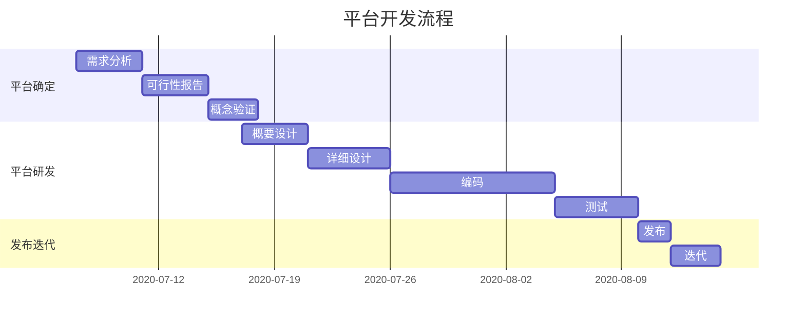
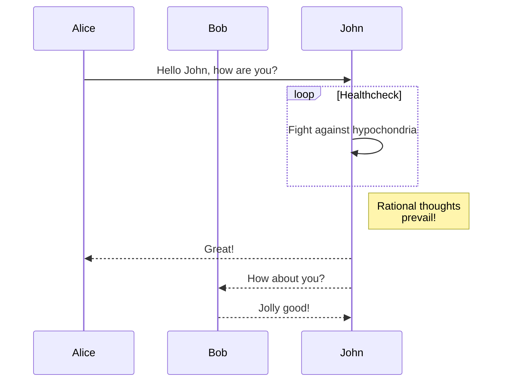
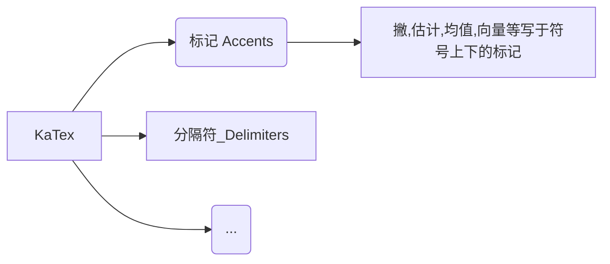

# 1. 图表


[[toc]]

## 1.1  mermaid


### 1.1.1 甘特图(进度)





### 1.1.2 序列图(系统结构图)


-->




### 1.1.3 思维导图




## 1.2  markmap

visual studio 中 下载这个插件，然后可以新建 xx.mm.md 写入后，后面就可以进行操作了


```
# redux

## react插件
### react toolkit 多了一层的封装
### redux react 连接
### redux devtools 是 浏览器 的插件


## 设计思路
### store(对象)  初始化可以传入reducer,第二个参数可以传入react thunk <br>这里的thunk 类似于判断是不是函数，是函数那么异步，不是函数那么传值给dispatch<br>实例化后可以传入(异步函数或者类似{data:"",type:""})<br>其实这里的的传入值也可以叫做action
#### middleware(dispatch,getstore)<br>这里在createstore进行配置:异步函数之后dispatch
#### reducer 一个 state + action的函数
##### state 最小状态 定义后不要动
##### action 通过action对state进行操作


## 用户视角
#### dispatch 触发 action
#### middleware 触发异步操作(这一步)
#### action更改 store 接着运行reducer生产者(state+store)
            
                
## 实操
### 第一步 createstore传入装有state和 action的函数
### 第二步 用第一步里面的返回值dispatch 参数,<br>然后action里面就可以进行判断这玩意可以绑定在事件里面
### 第三步 接下来就是监听数据用第一步的返回值.<br>subscribe一下store的值改变就会触同步 state 和 innerHTML
    
        
        
```


