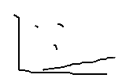
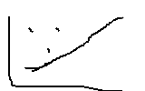

## 命令行交互


```python
# 可以像 python xx.py add xx 调用，但是速度会非常满


import sys
import pyautogui
# python index.py 2  # 能输出后面的值
type = sys.argv[1]
pyautogui.PAUSE = 0.00
# print(sys.argv)
if type == "MouseMove":
    mousex =float( sys.argv[2])
    mousey = float(sys.argv[3])
    pyautogui.moveTo(x=mousex, y=mousey, duration=0.2)
if type == "MouseClick":
    mousex =float( sys.argv[2])
    mousey = float(sys.argv[3])
    pyautogui.click(button='left')
 
 


```


## 简单的flask

```python
from flask import Flask,request,jsonify
import pyautogui

app = Flask(__name__)
# 解决接口返回内容是中文时，乱码的问题
app.config['JSON_AS_ASCII'] = False


# 请求地址映射
@app.route('/index', methods=['GET'])
def test_post():
    # 定义响应结果
    result = {}
    result['code'] = 200
    type = request.args.get('type','')
    mouseX = request.args.get('mouseX','')
    mouseY = request.args.get('mouseY','')
    if type == "MouseClick":
        pyautogui.click(button="left")
    if type == "MouseMove":
        # pyautogui.moveTo(x=int(float(mouseX)), y=int(float(mouseY)), duration=0.1)
        pyautogui.moveTo(x=int(mouseX), y=int(mouseY), duration=0.1)
    if type == "MouseScoll":
        pyautogui.scroll(int(float(mouseY)))
    result['message'] = "成功"
   
    return jsonify(result)


if __name__ == '__main__':
    app.run(debug=True, port=8899)
 # get 方式
    # name = request.args.get('name','')
    # post 方式
    # name = request.form.get('name','')
    # json 方式
    # data = request.get_data(as_text=True)
    # print(data)
    # jsonObj = json.loads(data)
```


## 神经网络


### 梯度下降

```js
假如有一个直线。有三个点。我们求出三个点到直线的值，最小的地方我们确定是这一条直线的方程也就是

kx+b = y 

0.学习率：一般来说一开始的学习率高一点，后来要低一点

1.步长：我们要不停的移动b值，这里的b值得移动范围我们可以叫做步长

2.偏导 | 也叫梯度：我们的目标是通过不断调整权重和偏置，让网络的输出值能够接近真实值，从而使损失函数最小化。也就是说。我们希望梯度的方向是指向损失函数减少的方向。

假设我们有一个神经元的输出值为 a
a，输入值为 z以及一个损失函数l，则偏导可以表示为l /a 或者 l/z。我们可以用 `所有`的 点 / 总个数 得到当前的偏导


3.随机梯度下降：就是从样本中随机选取几个.解决内存过大的问题

4.动量随机下降：为了解决神经网络模型中的"山顶"和"山谷",我们可以保留前一部分梯度的一部分动量，使得最终函数能够到达"山谷"

5.adam 算法 可以结合动量 和 学习率 递减
```



之后是这样。那么我们可以得到放的




### 反向传播

```js
作用：计算神经网络权重和偏置的梯度，并进行参数更新的过程。

kx+b=y
神经网络训练算法。对损失函数进行反向求出参数的梯度从而更新网络权重和偏执

具体来说，反向传播可以分为以下几个步骤：

1.计算输出层的误差（输出值与目标值之差）。这里的损失函数由我们自己定义。例如 L = 0.5(Math.pow((y-真实y),2))  这里的 L 就是误差

求出y 对于 截距b 和 k的 梯度值 也就是偏导数。沿着梯度的反方向。

我们可以计算 l 对 y的偏导
这样 l 对 k 的偏导 = l对 y的偏导 * y对w的偏导


求出来后我们就可以 
用 
k-(学习率*k的偏导得到k)
用
b-(学习率*b的偏导得到b)

2.计算输出层的权重梯度(k)和偏置梯度(b)。
3.计算隐藏层的误差（输出权重与输出层的误差之积）。
4.计算隐藏层的权重梯度和偏置梯度。
5.重复步骤 1-4，更新每层神经元的权重和偏置梯度。


```


### 正向传播

```js
就是由xxx变化得到 
kx1+b = y
变化后得到
kx2+b = y
这就是 处理输入数据的过程


```


### 激活函数

```js
解决非线性函数

也就是 (kx+b)*激活函数

```


### js实现

```js
/**
 * @fn 原生js实现神经网络-
 * @source 原理是前向传播 预测 + 反向传播更新 斜率 ， 截距 和 权重。最后用sigmoid进行最终值得输出
 * 输出值是0-1,需要对数据进行预处理
 * @train 注意训练的时候是 [[]] 二维数组的形式
 */
class NeuralNetwork {
  // 定义学习率和最大训练量
  /**
   * 
   * @param {*} inputNodes 如果你的输入是 [0,0] 就是 2
   * @param {*} hiddenNodes 随便写
   * @param {*} outputNodes 如果你的输出是 [0] 就是1
   */
  constructor(inputNodes, hiddenNodes, outputNodes) {
    this.inputNodes = inputNodes;
    this.hiddenNodes = hiddenNodes;
    this.outputNodes = outputNodes;

    // 初始化权重矩阵和偏置向量
    this.weightsInputHidden = Array.from({ length: this.inputNodes }, () =>
      Array.from({ length: this.hiddenNodes }, () => Math.random() - 0.5)
    );
    this.biasInputHidden = Array.from(
      { length: this.hiddenNodes },
      () => Math.random() - 0.5
    );

    console.log(
      Array.from({ length: 3 }, () => {
        return Math.random() - 0.5;
      })
    );

    this.weightsHiddenOutput = Array.from({ length: this.hiddenNodes }, () =>
      Array.from({ length: this.outputNodes }, () => Math.random() - 0.5)
    );
    this.biasHiddenOutput = Array.from(
      { length: this.outputNodes },
      () => Math.random() - 0.5
    );
    this.weightGradientsInputHidden = Array.from(
      { length: this.inputNodes },
      () => Array.from({ length: this.hiddenNodes }, () => 0)
    );
    this.biasGradientsInputHidden = Array.from(
      { length: this.hiddenNodes },
      () => 0
    );
    this.weightGradientsHiddenOutput = Array.from(
      { length: this.hiddenNodes },
      () => Array.from({ length: this.outputNodes }, () => 0)
    );
    this.biasGradientsHiddenOutput = Array.from(
      { length: this.outputNodes },
      () => 0
    );

    this.learningRate = 1;
    this.maxEpochs = 200;
  }

  // 定义激活函数 sigmoid()与它的导数
  sigmoid(x) {
    // return x
    return 1 / (1 + Math.exp(-x));
  }
  sigmoidDerivative(x) {
    const sigmoidX = this.sigmoid(x);
    return sigmoidX * (1 - sigmoidX);
  }

  // 定义前向传播函数 feedForward()
  feedForward(input) {
    const hidden = new Array(this.hiddenNodes);
    const output = new Array(this.outputNodes);

    // 计算隐藏层神经元的输出值
    for (let j = 0; j < this.hiddenNodes; j++) {
      let sum = 0;
      for (let i = 0; i < this.inputNodes; i++) {
        sum += input[i] * this.weightsInputHidden[i][j];
      }
      hidden[j] = this.sigmoid(sum + this.biasInputHidden[j]);
    }

    // 计算输出层神经元的输出值
    for (let k = 0; k < this.outputNodes; k++) {
      let sum = 0;
      for (let j = 0; j < this.hiddenNodes; j++) {
        sum += hidden[j] * this.weightsHiddenOutput[j][k];
      }
      output[k] = this.sigmoid(sum + this.biasHiddenOutput[k]);
    }

    return [output, hidden];
  }

  // 定义反向传播函数 backpropagation() 偏置项调整激活函数
  backpropagation(input, target,index) {
    // 计算前向传播的输出
    const [output, hidden] = this.feedForward(input); // 调用 feedForward 方法计算前向传播
    // console.log(`epoch${index}: ${target}-${output}`)
    const outputDeltas = new Array(this.outputNodes); // 存储输出层神经元梯度的数组
    for (let j = 0; j < this.outputNodes; j++) {
      // 计算输出层神经元的梯度
      outputDeltas[j] =
        (target[j] - output[j]) * this.sigmoidDerivative(output[j]); // 应用 sigmoid 函数的导数规则计算梯度
    }

    const hiddenDeltas = new Array(this.hiddenNodes); // 存储隐藏层神经元梯度的数组
    for (let j = 0; j < this.hiddenNodes; j++) {
      // 计算隐藏层神经元的梯度
      let sum = 0;
      for (let k = 0; k < this.outputNodes; k++) {
        sum += outputDeltas[k] * this.weightsHiddenOutput[j][k]; // 将输出层神经元梯度传播到隐藏层
      }
      hiddenDeltas[j] = sum * this.sigmoidDerivative(hidden[j]); // 应用 sigmoid 函数的导数规则计算梯度
    }

    // 更新权重矩阵的梯度
    for (let j = 0; j < this.hiddenNodes; j++) {
      for (let k = 0; k < this.outputNodes; k++) {
        // 更新隐藏层到输出层的权重梯度
        const weightGradient = outputDeltas[k] * hidden[j];
        this.weightGradientsHiddenOutput[j][k] += weightGradient;
      }
    }
    for (let i = 0; i < this.inputNodes; i++) {
      for (let j = 0; j < this.hiddenNodes; j++) {
        // 更新输入层到隐藏层的权重梯度
        const weightGradient = hiddenDeltas[j] * input[i];
        this.weightGradientsInputHidden[i][j] += weightGradient;
      }
    }

    // 更新偏差项的梯度
    for (let k = 0; k < this.outputNodes; k++) {
      this.biasGradientsHiddenOutput[k] += outputDeltas[k];
    }
    for (let j = 0; j < this.hiddenNodes; j++) {
      this.biasGradientsInputHidden[j] += hiddenDeltas[j];
    }

    // 根据权重矩阵的梯度和学习率更新权重值和偏置项值
    for (let j = 0; j < this.hiddenNodes; j++) {
      for (let k = 0; k < this.outputNodes; k++) {
        // 更新隐藏层到输出层的权重值
        const weightGradient = this.weightGradientsHiddenOutput[j][k];
        this.weightsHiddenOutput[j][k] += weightGradient * this.learningRate; // 根据学习率更新权重值
        this.weightGradientsHiddenOutput[j][k] = 0; // 将权重梯度置零
      }
    }
    for (let i = 0; i < this.inputNodes; i++) {
      for (let j = 0; j < this.hiddenNodes; j++) {
        // 更新输入层到隐藏层的权重值
        const weightGradient = this.weightGradientsInputHidden[i][j];
        this.weightsInputHidden[i][j] += weightGradient * this.learningRate; // 根据学习率更新权重值
        this.weightGradientsInputHidden[i][j] = 0; // 将权重梯度置零
      }
    }
    for (let k = 0; k < this.outputNodes; k++) {
      // 更新隐藏层到输出层的偏置项值 
      const biasGradient = this.biasGradientsHiddenOutput[k];
      this.biasHiddenOutput[k] += biasGradient * this.learningRate; // 根据学习率更新偏置项值
      this.biasGradientsHiddenOutput[k] = 0; // 将偏置项梯度置0
    }
    for (let j = 0; j < this.hiddenNodes; j++) {
      // 更新输入层到隐藏层的偏置项值
      const biasGradient = this.biasGradientsInputHidden[j];
      this.biasInputHidden[j] += biasGradient * this.learningRate; // 根据学习率更新偏置项值
      this.biasGradientsInputHidden[j] = 0; // 将偏置项梯度置零
    }
  }

  // 定义训练函数 train()
  train(inputs, targets) {
    for (let epoch = 0; epoch < this.maxEpochs; epoch++) {
      for (let i = 0; i < inputs.length; i++) {
        this.backpropagation(inputs[i], targets[i],i);
      }
    }
  }
}

// 创建神经网络模型并进行训练,注意输入的时候要对数据进行预处理(模型里面还没有做)

const nn = new NeuralNetwork(2, 1, 1);
let inputs = [
  [0.1, 0.1],
  [1, 1],
];
// 数据预处理

for (let i = 0; i < 10000; i++) {
  inputs.push([0, 0], [1, 1]);
}
const targets = [[0], [1]];
for (let i = 0; i < 10000; i++) {
  targets.push([0], [1]);
}

nn.train(inputs, targets);

// 进行预测
const testInput1 = [1, 1];
const [predictOutput1, _] = nn.feedForward(testInput1);

// 输出预测结果
console.log(`Predicted Output1: ${predictOutput1}`);


// 进行预测

const testInput2 = [0.2, 0.2];
const [predictOutput2,] = nn.feedForward(testInput2);
console.log(`Predicted Output2: ${predictOutput2}`);

```


