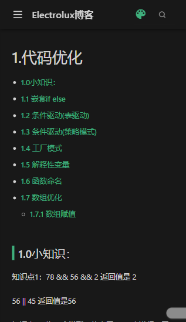
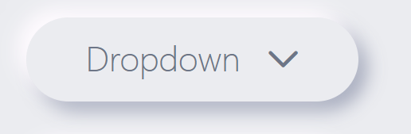
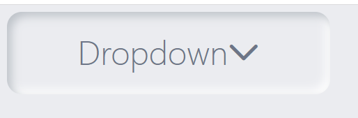

# 6.UI设计模式


## 6.素材 资源

```js
http://navnav.co/checkbox-radio   //优秀的东西。是codepen的代码片段  右下角可以share出去
```


更多的样式可以看到我的css库：https://gitee.com/Electrolux/front-css-package里面去

## 6.1 深色模式

高对比度。暗色  黑白灰 




## 6.3 3D立体风格

没有实操过，感觉不错。首页用，有一种破框关系


## 6.2 新拟态

代码：https://gitee.com/Electrolux/front-css-package/blob/master/%E6%95%88%E6%9E%9C/7.%E6%8B%9F%E6%80%81UI%E7%A4%BA%E4%BE%8B/index.html


1.扁平 2. 投影 3.新拟态

类似于一种浮雕的效果

```js
//玻璃拟态：有一种悬浮感和玻璃感
//新拟态：有高光立面和暗部立面
```

示例：



```css
基础示例
box-shadow: X轴阴影的位移（正是向右） Y轴阴影的位移（正是向下） 阴影大小   阴影颜色
代码示例
大背景我们设置 background-color: #ebecf0;

小背景我们设置
width: 371px;
height: 94px;
border-radius: 47px;
box-shadow:10px 10px 20px  #a6abbd; 我们设置这个就是外阴影  这是暗面

效果一：凸起来
width: 371px;
height: 94px;
border-radius: 17px;
box-shadow: 6px 6px 12px #bec3c9, -6px -6px 12px #fff

效果二：凸起来（渐变）
width: 371px;
height: 94px;
border-radius: 17px;
background: linear-gradient(145deg, #caced5, #f0f5fe);
box-shadow: 6px 6px 12px #bec3c9, -6px -6px 12px #fff
```


```css
效果三：凹下去
box-shadow:inset 5px 5px 10px #bec3c9,inset -5px -5px 10px #fff
```




## 6.4 极简留白


## 6.5 玻璃拟化风格

玻璃拟化是毛玻璃效果的新材质应用，在多个层级下，透过磨砂玻璃的通透，呈现出一种“虚实结合”的美感，为画面添加更多细节的层次。


