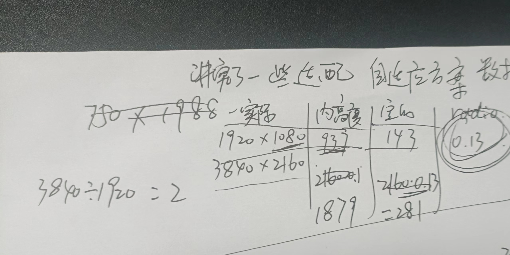
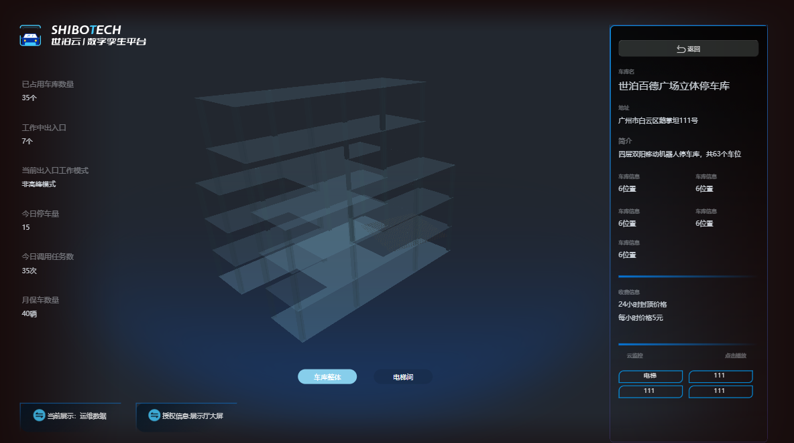
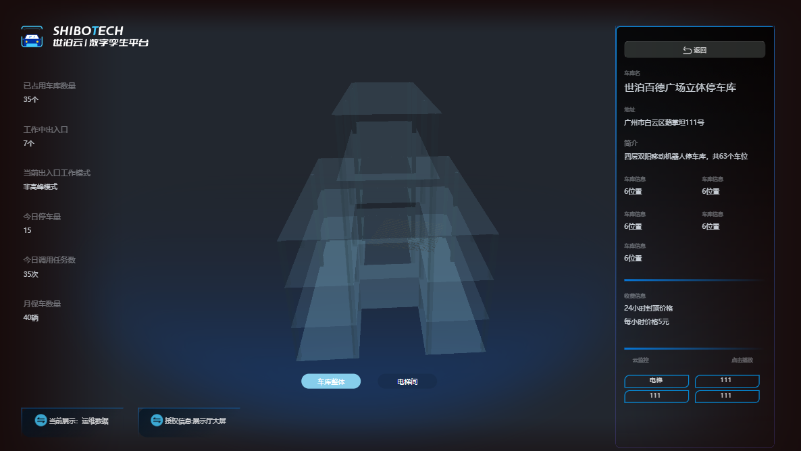
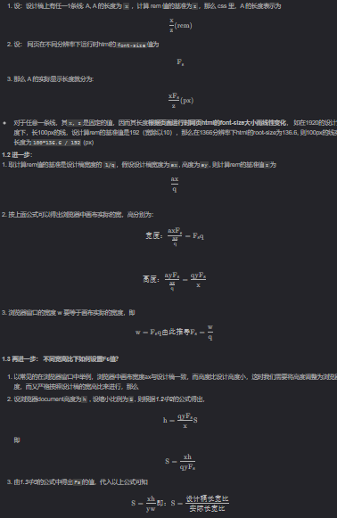
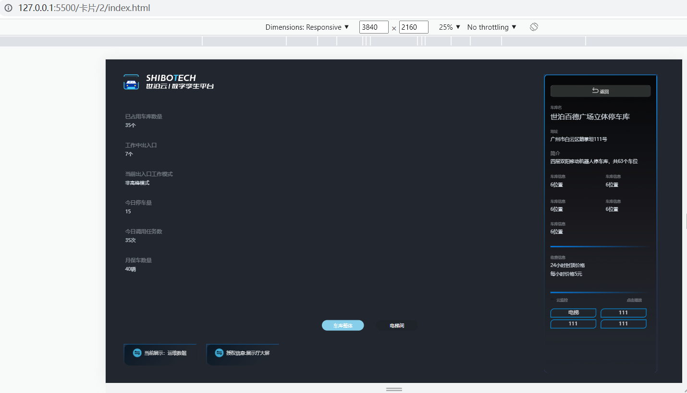

# 10.数据大屏自适应

[[toc]]

大屏等在不同尺寸下面的自适应的解决。百度大屏等，他们都采用了css3的缩放`transform: scale(X)`属性。相比较别的乱七八糟的方法。我们只要监听浏览器的窗口大小，然后控制变化的比例就好了


注意一下外层最好用float ，绝对布局会有问题

## 10.1 原生html

### 10.1.1 完全的单界面压缩

```html
<!DOCTYPE html>
<html lang="en">

<head>
    <meta charset="UTF-8">
    <meta http-equiv="X-UA-Compatible" content="IE=edge">
    <meta name="viewport" content="width=device-width, initial-scale=1.0">
    <title>Document</title>
</head>
<style>
    * {
        margin: 0;
        padding: 0;
    }

    :root {
        --scale: 1
    }

    #ScaleBox {
        /* --scale: 1; */
    }

    .ScaleBox {
        position: absolute;
        transform-origin: left top;
        display: flex;
        flex-direction: column;
        transform: scale(var(--scale)) translate(-50%, -50%);
        /* left: 50%;
        top: 50%; */
        transition: 0.3s;
        z-index: 999;
        /* 这里是设计稿的px尺寸，作业的时候要按照1920*1080来看（f12） */
        width: 1920px;
        height: 937px;
        overflow: hidden;
    }
</style>

<body>
    <div class="ScaleBox">
        <div style="width: 1920px;height:1080px;background:red">dsadasd</div>
    </div>
    <script>
      

        function adapition(rootEle) {
            let scale = "";
            //设计的尺寸
            let width = 1920;
            let height = 937;
            function getScale() {
                let wh = window.innerHeight / height;
                let ww = window.innerWidth / width;
                return {
                    widthRatio:ww,
                    heightRatio:wh,
                }
            }
            function setScale() {
                console.log("执行到这里了")
                if (window.innerHeight == 1080) {
                    document.querySelector(".ScaleBox").style.height = `1080px `;
                } else {
                    document.querySelector(".ScaleBox").style.height = `937px `;
                }
                scale = getScale();
                console.log(` transform:scale(${scale.widthRatio }, ${scale.heightRatio };transform-origin:left top )`)
                // document.body.style.setProperty("--scale", scale);
                document.querySelector(".ScaleBox").style.cssText =` transform:scale(${scale.widthRatio }, ${scale.heightRatio });transform-origin:left top;overflow: hidden;`
            }
            function debounce(fn, time) {
                window.flag = null;
                return function () {
                    clearTimeout(window.flag)
                    window.flag = setTimeout(() => {
                        fn()
                    }, time)
                }
            }
            window.addEventListener("resize", debounce(setScale, 100));
            window.addEventListener("load", setScale)
        }
        adapition()
    </script>

</body>

</html>
```


### 10.1.2 讲究了一些适配

```html
<!DOCTYPE html>
<html lang="en">

<head>
    <meta charset="UTF-8">
    <meta http-equiv="X-UA-Compatible" content="IE=edge">
    <meta name="viewport" content="width=device-width, initial-scale=1.0">
    <title>Document</title>
</head>
<style>
    * {
        margin: 0;
        padding: 0;
    }

    :root {
        --scale: 1
    }

    #ScaleBox {
        /* --scale: 1; */
    }

    .ScaleBox {
        position: absolute;
        transform-origin: left top;
        display: flex;
        flex-direction: column;
        transform: scale(var(--scale)) translate(-50%, -50%);
        left: 50%;
        top: 50%;
        transition: 0.3s;
        z-index: 999;
        /* 这里是设计稿的px尺寸，作业的时候要按照1920*1080来看（f12） */
        width: 1920px;
        height: 937px;
        overflow: hidden;
    }
</style>

<body>
    <div class="ScaleBox">
        <div style="width: 1920px;height:1080px;background:red">dsadasd</div>
    </div>
    <script>
        // // 大屏会出现上下有空位的情况，可以拉动滚动条
        function adapition(rootEle) {
            let scale = "";
            //设计的尺寸
            let width = 1920;
            let height = 937;
            // 至少有一个能贴边，这里是我认为可以调整的地方
            function getScale() {
                // let { width, height } = this;
                let wh = window.innerHeight / height;
                let ww = window.innerWidth / width;
                return ww < wh ? ww : wh;
                // return {
                //     widthRatio:ww,
                //     heightRatio:wh,
                // }
            }
            function setScale() {
                console.log("执行到这里了")
                if (window.innerHeight == 1080) {
                    document.querySelector(".ScaleBox").style.height = `1080px `;
                } else {
                    // 这里为了适应浏览器
                    document.querySelector(".ScaleBox").style.height = `937px `;
                }
                scale = getScale();
                console.log("transform:scale(" + scale.widthRatio + "," + scale.heightRatio + ")")
                document.body.style.setProperty("--scale", scale);
                // document.body.style = "transform:scale(" + scale.widthRatio + "," + scale.heightRatio + ")"
            }
            function debounce(fn, time) {
                window.flag = null;
                return function () {
                    clearTimeout(window.flag)
                    window.flag = setTimeout(() => {
                        fn()
                    }, time)
                }
            }
            window.addEventListener("resize", debounce(setScale, 100));
            window.addEventListener("load", setScale)
        }

        
        adapition()
    </script>

</body>

</html>
```


### 讲究了一些适配 4k示例（3840*2160）:比率是0.13




```html
<!DOCTYPE html>
<html lang="en">

<head>
    <meta charset="UTF-8">
    <meta http-equiv="X-UA-Compatible" content="IE=edge">
    <meta name="viewport" content="width=device-width, initial-scale=1.0">
    <title>Document</title>
</head>
<style>
    * {
        margin: 0;
        padding: 0;
    }

    :root {
        --scale: 1
    }

    #ScaleBox {
        /* --scale: 1; */
    }

    .ScaleBox {
        position: absolute;
        transform-origin: left top;
        display: flex;
        flex-direction: column;
        transform: scale(var(--scale)) translate(-50%, -50%);
        left: 50%;
        top: 50%;
        transition: 0.3s;
        z-index: 999;
        /* 这里是设计稿的px尺寸，作业的时候要按照1920*1080来看（f12） */
        width: 3840px;
        height: 1879px;
        overflow: hidden;
    }
</style>

<body>
    <div class="ScaleBox">
        <div style="width: 3840px;height:2160px;background:red;font-size: 100px;">dsadasd</div>
    </div>
    <script>
        // // 大屏会出现上下有空位的情况，可以拉动滚动条
        function adapition(rootEle) {
            let scale = "";
            //设计的尺寸 -2160*0.13
            let DesignWidth = 3840;
            let DesignHeight = 2160;
            let browerWidth = DesignWidth;
            let browerHeight = DesignHeight-DesignHeight*0.13;
            // 至少有一个能贴边，这里是我认为可以调整的地方
            // 小于号换成 大于号 就是尽可能大不变形
            function getScale() {
                let wh = window.innerHeight / browerHeight;
                let ww = window.innerWidth / browerWidth;
                return ww < wh ? ww : wh;
            }
            function setScale() {
                console.log("执行到这里了")
                if (window.innerHeight == DesignHeight) {
                    // 设计稿
                    document.querySelector(".ScaleBox").style.height = `${DesignHeight}px `;
                } else {
                    // 浏览器中的尺寸
                    document.querySelector(".ScaleBox").style.height = `${browerHeight}px `;
                }
                scale = getScale();
                document.body.style.setProperty("--scale", scale);

            }
            function debounce(fn, time) {
                window.flag = null;
                return function () {
                    clearTimeout(window.flag)
                    window.flag = setTimeout(() => {
                        fn()
                    }, time)
                }
            }
            window.addEventListener("resize", debounce(setScale, 100));
            window.addEventListener("load", setScale)
        }

        
        adapition()
    </script>

</body>

</html>
```


## 10.2 vue 代码


```vue
<template>
  <div
    class="ScaleBox"
    ref="ScaleBox"
    :style="{
      width: width + 'px',
      height: height + 'px',
    }"
  >
    <slot></slot>
  </div>
</template>
<script>
export default {
  name: "ScaleBox",
  props: {
   
  },
  data() {
    return {
      scale: "",
      width:1920,
      height:937
    };
  },
  mounted() {
    this.setScale();
    window.addEventListener("resize", this.debounce(this.setScale, 100));
  },
  methods: {
    getScale() {
      let { width, height } = this;
      let wh = window.innerHeight / height;
      let ww = window.innerWidth / width;
      console.log(ww < wh ? ww : wh);
      return ww < wh ? ww : wh;
    },
    setScale() {
      if(window.innerHeight ==1080){
        this.height = 1080
      }else{
        this.height = 937

      }
      this.scale = this.getScale();
      if (this.$refs.ScaleBox) {
        this.$refs.ScaleBox.style.setProperty("--scale", this.scale);
      }
    },
    debounce(fn, delay) {
      let delays = delay || 500;
      let timer;
      return function () {
        let th = this;
        let args = arguments;
        if (timer) {
          clearTimeout(timer);
        }
        timer = setTimeout(function () {
          timer = null;
          fn.apply(th, args);
        }, delays);
      };
    },
  },
};
</script>

<style lang="scss">
#ScaleBox {
  --scale: 1;
}
.ScaleBox {
  position: absolute;
  transform: scale(var(--scale)) translate(-50%, -50%);
  display: flex;
  flex-direction: column;
  transform-origin: 0 0;
  left: 50%;
  top: 50%;
  transition: 0.3s;
  z-index: 999;
}
</style>


```


然后直接引用就行了

```js
import ScaleBox from '@/components/ScaleBox.vue'
<ScaleBox >内容</ScaleBox >
```


## 10.3 针对特殊情况


针对于我们的threejs的东西，我们需要一些特殊情况来应对。

现在我们的设计稿是3840*2160.

针对于这种情况我们先修改 vue文件

```vue

<template>
  <!-- 假如设计稿尺寸和 -->
  <div
    class="ScaleBox"
    ref="ScaleBox"
    :style="{
      width: width + 'px',
      height: height + 'px',
    }"
  >
    <slot></slot>
  </div>
</template>
<script>
export default {
  name: "ScaleBox",
  props: {},
  data() {
    return {
      scale: "",
      //重要：原来是1920和937，这里我们按照设计图的尺寸进行修改
      width: 3840,
      height: 2160,
    };
  },
  mounted() {
    this.setScale();
    window.addEventListener("resize", this.debounce(this.setScale, 100));
  },
  methods: {
    getScale() {
      let { width, height } = this;
      let wh = window.innerHeight / height;
      let ww = window.innerWidth / width;
      console.log(ww < wh ? ww : wh);
      return ww < wh ? ww : wh;
    },
    setScale() {
      //重要：这里也是我们设计图的高度
      if (window.innerHeight == 2160) {
        this.height = 2160;
      } else {
        //重要：这里看着调整就好了，就是显示在你浏览器的东西
        // this.height = 1870;
        this.height = 1780;
      }
      this.scale = this.getScale();
      if (this.$refs.ScaleBox) {
        this.$refs.ScaleBox.style.setProperty("--scale", this.scale);
      }
    },
    debounce(fn, delay) {
      let delays = delay || 500;
      let timer;
      return function () {
        let th = this;
        let args = arguments;
        if (timer) {
          clearTimeout(timer);
        }
        timer = setTimeout(function () {
          timer = null;
          fn.apply(th, args);
        }, delays);
      };
    },
  },
};
</script>

<style lang="scss">
#ScaleBox {
  --scale: 1;
}
.ScaleBox {
  position: absolute;
  transform: scale(var(--scale)) translate(-50%, -50%);
  display: flex;
  flex-direction: column;
  transform-origin: 0 0;
  left: 50%;
  top: 50%;
  transition: 0.3s;
  z-index: 999;
}
</style>


```


然后又有一个需求是要three.js canvas的背景.关键就是设置渲染器render

```
vue 里 
new THREE.WebGLRenderer({ alpha: true });
然后我们设置渲染器的
this.renderer.setSize(3840, 2160);
```

```vue
<template>
  <ScaleBox>
    <!-- <div class="navbar">
   
  </div> -->

    <div id="info"></div>
  </ScaleBox>
</template>

<script>
import * as THREE from "three";
import { OrbitControls } from "three/examples/jsm/controls/OrbitControls.js";

import { FBXLoader } from "three/examples/jsm/loaders/FBXLoader";
import ScaleBox from "@/components/ScaleBox.vue";
export default {
  name: "data_",
  components: {
    ScaleBox,
  },
  data() {
    return {
      camera: null,
      scene: null,
      renderer: null,
    };
  },
  mounted() {
    this.init();
    this.animate();
  },
  methods: {
    init() {
      const container = document.createElement("div");
      document.querySelector("#info").appendChild(container);

      this.camera = new THREE.PerspectiveCamera(60, 3840 / 2160, 1, 20000);
      this.camera.position.set(-40, 80, 150);
      this.camera.lookAt(100, 0, 0);
      this.scene = new THREE.Scene();

      const hemiLight = new THREE.HemisphereLight(0xffffff, 0x444444);
      hemiLight.position.set(0, 1000, 0);
      this.scene.add(hemiLight);

      const dirLight = new THREE.DirectionalLight(0xffffff);
      dirLight.position.set(0, 1000, 0);
      this.scene.add(dirLight);

      // grid
      const gridHelper = new THREE.GridHelper(28, 28, 0x303030, 0x303030);
      this.scene.add(gridHelper);

      const loader = new FBXLoader();
      loader.load("/model/车库框架3.fbx", (object) => {
        // 模型缩放
        object.position.set(-10, 20, 0);
        object.scale.set(0.15, 0.15, 0.15);
        this.scene.add(object);

        // object.position.x=object.position.x+100
        // this.camera.lookAt(object.position);
        object.rotateY(60);
        // clickObjects = object
        console.log(object);
        this.renderer = new THREE.WebGLRenderer({ alpha: true });
        this.renderer.setPixelRatio(window.devicePixelRatio);
        // this.renderer.setSize(window.innerWidth, window.innerHeight);
        this.renderer.setSize(3840, 2160);
        container.appendChild(this.renderer.domElement);

        const controls = new OrbitControls(this.camera, this.renderer.domElement);
        // controls.target.set(120, 120, 0);
        controls.update();
      });
    },
    animate() {
      requestAnimationFrame(this.animate);
      try {
        this.renderer.render(this.scene, this.camera);
      } catch (e) {
        console.log;
      }
    },
  },
};
</script>

<style scoped>
* {
  text-decoration: no;
}
</style>

<style scoped></style>

<style>
#info {
  background-image: url("@/assets/bigdata/img/bigdata_backgroud.png");
  /* background-position:(100px,50%) */
  /* background-size:40% 60%; */
  height: 2160px;
  width: 3840px;
  overflow: hidden;
}
</style>

```


## 10.4 简单记录一下难点


先讲一下背景。我目前大四应届，在一家不知名机器人公司做前端实习生。然后为了2022.11月中国深圳数字交通大会和今后的运维工作。leader，产品老早就在筹划做一个全新的数据大屏。最近收到消息因为疫情的原因这个展会推后了。。。。本来火急火燎的任务就一下子可以慢慢做了，哈哈哈，摸鱼人狂喜。讲一下我们这个项目的人员配置。前端一个，后端一个，ui设计一个，3d建模人员一个。

先上一下这个项目的某一个界面的复现图。





然后简单说一下做这个项目的重难点吧

### 重难点1：首先是three这个库

首先很多操作是异步的。比如加载obj或者是fbx模型的时候。因此这里我们需要封装一些同步的方法。

同样用加载模型来做示例

```js
initModel(url) {
      return new Promise((resolve) => {
        new FBXLoader().load(url, (object) => {
          resolve(object);
        });
      });
},
```


然后是关于背景，这里我曾跟leader提出过用天空盒子。leader跟我说用天空盒子会丑到天际的。那么我们就需要一张炫酷的图片。图片那里ui已经给我提供好了，那么难点就是怎么把图片插入3d图层的背景中。其实就两行代码

```js
//设置透明化
this.renderer = new THREE.WebGLRenderer({ alpha: true });
//然后css 直接插入图片就可以了,类似于下面
document.body.style.cssText = `background-image: url("@/assets/bigdata/img/background.png") !important;`;
```


接下来如果我们要使得3d模型可以滚动查看，拉动远近视角的话的话我们就需要threejs的OrbitControls，一些代码如下

```js
const controls = new OrbitControls(this.camera, this.renderer.domElement);
// controls.target.set(120, 120, 0);
controls.update();
```


### 重难点2：自适应问题

设计稿给我们的是3840*2160，那么这个时候如何做屏幕在自适应是一个问题，要在1920x1080或者8k的屏幕不会太走样。这是第二个问题。咱们知道已知的大屏自适应方案主要有两种。第一种是rem，第二种是scale。

前者计算公式如下



个人感觉这方法实在麻烦。并且还有一个最大的缺陷。就是rem的方案对于1920及以上分辨率没有什么问题，但当切换到1266*668等小分辨率时，由于浏览器默认最小font-size为12px，所以会导致文字比理想效果更多大， 而如果我们要用echart这个库，由于这个库的文字是用px写死的，所以放大缩小的时候都会有问题

好了，这就是我为什么用scale来进行屏幕适配的一个原因，然后在用到这玩意的时候又有问题。一开始我是想用vue的slot并且封装一个组件来做这个的。通过slot组件的机制能够实现一个比较优雅的封装，但是我们这里用到的是threejs这玩意，你的3d画面是要渲染到你界面的一个canvas元素中。渲染调用的是three中的render，但是在实操的时候无论你的画布大小如何设置。例如下面

```js
this.renderer.setSize(3840, 2160);
```

他都会在刷新后将你的canvas画布变成你的1.5倍。但是你的界面缩放又放大后他又会变回到原来的尺寸，着实头疼（具体原因不详，我个人猜测是slot重绘回流的时候顺序有点问题？）

后来为了解决这个问题，我就决定不用组件了。用原生html搭建出一个demo，最后再把3d界面放上去。下图的示例代码在这个链接：https://gitee.com/Electrolux/front-css-package/blob/master/%E5%8D%A1%E7%89%87/2/index.html



事实证明这是可行的，最后放一个自适应的demo代码示例上来：

https://gitee.com/Electrolux/front-css-package/tree/master/%E5%B8%83%E5%B1%80/%E6%97%A0%E6%95%8C%E8%87%AA%E9%80%82%E5%BA%94

好了这大概就是我做这个3d数据大屏某一个界面的一些思路。


