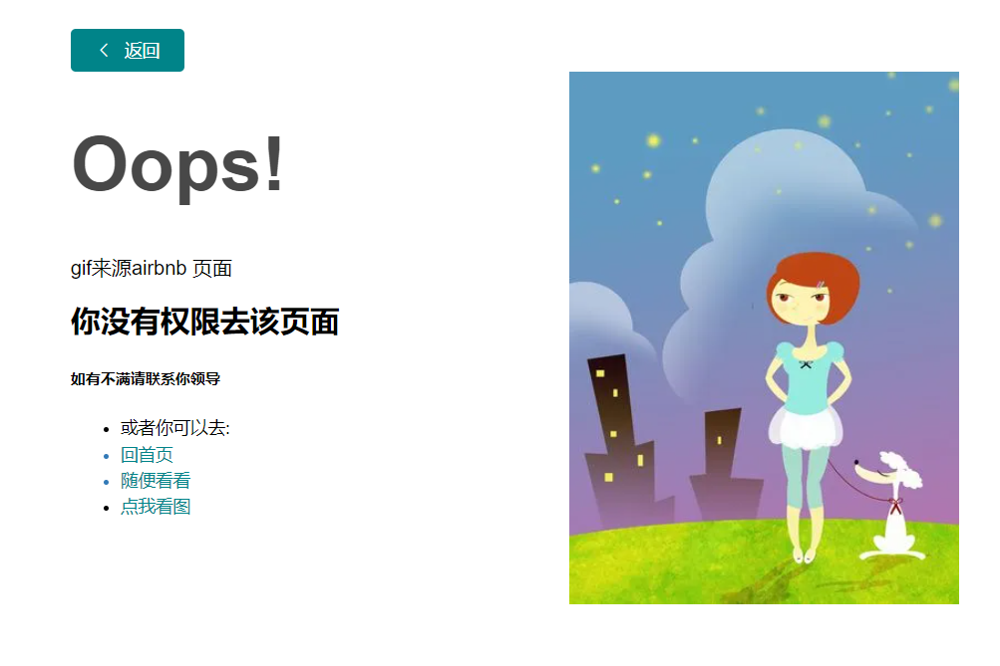
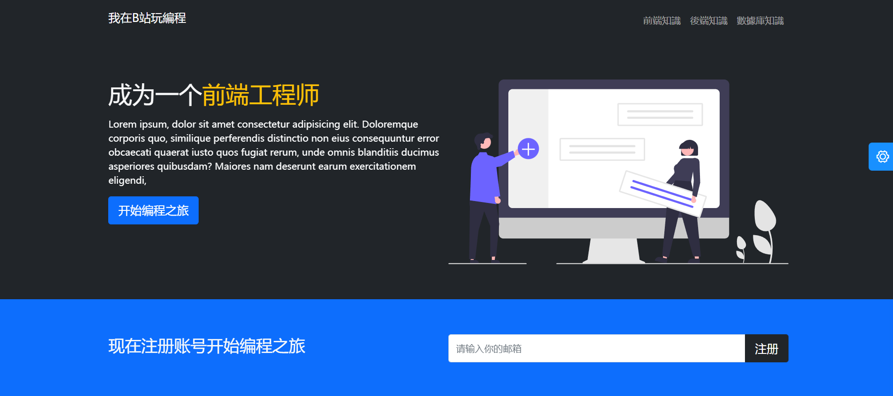
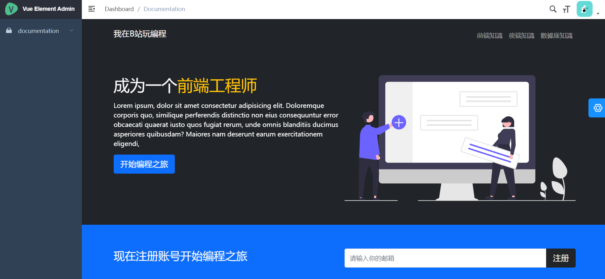
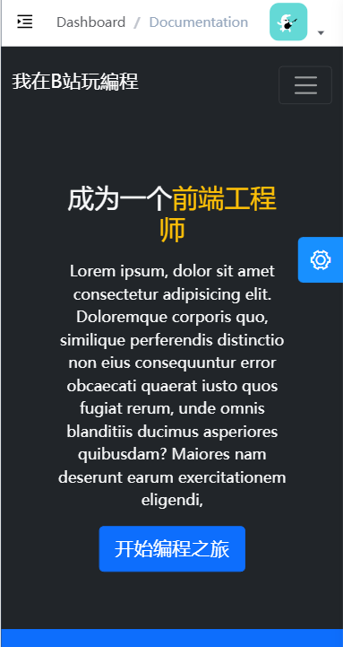

#  5.vue-element-admin

[[toc]]

```
一些知识：
@vue/cli 5.0.4
用ngrok的时设置在webpack.config.js设置
disableHostCheck: true,我们就可以进行正常的访问
正向代理是一个位于客户端和目标服务器之间的代理服务器（中间服务器）-cs中间有一个proxy-目标向服务器发送

反向代理是代理服务器-目标向代理服务器发送（10086）

正向代理主要是用来解决访问限制问题；反向代理则是提供负载均衡、安全防护等作用


```


## 5.1 icon的封装（iconfont）


### 1：首先我们先npm install svg-sprite-loader

 [svg-sprite-loader](https://link.juejin.cn/?target=https%3A%2F%2Fgithub.com%2Fkisenka%2Fsvg-sprite-loader) 这个神器， 它是一个 webpack loader ，可以将多个 svg 打包成 `svg-sprite`(雪碧图)

```
vue-cli`默认情况下会使用 `url-loader` 对svg进行处理，会将它放在`/img` 目录下，所以这时候我们引入`svg-sprite-loader要在vue.config.js中进行配置


解决方案有两种，最简单的就是你可以将 test 的 svg 去掉，这样就不会对svg做处理了，当然这样做是很不友善的。

你不能保证你所有的 svg 都是用来当做 icon的，有些真的可能只是用来当做图片资源的。
不能确保你使用的一些第三方类库会使用到 svg


所以最安全合理的做法是使用 webpack 的 exclude 和 include ，让svg-sprite-loader只处理你指定文件夹下面的 svg，url-loaer只处理除此文件夹之外的所以 svg，这样就完美解决了之前冲突的问题。 代码如下


```

```js

const path = require('path')
function resolve(dir) {
  return path.join(__dirname, dir)
}
module.exports = {
  
  devServer: {
    proxy: {
      "/api": {
        target: "http://localhost:3000",
        pathRewrite: { "^/api": "/" },
        changeOrigin: true,
      },
    },
  },
  chainWebpack(config) {
    //原有的svg图像处理loader添加exclude
    config.module
      .rule('svg')
      .exclude.add(resolve('src/icons'))
      .end()
      //然后为原来处理svg的file-loader添加exclude
    config.module
      .rule('icons')
      .test(/\.svg$/)
      .include.add(resolve('src/icons'))
      .end()
      .use('svg-sprite-loader')
      .loader('svg-sprite-loader')
      .options({
        symbolId: 'icon-[name]'
      })
      .end()

  }
};

```


### 2：@/component下面新建SvgIcon文件夹里面我们写入index.vue


### 3：@/utils/validate.js中写入

```js


/**
 * @param {string} path
 * @returns {Boolean}
 */
export function isExternal(path) {
  // console.log(/^(https?:|mailto:|tel:)/.test(path),"isternal")
  return /^(https?:|mailto:|tel:)/.test(path)
}

/**
 * @param {string} str
 * @returns {Boolean}
 */
export function validUsername(str) {
  const valid_map = ['admin', 'editor']
  return valid_map.indexOf(str.trim()) >= 0
}

/**
 * @param {string} url
 * @returns {Boolean}
 */

export function validURL(url) {
  // eslint-disable-next-line
  const reg = /^(https?|ftp):\/\/([a-zA-Z0-9.-]+(:[a-zA-Z0-9.&%$-]+)*@)*((25[0-5]|2[0-4][0-9]|1[0-9]{2}|[1-9][0-9]?)(\.(25[0-5]|2[0-4][0-9]|1[0-9]{2}|[1-9]?[0-9])){3}|([a-zA-Z0-9-]+\.)*[a-zA-Z0-9-]+\.(com|edu|gov|int|mil|net|org|biz|arpa|info|name|pro|aero|coop|museum|[a-zA-Z]{2}))(:[0-9]+)*(\/($|[a-zA-Z0-9.,?'\\+&%$#=~_-]+))*$/
  return reg.test(url)
}

/**
 * @param {string} str
 * @returns {Boolean}
 */
export function validLowerCase(str) {
  const reg = /^[a-z]+$/
  return reg.test(str)
}

/**
 * @param {string} str
 * @returns {Boolean}
 */
export function validUpperCase(str) {
  const reg = /^[A-Z]+$/
  return reg.test(str)
}

/**
 * @param {string} str
 * @returns {Boolean}
 */
export function validAlphabets(str) {
  const reg = /^[A-Za-z]+$/
  return reg.test(str)
}

/**
 * @param {string} email
 * @returns {Boolean}
 */
export function validEmail(email) {
  console.log(email)
  // const reg = /^(([^<>()\[\]\\.,;:\s@"]+(\.[^<>()\[\]\\.,;:\s@"]+)*)|(".+"))@((\[[0-9]{1,3}\.[0-9]{1,3}\.[0-9]{1,3}\.[0-9]{1,3}\])|(([a-zA-Z\-0-9]+\.)+[a-zA-Z]{2,}))$/
  // return reg.test(email)
}

/**
 * @param {string} str
 * @returns {Boolean}
 */
export function isString(str) {
  if (typeof str === 'string' || str instanceof String) {
    return true
  }
  return false
}

/**
 * @param {Array} arg
 * @returns {Boolean}
 */
export function isArray(arg) {
  if (typeof Array.isArray === 'undefined') {
    return Object.prototype.toString.call(arg) === '[object Array]'
  }
  return Array.isArray(arg)
}

```


### 4：@/下面新建icons文件夹

icons文件夹下面写一个index.js

```js
import Vue from 'vue'
import SvgIcon from '@/components/SvgIcon'// svg component

// register globally
Vue.component('svg-icon', SvgIcon)

//require.context 第一个参数是文件夹，第二个参数是是否遍历子文件夹，第三个参数是正则表达式。req是一个webpack方法，只有下面通过map可以得到module并且自动装载。我记得当时vuex封装是用了require.context+reduce进行替换并且挂载，这里不用挂载的原因是因为我们在vue.config.js中进行了处理
const req = require.context('./svg', false, /\.svg$/)
//这里是es6的语法
const requireAll = requireContext => requireContext.keys().map(requireContext)
requireAll(req)

关于调用和自定义icon代码：
新建一个svg文件夹，里面我们新建文件形式类似于404.svg，bug.svg的形式
里面我们写入iconfont.cn 里面复制过来的代码。类似于
```


```
requireAll
```


### 5：main.js中进行引用

```
import './icons'     // icon
```


### 6：调用起来


```style
<svg-icon icon-class="shopping" class-name="card-panel-icon"  style="color:red"/>
```


## 5.2.自动下载pdf功能

step1：渲染dom界面

step2：js中window.print()


## 5.3自动修改样式功能


index中定义一个watch

vue中

```
theme() {
   toggleClass(document.body, 'custom-theme')
  }
```


utils.js中

```js

export function toggleClass(element, className) {
  if (!element || !className) {
    return
  }
  let classString = element.className
  const nameIndex = classString.indexOf(className)
  if (nameIndex === -1) {
    classString += '' + className
  } else {
    classString =
      classString.substr(0, nameIndex) +
      classString.substr(nameIndex + className.length)
  }
  e
```


```vue
<template>
  <div class="errPage-container">
    <el-button icon="el-icon-arrow-left" class="pan-back-btn" @click="back">
      返回
    </el-button>
    <el-row>
      <el-col :span="12">
        <h1 class="text-jumbo text-ginormous">Oops!</h1>
        gif来源<a href="https://zh.airbnb.com/" target="_blank">airbnb</a> 页面
        <h2>你没有权限去该页面</h2>
       
        <ul class="list-unstyled">
          <li>或者你可以去:</li>
          <li class="link-type">
            <router-link to="/dashboard"> 回首页 </router-link>
          </li>
          <li class="link-type">
            <a href="https://www.taobao.com/">随便看看</a>
          </li>
          
        </ul>
      </el-col>
      <el-col :span="12">
        
      </el-col>
    </el-row>
    <el-dialog :visible.sync="dialogVisible" title="随便看">
      
    </el-dialog>
  </div>
</template>

<script>
// import errGif from '@/assets/401_images/405.gif'

export default {
  name: "Page401",
  data() {
    return {
      errGif:"https://img5.baidu.com/it/u=804386569,664900120&fm=253&fmt=auto&app=138&f=JPEG?w=353&h=499",
      ewizardClap: "https://wpimg.wallstcn.com/007ef517-bafd-4066-aae4-6883632d9646",
      dialogVisible: false,
    };
  },
  methods: {
    back() {
      if (this.$route.query.noGoBack) {
        this.$router.push({ path: "/dashboard" });
      } else {
        this.$router.go(-1);
      }
    },
  },
};
</script>

<style lang="scss" scoped>
.errPage-container {
  width: 800px;
  max-width: 100%;
  margin: 100px auto;
  .pan-back-btn {
    background: #008489;
    color: #fff;
    border: none !important;
  }
  .pan-gif {
    margin: 0 auto;
    display: block;
  }
  .pan-img {
    display: block;
    margin: 0 auto;
    width: 100%;
  }
  .text-jumbo {
    font-size: 60px;
    font-weight: 700;
    color: #484848;
  }
  .list-unstyled {
    font-size: 14px;
    li {
      padding-bottom: 5px;
    }
    a {
      color: #008489;
      text-decoration: none;
      &:hover {
        text-decoration: underline;
      }
    }
  }
}
</style>

```


## 5.4 一些好用的utils

### 5.4.1 auth.js

```js
import Cookies from 'js-cookie'

const TokenKey = 'Admin-Token'

export function getToken() {
  return Cookies.get(TokenKey)
}

export function setToken(token) {
  return Cookies.set(TokenKey, token)
}

export function removeToken() {
  return Cookies.remove(TokenKey)
}

```

### 5.4.2  index.js

防抖，时间处理（间隔formatTime，获取时间getime），深拷贝，url处理

```js

/**
 * Parse the time to string
 * @param {(Object|string|number)} time
 * @param {string} cFormat
 * @returns {string | null}
 */
export function parseTime(time, cFormat) {
  if (arguments.length === 0 || !time) {
    return null
  }
  const format = cFormat || '{y}-{m}-{d} {h}:{i}:{s}'
  let date
  if (typeof time === 'object') {
    date = time
  } else {
    if ((typeof time === 'string')) {
      if ((/^[0-9]+$/.test(time))) {
        // support "1548221490638"
        time = parseInt(time)
      } else {
        
        time = time.replace(new RegExp(/-/gm), '/')
      }
    }

    if ((typeof time === 'number') && (time.toString().length === 10)) {
      time = time * 1000
    }
    date = new Date(time)
  }
  const formatObj = {
    y: date.getFullYear(),
    m: date.getMonth() + 1,
    d: date.getDate(),
    h: date.getHours(),
    i: date.getMinutes(),
    s: date.getSeconds(),
    a: date.getDay()
  }
  const time_str = format.replace(/{([ymdhisa])+}/g, (result, key) => {
    const value = formatObj[key]
    // Note: getDay() returns 0 on Sunday
    if (key === 'a') { return ['日', '一', '二', '三', '四', '五', '六'][value ] }
    return value.toString().padStart(2, '0')
  })
  return time_str
}

/**
 * @param {number} time
 * @param {string} option
 * @returns {string}   算时间间隔的
 */
export function formatTime(time, option) {
  if (('' + time).length === 10) {
    time = parseInt(time) * 1000
  } else {
    time = +time
  }
  const d = new Date(time)
  const now = Date.now()

  const diff = (now - d) / 1000

  if (diff < 30) {
    return '刚刚'
  } else if (diff < 3600) {
    // less 1 hour
    return Math.ceil(diff / 60) + '分钟前'
  } else if (diff < 3600 * 24) {
    return Math.ceil(diff / 3600) + '小时前'
  } else if (diff < 3600 * 24 * 2) {
    return '1天前'
  }
  if (option) {
    return parseTime(time, option)
  } else {
    return (
      d.getMonth() +
      1 +
      '月' +
      d.getDate() +
      '日' +
      d.getHours() +
      '时' +
      d.getMinutes() +
      '分'
    )
  }
}

/**
 * @param {string} url
 * @returns {Object}
 */
//得到url的get传参
export function getQueryObject(url) {
  url = url == null ? window.location.href : url
  const search = url.substring(url.lastIndexOf('?') + 1)
  const obj = {}
  const reg = /([^?&=]+)=([^?&=]*)/g
  search.replace(reg, (rs, $1, $2) => {
    const name = decodeURIComponent($1)
    let val = decodeURIComponent($2)
    val = String(val)
    obj[name] = val
    return rs
  })
  return obj
}

/**
 * @param {string} input value
 * @returns {number} output value
 */
export function byteLength(str) {
  // returns the byte length of an utf8 string
  let s = str.length
  for (var i = str.length - 1; i >= 0; i--) {
    const code = str.charCodeAt(i)
    if (code > 0x7f && code <= 0x7ff) s++
    else if (code > 0x7ff && code <= 0xffff) s += 2
    if (code >= 0xDC00 && code <= 0xDFFF) i--
  }
  return s
}

/**
 * @param {Array} actual
 * @returns {Array}
 */
export function cleanArray(actual) {
  const newArray = []
  for (let i = 0; i < actual.length; i++) {
    if (actual[i]) {
      newArray.push(actual[i])
    }
  }
  return newArray
}

/**
 * @param {Object} json
 * @returns {Array}
 */
export function param(json) {
  if (!json) return ''
  return cleanArray(
    Object.keys(json).map(key => {
      if (json[key] === undefined) return ''
      return encodeURIComponent(key) + '=' + encodeURIComponent(json[key])
    })
  ).join('&')
}

/**
 * @param {string} url
 * @returns {Object}
 */
export function param2Obj(url) {
  const search = decodeURIComponent(url.split('?')[1]).replace(/\+/g, ' ')
  if (!search) {
    return {}
  }
  const obj = {}
  const searchArr = search.split('&')
  searchArr.forEach(v => {
    const index = v.indexOf('=')
    if (index !== -1) {
      const name = v.substring(0, index)
      const val = v.substring(index + 1, v.length)
      obj[name] = val
    }
  })
  return obj
}

/**
 * @param {string} val
 * @returns {string}
 */
export function html2Text(val) {
  const div = document.createElement('div')
  div.innerHTML = val
  return div.textContent || div.innerText
}

/**
 * Merges two objects, giving the last one precedence
 * @param {Object} target
 * @param {(Object|Array)} source
 * @returns {Object}
 */
export function objectMerge(target, source) {
  if (typeof target !== 'object') {
    target = {}
  }
  if (Array.isArray(source)) {
    return source.slice()
  }
  Object.keys(source).forEach(property => {
    const sourceProperty = source[property]
    if (typeof sourceProperty === 'object') {
      target[property] = objectMerge(target[property], sourceProperty)
    } else {
      target[property] = sourceProperty
    }
  })
  return target
}

/**
 * @param {HTMLElement} element
 * @param {string} className
 */
export function toggleClass(element, className) {
  if (!element || !className) {
    return
  }
  let classString = element.className
  const nameIndex = classString.indexOf(className)
  if (nameIndex === -1) {
    classString += '' + className
  } else {
    classString =
      classString.substr(0, nameIndex) +
      classString.substr(nameIndex + className.length)
  }
  element.className = classString
}

/**
 * @param {string} type
 * @returns {Date}
 */
export function getTime(type) {
  if (type === 'start') {
    return new Date().getTime() - 3600 * 1000 * 24 * 90
  } else {
    return new Date(new Date().toDateString())
  }
}

/**
 * @param {Function} func
 * @param {number} wait
 * @param {boolean} immediate
 * @return {*}
 */
export function debounce(func, wait, immediate) {
  let timeout, args, context, timestamp, result

  const later = function() {
    // 据上一次触发时间间隔
    const last = +new Date() - timestamp

    // 上次被包装函数被调用时间间隔 last 小于设定时间间隔 wait
    if (last < wait && last > 0) {
      timeout = setTimeout(later, wait - last)
    } else {
      timeout = null
      // 如果设定为immediate===true，因为开始边界已经调用过了此处无需调用
      if (!immediate) {
        result = func.apply(context, args)
        if (!timeout) context = args = null
      }
    }
  }

  return function(...args) {
    context = this
    timestamp = +new Date()
    const callNow = immediate && !timeout
    // 如果延时不存在，重新设定延时
    if (!timeout) timeout = setTimeout(later, wait)
    if (callNow) {
      result = func.apply(context, args)
      context = args = null
    }

    return result
  }
}

/**
 * This is just a simple version of deep copy
 * Has a lot of edge cases bug
 * If you want to use a perfect deep copy, use lodash's _.cloneDeep
 * @param {Object} source
 * @returns {Object}
 */
export function deepClone(source) {
  if (!source && typeof source !== 'object') {
    throw new Error('error arguments', 'deepClone')
  }
  const targetObj = source.constructor === Array ? [] : {}
  Object.keys(source).forEach(keys => {
    if (source[keys] && typeof source[keys] === 'object') {
      targetObj[keys] = deepClone(source[keys])
    } else {
      targetObj[keys] = source[keys]
    }
  })
  return targetObj
}

/**
 * @param {Array} arr
 * @returns {Array}
 */
export function uniqueArr(arr) {
  return Array.from(new Set(arr))
}

/**
 * @returns {string}
 */
export function createUniqueString() {
  const timestamp = +new Date() + ''
  const randomNum = parseInt((1 + Math.random()) * 65536) + ''
  return (+(randomNum + timestamp)).toString(32)
}

/**
 * Check if an element has a class
 * @param {HTMLElement} elm
 * @param {string} cls
 * @returns {boolean}
 */
export function hasClass(ele, cls) {
  return !!ele.className.match(new RegExp('(\\s|^)' + cls + '(\\s|$)'))
}

/**
 * Add class to element
 * @param {HTMLElement} elm
 * @param {string} cls
 */
export function addClass(ele, cls) {
  if (!hasClass(ele, cls)) ele.className += ' ' + cls
}

/**
 * Remove class from element
 * @param {HTMLElement} elm
 * @param {string} cls
 */
export function removeClass(ele, cls) {
  if (hasClass(ele, cls)) {
    const reg = new RegExp('(\\s|^)' + cls + '(\\s|$)')
    ele.className = ele.className.replace(reg, ' ')
  }
}

```


### 5.4.3 scroll.js

（原理是请求动画帧 window.requestAnimationFrame）

if (currentTime < duration)   那么就window.requestAnimFrame(animateScroll) 递归自己，

```js
Math.easeInOutQuad = function(t, b, c, d) {
  t /= d / 2
  if (t < 1) {
    return c / 2 * t * t + b
  }
  t--
  return -c / 2 * (t * (t - 2) - 1) + b
}

// requestAnimationFrame for Smart Animating 
var requestAnimFrame = (function() {
  return window.requestAnimationFrame || window.webkitRequestAnimationFrame || window.mozRequestAnimationFrame || function(callback) { window.setTimeout(callback, 1000 / 60) }
})()

/**
 * Because it's so fucking difficult to detect the scrolling element, just move them all
 * @param {number} amount
 */
function move(amount) {
  document.documentElement.scrollTop = amount
  document.body.parentNode.scrollTop = amount
  document.body.scrollTop = amount
}

function position() {
  return document.documentElement.scrollTop || document.body.parentNode.scrollTop || document.body.scrollTop
}

/**
 * @param {number} to
 * @param {number} duration
 * @param {Function} callback
 */
export function scrollTo(to, duration, callback) {
  const start = position()
  const change = to - start
  const increment = 20
  let currentTime = 0
  duration = (typeof (duration) === 'undefined') ? 500 : duration
  var animateScroll = function() {
    // increment the time
    currentTime += increment
    // find the value with the quadratic in-out easing function
    var val = Math.easeInOutQuad(currentTime, start, change, duration)
    // move the document.body
    move(val)
    // do the animation unless its over
    if (currentTime < duration) {
      requestAnimFrame(animateScroll)
    } else {
      if (callback && typeof (callback) === 'function') {
        // the animation is done so lets callback
        callback()
      }
    }
  }
  animateScroll()
}

```


使用 ，前面是距离顶部的距离，后面是持续的时间


```js
import {scrollTo} from "@/utils/scroll-to.js";
scrollTo(0,1600)
```


当时报了一个奇怪的错误

记录一下

```js
_utils_scroll_to_js__WEBPACK_IMPORTED_MODULE_4__.default) is not a function
因为当时引入的时候是
import {scrollTo} from "@/utils/scroll-to.js";
```


## 5.5 好用的组件


### 5.5.1 sticky 上贴示例

**位置：views/components-demo/sticky**

这个这个用sticky布局也许会更好，用这个或许会有抖动效果

vue-admin-element原理是监听鼠标滚轮事件，在鼠标滚轮超过某一个阈值的时候，就会粘住

组件调用起来是这样

```
<sticky :sticky-top="200" :class="sdds">
```


重要代码在这里

```js
mounted() {
    this.height = this.$el.getBoundingClientRect().height
    window.addEventListener('scroll', this.handleScroll)
    window.addEventListener('resize', this.handleResize)
  },

handleScroll() {
      const width = this.$el.getBoundingClientRect().width
      this.width = width || 'auto'
      const offsetTop = this.$el.getBoundingClientRect().top
      if (offsetTop < this.stickyTop) {
        //重要：他不是使用哪种sticky布局，而是监听鼠标滚轮事件来进行sticky
        this.sticky()
        return
      }
      this.handleReset()
    },
 handleResize() {
     if (this.isSticky) {
        this.width = this.$el.getBoundingClientRect().width + 'px'
     }
  }

```


### 5.5.2 错误页示例

**位置：views/components-demo/sticky**




```vue
<template>
  <div v-if="isExternal" :style="styleExternalIcon" class="svg-external-icon svg-icon" v-on="$listeners" />
  <svg v-else :class="svgClass" aria-hidden="true" v-on="$listeners">
    <use :xlink:href="iconName" />
  </svg>
</template>

<script>

import { isExternal } from '@/utils/validate'

export default {
  name: 'SvgIcon',
  props: {
    iconClass: {
      type: String,
      required: true
    },
    className: {
      type: String,
      default: ''
    }
  },
  computed: {
    isExternal() {
      return isExternal(this.iconClass)
    },
    iconName() {
      return `#icon-${this.iconClass}`
    },
    svgClass() {
      if (this.className) {
        return 'svg-icon ' + this.className
      } else {
        return 'svg-icon'
      }
    },
    styleExternalIcon() {
      return {
        mask: `url(${this.iconClass}) no-repeat 50% 50%`,
        '-webkit-mask': `url(${this.iconClass}) no-repeat 50% 50%`
      }
    }
  }
}
</script>

<style scoped>
.svg-icon {
  width: 1em;
  height: 1em;
  vertical-align: -0.15em;
  fill: currentColor;
  overflow: hidden;
}

.svg-external-icon {
  background-color: currentColor;
  mask-size: cover!important;
  display: inline-block;
}
</style>

```


### 5.5.3 富文本编辑器

**views/components-demo/tinymce.vue**

原理是调用tinymce-all-in-one的包来进行初始化就可以了

调用起来

```vue
<tinymce v-model="content" :height="300" />

data() {
    return {
      content:
      `<h1 style="text-align: center;">Welcome to the TinyMCE demo!</h1>`
    }
  }

```

### 5.5.4 跳到顶端的功能

**views/components-demo/back-to-top.vue**

原理是下面。监听滚动过一定的距离后显示ui

el-tooltip的功能是移到上面的时候会显示提示语

```js

//window.pageYOffset是window自带的一个api
mounted() {
    window.addEventListener('scroll', this.handleScroll)
  },
      
handleScroll() {
      this.visible = window.pageYOffset > this.visibilityHeight
    },
    backToTop() {
      if (this.isMoving) return
      const start = window.pageYOffset
      let i = 0
      this.isMoving = true
      this.interval = setInterval(() => {
        const next = Math.floor(this.easeInOutQuad(10 * i, start, -start, 500))
        if (next <= this.backPosition) {
          window.scrollTo(0, this.backPosition)
          clearInterval(this.interval)
          this.isMoving = false
        } else {
          window.scrollTo(0, next)
        }
        i++
      }, 16.7)
    },
 
      
```


调用起来

```
<tinymce v-model="content" :height="300" />

data() {
    return {
      content:
      `<h1 style="text-align: center;">Welcome to the TinyMCE demo!</h1>`
    }
  }

```


### 5.5.5 上传组件

**views/components-demo/back-to-top.vue**

原理是下面。监听滚动过一定的距离后显示ui

```js
//window.pageYOffset是window自带的一个api
mounted() {
    window.addEventListener('scroll', this.handleScroll)
  },
      
handleScroll() {
      this.visible = window.pageYOffset > this.visibilityHeight
    },
    backToTop() {
      if (this.isMoving) return
      const start = window.pageYOffset
      let i = 0
      this.isMoving = true
      this.interval = setInterval(() => {
        const next = Math.floor(this.easeInOutQuad(10 * i, start, -start, 500))
        if (next <= this.backPosition) {
          window.scrollTo(0, this.backPosition)
          clearInterval(this.interval)
          this.isMoving = false
        } else {
          window.scrollTo(0, next)
        }
        i++
      }, 16.7)
    },
 
      
```


调用起来

```
<tinymce v-model="content" :height="300" />

data() {
    return {
      content:
      `<h1 style="text-align: center;">Welcome to the TinyMCE demo!</h1>`
    }
  }

```


### 5.5.6  剪切板剪切


```
npm install clipboard
```


关键是src/utils/clipboard.js

```js
import Vue from 'vue'
import Clipboard from 'clipboard'

function clipboardSuccess() {
  Vue.prototype.$message({
    message: 'Copy successfully',
    type: 'success',
    duration: 1500
  })
}

function clipboardError() {
  Vue.prototype.$message({
    message: 'Copy failed',
    type: 'error'
  })
}

export default function handleClipboard(text, event) {
  const clipboard = new Clipboard(event.target, {
    text: () => text
  })
  clipboard.on('success', () => {
    clipboardSuccess()
    clipboard.destroy()
  })
  clipboard.on('error', () => {
    clipboardError()
    clipboard.destroy()
  })
  clipboard.onClick(event)
}

```

然后是src/view/pages/clipboard.vue

```vue
<template>
  <div class="app-container">
    <el-tabs v-model="activeName">
      <el-tab-pane label="use clipboard  directly" name="directly">
        <el-input v-model="inputData" placeholder="Please input" style="width:400px;max-width:100%;" />
        <el-button type="primary" icon="el-icon-document" @click="handleCopy(inputData,$event)">
          copy
        </el-button>
      </el-tab-pane>
     
    </el-tabs>
  </div>
</template>

<script>
import clip from '@/utils/clipboard' // use clipboard directly
// import clipboard from '@/directive/clipboard/index.js' // use clipboard by v-directive

export default {
  name: 'ClipboardDemo',
  // directives: {
  //   clipboard
  // },
  data() {
    return {
      activeName: 'directly',
      inputData: '/vue-element-admin'
    }
  },
  methods: {
    handleCopy(text, event) {
      clip(text, event)
    },
    clipboardSuccess() {
      this.$message({
        message: 'Copy successfully',
        type: 'success',
        duration: 1500
      })
    }
  }
}
</script>


```


### 5.5.7  引导页

这个很牛逼

step0:安装必要的js

```js
npm install driver.js -D
```


step1：写入pages的同级别目录中,step.js

```js
const steps = [
  {
    element: '.step1',
    popover: {
      title: 'Hamburger',
      description: 'Open && Close sidebar',
      position: 'bottom'
    }
  },
  {
    element: '.step2',
    popover: {
      title: 'Breadcrumb',
      description: 'Indicate the current page location',
      position: 'bottom'
    },
    padding: 0
  },
 
  {
    element: '#tags-view-container',
    popover: {
      title: 'Tags view',
      description: 'The history of the page you visited',
      position: 'bottom'
    },
    padding: 0
  }
]

export default steps

```


step2：写入pages的同级别目录中,step.js

在需要使用html的地方

```
<el-button icon="el-icon-question" type="primary" @click.prevent.stop="guide">
      Show Guide
    </el-button>
```


script中

```
import Driver from 'driver.js' // import driver.js
import 'driver.js/dist/driver.min.css' // import driver.js css
import steps from './steps'
```


在methods中

```
guide() {
      this.driver.defineSteps(steps)
      this.driver.start()
},
```


## 5.6 vue-admin-vue布局


### 5.6.1 引入组件，store

RightPanel（component）

src/setting.js

src/utils的一堆东西

components下面的

```
5.import Breadcrumb from '@/components/Breadcrumb'(用来控制面包屑)

2.import Hamburger from '@/components/Hamburger'(用来控制伸缩)

3.import Search from '@/components/HeaderSearch'(就是搜索框)

5.import SizeSelect from '@/components/SizeSelect'(用来控制显示的大小之类的，暂时不使用)

6.import Screenfull from '@/components/Screenfull（全屏的图标）

7.import RightPanel from "@/components/RightPanel";(右边的设置栏目)

src/store中然后导入
/src/layout/index.vue
```


原理是通过class来控制classObj，scss中有一个mobile的class。然后通过

```
<div :class="classObj" class="app-wrapper">

classObj() {
      return {
        hideSidebar: !this.sidebar.opened,
        openSidebar: this.sidebar.opened,
        withoutAnimation: this.sidebar.withoutAnimation,
        mobile: this.device === 'mobile'
      };
    },
```


.hideSidebar会transform: translate3d(-$sideBarWidth, 0, 0);

 .main-container会


### 5.6.2 npm 安装

```
npm install js-cookie 
npm install path-browserify
npm install vuex@3.6.2
npm install core-js@3.8.3
npm install fuse.js@3.4.4
npm install screenfull@4.2.0
npm install path-to-regexp@2.4.0
npm install sass@5.26.2 sass-loader@8.0.2

```


### 5.6.3.  .eslintrc.js

根目录下面


```js
module.exports = {
    root: true,
    env: {
      node: true
    },
    'extends': [
      'plugin:vue/essential',
      'eslint:recommended'
    ],
    parserOptions: {
      parser: '@babel/eslint-parser'
    },
    rules: {
      'no-console': process.env.NODE_ENV === 'production' ? 'warn' : 'off',
      'no-debugger': process.env.NODE_ENV === 'production' ? 'warn' : 'off',
       //在rules中添加自定义规则
       //关闭组件命名规则
       "vue/multi-word-component-names":"off",
       //define no use 
       "no-unused-vars":"off",
       "vue/no-unused-components": "off", // 当存在定义而未使用的组件时，关闭报错
       "no-unused-vars":"off" // 当存在定义而未使用的变量时，关闭报错
    },
    overrides: [
      {
        files: [
          '**/__tests__/*.{j,t}s?(x)',
          '**/tests/unit/**/*.spec.{j,t}s?(x)'
        ],
        env: {
          jest: true
        }
      }
    ]
  }
  
```


### 5.6.4 layout,styles引入

```js
特别注意
src/layout/components/Sidebar/index.vue下面的index
this.permission_routes这一块控制侧边路由
```


注意一下src/layout/index.vue里面，这个效果是根据一次项目的要求，pc端不要显示header和sidebar，只显示主体。然后移动端要是一样的东西

```js
mounted() {
    // this.sidebar = {
    //   opened: true,
    //   withoutAnimation: false,
    // },
    // this.device = "desktop";
    // this.fixedHeader = false;
    // this.showSettings = true;
    console.log(document.body.clientWidth,document.body.clientHeight,"宽和高")
    console.log(document.body.clientWidth>800 && document.body.clientHeight>800,"is")
    if(document.body.clientWidth>800 && document.body.clientHeight>800){
     document.querySelector('.main-container').style.cssText = "margin-left:0px ";
      document.querySelector('.sidebar-container').style.cssText = "display:none !important";
      document.querySelector('.navbar').style.cssText = "display:none !important";
    }
    window.addEventListener('resize', this.$_resizeHandler)
     
  },
```










## 5.7 自动添加@后面的代码提示

在根目录下面新建

jsconfig.json

```js
{ 
  "compilerOptions": {
    "baseUrl": "./",
    "paths": {
        "@/*": ["src/*"]
    }
  },
  "exclude": ["node_modules", "dist"]
}
```


### 5.6.4  mixin（自适应）

这个是src/layout/mixin里面的，这里的目的是自适应

```js
import store from '@/store'

const { body } = document
const WIDTH = 992 // refer to Bootstrap's responsive design

export default {
  watch: {
    $route(route) {
      if (this.device === 'mobile' && this.sidebar.opened) {
        store.dispatch('app/closeSideBar', { withoutAnimation: false })
      }
    }
  },
  beforeMount() {
    window.addEventListener('resize', this.$_resizeHandler)
  },
  beforeDestroy() {
    window.removeEventListener('resize', this.$_resizeHandler)
  },
  mounted() {
    const isMobile = this.$_isMobile()
    if (isMobile) {
      store.dispatch('app/toggleDevice', 'mobile')
      store.dispatch('app/closeSideBar', { withoutAnimation: true })
    }
  },
  methods: {
    // use $_ for mixins properties
    // https://vuejs.org/v2/style-guide/index.html#Private-property-names-essential
    $_isMobile() {
      const rect = body.getBoundingClientRect()
      return rect.width - 1 < WIDTH
    },
    $_resizeHandler() {
      if (!document.hidden) {
        const isMobile = this.$_isMobile()
        store.dispatch('app/toggleDevice', isMobile ? 'mobile' : 'desktop')

        if (isMobile) {
          store.dispatch('app/closeSideBar', { withoutAnimation: true })
        }
      }
    }
  }
}

```


### 5.6.5 router中写入

```js

  {
        path: '/documentation',
        component: () => import('@/layout'),
        children: [
          {
            path: 'index',
            component: () => import('@/views/home/home'),
            name: 'Documentation',
            meta: { title: 'Documentation', icon: 'documentation', affix: true }
          }
        ]
 },
```

访问documentation/index

### 5.6.6 main.js中写入


```js

import './styles/element-variables.scss'
import './icons' 
import '@/styles/index.scss' // global css

```


### 5.6.7 vue.config.js中写入

```js
module.exports = {
  devServer: {
    proxy: {
      "/api": {
        target: "http://localhost:3000",
        pathRewrite: { "^/api": "/" },
        changeOrigin: true,
      },
    },
  },
  configureWebpack: {
    resolve: {
      fallback: { path: require.resolve('path-browserify') }
    }
  }
  
 
};

```


