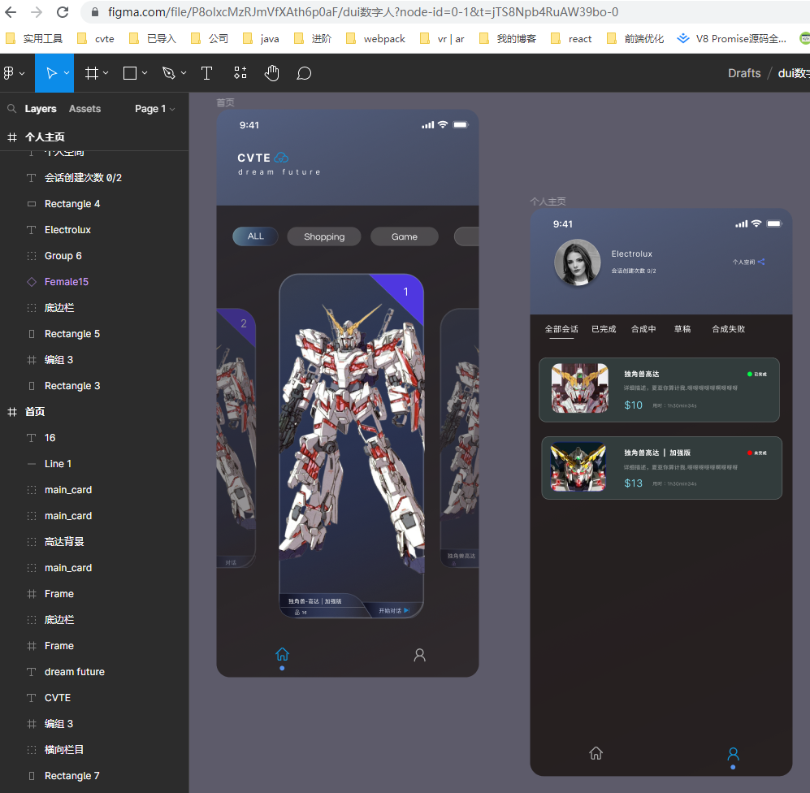
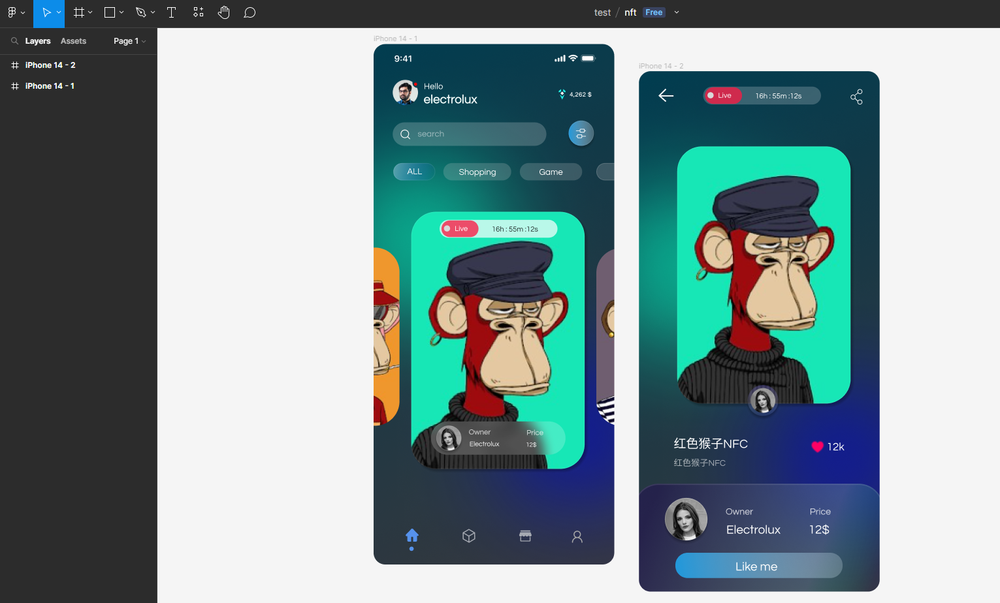

# 5.ps | figma 基操

[[toc]]

## 5.1 ps切片

```
切图
前端切图就是ps中用切片工具把icon图标框出来，然后导出为web旧版格式，导出所有用户切片。
记得选一下预设。不然会导出gif图
```


## 5.2 figma 基本操作

```js
<!-- 
			
            
            
    1.figma 小技巧
    注意像是avator 插件不能够直接使用相减，需要变成png才能进行相减
    1.0 新建frame
    1.1 背景图层 渐变色 需要从 fill 中 把 soild 改成 liner
    1.2 添加 背景颜色的多样性可以 新建两个小球 然后把小球的effect变成layer blur 然后把变量 拉到 200
    1.3 贝塞尔属性可以 alt 选择想选哪个方向都可以。记住done才算当前的结束。 对于里面的图形，我们可以在里面选择done旁边的油漆桶进行封闭图形单独的更改颜色
    1.4 搜索框可以在更改透明度 可以在拉出矩形设置圆角之后更改fill的透明度
    1.5 按钮中给一个stroke 白色边框 然后设置透明度是10% 还挺好看的
    1.6 shirt + h 水平翻转
    1.7 类似科比的图标 还挺好用的。两个烤串形式的图标也比较好画.分享图标三个圈两个横线也好画
    1.8 像是玻璃质感的做法我们可以把fill设置成纯白 的soild 设置成 20%.然后effect 给一个background blur 为 20
    1.9 渐变拉颜色的时候我们在颜色轴的中间点一下就有三渐变的效果
-->
```





